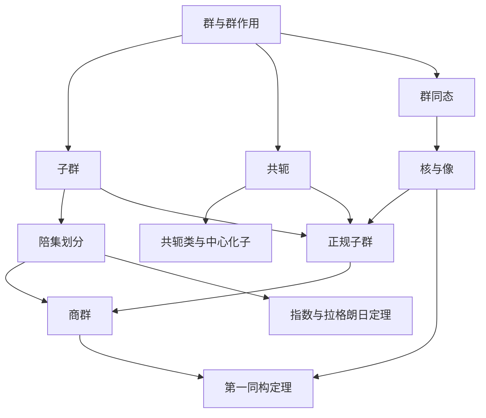

# 第三章 群的基本概念（公式完整版）

> 面向已经系统学过一次群论的物理学研究生。正文把定义写成完整的数学条件，把关键结论的推导步骤逐项展开；中文解释用于说明公式的含义。对应黄飞老师课程大纲（14 学时）。

## 阅读路线与符号约定

本讲义的主线是：先分清对象与表示，再研究群内结构，随后用同态联系不同群，最后把这些结构落实到几何与周期晶体。

- 标量域记为 $\mathbb F$，主要取 $\mathbb R$ 或 $\mathbb C$；有限维线性空间记为 $V,W$。复内积对第一变量共轭线性，对第二变量线性。
- 抽象线性算符记为 $\widehat A$，选基后的矩阵记为 $A$；$I_d$ 是 $d$ 维单位矩阵。矩阵用列矢量，复合操作从右往左实施。
- 一般群记为 $G,H,K$，单位元记为 $e$。加法群的单位元写作 $0$。正规子群一般记为 $N\trianglelefteq G$；$\mathbb Z_n$ 中 $n$ 是正整数，避免与正规子群符号冲突。
- $\mathrm D_n$ 表示阶为 $2n$ 的二面体群；有些书将同一群写成 $\mathrm D_{2n}$。几何正多边形默认 $n\geq3$，$n=1,2$ 仅按群关系解释。
- $\mathrm S_n$ 是置换群，$\mathrm A_n$ 是交错群。Schoenflies 的旋转反射点群也常写成 $\mathrm S_{2n}$，为避免与置换群混淆，本文专用 $\mathrm S_{2n}^{\mathrm{pt}}$ 表示后者。
- $\mathrm C_n$ 是由绕同一轴旋转生成的循环点群，抽象上同构于 $\mathbb Z_n$。三维 Schoenflies 点群 $\mathrm D_n$ 的全部操作均为固有旋转；它与平面多边形的二面体群抽象同构，具体作用不同。
- “简单空间群”采用 symmorphic 的含义，也称共形空间群；“非简单空间群”指 nonsymmorphic。这里的“简单”与抽象群中的“单群”无关。
- 课程未附 I 型、P 型的定义。第 3.10 节显式规定本讲义所用约定，并以构造公式为准，不把该字母约定冒称为课程的原始定义。

建议第一次阅读先做各节基础题；第二次不看正文重建证明；期末用附录的条件表和检查清单检验自己。行内公式采用 `$...$`，独立公式采用 `$$...$$`，可直接用于 Obsidian。

## 本章的结构主线

本章围绕两条代数主线和一条几何主线展开：

$$
\boxed{
\text{子群}
\longrightarrow
\text{陪集}
\longrightarrow
\text{正规子群}
\longrightarrow
\text{商群}
} \tag{1.2.1}
$$

$$
\boxed{
\text{同态}
\longrightarrow
\ker\varphi,\ \operatorname{im}\varphi
\longrightarrow
G/\ker\varphi\simeq\operatorname{im}\varphi
} \tag{1.2.2}
$$

$$
\boxed{
\text{抽象群}
\longrightarrow
\text{几何点群}
\longrightarrow
\text{平移群与空间群}
\longrightarrow
\text{晶系与 Bravais 格子}
} \tag{1.2.3}
$$

学习时应始终区分三个层次：群元素是什么，群运算是什么，以及群如何作用在物理对象上。

## 第 1 节 群的定义、分类、生成元与秩

### 3.1.1 本节问题、联系与学习目标

线性代数提供了变换的语言，但群不要求元素一定是矩阵。我们现在提取各种可逆对称操作共同遵循的规律。

学习目标：从操作复合建立群；证明基本唯一性与消去律；区分群阶与元素阶；分清离散生成元和 Lie 代数生成元。

### 3.1.2 群的严格定义

**定义（群）。** 群是一个有序对 $(G,\circ)$，其中 $G$ 是非空集合，

$$
\circ:G\times G\longrightarrow G,
\qquad
(a,b)\longmapsto a\circ b \tag{1.3.1}
$$

是定义在 $G$ 上的二元运算，并满足下列四条公理。

1. **封闭性：**

$$
\forall a,b\in G,\qquad a\circ b\in G. \tag{1.3.2}
$$

   由于 $\circ$ 的陪域已经指定为 $G$，也可以说封闭性包含在映射 $\circ:G\times G\to G$ 的写法中。

2. **结合律：**

$$
\forall a,b,c\in G,\qquad
(a\circ b)\circ c=a\circ(b\circ c). \tag{1.3.3}
$$

3. **单位元存在：**

$$
\exists e\in G, \forall a\in G,\qquad
e\circ a=a\circ e=a. \tag{1.3.4}
$$

4. **逆元存在：**

$$
\forall a\in G, \exists a^{-1}\in G,\qquad
a\circ a^{-1}=a^{-1}\circ a=e. \tag{1.3.5}
$$

通常省略运算符，写成 $ab$。如果还满足

$$
\forall a,b\in G,\qquad ab=ba, \tag{1.3.6}
$$

则称 $G$ 为 **Abel 群**；否则称为非 Abel 群。

**群与半群、幺半群的关系。** 只有封闭性和结合律的结构称为半群；再有单位元称为幺半群；每个元素再有逆元才成为群：

$$
\text{群}\subset\text{幺半群}\subset\text{半群}. \tag{1.3.7}
$$

**加法记号。** 对 Abel 群常把运算写成 $+$，此时群公理写为

$$
(a+b)+c=a+(b+c),\qquad
0+a=a+0=a, \tag{1.3.8}
$$

$$
\forall a\in G, \exists(-a)\in G,\qquad
a+(-a)=(-a)+a=0. \tag{1.3.9}
$$

**定义（群作用）。** 群 $G$ 在集合 $X$ 上的左作用是映射

$$
\alpha:G\times X\longrightarrow X,\qquad(g,x)\longmapsto g\cdot x, \tag{1.3.10}
$$

满足

$$
e\cdot x=x,\qquad
(gh)\cdot x=g\cdot(h\cdot x),\qquad
\forall g,h\in G,\ x\in X. \tag{1.3.11}
$$

令 $\operatorname{Sym}(X)$ 表示 $X$ 上所有双射在复合下组成的群，则群作用等价于群同态

$$
\rho:G\longrightarrow\operatorname{Sym}(X),\qquad
\rho(g)(x)=g\cdot x, \tag{1.3.12}
$$

因为

$$
\rho(gh)(x)=(gh)\cdot x
=g\cdot(h\cdot x)
=\bigl(\rho(g)\circ\rho(h)\bigr)(x). \tag{1.3.13}
$$

作用忠实的充要条件为

$$
\ker\rho
=\{g\in G:g\cdot x=x,\ \forall x\in X\}
=\{e\}. \tag{1.3.14}
$$

保持某一物理对象或规律的可逆变换，如果对复合封闭、包含恒等变换和每个变换的逆变换，就构成群。结合律来自映射复合本身：

$$
(f\circ g)\circ h=f\circ(g\circ h). \tag{1.3.15}
$$

### 3.1.3 重要性质与证明

**命题 1（单位元唯一）。** 假设 $e,e'\in G$ 都是双侧单位元。因为 $e$ 是左单位元而 $e'$ 是右单位元，

$$
e'=ee'=e. \tag{1.3.16}
$$

因此群中只有一个单位元。

**命题 2（逆元唯一）。** 假设 $b,c$ 都是 $a$ 的双侧逆元，即

$$
ba=ab=e,\qquad ca=ac=e. \tag{1.3.17}
$$

利用结合律，

$$
\begin{aligned}
b
&=be\\
&=b(ac)\\
&=(ba)c\\
&=ec\\
&=c.
\end{aligned} \tag{1.3.18}
$$

所以 $a$ 的逆元唯一，记作 $a^{-1}$。

**命题 3（左右消去律）。** 若 $ab=ac$，则

$$
\begin{aligned}
ab&=ac\\
\Longrightarrow\quad a^{-1}(ab)&=a^{-1}(ac)\\
\Longrightarrow\quad (a^{-1}a)b&=(a^{-1}a)c\\
\Longrightarrow\quad eb&=ec\\
\Longrightarrow\quad b&=c.
\end{aligned} \tag{1.3.19}
$$

若 $ba=ca$，应从右侧乘 $a^{-1}$：

$$
(ba)a^{-1}=(ca)a^{-1}
\Longrightarrow b=c. \tag{1.3.20}
$$

**命题 4（乘积的逆）。** 对任意 $a,b\in G$，

$$
(ab)^{-1}=b^{-1}a^{-1}. \tag{1.3.21}
$$

证明时要验证左右两边：

$$
(ab)(b^{-1}a^{-1})
=a(bb^{-1})a^{-1}
=aea^{-1}
=e, \tag{1.3.22}
$$

$$
(b^{-1}a^{-1})(ab)
=b^{-1}(a^{-1}a)b
=b^{-1}eb
=e. \tag{1.3.23}
$$

由逆元唯一性得到式 (3.7e)。归纳可得

$$
(a_1a_2\cdots a_n)^{-1}
=a_n^{-1}\cdots a_2^{-1}a_1^{-1}. \tag{1.3.24}
$$

**命题 5（方程的唯一解）。** 群中的方程

$$
ax=b,\qquad ya=b \tag{1.3.25}
$$

分别有唯一解

$$
x=a^{-1}b,\qquad y=ba^{-1}. \tag{1.3.26}
$$

例如，

$$
ax=b
\Longrightarrow
a^{-1}(ax)=a^{-1}b
\Longrightarrow
x=a^{-1}b. \tag{1.3.27}
$$

反代可验证 $a(a^{-1}b)=b$，消去律保证解唯一。

**证明思路。** 所有基本消去都来自可逆性；不交换的群中，必须在正确的一侧乘逆元，而不能任意挪动因子。

### 3.1.4 分类、例子与反例

| 区分 | 含义 | 最小例子或注意点 |
|---|---|---|
| 有限 / 无限 | 元素个数有限 / 无限 | $\mathbb Z_6$ / $\mathbb Z$ |
| 离散 / 连续 | 涉及所配拓扑 | $\mathbb Z$ / $\mathrm{SO}(2)$ |
| Abel / 非 Abel | 所有元素是否对易 | $\mathbb Z_6$ / $\mathrm S_3$ |
| 变换群 / 矩阵群 | 以双射 / 可逆矩阵实现 | 置换 / 正交矩阵 |
| 群阶 / 元素阶 | $\vert G\vert $ / 最小正整数 $m$ 使 $g^m=e$ | $\mathbb Z_6$ 中 $[2]$ 的阶是 3 |

无限不等于连续：$\mathbb Z$ 是无限离散群。“连续群”不是只由抽象乘法决定的分类，本讲义主要用它指 Lie 群。有限群也可表示成矩阵群，例如置换矩阵。

常用例子为

$$\mathrm{SO}(d)=\{R\in\mathbb R^{d\times d}:R^{\mathsf T}R=I_d,\det R=1\}, \tag{1.3.28} $$

$$\mathrm{SU}(2)=\{U\in\mathbb C^{2\times2}:U^\dagger U=I_2,\det U=1\}. \tag{1.3.29} $$

$\mathrm{SO}(2)$ 中绕同一轴的角度相加，故 Abel；$\mathrm{SO}(3)$ 中绕不同轴转动通常不对易。$\mathrm{SU}(2)$ 是描述自旋的重要群，它以二对一方式覆盖 $\mathrm{SO}(3)$，并非与后者同构。具体映射可由

$$U(\boldsymbol x\cdot\boldsymbol\sigma)U^\dagger=(R_U\boldsymbol x)\cdot\boldsymbol\sigma \tag{1.3.30} $$

定义；$\boldsymbol\sigma=(\sigma_x,\sigma_y,\sigma_z)$ 为 Pauli 矩阵，核为 $\{I_2,-I_2\}$。任意轴角旋转可由 $U=\exp[-i\theta\boldsymbol n\cdot\boldsymbol\sigma/2]$ 实现，说明映射满射。

非负整数在加法下有单位元、结合律和封闭性，却没有非零元素的加法逆元，因此不是群。矩阵乘法有结合律，但全部方阵含不可逆矩阵，也不是群。

### 3.1.5 群的阶、元素的阶、生成元与秩

**群的阶：**

$$
|G|=\#\{g:g\in G\}. \tag{1.3.31}
$$

**元素的阶：** 对 $g\in G$，若存在正整数 $n$ 使 $g^n=e$，则

$$
\operatorname{ord}(g)
=\min\{n\in\mathbb N_{>0}:g^n=e\}. \tag{1.3.32}
$$

若不存在这样的 $n$，则记 $\operatorname{ord}(g)=\infty$。这里

$$
g^0=e,\qquad g^n=\underbrace{gg\cdots g}_{n\text{ 个}},\qquad
g^{-n}=(g^{-1})^n. \tag{1.3.33}
$$

**生成子群：** 对 $S\subseteq G$，

$$
\langle S\rangle
=\bigcap_{\substack{H\leq G\\S\subseteq H}}H
=\left\{s_1^{\varepsilon_1}\cdots s_k^{\varepsilon_k}:
k\geq0,\ s_i\in S,\ \varepsilon_i\in\{\pm1\}\right\}. \tag{1.3.34}
$$

当 $S=\{g\}$ 时，

$$
\langle g\rangle=\{g^n:n\in\mathbb Z\}. \tag{1.3.35}
$$

若 $\langle S\rangle=G$，则 $S$ 是 $G$ 的生成集。有限生成群的生成秩可定义为

$$
d(G)=\min\{|S|:S\subseteq G,\ \langle S\rangle=G\}. \tag{1.3.36}
$$

这与 Lie 群的秩不同。紧连通 Lie 群的秩定义为最大环面 $T$ 的维数：

$$
\operatorname{rank}G=\dim T. \tag{1.3.37}
$$

例如

$$
\operatorname{rank}\mathrm{SO}(3)
=\operatorname{rank}\mathrm{SU}(2)=1, \tag{1.3.38}
$$

而

$$
\dim\mathfrak{so}(3)=\dim\mathfrak{su}(2)=3. \tag{1.3.39}
$$

Lie 群的一参数子群写成

$$
U(t)=e^{tX},\qquad U(t+s)=U(t)U(s), \tag{1.3.40}
$$

其中 $X$ 是 Lie 代数元素。量子力学常写成

$$
U(\theta)=\exp(-i\theta J),
\qquad
\left.\frac{\mathrm dU}{\mathrm d\theta}\right|_{\theta=0}=-iJ, \tag{1.3.41}
$$

其中 $J$ 取厄米算符约定。

### 3.1.6 物理解释、关系表与误区

| 概念 | 关系 | 后续作用 |
|---|---|---|
| 群 | 可逆操作的乘法结构 | 所有对称分析 |
| 群作用 | 抽象群作用于对象 | 几何实现与轨道 |
| 生成集 | 用少数元素描述全群 | 构造乘法表 |

常见误区：①群与一个群元素混用；②认为无限就连续；③把 Lie 代数维数当 Lie 群秩；④把稠密子群当整个群。

### 3.1.7 练习与提示

**基础计算。** 1. 求 $\mathbb Z_6$ 各元素阶。2. 求二维 $90^\circ$ 旋转矩阵的平方和阶。3. 验证 $\sigma_x\sigma_z=-\sigma_z\sigma_x$。

**证明。** 4. 证明 $(g^{-1})^{-1}=g$。5. 证明若所有元素满足 $g^2=e$，则群为 Abel。

**物理应用。** 6. 两个独立 Ising 变量各可翻转，写出操作群及最小生成集。

**答案或提示。** 1. 依次 $1,6,3,2,3,6$。2. 平方为 $-I_2$，阶 4。3. 直接相乘。4. $g$ 是 $g^{-1}$ 的双侧逆元。5. $ab=(ab)^{-1}=b^{-1}a^{-1}=ba$。6. $\mathbb Z_2\times\mathbb Z_2$，分别翻转第一、第二个变量。

## 第 2 节 有限群的重排定理与乘法表

### 3.2.1 本节问题、联系与学习目标

知道生成元后，需要把操作的所有复合计算出来。乘法表是有限群的完整数据，但它必须满足比“每行不同”更强的条件。

学习目标：证明左右乘是置换；从生成关系构造表格；识别交换性；理解表格何时决定同构类型。

### 3.2.2 左右乘映射与重排定理

固定 $a\in G$，定义

$$
L_a:G\to G,\qquad L_a(g)=ag, \tag{1.4.1}
$$

$$
R_a:G\to G,\qquad R_a(g)=ga. \tag{1.4.2}
$$

利用结合律和逆元，

$$
L_{a^{-1}}\circ L_a(g)=a^{-1}(ag)=(a^{-1}a)g=g, \tag{1.4.3}
$$

$$
L_a\circ L_{a^{-1}}(g)=a(a^{-1}g)=g, \tag{1.4.4}
$$

故

$$
L_a^{-1}=L_{a^{-1}}. \tag{1.4.5}
$$

同理，

$$
R_a^{-1}=R_{a^{-1}}. \tag{1.4.6}
$$

所以 $L_a,R_a$ 都是双射。若有限群写成

$$
G=\{g_1,g_2,\ldots,g_n\}, \tag{1.4.7}
$$

则

$$
G=\{ag_1,ag_2,\ldots,ag_n\}
=\{g_1a,g_2a,\ldots,g_na\}. \tag{1.4.8}
$$

这就是有限群重排定理。若 $ag_i=ag_j$，左乘 $a^{-1}$ 得 $g_i=g_j$；所以固定一行没有重复元素。固定一列同理。乘法表因此满足

$$
\{g_ig_j:j=1,\ldots,n\}=G,
\qquad
\{g_ig_j:i=1,\ldots,n\}=G. \tag{1.4.9}
$$

乘法表关于主对角线对称的充要条件是

$$
g_ig_j=g_jg_i,\qquad\forall i,j, \tag{1.4.10}
$$

即 $G$ 为 Abel 群。

### 3.2.3 两张乘法表及构造

对 $\mathbb Z_3$，运算是模 3 加法，先把普通整数相加，再取余数：

| $+$ | $0$ | $1$ | $2$ |
|---|---|---|---|
| $0$ | $0$ | $1$ | $2$ |
| $1$ | $1$ | $2$ | $0$ |
| $2$ | $2$ | $0$ | $1$ |

下面采用 $\mathrm D_3=\{e,r,r^2,s,sr,sr^2\}$，$r^3=s^2=e$、$srs=r^{-1}$。将每个乘积化到 $r^a$ 或 $sr^a$ 的形式：

$$r^ar^b=r^{a+b},\quad r^a(sr^b)=sr^{b-a},\quad (sr^a)r^b=sr^{a+b},\quad (sr^a)(sr^b)=r^{b-a}. \tag{1.4.11} $$

例如 $r(sr^2)=sr$，$(sr)s=r^{-1}=r^2$。所有指数模 3，得到

| $\cdot$ | $e$ | $r$ | $r^2$ | $s$ | $sr$ | $sr^2$ |
|---|---|---|---|---|---|---|
| $e$ | $e$ | $r$ | $r^2$ | $s$ | $sr$ | $sr^2$ |
| $r$ | $r$ | $r^2$ | $e$ | $sr^2$ | $s$ | $sr$ |
| $r^2$ | $r^2$ | $e$ | $r$ | $sr$ | $sr^2$ | $s$ |
| $s$ | $s$ | $sr$ | $sr^2$ | $e$ | $r$ | $r^2$ |
| $sr$ | $sr$ | $sr^2$ | $s$ | $r^2$ | $e$ | $r$ |
| $sr^2$ | $sr^2$ | $s$ | $sr$ | $r$ | $r^2$ | $e$ |

在 $\mathrm S_3$ 中令 $r=(123),s=(23)$，从右往左实施置换，则 $sr=(13),sr^2=(12)$。对应关系把上表变成 $\mathrm S_3$ 的乘法表。

### 3.2.4 等价刻画、反例与物理解释

两个有限群同构，当且仅当能够用一个元素双射同时重命名行、列、表内元素，使两张表相同。仅交换行或列而不一致地改变标签，不是同构。

“每行每列恰有一次”不足以保证群。例如在 $\mathbb Z_3$ 上定义 $a*b=a-b$，每行每列都无重复，但 $0*b=-b$，不存在双侧单位元；且 $(0*0)*1=2$，$0*(0*1)=1$，不满足结合律。

表格记录的是实际操作顺序。三角形先反射再转动与先转动再反射不同，表格的不对称恰是非交换性的几何记录。

### 3.2.5 本节小结、关系表与误区

| 工具 | 保证的事实 | 不能保证的事实 |
|---|---|---|
| 可逆左右乘 | 重排 | 元素彼此交换 |
| 拉丁方性质 | 每行每列无重复 | 结合律和单位元 |
| 一致重命名 | 同构群的同一乘法结构 | 具体几何作用相同 |

常见误区：①不声明乘法先后；②把行列无重复当群公理的全部；③独立重排行列后就宣称同构。

### 3.2.6 练习与提示

**基础计算。** 1. 求 $(sr^2)(sr)$。2. 求 $r^2s$。3. 写出 $\mathbb Z_4$ 的加法表。

**证明。** 4. 用消去律及有限性重新证明重排定理。5. 证明 $g\mapsto L_g$ 是忠实群作用。

**物理应用。** 6. 在三角形中比较 $rs$ 和 $sr$ 对顶点 1 的作用。

**答案或提示。** 1. $r^2$。2. $sr$。3. 第 $a$ 行第 $b$ 列为 $a+b\pmod4$。4. 单射的有限集合自映射必满射。5. $L_gL_h=L_{gh}$，且 $L_g(e)=g$。6. $rs$ 把 1 送至 2，$sr$ 把 1 送至 3。

## 第 3 节 子群、陪集与拉格朗日定理

### 3.3.1 本节问题、联系与学习目标

完整乘法表随群阶迅速膨胀。子群和陪集把全群拆成等大小的块，使我们可以在不枚举全部乘法的情况下获得结构信息。

学习目标：使用一步子群判据；计算左右陪集；证明陪集划分及拉格朗日定理；识别其逆命题的错误。

### 3.3.2 子群的严格定义与判据

**定义。** 若 $H\subseteq G$，并且 $H$ 在 $G$ 的群运算限制下仍构成群，则称 $H$ 是 $G$ 的子群，记作

$$
H\leq G. \tag{1.5.1}
$$

逐项写，要求

$$
\forall a,b\in H,\quad ab\in H, \tag{1.5.2}
$$

$$
e\in H, \tag{1.5.3}
$$

$$
\forall a\in H,\quad a^{-1}\in H. \tag{1.5.4}
$$

结合律由 $G$ 自动继承。实际判断通常使用一步子群判据：

$$
\boxed{
H\leq G
\iff
H\neq\varnothing
\ \text{且}\
\forall a,b\in H, ab^{-1}\in H.
} \tag{1.5.5}
$$

充分性的推导不能省略：取 $a\in H$，有

$$
aa^{-1}=e\in H; \tag{1.5.6}
$$

再取 $e,b\in H$，有

$$
eb^{-1}=b^{-1}\in H; \tag{1.5.7}
$$

最后对 $a,b^{-1}\in H$ 使用条件，得到

$$
a(b^{-1})^{-1}=ab\in H. \tag{1.5.8}
$$

因此单位元、逆元与封闭性全部得到。

元素 $g$ 生成的循环子群为

$$
\langle g\rangle=\{g^n:n\in\mathbb Z\}\leq G. \tag{1.5.9}
$$

若 $\operatorname{ord}(g)=m<\infty$，则

$$
\langle g\rangle=\{e,g,g^2,\ldots,g^{m-1}\},
\qquad |\langle g\rangle|=m. \tag{1.5.10}
$$

### 3.3.3 陪集、等价关系与拉格朗日定理

对 $H\leq G$ 与 $g\in G$，定义左、右陪集

$$
gH=\{gh:h\in H\},
\qquad
Hg=\{hg:h\in H\}. \tag{1.5.11}
$$

左陪集的等价判据为

$$
aH=bH
\iff b^{-1}a\in H. \tag{1.5.12}
$$

推导为

$$
aH=bH
\Longrightarrow a\in bH
\Longrightarrow a=bh
\Longrightarrow b^{-1}a=h\in H, \tag{1.5.13}
$$

而若 $b^{-1}a=h_0\in H$，则

$$
aH=bh_0H=bH, \tag{1.5.14}
$$

因为 $h_0H=H$。相应的右陪集判据为

$$
Ha=Hb
\iff ab^{-1}\in H. \tag{1.5.15}
$$

在 $G$ 上定义关系

$$
a\sim_L b
\iff b^{-1}a\in H. \tag{1.5.16}
$$

其等价类正是左陪集：

$$
[a]_{\sim_L}=aH. \tag{1.5.17}
$$

若 $aH\cap bH\neq\varnothing$，取

$$
x=ah_1=bh_2, \tag{1.5.18}
$$

则

$$
b^{-1}a=h_2h_1^{-1}\in H, \tag{1.5.19}
$$

所以 $aH=bH$。由此得到陪集划分

$$
G=\bigsqcup_{i\in I}g_iH. \tag{1.5.20}
$$

映射

$$
H\to gH,\qquad h\mapsto gh \tag{1.5.21}
$$

由逆映射 $gh\mapsto h$ 可知是双射，故有限时

$$
|gH|=|H|. \tag{1.5.22}
$$

设不同左陪集数为指数 $[G:H]$，对式 (3.30) 计数得到

$$
\boxed{|G|=[G:H]|H|.} \tag{1.5.23}
$$

这就是拉格朗日定理。令 $H=\langle g\rangle$，得到

$$
\operatorname{ord}(g)=|\langle g\rangle|\mid |G|. \tag{1.5.24}
$$

进一步，由 $g^{|G|}=e$；对任意有限群也有

$$
g^{|G|}=e,
\qquad \forall g\in G. \tag{1.5.25}
$$

若 $|G|=p$ 为素数且 $g\neq e$，则

$$
1<\operatorname{ord}(g)\mid p
\Longrightarrow
\operatorname{ord}(g)=p
\Longrightarrow
G=\langle g\rangle\simeq\mathbb Z_p. \tag{1.5.26}
$$

### 3.3.4 贯穿例子与反例

$\mathbb Z_6$ 的全部子群为 $\{0\}$、$\{0,3\}$、$\{0,2,4\}$ 和全群。对子群 $H=\{0,3\}$，左右陪集相同，分别为 $\{0,3\}$、$\{1,4\}$、$\{2,5\}$。后两个不含零，所以不是子群。

$\mathrm S_3\simeq\mathrm D_3$ 的全部子群为 $\{e\}$、三个反射生成的二阶子群、$\langle r\rangle=\mathrm A_3$ 和全群。取 $H=\{e,s\}$：

| 左陪集 | 右陪集 |
|---|---|
| $H=\{e,s\}$ | $H=\{e,s\}$ |
| $rH=\{r,sr^2\}$ | $Hr=\{r,sr\}$ |
| $r^2H=\{r^2,sr\}$ | $Hr^2=\{r^2,sr^2\}$ |

同一代表元对应的左右陪集可以不同；两种划分的块数仍同为 3。任意陪集 $gH$ 是子群当且仅当 $g\in H$：若它是子群便含 $e$，所以 $gh=e$ 给出 $g=h^{-1}\in H$；反向则 $gH=H$。

拉格朗日定理的逆命题不成立：$\mathrm A_4$ 阶为 12，却没有六阶子群。证明框架是：假设有六阶子群，其指数为 2，故正规，产生满同态 $\mathrm A_4\to\mathbb Z_2$；每个三循环的像阶同时整除 3 和 2，故像为单位元；而三循环生成 $\mathrm A_4$，于是整个像平凡，矛盾。指数二子群正规及同态事实在后两节证明。这一反例的证明依赖已经明确列出，没有把逆命题的错误当作未经说明的口号。

### 3.3.5 物理解释、关系表与误区

若某个物理构型的稳定子为 $H=\{g:g\cdot x=x\}$，则 $g_1\cdot x=g_2\cdot x$ 当且仅当 $g_2^{-1}g_1\in H$，所以不同构型由左陪集标记。此时陪集空间 $G/H$ 作为集合已经有意义，**不要求 $H$ 正规**；但它一般不是群。对称性破缺的序参量空间经常正是这种情形。

| 对象 | 表示什么 | 是否必为群 |
|---|---|---|
| $H$ | 保留的一组操作 | 是 |
| $gH$ | 与 $g$ 仅差一个右侧 $H$ 操作 | 通常否 |
| 陪集集合 | 等价构型或分块 | 通常否 |

常见误区：①封闭就当子群，忘记有限性或逆元；②左右陪集写反；③把任意陪集集合直接作为商群；④由整除性断言子群存在。

### 3.3.6 练习与提示

**基础计算。** 1. 求 $[\mathbb Z_6:\{0,2,4\}]$ 和全部陪集。2. 求 $\mathrm S_3$ 中 $\langle sr\rangle$ 的左陪集。3. 求 15 阶群中元素阶的可能值。

**证明。** 4. 证明两个子群的交是子群。5. 证明子群的并是子群当且仅当其中一个包含另一个。

**物理应用。** 6. 三角形选定一个顶点作为标记，求其稳定子阶及可区分标记构型数。

**答案或提示。** 1. 指数 2，偶数类与奇数类。2. $\{e,sr\},\{r,s\},\{r^2,sr^2\}$。3. 只能取 $1,3,5,15$；这里只列必要候选。4. 用一步判据。5. 若互不包含，取 $a\in H\setminus K,b\in K\setminus H$，则 $ab$ 不可能落在并集中。6. 稳定子阶 2，轨道大小 3。

## 第 4 节 共轭、正规子群与商群

### 3.4.1 本节问题、联系与学习目标

陪集能划分群，但要使“块与块相乘”不依赖块中选了哪个元素，需要额外条件。本节把这个条件与共轭不变性联系起来。

学习目标：计算共轭类及中心化子；区分两种划分；证明正规判据与商群良定义性；完整分析 $\mathrm S_3$。

### 3.4.2 共轭关系、中心化子与类方程

**共轭。** 对 $a,b\in G$，定义

$$
a\sim b
\iff
\exists g\in G,\qquad b=gag^{-1}. \tag{1.6.1}
$$

它是等价关系，因为

$$
a=eae^{-1}, \tag{1.6.2}
$$

$$
b=gag^{-1}Longrightarrow a=g^{-1}bg, \tag{1.6.3}
$$

$$
b=gag^{-1},\ c=hbh^{-1}Longrightarrow c=(hg)a(hg)^{-1}. \tag{1.6.4}
$$

$a$ 的共轭类为

$$
\operatorname{Cl}_G(a)
=\{gag^{-1}:g\in G\}. \tag{1.6.5}
$$

中心与中心化子分别为

$$
Z(G)=\{z\in G:zg=gz,\ \forall g\in G\}, \tag{1.6.6}
$$

$$
C_G(a)=\{g\in G:ga=ag\}
=\{g\in G:gag^{-1}=a\}. \tag{1.6.7}
$$

$G$ 通过共轭作用在自身上：

$$
g\cdot a=gag^{-1}. \tag{1.6.8}
$$

$a$ 的轨道是 $\operatorname{Cl}_G(a)$，稳定子是 $C_G(a)$。映射

$$
G/C_G(a)\longrightarrow\operatorname{Cl}_G(a),\qquad
gC_G(a)\longmapsto gag^{-1} \tag{1.6.9}
$$

是双射，因此有限群中

$$
|\operatorname{Cl}_G(a)|=[G:C_G(a)]
=\frac{|G|}{|C_G(a)|}. \tag{1.6.10}
$$

把中心中的单元素共轭类和其他共轭类分开，得到类方程

$$
\boxed{
|G|=|Z(G)|+
\sum_{j}[G:C_G(a_j)]
} \tag{1.6.11}
$$

其中 $a_j$ 从所有非中心共轭类中各取一个代表元。

### 3.4.3 正规子群的等价条件

**定义。** 子群 $N\leq G$ 称为正规子群，如果

$$
\forall g\in G,\qquad gNg^{-1}=N. \tag{1.6.12}
$$

记作

$$
N\trianglelefteq G. \tag{1.6.13}
$$

下列条件等价：

$$
N\trianglelefteq G, \tag{1.6.14}
$$

$$
\forall g\in G,\qquad gN=Ng, \tag{1.6.15}
$$

$$
\forall g\in G,\qquad gNg^{-1}\subseteq N, \tag{1.6.16}
$$

$$
\forall g\in G,\ \forall n\in N,\qquad gng^{-1}\in N. \tag{1.6.17}
$$

式 (3.43a) 与 (3.43b) 的等价性来自集合等式右乘 $g$：

$$
gNg^{-1}=N
\iff gN=Ng. \tag{1.6.18}
$$

若只有包含关系 $gNg^{-1}\subseteq N$，将 $g$ 替换为 $g^{-1}$ 得

$$
g^{-1}Ng\subseteq N. \tag{1.6.19}
$$

两边左乘 $g$、右乘 $g^{-1}$，得到

$$
N\subseteq gNg^{-1}, \tag{1.6.20}
$$

所以仍有等号。正规子群也等价于它是若干完整共轭类之并，同时自身满足子群条件。

### 3.4.4 商群及其运算的良定义性

对 $N\trianglelefteq G$，左、右陪集相同。定义陪集集合

$$
G/N=\{gN:g\in G\}. \tag{1.6.21}
$$

在其上定义乘法

$$
(aN)(bN)=(ab)N. \tag{1.6.22}
$$

必须证明结果与代表元选择无关。若

$$
aN=a'N,\qquad bN=b'N, \tag{1.6.23}
$$

则存在 $n_1,n_2\in N$ 使

$$
a'=an_1,\qquad b'=bn_2. \tag{1.6.24}
$$

于是

$$
\begin{aligned}
a'b'
&=(an_1)(bn_2)\\
&=a(n_1b)n_2\\
&=ab(b^{-1}n_1b)n_2.
\end{aligned} \tag{1.6.25}
$$

正规性给出

$$
b^{-1}n_1b\in N, \tag{1.6.26}
$$

因而

$$
(b^{-1}n_1b)n_2\in N, \tag{1.6.27}
$$

最终得到

$$
a'b'N=abN. \tag{1.6.28}
$$

所以式 (3.45) 良定义。群公理逐项为

$$
[(aN)(bN)](cN)=((ab)c)N=(a(bc))N=(aN)[(bN)(cN)], \tag{1.6.29}
$$

$$
N(aN)=(ea)N=aN=(ae)N=(aN)N, \tag{1.6.30}
$$

$$
(aN)(a^{-1}N)=N=(a^{-1}N)(aN). \tag{1.6.31}
$$

因此 $G/N$ 是群，其阶为

$$
|G/N|=[G:N]=\frac{|G|}{|N|}
\qquad(G\text{ 有限}). \tag{1.6.32}
$$

反过来，若对一般子群 $H$ 用 $(aH)(bH)=abH$ 定义的乘法良定义，则 $hH=H$ 对任意 $h\in H$ 成立。右乘 $gH$ 得

$$
hgH=gH, \tag{1.6.33}
$$

所以

$$
g^{-1}hg\in H,\qquad\forall g\in G,\ h\in H. \tag{1.6.34}
$$

故 $H\trianglelefteq G$。这说明正规性正是陪集乘法良定义的充要条件。

### 3.4.5 完整例子：$\mathrm S_3$

在前述 $r,s$ 记号下：

| 共轭类 | 元素 | 中心化子示例 |
|---|---|---|
| 单位元类 | $\{e\}$ | $C_G(e)=G$ |
| 三循环类 | $\{r,r^2\}$ | $C_G(r)=\langle r\rangle$ |
| 对换类 | $\{s,sr,sr^2\}$ | $C_G(s)=\{e,s\}$ |

中心为 $\{e\}$，类方程为 $6=1+2+3$。三循环被反射共轭互换；三个反射由转动共轭互换。对 $r$，反射不对易，因此中心化子只有三次旋转；对 $s$，只有 $e,s$ 与其对易。

正规子群必须包含单位元，并由完整共轭类组成，阶还须整除 6。候选大小只有 $1,3,4,6$，其中 4 被排除，其余得到且仅得到 $\{e\}$、$\mathrm A_3=\{e,r,r^2\}$、$\mathrm S_3$。

$H=\{e,s\}$ 不是正规子群，例如 $rsr^{-1}=sr\notin H$。共轭类 $\{r,r^2\}$ 也不是子群，因为不含 $e$。

商群 $\mathrm S_3/\mathrm A_3$ 有两个元素 $\mathrm A_3,s\mathrm A_3$，后者平方为单位陪集，故同构于 $\mathbb Z_2$。这在置换意义上就是只保留奇偶性。

反观非正规 $H=\{e,s\}$：$eH=sH$，但按代表元乘法右乘 $rH$ 得到 $rH=\{r,sr^2\}$ 与 $srH=\{sr,r^2\}$，二者不同。商群运算失败可以直接看到，不只是因为没有套用定义。

### 3.4.6 物理解释、关系表与误区

| 概念 | 构造 | 要点 |
|---|---|---|
| 共轭类 | $gag^{-1}$ 的所有结果 | 一个操作在群内改换参照后的同类操作 |
| 左陪集 | $gN$ | 相差一个被忽略的右侧操作 |
| 正规子群 | 共轭下不变的子群 | 保证等同关系与乘法相容 |
| 商群 | 陪集作为新元素 | 删除 $N$ 所承载的区别 |

例如 $\mathrm{SU}(2)/\{\pm I_2\}\simeq\mathrm{SO}(3)$ 忽略两个自旋变换对空间矢量具有相同作用的区别；这不意味着 $-I_2$ 对自旋态的作用等于 $I_2$，而是目标对象无法区分它们。

常见误区：①把共轭类当陪集；②认为共轭类之并自动为子群；③把 $G/N$ 的单位元写成单个原元素 $e$ 而忘记它是 $N$；④以“取商”代替验证正规性。

### 3.4.7 练习与提示

**基础计算。** 1. 写 $\mathbb Z_4$ 的共轭类。2. 求 $\mathrm S_3/\mathrm A_3$ 的乘法表。3. 求 $\mathrm D_4$ 中 $r$ 的共轭类。

**证明。** 4. 证明中心是正规子群。5. 证明 $G/Z(G)$ 若是循环群，则 $G$ 为 Abel。

**物理应用。** 6. 为什么有方向的平面箭头与无方向直线的旋转稳定子不同？写出后者在 $\mathrm{SO}(2)$ 中的稳定子。

**答案或提示。** 1. 四个单元素类。2. 二阶循环群表。3. $\{r,r^3\}$。4. 共轭不改变中心元素。5. 写 $a=g^mz_1,b=g^nz_2$，利用中心元素对易。6. 无方向直线允许额外 $\pi$ 旋转，稳定子为 $\{R(0),R(\pi)\}$；有方向箭头只有恒等旋转。

## 第 5 节 同态与同构

### 3.5.1 本节问题、联系与学习目标

商群把群内某些差别消去。同态则从外部描述这种信息保留与损失：哪些不同元素在目标群里变得不可区分？

学习目标：判定映射是否保持乘法；求核与像；证明核正规及单射判据；区分抽象同构与具体作用。

### 3.5.2 同态、单同态、满同态与同构

**定义。** 映射 $\varphi:G\to H$ 称为群同态，如果

$$
\forall g_1,g_2\in G,\qquad
\varphi(g_1g_2)=\varphi(g_1)\varphi(g_2). \tag{1.7.1}
$$

在加法群之间，相应公式为

$$
\varphi(x+y)=\varphi(x)+\varphi(y). \tag{1.7.2}
$$

同态自动保持单位元：

$$
\varphi(e_G)
=\varphi(e_Ge_G)
=\varphi(e_G)\varphi(e_G). \tag{1.7.3}
$$

左乘 $\varphi(e_G)^{-1}$，得到

$$
\varphi(e_G)=e_H. \tag{1.7.4}
$$

它也保持逆元：

$$
e_H=\varphi(e_G)=\varphi(gg^{-1})
=\varphi(g)\varphi(g^{-1}), \tag{1.7.5}
$$

所以

$$
\varphi(g^{-1})=\varphi(g)^{-1}. \tag{1.7.6}
$$

由归纳法，整数 $n$ 下都有

$$
\varphi(g^n)=\varphi(g)^n. \tag{1.7.7}
$$

同态若为单射、满射、双射，分别称单同态、满同态、同构。用公式表示为

$$
\varphi\text{ 单射}
\iff
\bigl(\varphi(g_1)=\varphi(g_2)\Rightarrow g_1=g_2\bigr), \tag{1.7.8}
$$

$$
\varphi\text{ 满射}
\iff
\forall h\in H,\ \exists g\in G,\ \varphi(g)=h, \tag{1.7.9}
$$

$$
G\simeq H
\iff
\exists\text{ 双射同态 }\varphi:G\to H. \tag{1.7.10}
$$

自同构群为

$$
\operatorname{Aut}(G)
=\{\varphi:G\to G:\varphi\text{ 是同构}\}, \tag{1.7.11}
$$

其群运算是映射复合。

### 3.5.3 核、像及其基本定理

同态 $\varphi:G\to H$ 的核与像定义为

$$
\ker\varphi
=\varphi^{-1}(\{e_H\})
=\{g\in G:\varphi(g)=e_H\}, \tag{1.7.12}
$$

$$
\operatorname{im}\varphi
=\varphi(G)
=\{\varphi(g):g\in G\}. \tag{1.7.13}
$$

对 $a,b\in\ker\varphi$，

$$
\varphi(ab^{-1})
=\varphi(a)\varphi(b)^{-1}
=e_He_H^{-1}=e_H, \tag{1.7.14}
$$

所以

$$
\ker\varphi\leq G. \tag{1.7.15}
$$

再对 $g\in G,n\in\ker\varphi$，

$$
\varphi(gng^{-1})
=\varphi(g)\varphi(n)\varphi(g)^{-1}
=\varphi(g)e_H\varphi(g)^{-1}
=e_H, \tag{1.7.16}
$$

故

$$
\boxed{\ker\varphi\trianglelefteq G.} \tag{1.7.17}
$$

若 $x=\varphi(a),y=\varphi(b)\in\operatorname{im}\varphi$，则

$$
xy^{-1}=\varphi(a)\varphi(b)^{-1}
=\varphi(ab^{-1})\in\operatorname{im}\varphi, \tag{1.7.18}
$$

所以

$$
\boxed{\operatorname{im}\varphi\leq H.} \tag{1.7.19}
$$

最后，

$$
\begin{aligned}
\varphi(a)=\varphi(b)
&\iff \varphi(b)^{-1}\varphi(a)=e_H\\
&\iff \varphi(b^{-1}a)=e_H\\
&\iff b^{-1}a\in\ker\varphi.
\end{aligned} \tag{1.7.20}
$$

因此

$$
\boxed{
\varphi\text{ 单射}
\iff
\ker\varphi=\{e_G\}.
} \tag{1.7.21}
$$

### 3.5.4 例子、反例与物理意义

$\varphi:\mathbb Z\to\mathbb Z_n$，$k\mapsto[k]_n$ 是满同态，核为 $n\mathbb Z$。它丢失了相差整倍数 $n$ 的区别。

$\det:\mathrm O(3)\to\{+1,-1\}$ 是满同态，因为行列式保持乘法，恒等与反演分别给出两种符号；核为 $\mathrm{SO}(3)$，它只保留是否改变空间取向的信息。

符号映射 $\operatorname{sgn}:\mathrm S_3\to\{\pm1\}$ 的核为 $\mathrm A_3$。嵌入 $\mathbb Z\to\mathbb Q$（加法群）单射但不满射。映射 $\mathbb Z\to\mathbb Z_4$、$k\mapsto[2k]_4$ 既非单射也非满射，像只有 $\{0,2\}$。

阶相同不能推出同构：$\mathbb Z_4$ 有四阶元素，$\mathbb Z_2\times\mathbb Z_2$ 的非单位元全是二阶，故不同构。同构会保持元素阶，因为 $\varphi(g)^m=e\Leftrightarrow g^m=e$。

内自同构 $c_g(a)=gag^{-1}$ 保持乘法，其逆为 $c_{g^{-1}}$。Abel 群的内自同构均平凡，但可以有非平凡自同构，例如 $\mathbb Z_4$ 上 $[k]\mapsto[-k]$。

### 3.5.5 本节小结、关系表与误区

| 对象 | 在哪里 | 回答的问题 |
|---|---|---|
| 核 | 定义域 | 哪些操作变成单位元 |
| 像 | 陪域 | 哪些目标元素实际可达 |
| 同构 | 两群之间 | 乘法结构是否完全相同 |

常见误区：①把像默认成整个陪域；②用平凡核判断满射；③只看群阶判断同构；④把集合双射当群同构。

### 3.5.6 练习与提示

**基础计算。** 1. 求 $k\mapsto[2k]_6$ 的核与像。2. 列 $\mathbb Z_4$ 的全部自同构。3. 求 $\operatorname{sgn}((123))$。

**证明。** 4. 证明同态复合仍是同态。5. 证明任意子群的同态像是子群。

**物理应用。** 6. 对 $\mathrm{SU}(2)\to\mathrm{SO}(3)$，解释为什么 $2\pi$ 与 $4\pi$ 自旋旋转需要区分。

**答案或提示。** 1. 核为 $3\mathbb Z$，像为 $\{0,2,4\}$。2. $[k]\mapsto[k]$ 与 $[k]\mapsto[3k]$。3. $+1$。4—5. 展开乘法或用一步判据。6. $2\pi$ 给出 $-I_2$，$4\pi$ 给出 $I_2$；在空间矢量作用中二者均映到恒等旋转。

## 第 6 节 第一同构定理与群的直积

### 3.6.1 本节问题、联系与学习目标

上一节找到核和像。本节证明：核已经完全描述同态的信息损失；随后研究两个群能否作为独立因素组合成一个群。

学习目标：逐项证明第一同构定理；构造外直积；判断内直积的条件；计算直积元素阶。

### 3.6.2 第一同构定理及完整证明

**第一同构定理。** 若 $\varphi:G\to H$ 为群同态，则

$$
\boxed{
G/\ker\varphi\simeq\operatorname{im}\varphi.
} \tag{1.8.1}
$$

令 $N=\ker\varphi\trianglelefteq G$。定义诱导映射

$$
\overline\varphi:G/N\longrightarrow\operatorname{im}\varphi,
\qquad
\overline\varphi(gN)=\varphi(g). \tag{1.8.2}
$$

证明分成四步。

**良定义：**

$$
gN=hN
\iff h^{-1}g\in N
\iff \varphi(h^{-1}g)=e_H
\iff \varphi(g)=\varphi(h). \tag{1.8.3}
$$

**保持乘法：**

$$
\begin{aligned}
\overline\varphi((gN)(hN))
&=\overline\varphi(ghN)\\
&=\varphi(gh)\\
&=\varphi(g)\varphi(h)\\
&=\overline\varphi(gN)\overline\varphi(hN).
\end{aligned} \tag{1.8.4}
$$

**单射：**

$$
\overline\varphi(gN)=\overline\varphi(hN)
\Longrightarrow
\varphi(g)=\varphi(h)
\Longrightarrow
h^{-1}g\in N
\Longrightarrow
gN=hN. \tag{1.8.5}
$$

**满射到像：** 对任意 $y\in\operatorname{im}\varphi$，存在 $g\in G$ 使

$$
y=\varphi(g)=\overline\varphi(gN). \tag{1.8.6}
$$

于是 $\overline\varphi$ 是同构。

若 $G$ 有限，立即得到计数公式

$$
|G|=|\ker\varphi|\,|\operatorname{im}\varphi|. \tag{1.8.7}
$$

### 3.6.3 群的外直积

给定群 $G,H$，定义集合

$$
G\times H=\{(g,h):g\in G,\ h\in H\} \tag{1.8.8}
$$

和分量乘法

$$
(g_1,h_1)(g_2,h_2)
=(g_1g_2,h_1h_2). \tag{1.8.9}
$$

群公理逐项表现为

$$
\begin{aligned}
[(g_1,h_1)(g_2,h_2)](g_3,h_3)
&=((g_1g_2)g_3,(h_1h_2)h_3)\\
&=(g_1(g_2g_3),h_1(h_2h_3))\\
&=(g_1,h_1)[(g_2,h_2)(g_3,h_3)],
\end{aligned} \tag{1.8.10}
$$

$$
e_{G\times H}=(e_G,e_H), \tag{1.8.11}
$$

$$
(g,h)^{-1}=(g^{-1},h^{-1}). \tag{1.8.12}
$$

若两群有限，

$$
|G\times H|=|G|\,|H|. \tag{1.8.13}
$$

若 $\operatorname{ord}(g)=m$、$\operatorname{ord}(h)=n$，则

$$
(g,h)^k=(g^k,h^k)=(e_G,e_H)
\iff m\mid k\ \text{且}\ n\mid k. \tag{1.8.14}
$$

所以

$$
\boxed{
\operatorname{ord}(g,h)=\operatorname{lcm}(m,n).
} \tag{1.8.15}
$$

### 3.6.4 内直积的判据与证明

若 $H,K\leq G$，定义集合积

$$
HK=\{hk:h\in H,\ k\in K\}. \tag{1.8.16}
$$

若

$$
H\trianglelefteq G,\qquad
K\trianglelefteq G,\qquad
H\cap K=\{e\},\qquad
HK=G, \tag{1.8.17}
$$

则称 $G$ 是 $H,K$ 的内直积，并有

$$
G\simeq H\times K. \tag{1.8.18}
$$

关键一步是证明两个因子逐元素对易。对 $h\in H,k\in K$，交换子

$$
[h,k]=hkh^{-1}k^{-1}. \tag{1.8.19}
$$

由于 $K\trianglelefteq G$，

$$
hkh^{-1}\in K
\Longrightarrow
[h,k]\in K. \tag{1.8.20}
$$

由于 $H\trianglelefteq G$，

$$
kh^{-1}k^{-1}\in H
\Longrightarrow
[h,k]=h(kh^{-1}k^{-1})\in H. \tag{1.8.21}
$$

于是

$$
[h,k]\in H\cap K=\{e\}, \tag{1.8.22}
$$

即

$$
hk=kh. \tag{1.8.23}
$$

定义

$$
F:H\times K\to G,\qquad F(h,k)=hk. \tag{1.8.24}
$$

式 (3.77) 保证

$$
F(h_1,k_1)F(h_2,k_2)
=h_1h_2k_1k_2
=F(h_1h_2,k_1k_2). \tag{1.8.25}
$$

$HK=G$ 保证满射；若 $F(h,k)=e$，则

$$
h=k^{-1}\in H\cap K, \tag{1.8.26}
$$

故 $h=k=e$，核平凡，$F$ 单射。于是得到式 (3.75)。

### 3.6.5 反例、物理解释与本节小结

$\mathrm S_3$ 有 $H=\langle r\rangle$、$K=\langle s\rangle$，交平凡、$HK=G$，但 $K$ 不正规且两因子不对易，因此不是 $\mathbb Z_3\times\mathbb Z_2$；它是半直积，后续空间群也将出现这种结构。

$\mathbb Z_4$ 有正规二阶子群且商群为 $\mathbb Z_2$，却不是 $\mathbb Z_2\times\mathbb Z_2$。知道“核与商”不足以断言原群是二者直积。

物理上，直积适合描述两个独立且相互对易的对称部门。但若一个操作会把另一组操作变成不同操作，例如旋转会改变平移方向，就需要半直积或更一般的扩张。

| 结构 | 必要验证 | 结果 |
|---|---|---|
| 第一同构定理 | 同态、核、诱导映射 | 商群等于可见的像 |
| 内直积 | 对易、交平凡、覆盖 | 两个独立群因子 |
| 半直积 | 一个正规因子及补群 | 一个因子作用于另一个 |

常见误区：①把目标 $H$ 写成像而不检查满射；②有正规子群就宣布直积分解；③把直积元素阶写成阶的乘积；④仅凭总阶相同确认分解。

### 3.6.6 练习与提示

**基础计算。** 1. 求 $([2]_6,[1]_4)$ 的阶。2. 求 $\mathbb Z_6\to\mathbb Z_3$ 的自然同态的核。3. 求 $\mathbb Z_2\times\mathbb Z_2$ 的全部二阶子群。

**证明。** 4. 证明 $\mathbb Z_m\times\mathbb Z_n$ 在 $\gcd(m,n)=1$ 时为循环群。5. 证明投影 $(g,h)\mapsto g$ 诱导 $(G\times H)/(\{e\}\times H)\simeq G$。

**物理应用。** 6. 两个独立环分别具有三重与四重离散转动对称，问同步实施各自一步转动多久恢复？整个对称群是否循环？

**答案或提示。** 1. $\operatorname{lcm}(3,4)=12$。2. $\{0,3\}$。3. 分别由 $(1,0),(0,1),(1,1)$ 生成。4. $(1,1)$ 的阶为 $mn$。5. 第一同构定理。6. 12 步，群 $\mathbb Z_3\times\mathbb Z_4\simeq\mathbb Z_{12}$。

## 第 7 节 点群的定义与循环群

### 3.7.1 本节问题、联系与学习目标

抽象结构已经建立，现在开始把它们落到固定一点的几何对称。最简单的有限旋转结构就是循环群。

学习目标：用固定点定义点群；求循环群元素阶和生成元；证明子群与因数一一对应；理解循环群的商与直积分解。

### 3.7.2 点群与循环群的核心公式

点群是保持某一点不动的空间等距变换群。把共同不动点取为原点后，点操作可写成正交矩阵

$$
R^{\mathsf T}R=I_3,\qquad R\in\mathrm O(3). \tag{1.9.1}
$$

固有点群还满足

$$
\det R=+1,\qquad R\in\mathrm{SO}(3). \tag{1.9.2}
$$

有限群作用若最初没有把共同不动点置于原点，可取任意 $x_0$ 并定义轨道重心

$$
c=\frac1{|G|}\sum_{g\in G}g\cdot x_0. \tag{1.9.3}
$$

对任意 $h\in G$，重排定理给出

$$
h\cdot c
=\frac1{|G|}\sum_{g\in G}(hg)\cdot x_0
=\frac1{|G|}\sum_{g'\in G}g'\cdot x_0
=c. \tag{1.9.4}
$$

所以有限等距变换群确有共同不动点。

循环群由单个元素生成：

$$
G=\langle r\rangle. \tag{1.9.5}
$$

若 $\operatorname{ord}(r)=n$，则

$$
G=\{e,r,r^2,\ldots,r^{n-1}\},
\qquad
r^n=e, \tag{1.9.6}
$$

并有同构

$$
\Phi:\mathbb Z_n\to G,\qquad[k]_n\mapsto r^k. \tag{1.9.7}
$$

几何循环点群 $\mathrm C_n$ 可表示为

$$
\mathrm C_n
=\left\{R_{\boldsymbol n}\left(\frac{2\pi k}{n}\right):k=0,1,\ldots,n-1\right\}, \tag{1.9.8}
$$

其中 $\boldsymbol n$ 是固定旋转轴。

### 3.7.3 循环群中元素阶、生成元与子群

在 $G=\langle r\rangle$、$\operatorname{ord}(r)=n$ 中，$r^k$ 的阶是使

$$
(r^k)^m=r^{km}=e \tag{1.9.9}
$$

成立的最小正整数 $m$。该条件等价于

$$
n\mid km. \tag{1.9.10}
$$

令

$$
d=\gcd(n,k),\qquad n=dn',\qquad k=dk',\qquad\gcd(n',k')=1, \tag{1.9.11}
$$

则

$$
n\mid km
\iff dn'\mid dk'm
\iff n'\mid k'm
\iff n'\mid m. \tag{1.9.12}
$$

因此

$$
\boxed{
\operatorname{ord}(r^k)=\frac{n}{\gcd(n,k)}.
} \tag{1.9.13}
$$

所以

$$
\langle r^k\rangle=G
\iff
\operatorname{ord}(r^k)=n
\iff
\gcd(n,k)=1. \tag{1.9.14}
$$

生成元数为 Euler 函数

$$
\#\{r^k:\langle r^k\rangle=G\}
=\phi(n)
=\#\{1\leq k\leq n:\gcd(k,n)=1\}. \tag{1.9.15}
$$

对每个因数 $d\mid n$，唯一的 $d$ 阶子群为

$$
H_d=\left\langle r^{n/d}\right\rangle
=\{e,r^{n/d},r^{2n/d},\ldots,r^{(d-1)n/d}\}. \tag{1.9.16}
$$

若 $H_d$ 的阶为 $d$，则商群满足

$$
G/H_d\simeq\mathbb Z_{n/d}. \tag{1.9.17}
$$

循环群为 Abel：

$$
r^ar^b=r^{a+b}=r^{b+a}=r^br^a. \tag{1.9.18}
$$

因此每个共轭类都是单元素：

$$
gag^{-1}=a,\qquad
\operatorname{Cl}_G(a)=\{a\}, \tag{1.9.19}
$$

且每个子群都正规。

### 3.7.4 三个具体例子

以下使用加法记号，$\langle k\rangle$ 包含 $k$ 的所有模 $n$ 整数倍。

| 群 | 元素 $k$ | 生成的子群 |
|---|---|---|
| $\mathbb Z_4$ | $0$ | $\{0\}$ |
|  | $1,3$ | 全群，二者都是生成元 |
|  | $2$ | $\{0,2\}$ |
| $\mathbb Z_6$ | $0$ | $\{0\}$ |
|  | $1,5$ | 全群 |
|  | $2,4$ | $\{0,2,4\}$ |
|  | $3$ | $\{0,3\}$ |
| $\mathbb Z_8$ | $0$ | $\{0\}$ |
|  | $1,3,5,7$ | 全群 |
|  | $2,6$ | $\{0,2,4,6\}$ |
|  | $4$ | $\{0,4\}$ |

循环群为 Abel，因为 $r^ar^b=r^{a+b}=r^{b+a}$。在任何 Abel 群中 $gag^{-1}=a$，所以共轭类全是单元素，每个子群都正规。若 $H$ 阶为 $d$，$G/H$ 由 $rH$ 生成、阶为 $n/d$，故同构于 $\mathbb Z_{n/d}$。

当 $\gcd(m,n)=1$，映射 $[k]_{mn}\mapsto([k]_m,[k]_n)$ 的核平凡：同时被 $m,n$ 整除意味着被 $mn$ 整除；定义域与陪域均有 $mn$ 个元素，故为同构。这是中国剩余定理的群论形式。若 $m,n$ 不互素，直积中每个元素阶至多为 $\operatorname{lcm}(m,n)<mn$，因此不是循环群。

### 3.7.5 反例、物理解释、关系表与误区

$\mathbb Z_2\times\mathbb Z_2$ 是 Abel 群却非循环群；“所有子群正规”也不蕴含循环。$\mathrm C_2$、空间反演群 $\mathrm C_i$ 和镜面群 $\mathrm C_s$ 都抽象同构于 $\mathbb Z_2$，但它们在三维空间的固定集合分别为一条轴、一个点、一个平面，不能把几何作用视为相同。

对于正 $n$ 边形环上的离散平移 $T$，$T^n=e$。一步生成群，$k$ 步移动生成的子群决定能够从某个格点访问的格点数 $n/\gcd(n,k)$。

| 信息 | 公式 | 几何意义 |
|---|---|---|
| 元素阶 | $n/\gcd(n,k)$ | 反复操作多久返回 |
| 子群 | $\langle r^{n/d}\rangle$ | 保留较粗转角步长 |
| 商群 | $\mathbb Z_{n/d}$ | 忽略子群内部区别 |

常见误区：①把所有非单位元都当生成元；②把 Abel 当循环；③把 $n$ 阶循环群的子群数写成 $n$；④忽略直积分解的互素条件。

### 3.7.6 练习与提示

**基础计算。** 1. 求 $\mathbb Z_{12}$ 的生成元。2. 求其中四阶子群及商群。3. 求 $\phi(8)$。

**证明。** 4. 证明循环群的同态像仍循环。5. 证明 $\operatorname{Aut}(\mathbb Z_n)$ 与模 $n$ 可逆剩余类的乘法群同构。

**物理应用。** 6. 八格点环上每次前进两格，从 0 出发访问哪些格点？有多少互不连通的轨道？

**答案或提示。** 1. $1,5,7,11$。2. $\{0,3,6,9\}$，商为 $\mathbb Z_3$。3. 4。4. 像由原生成元的像生成。5. 自同构由 $1$ 的像确定，且像必须为生成元，复合对应系数相乘。6. $0,2,4,6$；另一个轨道为奇数格点，共两个。

## 第 8 节 正多边形的二面体群

### 3.8.1 本节问题、联系与学习目标

循环群只记录绕中心的旋转。加入反射后，旋转方向会反向，形成最简单的非交换几何群。

学习目标：由群关系计算任意乘积；求全部子群的统一形式；区分奇偶情形的共轭类和正规子群；逐项识别三角形与正方形的操作。

### 3.8.2 二面体群的定义、矩阵实现与乘法公式

本文采用

$$
\boxed{
\mathrm D_n
=\langle r,s\mid r^n=e,\ s^2=e,\ srs=r^{-1}\rangle,
\qquad |\mathrm D_n|=2n.
} \tag{1.10.1}
$$

关系 $srs=r^{-1}$ 等价于

$$
sr=r^{-1}s,\qquad
rs=sr^{-1},\qquad
sr^k=r^{-k}s,\qquad
r^ks=sr^{-k}. \tag{1.10.2}
$$

在平面标准基下，可取

$$
r=
\begin{pmatrix}
\cos\frac{2\pi}{n}&-\sin\frac{2\pi}{n}\\
\sin\frac{2\pi}{n}& \cos\frac{2\pi}{n}
\end{pmatrix},
\qquad
s=
\begin{pmatrix}1&0\\0&-1\end{pmatrix}. \tag{1.10.3}
$$

直接相乘得到

$$
srs=
\begin{pmatrix}
\cos\frac{2\pi}{n}&\sin\frac{2\pi}{n}\\
-\sin\frac{2\pi}{n}&\cos\frac{2\pi}{n}
\end{pmatrix}
=r^{-1}. \tag{1.10.4}
$$

任何群元素都可化成

$$
r^k\quad\text{或}\quad sr^k,\qquad k=0,1,\ldots,n-1. \tag{1.10.5}
$$

四类乘法公式为

$$
r^ar^b=r^{a+b}, \tag{1.10.6}
$$

$$
r^a(sr^b)=sr^{b-a}, \tag{1.10.7}
$$

$$
(sr^a)r^b=sr^{a+b}, \tag{1.10.8}
$$

$$
(sr^a)(sr^b)=r^{b-a}, \tag{1.10.9}
$$

其中指数均按模 $n$ 计算。特别地，

$$
(sr^k)^2=e, \tag{1.10.10}
$$

所以所有反射元素的阶都是 2。当 $n\geq3$ 时，$r\neq r^{-1}$，由

$$
sr=r^{-1}s\neq rs \tag{1.10.11}
$$

可知 $\mathrm D_n$ 非 Abel。

### 3.8.3 子群、正规子群与共轭公式

$\mathrm D_n$ 的每个子群具有以下两类形式：

$$
\langle r^d\rangle,\qquad d\mid n, \tag{1.10.12}
$$

或

$$
H_{d,k}=\langle r^d,sr^k\rangle,
\qquad d\mid n,\quad 0\leq k<d. \tag{1.10.13}
$$

第二类可明确写成

$$
H_{d,k}
=\{r^{jd}:0\leq j<n/d\}
\cup
\{sr^{k+jd}:0\leq j<n/d\}, \tag{1.10.14}
$$

所以

$$
|H_{d,k}|=\frac{2n}{d}. \tag{1.10.15}
$$

旋转子群在生成元共轭下满足

$$
r(r^d)r^{-1}=r^d,
\qquad
s(r^d)s^{-1}=r^{-d}\in\langle r^d\rangle, \tag{1.10.16}
$$

故

$$
\langle r^d\rangle\trianglelefteq\mathrm D_n. \tag{1.10.17}
$$

反射的关键共轭公式为

$$
r^a(sr^k)r^{-a}=sr^{k-2a}, \tag{1.10.18}
$$

$$
s(sr^k)s^{-1}=sr^{-k}. \tag{1.10.19}
$$

因此反射指数在共轭下可改变偶数并取负。由此得到：

$$
n\text{ 为奇数}
\Longrightarrow
\{sr^k:0\leq k<n\}
\text{ 是一个共轭类}, \tag{1.10.20}
$$

$$
n\text{ 为偶数}
\Longrightarrow
\begin{cases}
\{sr^{2j}:0\leq j<n/2\},\\
\{sr^{2j+1}:0\leq j<n/2\}
\end{cases}
\text{ 是两个共轭类}. \tag{1.10.21}
$$

含反射的 $H_{d,k}$ 正规，当且仅当 $d\mid2$；这是因为式 (3.100) 要求

$$
k-2\equiv k\pmod d
\iff d\mid2. \tag{1.10.22}
$$

### 3.8.4 共轭类、中心与奇偶差别

旋转共轭类为 $\{r^k,r^{-k}\}$，若两者相同则缩成单元素。反射在共轭下的指数可以加减 2 或取负。

- $n$ 奇数：2 在模 $n$ 下可逆，所有反射处于一个 $n$ 元共轭类；中心只有 $e$。旋转有 $(n-1)/2$ 个二元素类。
- $n$ 偶数：反射指数奇偶性保持，分成各 $n/2$ 个元素的两个类；中心为 $\{e,r^{n/2}\}$。其他旋转分成 $(n-2)/2$ 个二元素类。

奇偶差异来自“加 2 能否走遍所有剩余类”，并非单纯来自图形看起来是否有对角线。

### 3.8.5 三角形与正方形逐项对应

三角形顶点为 $1,2,3$，令 $r=(123),s=(23)$：

| 元素 | 几何操作 | 置换 |
|---|---|---|
| $e$ | 不动 | $e$ |
| $r$ | $120^\circ$ 旋转 | $(123)$ |
| $r^2$ | $240^\circ$ 旋转 | $(132)$ |
| $s$ | 过顶点 1 的轴反射 | $(23)$ |
| $sr$ | 过顶点 2 的轴反射 | $(13)$ |
| $sr^2$ | 过顶点 3 的轴反射 | $(12)$ |

这是 $\mathrm D_3\simeq\mathrm S_3$ 的具体同构，作用对象是三个顶点，不是仅凭六阶作出的猜测。

正方形放置顶点 $(\pm1,\pm1)$，取 $r$ 为逆时针 $90^\circ$ 旋转，$s$ 为 $x$ 轴反射：

| 元素 | 几何操作 |
|---|---|
| $e,r,r^2,r^3$ | 分别转 $0^\circ,90^\circ,180^\circ,270^\circ$ |
| $s$ | 关于 $x$ 轴反射 |
| $sr$ | 关于 $y=-x$ 反射 |
| $sr^2$ | 关于 $y$ 轴反射 |
| $sr^3$ | 关于 $y=x$ 反射 |

$\mathrm D_4$ 的全部子群为：$\{e\}$；$\langle r^2\rangle$；$\langle r\rangle$；四个 $\langle sr^k\rangle$；两个 $\langle r^2,s\rangle,\langle r^2,sr\rangle$；全群，共 10 个。正规子群是其中除四个反射二阶子群外的 6 个。

其共轭类为 $\{e\},\{r^2\},\{r,r^3\},\{s,sr^2\},\{sr,sr^3\}$。商 $\mathrm D_4/\langle r\rangle\simeq\mathbb Z_2$；$\mathrm D_4/\langle r^2\rangle\simeq\mathbb Z_2\times\mathbb Z_2$，因为商中两个生成元都为二阶且对易。

### 3.8.6 反例、物理解释、关系表与误区

$\mathrm D_4$ 与 $\mathbb Z_8$ 同阶但前者不交换。三维固有点群 $\mathrm D_n$ 可用绕 $z$ 轴 $2\pi/n$ 转动和绕 $x$ 轴 $\pi$ 转动生成；后一操作在 $xy$ 平面的限制就是反射，但三维行列式为 $+1$。平面反射与三维半转因而可以实现相同抽象关系。

正方形四格点模型若所有顶点、边耦合完全相同，则顶点置换 $\mathrm D_4$ 是几何对称；若某条边耦合不同，必须重新求保持耦合的子群，不能仅凭格点位置宣称全群仍为哈密顿量对称。

| 内容 | 统一表达 | 关键分岔 |
|---|---|---|
| 元素 | $r^k,sr^k$ | 旋转 / 反射 |
| 子群 | $\langle r^d\rangle,H_{d,k}$ | 是否含反射 |
| 反射共轭类 | 指数加减 2 | $n$ 奇 / 偶 |

常见误区：①忘记 $|\mathrm D_n|=2n$ 的约定；②把 $srs=r$ 当正确关系；③把所有反射永远放在同一类；④混同平面和三维实现。

### 3.8.7 练习与提示

**基础计算。** 1. 求 $\mathrm D_4$ 中 $(sr)(sr^3)$。2. 列 $\mathrm D_5$ 的共轭类大小。3. 求 $\mathrm D_4$ 中 $s$ 的中心化子。

**证明。** 4. 证明奇数 $n$ 时 $\mathrm D_n$ 中任一非平凡旋转的中心化子为 $\langle r\rangle$。5. 证明 $\mathrm D_n/\langle r\rangle\simeq\mathbb Z_2$。

**物理应用。** 6. 四格点正方形最近邻耦合水平为 $J_x$、竖直为 $J_y$，$J_x\ne J_y$，求保留下来的平面对称群。

**答案或提示。** 1. $r^2$。2. $1,2,2,5$。3. $\{e,r^2,s,sr^2\}$。4. 反射会使旋转取逆，奇数阶非平凡旋转不等于其逆。5. 旋转 / 反射奇偶同态。6. $\{e,r^2,s,sr^2\}\simeq\mathbb Z_2\times\mathbb Z_2$；若 $J_x=J_y$ 才恢复全部 $\mathrm D_4$。

## 第 9 节 正多面体固有旋转群

### 3.9.1 本节问题、联系与学习目标

单一主轴给出循环或二面体结构。若有多条不平行的高阶轴，有限旋转群受到球面几何的强约束，出现四面体、八面体和二十面体三类。

学习目标：按轴与角计数；解释几何置换同构；识别共轭类分裂；利用几何稳定子构造子群。

### 3.9.2 正多面体旋转群的群阶计算

对有限群 $G$ 作用于集合 $X$，轨道—稳定子定理为

$$
|G\cdot x|=[G:G_x]
=\frac{|G|}{|G_x|},
\qquad
G_x=\{g\in G:g\cdot x=x\}. \tag{1.11.1}
$$

正多面体的旋转群阶也可以直接按旋转轴计数。每条 $m$ 重轴贡献 $m-1$ 个非恒等旋转。

四面体群：

$$
|\mathrm T|
=1+4(3-1)+3(2-1)
=12. \tag{1.11.2}
$$

八面体或立方体群：

$$
|\mathrm O|
=1+3(4-1)+4(3-1)+6(2-1)
=24. \tag{1.11.3}
$$

二十面体或十二面体群：

$$
|\mathrm I|
=1+6(5-1)+10(3-1)+15(2-1)
=60. \tag{1.11.4}
$$

相应的抽象同构为

$$
\mathrm T\simeq\mathrm A_4,
\qquad
\mathrm O\simeq\mathrm S_4,
\qquad
\mathrm I\simeq\mathrm A_5. \tag{1.11.5}
$$

同构映射分别来自对四面体四个顶点、立方体四条无向体对角线、十二面体内五个立方体的置换。群阶相同本身不足以证明这些同构；还要证明相应作用给出的同态是忠实的，并确认其像。

$\mathrm T,\mathrm O,\mathrm I$ 分别是正四面体、正八面体（或正方体）、正二十面体（或正十二面体）的固有旋转群。以下每条轴不区分正负方向，角度按具体操作计数。

| 群 | 轴与非平凡转动 | 元素计数 |
|---|---|---|
| $\mathrm T$ | 4 条顶点—对面中心三重轴；3 条对边中点二重轴 | $1+4\times2+3=12$ |
| $\mathrm O$ | 3 条对面中心四重轴；4 条体对角线三重轴；6 条对边中点二重轴 | $1+3\times3+4\times2+6=24$ |
| $\mathrm I$ | 6 条对顶点五重轴；10 条对面中心三重轴；15 条对边中点二重轴 | $1+6\times4+10\times2+15=60$ |

对偶多面体把顶点与面中心交换。一个旋转保持原多面体当且仅当保持其对偶构造，因此两者有同一个旋转矩阵群。

### 3.9.3 同构映射、生成元与证明框架

**四面体。** 旋转置换四个顶点，给出 $\mathrm T\to\mathrm S_4$。固定全部顶点的旋转是恒等，故忠实。三重转动对应三循环，二重转动对应两个不交对换的乘积，都是偶置换。像包含于 $\mathrm A_4$，且两者均有 12 个元素，故 $\mathrm T\simeq\mathrm A_4$。

**八面体。** 用正方体的四条无向体对角线作为置换对象，得到 $\mathrm O\to\mathrm S_4$。若一个旋转保持每条线，取这些线的方向代表 $v_i$，则 $Rv_i=\varepsilon_iv_i$，$\varepsilon_i=\pm1$。四个方向可取为正四面体顶点，任意两个内积非零；保内积强制 $\varepsilon_i\varepsilon_j=1$，所以符号全部相同。全为 $+1$ 得恒等，全为 $-1$ 则是 $-I_3$，行列式为 $-1$，不在固有群中。核因此平凡；像阶为 24，等于全部 $\mathrm S_4$。

**二十面体。** 在对偶正十二面体内有一组由其顶点组成的五个内接立方体；每个立方体有 8 个顶点，每个十二面体顶点属于其中两个。可从顶点坐标

$$(\pm1,\pm1,\pm1),\quad(0,\pm\phi^{-1},\pm\phi),\quad(\pm\phi^{-1},\pm\phi,0),\quad(\pm\phi,0,\pm\phi^{-1}) \tag{1.11.6} $$

构造，其中 $\phi=(1+\sqrt5)/2$，第一组 8 个点给出其中一个立方体；旋转得到整组五个立方体。$\mathrm I$ 置换这五个几何对象，给出 $\mathrm I\to\mathrm S_5$。其核的平凡性可由下面的共轭类计数得到：这些类的大小不允许任何非平凡真正规子群，而上述作用并非平凡。因此像阶为 60，在 $\mathrm S_5$ 中指数为 2；它必为 $\mathrm A_5$。最后一步可这样验证：任何满同态 $\mathrm S_5\to\mathbb Z_2$ 都把共轭的各对换映到同一个非单位元，因而与奇偶同态相同，其核就是 $\mathrm A_5$。

这三个同构分别作用于四个顶点、四条体对角线、五个内接立方体，作用对象不能省略。

对应置换模型可选生成元 $a,b$：

| 群 | $a$ | $b$ | 关系 |
|---|---|---|---|
| $\mathrm T\simeq\mathrm A_4$ | $(12)(34)$ | $(123)$ | $a^2=b^3=(ab)^3=e$ |
| $\mathrm O\simeq\mathrm S_4$ | $(12)$ | $(234)$ | $a^2=b^3=(ab)^4=e$ |
| $\mathrm I\simeq\mathrm A_5$ | $(12)(34)$ | $(135)$ | $a^2=b^3=(ab)^5=e$ |

这些是球面三角形群的取向保持表示。第一行生成整个交错群；第二行含一个四循环和相应的共轭对换，生成全置换群；第三行含阶为 2、3、5 的元素，生成子群阶须被 30 整除，而 $\mathrm A_5$ 没有指数二子群，故生成全群。对第三行的最后判断也可使用下方的单性证明。

### 3.9.4 共轭类与正规结构

| 群 | 共轭类及大小 |
|---|---|
| $\mathrm T$ | $1$；$3C_2$；两个各含 4 个元素的 $C_3$ 类 |
| $\mathrm O$ | $1$；$8C_3$；$6C_4$（$\pm90^\circ$）；$3C_2$（四重轴上的 $180^\circ$）；$6C_2'$（对边轴） |
| $\mathrm I$ | $1$；$15C_2$；$20C_3$；$12C_5$（$\pm72^\circ$）；$12C_5^2$（$\pm144^\circ$） |

这里 $C_k$ 表示相应类型的旋转操作，不是独立群名。共轭旋转保持转角，但相同转角不一定在有限群内共轭。$\mathrm T$ 的三循环分成两类：若要把固定三重轴上的 $r$ 共轭成 $r^{-1}$，需要在群内找到把轴的有向方向翻转的旋转，四面体群中没有这样的操作。每个三重旋转中心化子阶为 3，类大小 $12/3=4$，八个操作正好分成两类。

$\mathrm O$ 的两类 $180^\circ$ 旋转对应两种不等价的轴；在置换模型中分别是双对换与单对换。$\mathrm I$ 的非半转绕轴操作，其中心化子是同轴旋转子群，给出 $60/3=20$ 或 $60/5=12$ 的类大小；全部半转轴等价，得到 15 元类。

$\mathrm I$ 的正规子群必须是含单位元的上述类之并，其阶必须整除 60。将 $1$ 与 $15,20,12,12$ 的任意非空真子集相加，没有一个是真因数，故 $\mathrm I$ 没有非平凡真正规子群。这也补全前述忠实作用证明。

$\mathrm T$ 的全部正规子群为 $\{e\}$、由三个半转及单位元组成的 $\mathbb Z_2\times\mathbb Z_2$、全群。$\mathrm O\simeq\mathrm S_4$ 的全部正规子群为 $\{e\}$、双对换四元群、$\mathrm A_4$、全群。可分别用类大小和子群封闭性验证。

### 3.9.5 子群如何构造：类型表

以下给出实际子群的类型与数量，不把“同构类型相同”误作“只有一个子群”。$\mathrm D_k$ 的阶仍为 $2k$。

| 群 | 全部子群类型与各自数量（含平凡及全群） |
|---|---|
| $\mathrm T$ | $1$：1；$\mathbb Z_2$：3；$\mathbb Z_3$：4；$\mathbb Z_2\times\mathbb Z_2$：1；$\mathrm T$：1 |
| $\mathrm O$ | $1$：1；$\mathbb Z_2$：9；$\mathbb Z_3$：4；$\mathbb Z_4$：3；$\mathbb Z_2\times\mathbb Z_2$：4；$\mathrm D_3$：4；$\mathrm D_4$：3；$\mathrm T$：1；$\mathrm O$：1 |
| $\mathrm I$ | $1$：1；$\mathbb Z_2$：15；$\mathbb Z_3$：10；$\mathbb Z_5$：6；$\mathbb Z_2\times\mathbb Z_2$：5；$\mathrm D_3$：10；$\mathrm D_5$：6；$\mathrm T$：5；$\mathrm I$：1 |

构造原则是先稳定轴或内接对象。单轴旋转给循环子群；稳定一条无向轴、并允许翻转轴向时给二面体子群；$\mathrm O$ 中保留一对互补四面体中的各个四面体得到 $\mathrm T$；$\mathrm I$ 中稳定一个内接立方体的旋转形成 $\mathrm T$。

穷尽性可按以下框架检查：任何非循环有限旋转子群必须属于二面体或三种多面体类型（分类在第 3.12 节证明）；其元素阶和群阶必须允许嵌入母群。例如 $\mathrm I$ 无四阶元素，排除 $\mathrm O$ 与含四阶旋转的二面体群；$\mathrm D_2$ 即四元群对应内接立方体的三条垂直二重轴；其余类型再以可用轴及稳定子计数。该表的计数也可独立在 $\mathrm A_4,\mathrm S_4,\mathrm A_5$ 中枚举核验。

### 3.9.6 物理解释、关系表与误区

四面体或八面体配位环境下，轨道空间承载 $\mathrm T$ 或 $\mathrm O$（若含非固有操作则用完整点群）的表示，晶场哈密顿量必须在这些操作下不变。多面体有高对称性并不意味着所有轨道都简并；具体分裂由表示约化决定。

反例是 $\mathrm O$ 中两类半转：相同角度不能保证共轭。另一个反例是 $\mathrm I$：它完全合法地作用于孤立多面体，却因含五重旋转而不能作为三维周期晶体点群。

| 操作对象 | 对应同构 | 群阶 |
|---|---|---|
| 四面体四顶点 | $\mathrm T\simeq\mathrm A_4$ | 12 |
| 立方体四体对角线 | $\mathrm O\simeq\mathrm S_4$ | 24 |
| 十二面体内五立方体 | $\mathrm I\simeq\mathrm A_5$ | 60 |

常见误区：①混同完整对称群与固有旋转群；②只以群阶说明同构；③只按角度分共轭类；④把五重多面体对称直接用于周期晶格。

### 3.9.7 练习与提示

**基础计算。** 1. 数出立方体中恰为四阶的操作数。2. 写 $\mathrm T$ 的类方程。3. 求 $\mathrm I$ 中五阶循环子群数。

**证明。** 4. 用类大小证明 $\mathrm T$ 的三阶子群不正规。5. 证明对偶多面体的旋转群相同。

**物理应用。** 6. 在立方环境加入沿 $z$ 方向的无向单轴畸变（拉伸或压缩），固有旋转对称从 $\mathrm O$ 降为什么群？

**答案或提示。** 1. 6。2. $12=1+3+4+4$。3. $24/4=6$。4. 正规子群不能只取某个四元素共轭类的一部分。5. 旋转保持关联关系和面中心构造，反向再取对偶。6. $\mathrm D_4$，因 $z$ 轴作为无向轴被保留；若改为有向外场，稳定子还需相应缩小。

## 第 10 节 非固有点群与 I 型、P 型构造

### 3.10.1 本节问题、联系与学习目标

固有旋转保空间取向。加入取向反转后，行列式同态立刻把全群分成两部分，本节利用正规子群和指数二结构完整描述这种构造。

学习目标：分辨反演、反射和两类复合操作；由行列式找固有子群；掌握含反演与不含反演的两种构造；对照标准点群记号。

### 3.10.2 固有与非固有正交变换

任意点操作 $Q\in\mathrm O(3)$ 满足

$$
Q^{\mathsf T}Q=I_3. \tag{1.12.1}
$$

取行列式得到

$$
(\det Q)^2=1, \tag{1.12.2}
$$

所以

$$
\det Q=\pm1. \tag{1.12.3}
$$

其中

$$
\det Q=+1
\Longleftrightarrow
Q\in\mathrm{SO}(3)
\quad\text{（固有旋转）}, \tag{1.12.4}
$$

$$
\det Q=-1
\quad\text{（非固有变换）}. \tag{1.12.5}
$$

空间反演与关于 $xy$ 平面的镜面反射分别为

$$
\iota=-I_3,\qquad
m_h=\operatorname{diag}(1,1,-1). \tag{1.12.6}
$$

它们满足

$$
\iota^2=m_h^2=I_3,\qquad
\det\iota=det m_h=-1. \tag{1.12.7}
$$

绕 $z$ 轴旋转为

$$
R_z(\theta)=
\begin{pmatrix}
\cos\theta&-\sin\theta&0\\
\sin\theta&\cos\theta&0\\
0&0&1
\end{pmatrix}. \tag{1.12.8}
$$

旋转反演与旋转反射分别写成

$$
\bar R_z(\theta)=\iota R_z(\theta),
\qquad
S_z(\theta)=m_hR_z(\theta). \tag{1.12.9}
$$

由于

$$
m_h=\iota R_z(\pi), \tag{1.12.10}
$$

两种记法满足

$$
S_z(\theta)=\iota R_z(\theta+\pi). \tag{1.12.11}
$$

任意非固有 $Q$ 都可唯一写成

$$
Q=\iota R,\qquad
R=\iota Q\in\mathrm{SO}(3). \tag{1.12.12}
$$

空间反演记为 $\iota=-I_3$，$x\mapsto-x$，满足 $\iota^2=e$，与全部线性操作对易。$xy$ 面反射为 $m_h=\operatorname{diag}(1,1,-1)$。两者行列式都是 $-1$，但固定集合不同：反演只有原点，反射有整个平面。

对 $R_z(\theta)$，旋转反演为 $\iota R_z(\theta)$，旋转反射为 $m_hR_z(\theta)$。二者不能用相同角度混为一谈，因为

$$m_h=\iota R_z(\pi),\qquad m_hR_z(\theta)=\iota R_z(\theta+\pi). \tag{1.12.13} $$

任意 $Q\in\mathrm O(3)$ 若 $\det Q=+1$ 则为固有旋转；若 $\det Q=-1$，可唯一写成 $Q=\iota R$，其中 $R=\iota Q\in\mathrm{SO}(3)$。取向反转不是“旋转角为负”：负角旋转仍有行列式 $+1$。

### 3.10.3 非固有点群的指数二结构与两类构造

本文采用：I 型表示含反演的非固有点群，P 型表示不含反演的非固有点群。字母约定依教材可能不同，下述公式是判断依据。

限制行列式同态

$$
\det:G\longrightarrow\{+1,-1\}\simeq\mathbb Z_2. \tag{1.12.14}
$$

若 $G$ 含非固有操作，则此同态满射，其核为固有部分

$$
H=G\cap\mathrm{SO}(3)=\ker(\det|_G). \tag{1.12.15}
$$

第一同构定理给出

$$
G/H\simeq\mathbb Z_2, \tag{1.12.16}
$$

所以

$$
H\trianglelefteq G,\qquad [G:H]=2,\qquad |G|=2|H|. \tag{1.12.17}
$$

若 $\iota\in G$，则

$$
G=H\cup\iota H,\qquad H\cap\langle\iota\rangle=\{e\}, \tag{1.12.18}
$$

并且 $\iota$ 与全部正交矩阵对易，因此

$$
\boxed{G\simeq H\times\mathbb Z_2.} \tag{1.12.19}
$$

若 $\iota\notin G$，定义

$$
p:\mathrm O(3)\to\mathrm{SO}(3),\qquad
p(Q)=(\det Q)Q. \tag{1.12.20}
$$

验证同态：

$$
\begin{aligned}
p(Q_1Q_2)
&=\det(Q_1Q_2)Q_1Q_2\\
&=(\det Q_1)(\det Q_2)Q_1Q_2\\
&=p(Q_1)p(Q_2).
\end{aligned} \tag{1.12.21}
$$

其核为

$$
\ker p=\{I_3,-I_3\}. \tag{1.12.22}
$$

因 $-I_3=\iota\notin G$，$p|_G$ 的核平凡，所以 $G\simeq K=p(G)\leq\mathrm{SO}(3)$。将 $H$ 看成 $K$ 的指数二子群，有

$$
\boxed{
G=H\cup\iota(K\setminus H).
} \tag{1.12.23}
$$

本讲义规定：**I 型指含中心反演的非固有群；P 型指不含中心反演的非固有群。** 字母不是国际统一名称；若课堂以相反字母命名，应按以下构造公式对应，不能只对字母背诵。

设 $G\leq\mathrm O(3)$ 含非固有操作，$H=G\cap\mathrm{SO}(3)$。行列式在 $G$ 上满射到 $\{\pm1\}$，所以 $H\trianglelefteq G$ 且 $[G:H]=2$。

**I 型（加倍构造）。** 若 $\iota\in G$，任意非固有 $q$ 使 $\iota q\in H$，所以

$$G=H\cup\iota H\simeq H\times\mathbb Z_2. \tag{1.12.24} $$

两因子对易且交平凡，内直积定理给出结论。例子：$\mathrm C_i=\mathrm C_1\times\{e,\iota\}$，$\mathrm T_h=\mathrm T\times\{e,\iota\}$，$\mathrm O_h=\mathrm O\times\{e,\iota\}$。

**P 型（替换构造）。** 定义去除取向符号的映射

$$p:\mathrm O(3)\to\mathrm{SO}(3),\qquad p(Q)=(\det Q)Q. \tag{1.12.25} $$

标量符号与矩阵对易，故 $p$ 是同态，核为 $\{I_3,-I_3\}$。若 $\iota\notin G$，其限制在 $G$ 上单射。设 $K=p(G)$，则 $G\simeq K$，且 $H\trianglelefteq K$ 为指数二子群。全群恰为

$$G=H\cup\iota(K\setminus H). \tag{1.12.26} $$

反向构造也成立：给定固有群 $K$ 的指数二子群 $H$，其非平凡陪集的平方落在 $H$，再用 $\iota^2=e$，可逐项验证上述替换构造对乘法和逆封闭；它含非固有操作但不含 $\iota$，因为这要求把 $K$ 的单位元放进被替换的陪集，而单位元在 $H$ 中。

**证明思路。** 含反演时是在原固有群外复制一整层；不含反演时则把较大固有群的半数操作乘上反演，保持抽象乘法而改变几何实现。两种情况覆盖全部非固有有限点群。

### 3.10.4 标准记号的对应例子

| 群 | 构造 | 结果 |
|---|---|---|
| $\mathrm C_s$（$m$） | $K=\mathrm C_2,H=\mathrm C_1$ | 半转换成镜面 |
| $\mathrm S_4^{\mathrm{pt}}$（$\bar4$） | $K=\mathrm C_4,H=\mathrm C_2$ | 循环四阶旋转反射群 |
| $\mathrm C_{3v}$（$3m$） | $K=\mathrm D_3,H=\mathrm C_3$ | 三维水平二重轴换成竖直镜面 |
| $\mathrm T_d$（$\bar43m$） | $K=\mathrm O,H=\mathrm T$ | 四面体完整对称群，抽象为 $\mathrm S_4$ |
| $\mathrm C_{2h}$（$2/m$） | $H=\mathrm C_2$ 加反演 | 四阶，抽象为四元群 |

Schoenflies 下标 $h$ 指垂直主轴的水平镜面，$v$ 指含主轴的竖直镜面，$d$ 指相对于相关二重轴的对角镜面。并非有下标 $h$ 就必含反演，例如 $\mathrm C_{3h}$ 不含反演。$\mathrm S_6^{\mathrm{pt}}=\mathrm C_{3i}$ 含反演，而 $\mathrm S_4^{\mathrm{pt}}$ 不含反演，应直接检查群元素。

### 3.10.5 反例、物理解释与小结

$\mathrm T_d$ 与 $\mathrm O$ 都抽象同构于 $\mathrm S_4$，但前者有取向反转，后者全部保取向，故抽象同构不保具体行列式。I 型、P 型也不是晶格中心化字母 I、P 的含义。

极矢量如位置、电偶极矩按 $v\mapsto Qv$ 变换；轴矢量如角动量按 $a\mapsto(\det Q)Qa$ 变换。对反演，极矢量反向、轴矢量不变，这解释为何两者不能用同一几何箭头规则处理。

| 条件 | 固有部分 | 全群构造 |
|---|---|---|
| 含反演 | $H$ | $H\times\mathbb Z_2$ |
| 不含反演但含非固有操作 | $H$ 指数二嵌入 $K$ | $H\cup\iota(K\setminus H)$ |

常见误区：①反演就是任意镜面；②负转角就是非固有；③$h$ 必意味着反演；④把 $\mathrm S_4^{\mathrm{pt}}$ 当四次置换群。

### 3.10.6 练习与提示

**基础计算。** 1. 求 $\iota R_z(\pi)$。2. 求 $[m_hR_z(\pi/2)]^2$ 及阶。3. 写 $\mathrm C_{2h}$ 的四个操作。

**证明。** 4. 证明任何非固有点群的固有子群指数为 2。5. 证明任意两个非固有操作之积是固有操作。

**物理应用。** 6. 反演对位置、电偶极矩、角动量分别有何作用？

**答案或提示。** 1. $\operatorname{diag}(1,1,-1)=m_h$。2. 平方 $R_z(\pi)$，阶 4。3. $e,R_z(\pi),\iota,m_h$。4. 行列式同态及第一同构定理。5. 行列式乘法。6. 前两者反向，角动量不变。

## 第 11 节 晶体结构、平移群与空间群

### 3.11.1 本节问题、联系与学习目标

点群固定一点，但无限周期晶体还有平移。旋转会改变平移方向，所以两者组合后通常不是直积。

学习目标：分清晶格与带基元的结构；掌握 Seitz 运算；证明平移群正规及点群商结构；区分简单与非简单空间群。

### 3.11.2 晶格、平移群、基元与晶胞

三维 Bravais 晶格定义为

$$
L=left\{n_1\boldsymbol a_1+n_2\boldsymbol a_2+n_3\boldsymbol a_3:
n_1,n_2,n_3\in\mathbb Z\right\}, \tag{1.13.1}
$$

其中

$$
\det B\neq0,\qquad
B=(\boldsymbol a_1,\boldsymbol a_2,\boldsymbol a_3), \tag{1.13.2}
$$

故

$$
L=B\mathbb Z^3. \tag{1.13.3}
$$

对应的平移为

$$
T_{\boldsymbol\ell}:\boldsymbol x\mapsto\boldsymbol x+\boldsymbol\ell,
\qquad \boldsymbol\ell\in L. \tag{1.13.4}
$$

平移复合满足

$$
T_{\boldsymbol\ell}T_{\boldsymbol m}=T_{\boldsymbol\ell+\boldsymbol m},
\qquad
T_{\boldsymbol\ell}^{-1}=T_{-\boldsymbol\ell}, \tag{1.13.5}
$$

所以

$$
\mathcal T=\{T_{\boldsymbol\ell}:\boldsymbol\ell\in L\}
\simeq(\mathbb Z^3,+). \tag{1.13.6}
$$

若一个原胞内含 $p$ 个带物理标记的基元位置 $\boldsymbol\tau_\alpha$，晶体结构可写成

$$
\mathcal C
=\bigcup_{\boldsymbol\ell\in L}
\bigcup_{\alpha=1}^{p}
\{(\boldsymbol\ell+\boldsymbol\tau_\alpha,\,q_\alpha)\}, \tag{1.13.7}
$$

其中 $q_\alpha$ 表示原子种类、自旋、轨道取向等标记。空间操作成为晶体对称，要求

$$
g\mathcal C=\mathcal C, \tag{1.13.8}
$$

即它既保持位置集合，也保持相应物理标记。

原胞体积为

$$
V_{\mathrm{prim}}
=\left|\boldsymbol a_1\cdot(\boldsymbol a_2\times\boldsymbol a_3)\right|
=|\det B|. \tag{1.13.9}
$$

三维满秩平移晶格为

$$L=\{n_1a_1+n_2a_2+n_3a_3:n_j\in\mathbb Z\}, \tag{1.13.10} $$

其中实矢量 $a_1,a_2,a_3$ 线性无关。取基矩阵 $B=(a_1,a_2,a_3)$，有 $L=B\mathbb Z^3$。晶格点是等价环境的数学标签，不一定每个位置都坐着一个原子。

周期晶体结构由晶格加基元给出：$\{\ell+\tau_\alpha:\ell\in L\}$，$\tau_\alpha$ 是原胞内第 $\alpha$ 个原子的位置，还要附带元素种类、取向等物理信息。应选择**完整平移对称群**对应的最小周期晶格；人为使用超胞得到的平移子群不能直接替代它。

原胞是晶格平移的基本区域，按边界共享计数含一个格点，体积 $|\det B|$，但可以含多个原子。惯用胞突出对称性，可能含多个格点。Wigner–Seitz 原胞是距某个格点比距其他格点更近的点集，由垂直平分面围成；它是原胞，不必是平行六面体。

二维蜂窝结构是重要反例：它不是单格点 Bravais 晶格，而是三角 Bravais 晶格加两个点的基元。三维六方密堆结构也需要基元，不是“第十五种 Bravais 格子”。

### 3.11.3 Seitz 运算、正规平移子群与点群商

空间等距操作用 Seitz 记号表示：

$$
\{R\mid\boldsymbol t\}:\boldsymbol x\mapsto R\boldsymbol x+\boldsymbol t,
\qquad R\in\mathrm O(3). \tag{1.13.11}
$$

连续实施两个操作得到

$$
\begin{aligned}
\{R\mid\boldsymbol t\}\{S\mid\boldsymbol u\}\boldsymbol x
&=R(S\boldsymbol x+\boldsymbol u)+\boldsymbol t\\
&=RS\boldsymbol x+(\boldsymbol t+R\boldsymbol u),
\end{aligned} \tag{1.13.12}
$$

所以群乘法为

$$
\boxed{
\{R\mid\boldsymbol t\}\{S\mid\boldsymbol u\}
=\{RS\mid\boldsymbol t+R\boldsymbol u\}.
} \tag{1.13.13}
$$

令乘积为恒等操作 $\{I_3\mid\boldsymbol0\}$，解得逆元

$$
\boxed{
\{R\mid\boldsymbol t\}^{-1}
=\{R^{-1}\mid-R^{-1}\boldsymbol t\}.
} \tag{1.13.14}
$$

纯平移写成 $\{I_3\mid\boldsymbol\ell\}$。其共轭为

$$
\begin{aligned}
&\{R\mid\boldsymbol t\}
\{I_3\mid\boldsymbol\ell\}
\{R\mid\boldsymbol t\}^{-1}\\
&=\{R\mid\boldsymbol t+R\boldsymbol\ell\}
\{R^{-1}\mid-R^{-1}\boldsymbol t\}\\
&=\{I_3\mid R\boldsymbol\ell\}.
\end{aligned} \tag{1.13.15}
$$

因此完整平移子群满足

$$
\mathcal T\trianglelefteq\mathcal G. \tag{1.13.16}
$$

忘掉平移部分的映射

$$
\pi:\mathcal G\to\mathrm O(3),\qquad
\pi(\{R\mid\boldsymbol t\})=R \tag{1.13.17}
$$

满足

$$
\pi(g_1g_2)=\pi(g_1)\pi(g_2),\qquad
\ker\pi=\mathcal T. \tag{1.13.18}
$$

令 $P=\operatorname{im}\pi$ 为晶体点群，则

$$
\boxed{
\mathcal G/\mathcal T\simeq P.
} \tag{1.13.19}
$$

这也写成短正合列

$$
1\longrightarrow\mathcal T
\longrightarrow\mathcal G
\overset{\pi}{\longrightarrow}P
\longrightarrow1. \tag{1.13.20}
$$

**定义。** 空间等距操作写成 $\{R\mid t\}:x\mapsto Rx+t$，其中 $R\in\mathrm O(3)$、$t\in\mathbb R^3$。保持全部带物理标记的结构的这些操作组成空间群 $\mathcal G$。

直接作用于 $x$，有

$$\{R\mid t\}\{S\mid u\}=\{RS\mid t+Ru\},\qquad
\{R\mid t\}^{-1}=\{R^{-1}\mid-R^{-1}t\}. \tag{1.13.21} $$

平移子群为 $\mathcal T=\{\{I_3\mid\ell\}:\ell\in L\}\simeq\mathbb Z^3$。计算共轭：

$$\{R\mid t\}\{I_3\mid\ell\}\{R\mid t\}^{-1}=\{I_3\mid R\ell\}. \tag{1.13.22} $$

它仍是晶体的平移对称，所以 $RL=L$，且 $\mathcal T\trianglelefteq\mathcal G$。映射 $\pi(\{R\mid t\})=R$ 是同态，核恰为完整平移群，其像为晶体点群 $P$，因此

$$\mathcal G/\mathcal T\simeq P. \tag{1.13.23} $$

同一个 $R$ 的两个平移部分相差晶格矢量，因此商群把这些区别消去。$P$ 是有限群：每个 $R$ 将三个基矢映到同长度的晶格矢量，而给定有界球内晶格点只有有限个，所以可能的基矢像组合有限。

**证明思路。** 旋转的共轭会改变平移方向，但不会使平移脱离平移群；这使平移成为天然的正规子群，而“忘记平移部分”就是点群商映射。

### 3.11.4 半直积与简单空间群

点操作对平移的共轭作用为

$$
\alpha_R(\boldsymbol\ell)=R\boldsymbol\ell. \tag{1.13.24}
$$

若存在同态截面

$$
s:P\to\mathcal G,\qquad
\pi\circ s=\operatorname{id}_P, \tag{1.13.25}
$$

则短正合列 (3.138) 分裂。适当选择共同不动点为原点后可写

$$
s(R)=\{R\mid\boldsymbol0\}, \tag{1.13.26}
$$

并且

$$
\mathcal G\simeq L\rtimes P. \tag{1.13.27}
$$

半直积乘法为

$$
(\boldsymbol\ell,R)(\boldsymbol u,S)
=(\boldsymbol\ell+R\boldsymbol u,RS). \tag{1.13.28}
$$

这类空间群称为简单空间群或 symmorphic space group。只有当作用平凡，

$$
R\boldsymbol\ell=\boldsymbol\ell,\qquad
\forall R\in P,\ \boldsymbol\ell\in L, \tag{1.13.29}
$$

半直积才退化为直积 $L\times P$；晶体点群通常会改变平移方向，所以一般不是直积。

螺旋轴的一般形式为

$$
g=\left\{R_{\boldsymbol n}\left(\frac{2\pi}{m}\right)
\middle|\frac{p}{m}\boldsymbol a_{\parallel}\right\}, \tag{1.13.30}
$$

从式 (3.132) 反复相乘可得

$$
g^m
=\left\{I_3\middle|p\boldsymbol a_{\parallel}\right\}. \tag{1.13.31}
$$

滑移面为

$$
g=\{m\mid\boldsymbol t_{\parallel}\}, \tag{1.13.32}
$$

其中 $m\boldsymbol t_{\parallel}=\boldsymbol t_{\parallel}$，于是

$$
g^2=\{I_3\mid2\boldsymbol t_{\parallel}\}. \tag{1.13.33}
$$

非简单空间群的分数平移不能通过换原点全部消去。若原点平移 $\boldsymbol o$，则

$$
\boldsymbol t\longmapsto
\boldsymbol t'=\boldsymbol t+(R-I_3)\boldsymbol o. \tag{1.13.34}
$$

如果可选原点，使每个 $R\in P$ 都有纯点操作 $\{R\mid0\}\in\mathcal G$，则任意元素写成 $\{I_3\mid\ell\}\{R\mid0\}$，群律为

$$(\ell,R)(u,S)=(\ell+Ru,RS),\qquad\mathcal G\simeq L\rtimes P. \tag{1.13.35} $$

这叫半直积：$P$ 通过 $u\mapsto Ru$ 作用于平移群。除非所有 $R$ 对所有晶格矢量都不起作用，否则不能改成直积。例如 $R_z(\pi/2)T_xR_z(-\pi/2)=T_y$，不是 $T_x$。

**严格定义。** 若除晶格平移外可以选取一组有共同不动点的生成操作，空间群称简单（symmorphic）。这等价于上述扩张可以分裂成 $L\rtimes P$。非简单空间群无法这样选取生成操作和共同原点。

螺旋操作将绕轴旋转与沿轴分数平移结合；滑移操作将镜面反射与面内分数平移结合。以 $2_1$ 螺旋为例，$g=\{R_z(\pi)\mid(c/2)\hat z\}$，其平方为 $\{I_3\mid c\hat z\}$。由 $g$ 与横向平移生成的典型 $\mathrm P2_1$ 空间群，所有线性部分为 $R_z(\pi)$ 的操作沿轴平移均为 $(m+1/2)c$，不能产生二阶纯旋转补群，故不分裂。

换原点 $x=x'+o$ 后，平移部分变为 $t'=t+(R-I_3)o$。沿旋转轴的分量不能由 $(R-I_3)o$ 消去，所以螺旋的轴向分数平移具有本质性。

**重要反例。** 简单空间群内也可能出现螺旋或滑移操作，它们可以由纯点操作与已有晶格平移复合产生。判断标准是是否需要不可消除的此类操作作为生成元，不能只检查群里有没有一条螺旋轴。这个区别与定义见 [IUCr：Symmorphic space groups](https://dictionary.iucr.org/Symmorphic_space_groups)。

### 3.11.5 物理解释、关系表与误区

点群 $P$ 是空间群的线性部分，不一定等于实际晶体中某一点的稳定子。非简单空间群中，某个点群旋转可能只以螺旋形式存在，晶体里未必有一个点固定在全部点群操作下。

晶格的完整点群 $P_L=\{R:RL=L\}$ 通常大于带基元晶体的点群。点操作必须既保持平移晶格，又把各种原子映到相同种类的原子位置。

| 对象 | 数学表达 | 分类对象 |
|---|---|---|
| 晶格 | $B\mathbb Z^3$ | 平移周期 |
| 晶体结构 | 晶格与带标记基元 | 真实空间排列 |
| 空间群 | $\{R\mid t\}$ | 完整空间对称 |
| 晶体点群 | $\mathcal G/\mathcal T$ | 忽略晶格平移后的线性部分 |

常见误区：①一个原胞只有一个原子；②晶格点等于全部原子；③所有空间群都是半直积；④晶体点群必有一个共同实际固定点；⑤简单空间群内绝无螺旋或滑移。

### 3.11.6 练习与提示

**基础计算。** 1. 求两个 Seitz 操作乘积 $\{R\mid t\}\{I_3\mid u\}$。2. 求上述 $2_1$ 操作三次方。3. 面心立方惯用胞含几个格点？

**证明。** 4. 证明 $\mathcal T\simeq\mathbb Z^3$。5. 证明同一线性部分的两个空间群操作之平移差属于 $L$。

**物理应用。** 6. 蜂窝模型为何需要两个子格？如果 A、B 两类原子不同，为什么一些几何点操作会消失？

**答案或提示。** 1. $\{R\mid t+Ru\}$。2. $\{R_z(\pi)\mid3c\hat z/2\}$。3. $8/8+6/2=4$。4. 基矢线性无关保证整数坐标唯一，平移复合对应坐标相加。5. 用 $\{R\mid t\}\{R\mid u\}^{-1}=\{I_3\mid t-u\}$。6. 单纯平移不能将所有格点环境作单点 Bravais 描述；交换不同原子种类的操作不再保持带标记结构。

## 第 12 节 晶体学限制与 32 种晶体点群

### 3.12.1 本节问题、联系与学习目标

孤立多面体可以有五重旋转，周期晶格却不能。本节从晶格基下的整矩阵性质推出允许转角，并说明为何这些条件最后给出 32 种点群。

学习目标：独立重建迹证明；理解周期性是关键条件；掌握有限旋转群分类框架；列全 11 种固有与 21 种非固有晶体点群。

### 3.12.2 晶体学限制定理的完整公式推导

设晶格 $L=B\mathbb Z^3$，且点操作 $R$ 保持晶格：

$$
RL=L. \tag{1.14.1}
$$

每个 $R\boldsymbol a_j$ 都是晶格基矢的整数线性组合，所以存在整矩阵 $M$ 使

$$
RB=BM. \tag{1.14.2}
$$

因此

$$
M=B^{-1}RB\in\mathrm{GL}(3,\mathbb Z),
\qquad
\det M=\pm1. \tag{1.14.3}
$$

若 $R$ 是绕某轴转过 $\theta$ 的固有旋转，其复本征值为

$$
1,\qquad e^{i\theta},\qquad e^{-i\theta}. \tag{1.14.4}
$$

所以

$$
\operatorname{tr}R
=1+e^{i\theta}+e^{-i\theta}
=1+2\cos\theta. \tag{1.14.5}
$$

$M$ 与 $R$ 相似，因此

$$
\operatorname{tr}M=operatorname{tr}R. \tag{1.14.6}
$$

又因 $M$ 为整矩阵，

$$
\operatorname{tr}M\in\mathbb Z, \tag{1.14.7}
$$

从而

$$
2\cos\theta=\operatorname{tr}M-1\in\mathbb Z. \tag{1.14.8}
$$

结合

$$
-2\leq2\cos\theta\leq2, \tag{1.14.9}
$$

只能有

$$
2\cos\theta\in\{-2,-1,0,1,2\}. \tag{1.14.10}
$$

对应关系为

$$
\begin{array}{c|ccccc}
2\cos\theta&2&1&0&-1&-2\\ \hline
\theta&0&\pm\pi/3&\pm\pi/2&\pm2\pi/3&\pi\\
\operatorname{ord}(R)&1&6&4&3&2
\end{array} \tag{1.14.11}
$$

所以

$$
\boxed{
\operatorname{ord}(R)\in\{1,2,3,4,6\}.
} \tag{1.14.12}
$$

五重旋转被排除，因为

$$
2\cos\frac{2\pi}{5}=\frac{\sqrt5-1}{2}\notin\mathbb Z. \tag{1.14.13}
$$

若 $RL=L$ 且 $L=B\mathbb Z^3$，则每个 $Ra_j$ 是晶格基的整数线性组合，因此

$$M=B^{-1}RB\in\mathrm{GL}(3,\mathbb Z). \tag{1.14.14} $$

这里 $\mathrm{GL}(3,\mathbb Z)$ 要求矩阵和逆矩阵均整系数，等价于整矩阵且行列式为 $\pm1$。欧氏基下的 $R$ 正交，晶格基下的 $M$ 一般不是普通正交矩阵，而满足 $M^{\mathsf T}(B^{\mathsf T}B)M=B^{\mathsf T}B$。

**晶体学限制定理。** 三维满秩周期晶格允许的固有旋转阶仅为 $1,2,3,4,6$。

**证明。** 绕轴转角 $\theta$ 的三维固有旋转本征值为 $1,e^{i\theta},e^{-i\theta}$。相似变换保持迹，故

$$\operatorname{tr}M=\operatorname{tr}R=1+2\cos\theta\in\mathbb Z. \tag{1.14.15} $$

而 $-2\leq2\cos\theta\leq2$，所以 $2\cos\theta$ 只能为 $-2,-1,0,1,2$。对应 $\theta$ 模 $2\pi$ 为 $\pi,\pm2\pi/3,\pm\pi/2,\pm\pi/3,0$，分别给出阶 $2,3,4,6,1$。证毕。

例如五重旋转的 $2\cos(2\pi/5)=(\sqrt5-1)/2$ 不是整数，所以不可能是上述整矩阵的迹减 1。一个允许旋转阶只是必要条件，不能保证一组任选轴的操作能共同保持同一个晶格。

**证明思路。** 欧氏空间允许连续角度；周期性要求旋转后基矢仍是原基的整数组合。连续的 $\cos\theta$ 因此受到离散整数约束。

几何图像是：旋转会把所有平移方向同时带到已有平移方向，并保持其中的整数关系。正五边形的局部图案可闭合，不代表它能以同一个三维满秩平移晶格无缝重复。准周期结构不满足本定理的平移假设，所以五重对称不构成反例。

### 3.12.3 有限固有点群分类的计数公式

令非平凡有限群 $G\leq\mathrm{SO}(3)$，$|G|=m$。每个非单位旋转固定球面上的两个极点。把所有极点按 $G$ 的轨道分为 $k$ 类，第 $j$ 类极点的稳定子阶为 $n_j\geq2$。由轨道—稳定子定理，第 $j$ 类极点数为

$$
\frac{m}{n_j}. \tag{1.14.16}
$$

对集合

$$
\Omega=\{(g,x):g\in G\setminus\{e\},\ x\in S^2,\ gx=x\} \tag{1.14.17}
$$

作双重计数。按非单位旋转计数，每个固定两个极点：

$$
|\Omega|=2(m-1). \tag{1.14.18}
$$

按极点轨道计数，第 $j$ 类有 $m/n_j$ 个极点，每个极点被其稳定子中 $n_j-1$ 个非单位元素固定：

$$
|\Omega|
=\sum_{j=1}^k\frac{m}{n_j}(n_j-1). \tag{1.14.19}
$$

两式相等并除以 $m$：

$$
\boxed{
\sum_{j=1}^k\left(1-\frac1{n_j}\right)
=2-\frac2m.
} \tag{1.14.20}
$$

因为每项至少为 $1/2$ 且右端小于 2，得到 $k\leq3$。$k=2$ 导出循环群。$k=3$ 时

$$
\frac1{n_1}+\frac1{n_2}+\frac1{n_3}>1,
\qquad 2\leq n_1\leq n_2\leq n_3, \tag{1.14.21}
$$

只有

$$
(2,2,n),\qquad(2,3,3),\qquad(2,3,4),\qquad(2,3,5). \tag{1.14.22}
$$

代回式 (3.154)，分别得到

$$
m=2n,\qquad12,\qquad24,\qquad60, \tag{1.14.23}
$$

对应

$$
\mathrm D_n,\qquad\mathrm T,\qquad\mathrm O,\qquad\mathrm I. \tag{1.14.24}
$$

令非平凡有限 $G\leq\mathrm{SO}(3)$，$m=|G|$。每个非单位旋转在单位球面上固定两个极点。收集所有这样的极点，按 $G$ 的轨道分组，第 $j$ 类极点的稳定子是同轴循环群，阶记为 $n_j\geq2$。轨道有 $m/n_j$ 个点。

对集合 $\{(g,x):g\ne e,\ gx=x\}$ 双重计数：按旋转数为 $2(m-1)$，按极点数为 $\sum_j(m/n_j)(n_j-1)$，所以

$$\sum_{j=1}^k\left(1-\frac1{n_j}\right)=2-\frac2m. \tag{1.14.25} $$

每项至少 $1/2$，右侧小于 2，故 $k\leq3$。$k=1$ 不可能；$k=2$ 时 $1/n_1+1/n_2=2/m$，结合 $n_j\leq m$ 得 $n_1=n_2=m$，是绕一条轴的循环群。$k=3$ 时按 $n_1\leq n_2\leq n_3$ 排列，

$$\frac1{n_1}+\frac1{n_2}+\frac1{n_3}>1, \tag{1.14.26} $$

只可能为 $(2,2,n)$、$(2,3,3)$、$(2,3,4)$、$(2,3,5)$。公式 (3.154) 分别给出阶 $2n,12,24,60$，对应 $\mathrm D_n,\mathrm T,\mathrm O,\mathrm I$。球面基本三角形的角分别为 $\pi/n_1,\pi/n_2,\pi/n_3$；其反射拼接及取向保持部分实现并确定这些旋转群。这里最后的几何唯一性给出分类框架，不能仅凭阶数认定同构。

加入晶体学限制后，循环型保留 $\mathrm C_1,\mathrm C_2,\mathrm C_3,\mathrm C_4,\mathrm C_6$ 五种；二面体型保留 $\mathrm D_2,\mathrm D_3,\mathrm D_4,\mathrm D_6$ 四种（$\mathrm D_1=\mathrm C_2$ 不重复）；多面体型保留 $\mathrm T,\mathrm O$ 两种，总共 11 种。

### 3.12.4 32 种点群完整对照表

先用第 3.10 节两种构造。由于反演 $-I_3$ 总保持任意晶格，如果 $G$ 保持晶格，则去取向符号后的 $p(G)$ 也保持同一晶格。因此替换构造中的 $K$ 只需遍历那 11 种固有晶体点群，再枚举其指数二子群并按几何等价去重，得到 21 种非固有晶体点群。其中含反演 11 种、不含反演 10 种。

下表 Schoenflies 群名用直立体；Hermann–Mauguin（H–M）记号中的上横线表示旋转反演，$m$ 表示镜面。符号 $\bar4$ 对应的点群是 $\mathrm S_4^{\mathrm{pt}}$，不是 $\mathrm S_4$ 置换群。

| 晶系 | 固有：Schoenflies（H–M） | 非固有：Schoenflies（H–M） | 总数 |
|---|---|---|---|
| 三斜 | $\mathrm C_1\ (1)$ | $\mathrm C_i\ (\bar1)$ | 2 |
| 单斜 | $\mathrm C_2\ (2)$ | $\mathrm C_s\ (m)$；$\mathrm C_{2h}\ (2/m)$ | 3 |
| 正交 | $\mathrm D_2\ (222)$ | $\mathrm C_{2v}\ (mm2)$；$\mathrm D_{2h}\ (mmm)$ | 3 |
| 四方 | $\mathrm C_4\ (4)$；$\mathrm D_4\ (422)$ | $\mathrm S_4^{\mathrm{pt}}\ (\bar4)$；$\mathrm C_{4h}\ (4/m)$；$\mathrm C_{4v}\ (4mm)$；$\mathrm D_{2d}\ (\bar42m)$；$\mathrm D_{4h}\ (4/mmm)$ | 7 |
| 三方 | $\mathrm C_3\ (3)$；$\mathrm D_3\ (32)$ | $\mathrm C_{3i}\ (\bar3)$；$\mathrm C_{3v}\ (3m)$；$\mathrm D_{3d}\ (\bar3m)$ | 5 |
| 六方 | $\mathrm C_6\ (6)$；$\mathrm D_6\ (622)$ | $\mathrm C_{3h}\ (\bar6)$；$\mathrm C_{6h}\ (6/m)$；$\mathrm C_{6v}\ (6mm)$；$\mathrm D_{3h}\ (\bar6m2)$；$\mathrm D_{6h}\ (6/mmm)$ | 7 |
| 立方 | $\mathrm T\ (23)$；$\mathrm O\ (432)$ | $\mathrm T_h\ (m\bar3)$；$\mathrm T_d\ (\bar43m)$；$\mathrm O_h\ (m\bar3m)$ | 5 |

数量检查为 $2+3+3+7+5+7+5=32$。32 种晶体点群及 230 种空间群是标准三维晶体学分类，表与记号可对照 [IUCr《International Tables》Volume A](https://www.iucr.org/resources/commissions/international-tables/volume-a) 和 [International Tables Symmetry Database 说明](https://journals.iucr.org/j/issues/2023/06/00/dv5006/)。

为什么不能给所有非固有群随意套 $n=1,2,3,4,6$？例如 $\mathrm D_{4d}$ 含八阶旋转反射。相关操作可写成 $Q=\iota R_z(3\pi/4)$，其迹 $-1-2\cos(3\pi/4)=-1+\sqrt2$ 不是整数，不能保晶格。必须限制实际操作的整矩阵性质，不能只看群名字里的下标。

为使“21”可逐项重建，下表把构造来源补全。加反演的 11 种分别由 11 个固有晶体点群产生；另外 10 种来自列出的指数二对子。每行中的 $H$ 均为最后非固有群的固有部分。

| 构造 | 输入固有群或指数二对子 | 输出非固有晶体点群 |
|---|---|---|
| 加反演 | $\mathrm C_1,\mathrm C_2,\mathrm C_3,\mathrm C_4,\mathrm C_6$ | $\mathrm C_i,\mathrm C_{2h},\mathrm C_{3i},\mathrm C_{4h},\mathrm C_{6h}$ |
| 加反演 | $\mathrm D_2,\mathrm D_3,\mathrm D_4,\mathrm D_6$ | $\mathrm D_{2h},\mathrm D_{3d},\mathrm D_{4h},\mathrm D_{6h}$ |
| 加反演 | $\mathrm T,\mathrm O$ | $\mathrm T_h,\mathrm O_h$ |
| 替换 | $K=\mathrm C_2,H=\mathrm C_1$ | $\mathrm C_s$ |
| 替换 | $K=\mathrm C_4,H=\mathrm C_2$ | $\mathrm S_4^{\mathrm{pt}}$ |
| 替换 | $K=\mathrm C_6,H=\mathrm C_3$ | $\mathrm C_{3h}$ |
| 替换 | $K=\mathrm D_n,H=\mathrm C_n$，$n=2,3,4,6$ | $\mathrm C_{nv}$ 四种 |
| 替换 | $K=\mathrm D_4,H=\mathrm D_2$ | $\mathrm D_{2d}$ |
| 替换 | $K=\mathrm D_6,H=\mathrm D_3$ | $\mathrm D_{3h}$ |
| 替换 | $K=\mathrm O,H=\mathrm T$ | $\mathrm T_d$ |

这里 $\mathrm D_3$ 加反演得到 $\mathrm D_{3d}$ 而非 $\mathrm D_{3h}$，因为奇数主轴阶时两者的反演性质不同。对子还须按几何等价去重；将所有点群先按两种构造分解，再利用有限固有群分类与整矩阵约束筛选，就得到上表的穷尽枚举。

### 3.12.5 物理解释、关系表与误区

晶体对称性限制物性张量，但只给出对称性约束，不决定所有数值。某些在群作用下变号的标量或矢量分量必须为零；某些分量必须相等。表示论将系统化这些推断。

| 分类阶段 | 原则 | 输出 |
|---|---|---|
| 有限旋转群 | 球面极点轨道计数 | 循环、二面体、三种多面体 |
| 晶格相容性 | 整矩阵迹 | 11 种固有晶体点群 |
| 非固有扩充 | 反演加倍 / 指数二替换，并检查晶格 | 21 种非固有群 |

常见误区：①不写周期性假设；②把准晶当限制定理反例；③群名下标允许就认为整个群允许；④混同 11 种固有点群与 11 种 Laue 类，虽数量相同但对象不同。

### 3.12.6 练习与提示

**基础计算。** 1. 求 $60^\circ,90^\circ,120^\circ$ 三维旋转的迹。2. 数出 32 群中的立方固有群数。3. 求 $\bar4$ 操作的平方。

**证明。** 4. 在二维晶格中用 $\operatorname{tr}R=2\cos\theta$ 重证限制定理。5. 证明晶格的反演 $\ell\mapsto-\ell$ 总是晶格对称。

**物理应用。** 6. 一个结构只有局部五重团簇，能否仅据此否定其周期性？

**答案或提示。** 1. $2,1,0$。2. 2。3. 二重固有旋转。4. $B^{-1}RB$ 是二维整矩阵。5. 整数坐标全部取负仍在晶格。6. 不能；必须是整个结构的全局五重旋转对称，局部团簇不必延伸成全局对称。

## 第 13 节 点群对晶胞形状的约束与七大晶系

### 3.13.1 本节问题、联系与学习目标

32 种点群描述不同操作集合。为什么描述宏观轴系时常只用七大晶系？本节用不变度量说明形状约束，并处理三方与菱方的术语差别。

学习目标：写出晶胞 Gram 矩阵；推导典型旋转对边长与夹角的限制；列七大晶系；区分晶系、晶格系统和偶然的度量相等。

### 3.13.2 晶格度量与点群约束

令晶格基矩阵为

$$
B=(\boldsymbol a_1,\boldsymbol a_2,\boldsymbol a_3), \tag{1.15.1}
$$

定义 Gram 矩阵

$$
Q=B^{\mathsf T}B,
\qquad Q_{ij}=\boldsymbol a_i\cdot\boldsymbol a_j. \tag{1.15.2}
$$

用晶胞参数表示，

$$
Q=
\begin{pmatrix}
a^2&ab\cos\gamma&ac\cos\beta\\
ab\cos\gamma&b^2&bc\cos\alpha\\
ac\cos\beta&bc\cos\alpha&c^2
\end{pmatrix}. \tag{1.15.3}
$$

点操作 $R$ 在晶格基下满足

$$
RB=BM,\qquad M=B^{-1}RB\in\mathrm{GL}(3,\mathbb Z). \tag{1.15.4}
$$

由于 $R^{\mathsf T}R=I_3$，

$$
\begin{aligned}
Q
&=B^{\mathsf T}B\\
&=B^{\mathsf T}R^{\mathsf T}RB\\
&=(RB)^{\mathsf T}(RB)\\
&=(BM)^{\mathsf T}(BM)\\
&=M^{\mathsf T}QM.
\end{aligned} \tag{1.15.5}
$$

所以晶胞参数必须满足

$$
\boxed{M^{\mathsf T}QM=Q.} \tag{1.15.6}
$$

这是点群限制晶胞形状的统一方程。它同时要求

$$
Q=Q^{\mathsf T},\qquad
\boldsymbol x^{\mathsf T}Q\boldsymbol x>0
\quad(\boldsymbol x\neq0), \tag{1.15.7}
$$

即 $Q$ 是实对称正定矩阵。

令 $a=|a_1|,b=|a_2|,c=|a_3|$，$\alpha=\angle(a_2,a_3)$，$\beta=\angle(a_1,a_3)$，$\gamma=\angle(a_1,a_2)$。Gram 矩阵为

$$Q=B^{\mathsf T}B=\begin{pmatrix}
a^2&ab\cos\gamma&ac\cos\beta\\
ab\cos\gamma&b^2&bc\cos\alpha\\
ac\cos\beta&bc\cos\alpha&c^2
\end{pmatrix}. \tag{1.15.8} $$

晶格操作的整数矩阵 $M$ 必满足

$$M^{\mathsf T}QM=Q. \tag{1.15.9} $$

固定 $M$ 后，这是一组关于 $Q$ 各分量的线性方程，再加 $Q$ 正定。它把抽象操作变成可计算的晶胞形状限制。

晶系按晶体点群的对称类型组织；Bravais 类型按平移晶格及其对称性组织；晶格系统按晶格的最高点对称组织。七大晶系含“三方”，七种晶格系统对应位置则称“菱方”。三方晶体可以采用菱方或六方晶格，二者不能逐字替换。正式区别见 [IUCr：Crystal system](https://dictionary.iucr.org/Crystal_system)。

### 3.13.3 典型约束的推导与证明思路

**单斜。** 选独特轴 $b$，二重轴或垂直于 $b$ 的镜面在适当轴系中用符号变换表示。取 $M=\operatorname{diag}(-1,1,-1)$，公式 (3.160) 使 $Q_{12}=Q_{23}=0$，但 $Q_{13}$ 可非零。所以 $\gamma=\alpha=90^\circ$，$\beta$ 可变。

**正交。** 取三条相互垂直的二重轴，或产生同样度量限制的镜面组合。分别翻转两轴会把每个非对角元中的至少一个变号，因此 $Q$ 对角，三角均为 $90^\circ$，但不要求三边相等。

**四方。** 四重轴交换 $a_1,a_2$ 并使一者反向，可取

$$M=\begin{pmatrix}0&-1&0\\1&0&0\\0&0&1\end{pmatrix}. \tag{1.15.10} $$

公式 (3.160) 给出 $Q_{11}=Q_{22}$、$Q_{12}=0$、$Q_{13}=Q_{23}=0$，即 $a=b$、三个直角。仅有 $\bar4$ 时，$Q$ 对 $M$ 与 $-M$ 的不变条件相同，仍得到这一形状。

**六方轴系。** 基面选夹角 $120^\circ$ 的 $a_1,a_2$，$60^\circ$ 旋转对应

$$M=\begin{pmatrix}1&-1&0\\1&0&0\\0&0&1\end{pmatrix}. \tag{1.15.11} $$

不变性给出 $Q_{11}=Q_{22}$、$Q_{12}=-Q_{11}/2$，并令 $Q_{13}=Q_{23}=0$，故 $a=b,\gamma=120^\circ,\alpha=\beta=90^\circ$。其平方即三重旋转也给相同的六方轴系度量限制，因此三方点群可以作用在六方晶格上。

**菱方原始轴。** 三重旋转若循环置换三个原始基矢，则 $Q$ 的三个对角元相等，三个非对角元相等，所以 $a=b=c$、$\alpha=\beta=\gamma$。这是另一种相容的整数晶格实现，与上述六方原始晶格不可混同。

**立方。** 除正交条件外，沿体对角线的三重旋转循环置换坐标轴，使三个对角元相等，故 $a=b=c$、三角均为直角。

**证明思路。** 点群要求基矢交换、反向后内积表不变。等长来自对角元被交换，直角来自某个非对角内积必须等于它的负数。

### 3.13.4 七大晶系对照表

下表列的是适当惯用轴下由对称性强制的条件；未要求相等不等于强制不相等。特征对称性包含旋转反演，不是仅按固有轴命名。

| 晶系 | 晶胞边长约束 | 晶胞夹角约束 | 特征对称性 | 相容 Bravais 类型 |
|---|---|---|---|---|
| 三斜 | 无强制相等 | 无强制固定角 | 仅 $1$ 或 $\bar1$ | aP |
| 单斜 | 无强制相等 | $\alpha=\gamma=90^\circ$，$\beta$ 自由（独特轴 $b$） | 单一 $2$、$m$ 或 $2/m$ 轴系 | mP、mC |
| 正交 | 无强制相等 | 三角均 $90^\circ$ | $222,mm2,mmm$ | oP、oC、oI、oF |
| 四方 | $a=b$，$c$ 独立 | 三角均 $90^\circ$ | 特征 $4$ 或 $\bar4$ 轴 | tP、tI |
| 三方 | hR 原始轴：$a=b=c$；hP 六方轴：$a=b$ | hR：三角相等；hP：$\alpha=\beta=90^\circ,\gamma=120^\circ$ | 特征 $3$ 或 $\bar3$ 轴，非立方配置 | hR 或 hP |
| 六方 | $a=b$，$c$ 独立 | $\alpha=\beta=90^\circ,\gamma=120^\circ$ | 特征 $6$ 或 $\bar6$ 轴 | hP |
| 立方 | $a=b=c$ | 三角均 $90^\circ$ | 四条体对角线三重轴的立方配置 | cP、cI、cF |

注意 hP 在三方与六方晶体中都可以出现，因此不能把这一表的条目机械相加得到 14。严格的 14 种平移晶格列表在下一节。

### 3.13.5 反例、物理解释、关系表与误区

偶然的 $a=b$ 不足以确认四方晶体：基元可能破坏四重旋转。反过来，几何立方晶格可以承载对称性更低的结构；判断晶系需要检查完整结构的点群，而不能只量晶胞边长。只看到三重轴也不能直接判三方，因为立方群中也有三重轴。

二阶对称张量（例如无磁条件下讨论的某些静态物性张量）满足类似 $R^{\mathsf T}\chi R=\chi$ 的条件。因此推导晶胞度量限制的方法，也可用来判断允许的各向异性结构。

| 分类 | 关注什么 | 三方相关区别 |
|---|---|---|
| 晶系 | 晶体点群类型 | 含三方 |
| 晶格系统 | 平移晶格最高对称 | 含菱方 |
| Bravais 类型 | 平移格点排列类型 | hR 与 hP 不同 |

常见误区：①只凭边长判晶系；②把“自由”写成“必须不相等”；③三方等于菱方；④见三重轴就排除立方。

### 3.13.6 练习与提示

**基础计算。** 1. 写正交晶胞的 $Q$。2. 写菱方晶格的 $Q$，以边长 $a$ 和公共角 $\eta$ 表示。3. 求六方基面 Gram 矩阵的行列式。

**证明。** 4. 用公式 (3.160) 推导四方约束。5. 证明立方旋转对称要求实对称二阶不变张量正比于 $I_3$。

**物理应用。** 6. 四方环境下，若线性响应张量对称，其一般对角形式是什么？

**答案或提示。** 1. $\operatorname{diag}(a^2,b^2,c^2)$。2. 对角元 $a^2$，非对角元 $a^2\cos\eta$。3. $3a^4/4$。4. 直接计算 $M^{\mathsf T}QM$。5. 二重轴消去非对角元，三重轴令对角元相等。6. $\operatorname{diag}(\chi_\perp,\chi_\perp,\chi_\parallel)$。

## 第 14 节 格点配置、14 种布拉菲格子与 73 种简单空间群

### 3.14.1 本节问题、联系与学习目标

晶胞形状固定后，还要问是否存在额外平移使惯用胞内多个格点彼此等价。中心化的分类回答这个问题；随后把点群以不同方式嵌入晶格，得到简单空间群。

学习目标：理解中心化是平移信息；通过换胞消去重复类型；完整列出 14 型；解释 73 的计数为何不是 $32\times14$。

### 3.14.2 原始基变换与中心化公式

两组原始基 $B,B'$ 描述同一个晶格的充要条件是

$$
B'=BU,\qquad U\in\mathrm{GL}(3,\mathbb Z), \tag{1.16.1}
$$

其中

$$
U_{ij}\in\mathbb Z,\qquad\det U=\pm1. \tag{1.16.2}
$$

这保证

$$
B'\mathbb Z^3=BU\mathbb Z^3=B\mathbb Z^3. \tag{1.16.3}
$$

若惯用胞含 $N_c$ 个格点，则

$$
V_{\mathrm{conv}}=N_cV_{\mathrm{prim}}. \tag{1.16.4}
$$

中心化平移用惯用胞分数坐标表示为

$$
\begin{aligned}
\mathrm P:&\quad(0,0,0),\\
\mathrm A:&\quad(0,0,0),(0,\tfrac12,\tfrac12),\\
\mathrm B:&\quad(0,0,0),(\tfrac12,0,\tfrac12),\\
\mathrm C:&\quad(0,0,0),(\tfrac12,\tfrac12,0),\\
\mathrm I:&\quad(0,0,0),(\tfrac12,\tfrac12,\tfrac12),\\
\mathrm F:&\quad(0,0,0),(0,\tfrac12,\tfrac12),
(\tfrac12,0,\tfrac12),(\tfrac12,\tfrac12,0),\\
\mathrm R:&\quad(0,0,0),(\tfrac23,\tfrac13,\tfrac13),
(\tfrac13,\tfrac23,\tfrac23).
\end{aligned} \tag{1.16.5}
$$

例如四方 C 中心胞取

$$
\boldsymbol a'=\frac{\boldsymbol a+\boldsymbol b}{2},\qquad
\boldsymbol b'=\frac{-\boldsymbol a+\boldsymbol b}{2},\qquad
\boldsymbol c'=\boldsymbol c. \tag{1.16.6}
$$

若 $|\boldsymbol a|=|\boldsymbol b|=a$ 且 $\boldsymbol a\cdot\boldsymbol b=0$，则

$$
|\boldsymbol a'|^2=|\boldsymbol b'|^2=\frac{a^2}{2},\qquad
\boldsymbol a'\cdot\boldsymbol b'=0. \tag{1.16.7}
$$

又有

$$
|\det B'|=\frac12|\det B|, \tag{1.16.8}
$$

所以原 C 中心惯用胞化成一个四方原始胞，即 tC 与 tP 等价。

若 $B'=BU$，其中 $U\in\mathrm{GL}(3,\mathbb Z)$，则 $B'$ 与 $B$ 是同一晶格的两组原始基。惯用胞往往不是原始基，其体积是原胞体积的整数倍。寻找更小原胞时，基变换可以含分数，但必须实际验证它生成相同的完整点集。

以惯用胞分数坐标表示额外格点：

| 中心化 | 额外平移代表（模惯用胞整数平移） | 每惯用胞格点数 |
|---|---|---|
| P 原始 | 无 | 1 |
| A 底心 | $(0,1/2,1/2)$ | 2 |
| B 底心 | $(1/2,0,1/2)$ | 2 |
| C 底心 | $(1/2,1/2,0)$ | 2 |
| I 体心 | $(1/2,1/2,1/2)$ | 2 |
| F 面心 | $(0,1/2,1/2),(1/2,0,1/2),(1/2,1/2,0)$ | 4 |
| R 菱方的六方轴描述 | $(2/3,1/3,1/3),(1/3,2/3,2/3)$（一种标准取向） | 3 |

R 在菱方原始轴下仍是一格点原胞；“三个格点”指其六方惯用胞。Bravais 格子这里指类型而非一个固定晶格常数的点集，正式用语见 [IUCr：Bravais lattice](https://dictionary.iucr.org/Bravais_lattice)。

### 3.14.3 为什么有的中心化产生新类型，有的只是重复

**三斜。** 没有需要保持的高对称惯用轴，直接选完整晶格的原始基即可，中心化描述不会增加新类型。

**单斜。** 在独特轴 $b$ 约定下，只需 P 与一种标准 C。举例，若先用 I 中心化的单斜轴 $a,b,c$ 描述，改惯用轴为 $a'=a+c,b'=b,c'=c$，体心矢量 $(a+b+c)/2=(a'+b')/2$ 就成为 C 中心化矢量，并保留 $b$ 与另外两轴垂直。B 中心化可取 $a'=(a+c)/2,c'=(c-a)/2,b'=b$ 化为单斜原始胞。F 中心化取这组 $a',c'$ 后还保留一个底心平移，因此化成 C 型。其余 A/C 通过交换允许的轴对应。

**正交。** 要保持三个直角，P、C、I、F 一般不能相互换成同类型的正交惯用胞。底心在一个面内引入额外平移，体心联结三轴半步，面心包含三个半步平移。A、B、C 在纯晶格分类中可交换轴而归为一种底心类型，但在指定点群嵌入后方向可能变得重要。

**四方 C 等价 P。** 若 $|a|=|b|$ 且 $a\perp b$，取

$$a'=(a+b)/2,\qquad b'=(-a+b)/2,\qquad c'=c. \tag{1.16.9} $$

则 $a'\cdot b'=0$、$|a'|=|b'|=a/\sqrt2$，新胞体积减半，原底心点成为新原始平移，所以是 tP。

**四方 F 等价 I。** 用同样的基面变换，原面心平移 $(a+c)/2$ 在新轴下为 $(a'-b'+c')/2$，模整数平移就是 $(a'+b'+c')/2$。原 F 胞体积减半后含两个格点，成为 tI。故四方只需 P、I。

**立方。** P、I、F 都保持立方轴对称且一般不等价。若只加 C 中心，循环置换三轴的立方旋转会要求另两个面心平移也存在，于是闭合成 F；单独 C 不保持立方点群。F 和 I 的任意原胞可选非立方形状，但这不使它们变成 cP，因为分类保留的是完整晶格的立方对称实现。

**六方与菱方。** 基面额外中心化若不改变完整晶格，只是用了过大的胞，可通过更小六方原始轴消去。沿六方轴方向若分层错位，以 $1/3,2/3$ 高度配合基面位移产生 R 型格点，可保三重旋转而一般破坏六重旋转，成为独立 hR。hP 与 hR 的差别是平移排列，不只是画成六角柱还是菱形体。

这些例子解释主要去重机制。**14 型穷尽性的完整分类证明**还要枚举与有限整数点群相容的所有格点模块：先求公式 (3.160) 的正定度量族，再把相容平移格点按整数基变换识别，按最高晶格点对称归类。上述换胞示例本身不能充当“从所有可能晶格出发”的穷尽证明；本节给出分类框架和完整结果，而不把它伪装成只需几行几何观察的定理。

### 3.14.4 14 种 Bravais 类型完整表

| 晶格系统 | Pearson 类型 | 惯用中心化 | 数量 |
|---|---|---|---|
| 三斜 | aP | P | 1 |
| 单斜 | mP、mC | P、C | 2 |
| 正交 | oP、oC、oI、oF | P、C、I、F | 4 |
| 四方 | tP、tI | P、I | 2 |
| 菱方（用于三方晶系） | hR | 菱方原始轴，或六方轴 R | 1 |
| 六方（可用于三方或六方晶系） | hP | P | 1 |
| 立方 | cP、cI、cF | P、I、F | 3 |

$$1+2+4+2+1+1+3=14. \tag{1.16.10} $$

回答“为什么七大晶系与 14 格子不同”：前者归类晶体点群对称类型，后者还区分平移格点排列；例如同属立方轴系，有简单立方、体心立方和面心立方三种平移格点类型。

### 3.14.5 简单空间群的结构与 73 种类型

简单空间群满足分裂短正合列

$$
1\longrightarrow L
\longrightarrow\mathcal G
\longrightarrow P
\longrightarrow1, \tag{1.16.11}
$$

并存在截面 $s:P\to\mathcal G$，因而

$$
\boxed{\mathcal G\simeq L\rtimes P.} \tag{1.16.12}
$$

其中点群作用必须保持晶格：

$$
R L=L,\qquad\forall R\in P. \tag{1.16.13}
$$

在晶格基下等价于存在整数矩阵表示

$$
M_R=B^{-1}RB\in\mathrm{GL}(3,\mathbb Z), \tag{1.16.14}
$$

满足

$$
M_{RS}=M_RM_S,\qquad
M_R^{\mathsf T}QM_R=Q. \tag{1.16.15}
$$

所以不能把 32 种晶体点群与 14 种 Bravais 格子任意组合。按 $\mathrm{GL}(3,\mathbb Z)$ 共轭识别相同的整数实现后，得到 73 个算术晶类，也就得到 73 种简单空间群：

$$
2+6+13+16+13+8+15=73. \tag{1.16.16}
$$

若允许不可分裂的空间群扩张，还会出现具有本质分数平移的类型，三维总数为

$$
73+157=230. \tag{1.16.17}
$$

简单空间群由相容的 $(L,P)$ 及 $P$ 在晶格中的作用构成 $L\rtimes P$。不能把 32 与 14 任意搭配：许多点群不保某些晶格；即便点群类型和格子类型相同，不等价的方向嵌入也可能产生不同类型。

例如正交 $mm2$ 与底心格子结合，二重轴相对于底心平移有不同位置关系，得到 $\mathrm Cmm2$ 与 $\mathrm Amm2$。三方在 hP 上，二重轴或镜面相对六方基轴有两种不等价方向，得到 $\mathrm P312/\mathrm P321$、$\mathrm P3m1/\mathrm P31m$ 等不同类型。它们不是 14 型中的新晶格，而是点群在同一类晶格上的不同实现。

数学上，对有限整数点群按 $\mathrm{GL}(3,\mathbb Z)$ 共轭分类，得到算术晶类；三维共有 73 类，与简单空间群类型一一对应。以下按算术嵌入计数并列出 H–M 符号，可与 [IUCr：Arithmetic crystal class](https://dictionary.iucr.org/Arithmetic_crystal_class) 的标准表逐项对应。

| 晶系 | 简单空间群 H–M 符号（同一行逗号分隔） | 数目 |
|---|---|---|
| 三斜 | $\mathrm P1$，$\mathrm P\bar1$ | 2 |
| 单斜 | $\mathrm P2,\mathrm C2,\mathrm Pm,\mathrm Cm,\mathrm P2/m,\mathrm C2/m$ | 6 |
| 正交 | $\mathrm P222,\mathrm C222,\mathrm F222,\mathrm I222$；$\mathrm Pmm2,\mathrm Cmm2,\mathrm Amm2,\mathrm Fmm2,\mathrm Imm2$；$\mathrm Pmmm,\mathrm Cmmm,\mathrm Fmmm,\mathrm Immm$ | 13 |
| 四方 | $\mathrm P4,\mathrm I4,\mathrm P\bar4,\mathrm I\bar4$；$\mathrm P4/m,\mathrm I4/m$；$\mathrm P422,\mathrm I422$；$\mathrm P4mm,\mathrm I4mm$；$\mathrm P\bar42m,\mathrm P\bar4m2,\mathrm I\bar4m2,\mathrm I\bar42m$；$\mathrm P4/mmm,\mathrm I4/mmm$ | 16 |
| 三方 | $\mathrm P3,\mathrm R3,\mathrm P\bar3,\mathrm R\bar3$；$\mathrm P312,\mathrm P321,\mathrm R32$；$\mathrm P3m1,\mathrm P31m,\mathrm R3m$；$\mathrm P\bar31m,\mathrm P\bar3m1,\mathrm R\bar3m$ | 13 |
| 六方 | $\mathrm P6,\mathrm P\bar6,\mathrm P6/m,\mathrm P622,\mathrm P6mm,\mathrm P\bar6m2,\mathrm P\bar62m,\mathrm P6/mmm$ | 8 |
| 立方 | $\mathrm P23,\mathrm F23,\mathrm I23$；$\mathrm Pm\bar3,\mathrm Fm\bar3,\mathrm Im\bar3$；$\mathrm P432,\mathrm F432,\mathrm I432$；$\mathrm P\bar43m,\mathrm F\bar43m,\mathrm I\bar43m$；$\mathrm Pm\bar3m,\mathrm Fm\bar3m,\mathrm Im\bar3m$ | 15 |

$$2+6+13+16+13+8+15=73. \tag{1.16.18} $$

这里 $\mathrm P312$ 中的 $3,1,2$ 是不同方向的点对称符号，不是螺旋轴 $3_1$。书写下标与空格时必须保留这个区别。将更一般不可分裂的平移扩张计入，得到 230 种标准三维空间群；73 是其中的简单类型，不是全部空间群。

### 3.14.6 物理解释、关系表与误区

平移格点不同会改变倒格子的结构与衍射条件；基元还会额外改变结构因子。因此“惯用胞中有多个点”和“原胞内有多个原子”对衍射的影响需要分别计算。对 Bloch 态，空间群中的分数平移会产生动量依赖相位，这是非简单对称与能带约束联系的入口。

| 数字 | 分类对象 | 必须额外知道什么 |
|---|---|---|
| 7 | 晶系 | 晶体点群的对称类型 |
| 14 | Bravais 晶格类型 | 完整平移格点排列 |
| 32 | 晶体点群类型 | 具体固有与非固有操作 |
| 73 | 简单空间群类型 | 点群在晶格中的算术嵌入 |
| 230 | 标准三维空间群类型 | 还允许非简单扩张 |

常见误区：①把所有中心化与晶系任意组合；②认为可选原胞就都是 P 型；③把三方和 hR 一一绑定；④把 $73$ 算成 $32\times14$；⑤把 $\mathrm P312$ 读成含 $3_1$ 螺旋的符号。

### 3.14.7 练习与提示

**基础计算。** 1. 边长 $a$ 的 cF 原胞体积是多少？2. cI 原胞体积是多少？3. 分别数出三方、六方的简单空间群类型。

**证明。** 4. 证明四方 C 胞可化为 tP。5. 证明立方对称下若有一个面心平移，则必须有全部三个面心平移。

**物理应用。** 6. 一份结构数据给出立方惯用胞顶点与体心处同种原子。另一份把体心改成不同种原子。两者的完整平移晶格是否相同？

**答案或提示。** 1. $a^3/4$。2. $a^3/2$。3. 13 与 8。4. 使用 $a'=(a+b)/2,b'=(-a+b)/2$ 并验证点集和体积。5. 用循环置换坐标轴的三重旋转作用于中心化平移。6. 不同：前者可为 cI 单原子 Bravais 结构；后者体心半平移交换原子种类，不再是对称，其平移晶格为 cP、基元含两个不同原子。

# 第三章总结与复习附录

## A. 群的内部结构知识图谱

这张图有两条不能省略条件的链。

第一条是“子群 → 陪集集合 → 检查正规性 → 商群”。子群足够定义陪集划分，正规性才保证陪集乘法良定义。用于描述构型的齐性空间 $G/H$ 可以不是群。

第二条是“同态 → 核与像 → 核正规 → 陪集压缩 → 第一同构定理”。核不只是提供一个正规子群实例；它精确刻画了同态的全部纤维，因此决定哪些输入应被视为同一个输出。

## B. 常见有限群对照表

| 群 | 阶 | 生成元和关系 | 元素阶 | 共轭类大小 | 正规子群结构 |
|---|---|---|---|---|---|
| $\mathbb Z_4$ | 4 | $r^4=e$ | $1,2,4$ | $1,1,1,1$ | 全部子群正规 |
| $\mathbb Z_6$ | 6 | $r^6=e$ | $1,2,3,6$ | 六个 1 | 全部子群正规 |
| $\mathbb Z_2\times\mathbb Z_2$ | 4 | $a^2=b^2=e,ab=ba$ | $1,2$ | 四个 1 | 全部子群正规 |
| $\mathrm D_3\simeq\mathrm S_3$ | 6 | $r^3=s^2=e,srs=r^{-1}$ | $1,2,3$ | $1,2,3$ | $1,\langle r\rangle,G$ |
| $\mathrm D_4$ | 8 | $r^4=s^2=e,srs=r^{-1}$ | $1,2,4$ | $1,1,2,2,2$ | 3 个旋转子群、2 个含反射指数二子群及全群 |
| $\mathrm T\simeq\mathrm A_4$ | 12 | $(2,3,3)$ 球面关系 | $1,2,3$ | $1,3,4,4$ | $1$、四元群、全群 |
| $\mathrm O\simeq\mathrm S_4$ | 24 | $(2,3,4)$ 球面关系 | $1,2,3,4$ | $1,3,6,6,8$ | $1$、双对换四元群、$\mathrm A_4$、全群 |
| $\mathrm I\simeq\mathrm A_5$ | 60 | $(2,3,5)$ 球面关系 | $1,2,3,5$ | $1,12,12,15,20$ | 仅平凡及全群 |

本表“元素阶”列列的是可能值，不是按群元素逐个排序。四元群记作 $\mathbb Z_2\times\mathbb Z_2$，避免将它与四阶循环群混为一谈。

## C. 常见点群：抽象同构与几何区别

| 点群 | 抽象群 | 三维几何内容 | 固有 / 非固有 |
|---|---|---|---|
| $\mathrm C_n$ | $\mathbb Z_n$ | 同轴 $n$ 重旋转 | 固有 |
| $\mathrm D_n$ | 二面体群，阶 $2n$ | 主轴旋转及垂直二重轴 | 固有 |
| $\mathrm C_{nv}$ | 二面体群，阶 $2n$ | 主轴旋转及竖直镜面 | 非固有 |
| $\mathrm C_i$ | $\mathbb Z_2$ | 反演 | 非固有 |
| $\mathrm C_s$ | $\mathbb Z_2$ | 单镜面 | 非固有 |
| $\mathrm S_4^{\mathrm{pt}}$ | $\mathbb Z_4$ | 四阶旋转反射 | 非固有 |
| $\mathrm T$ | $\mathrm A_4$ | 四面体旋转 | 固有 |
| $\mathrm T_d$ | $\mathrm S_4$ | 四面体完整对称 | 非固有 |
| $\mathrm O$ | $\mathrm S_4$ | 立方 / 八面体旋转 | 固有 |
| $\mathrm O_h$ | $\mathrm S_4\times\mathbb Z_2$ | 立方 / 八面体完整对称 | 非固有 |
| $\mathrm I$ | $\mathrm A_5$ | 二十面体 / 十二面体旋转 | 固有，非晶体学 |
| $\mathrm I_h$ | $\mathrm A_5\times\mathbb Z_2$ | 相应完整对称 | 非固有，非晶体学 |

七大晶系表见第 3.13.4 节，14 种 Bravais 类型表见第 3.14.4 节，32 点群的完整两套记号表见第 3.12.4 节。使用这些表时先确认自己在分类的是操作、点群、平移晶格还是完整空间群。

## D. 18 组概念辨析

| 概念对：定义 | 联系与区别 | 最小例子 | 常见错误 |
|---|---|---|---|
| 群阶：元素总数；元素阶：重复操作回到 $e$ 的最小正次数 | 有限时后者整除前者，含义不同 | $\mathbb Z_6$ 阶 6，$[2]$ 阶 3 | 把群内每个元素的阶都写成群阶 |
| 子集：任意部分；子群：继承运算仍为群 | 子群必为子集，逆命题不成立 | $\{1\}\subset\mathbb Z$ 不是加法子群 | 只检查非空 |
| 任意元素：$g\in G$；生成集：其乘积及逆生成全群 | 生成元是角色，可能只在一个多元素生成集中起作用 | $2\in\mathbb Z_6$ 不能单独生成全群 | 认为非单位元都是生成元 |
| 左陪集：$gH$；右陪集：$Hg$ | 各自划分全群、块数相同；一般逐代表元不相等 | $\mathrm S_3$ 中 $rH\ne Hr$，$H=\langle s\rangle$ | 因两者大小相同就判相等 |
| 陪集：乘固定代表元；共轭类：所有 $gag^{-1}$ | 都是群集合的分块，但按不同等价关系 | $\mathrm S_3$ 的三循环共轭类大小 2，而 $\mathrm A_3$ 大小 3 | 把“同类操作”视为一个子群陪集 |
| 子群：继承群结构；正规子群：还须共轭不变 | 正规性等价于所有左右陪集相等 | $\langle s\rangle\leq\mathrm S_3$ 非正规 | 子群都能取商群 |
| 商集：等价类集合；商群：与群乘法相容的商集 | 群结构需要检验良定义性 | $\mathrm S_3/\langle s\rangle$ 是陪集集合而非标准商群 | 看见斜线就套群乘法 |
| 同态：保持乘法；同构：双射同态 | 同构完全保结构，同态允许信息丢失或目标遗漏 | $\mathbb Z\to\mathbb Z_2$ 是同态非同构 | 把满同态当同构 |
| 核：映到 $e$ 的输入；像：实际出现的输出 | 核在定义域，像在陪域；商核后与像同构 | 模 $n$ 映射的核为 $n\mathbb Z$ | 把核当映不到的目标元素 |
| 群直积：元素对分量相乘；Kronecker 积：复合线性算符的矩阵 | 表示可把群直积映为 Kronecker 矩阵，二者不是同一对象 | $\mathbb Z_2^2$ 可用两个局域 Pauli 操作表示 | 用矩阵维数乘积当群阶 |
| 抽象群：乘法结构；表示：到可逆线性算符群的同态 | 同一群可有多种甚至非忠实表示 | $\mathbb Z_2$ 可映到反射，也可全映到 $I$ | 用一种表示里的矩阵性质定义抽象元素 |
| 主动变换：改变对象；被动换基：改变坐标 | 矩阵表达可能近似，但问题不同 | 旋转箭头与旋转坐标轴 | 看见共轭就说系统被旋转 |
| 点群：有限线性部分；空间群：含平移的完整等距群 | 晶体点群是空间群除以完整平移群 | $\mathrm P2_1$ 的点群是 $2$ | 删除螺旋的分数平移后认为得到实际空间群子群 |
| 晶格：平移点阵；晶体结构：晶格与带标记基元 | 基元可降低晶格最高对称 | 蜂窝 = 三角晶格 + 两点基元 | 把所有原子位置当一个 Bravais 格子 |
| 原胞：一个格点的基本区域；惯用胞：突出对称的胞 | 惯用胞可以是原胞，也可含多个格点 | cF 惯用胞含 4 格点 | 一原胞等于一原子 |
| 晶系：晶体点群分组；Bravais 类型：平移晶格类型 | 同一晶系可容纳多种格子 | 立方有 cP、cI、cF | 把 7 与 14 当两套同义名称 |
| 固有：$\det=+1$；非固有：$\det=-1$ | 正交群由两种取向分成两陪集 | $R_z(-\pi/2)$ 仍固有 | 用角度正负区分固有性 |
| 抽象同构：保乘法双射；几何等价：还保具体空间作用 | 几何等价更强，受固定集、行列式等约束 | $\mathrm C_2,\mathrm C_i,\mathrm C_s$ 都为二阶抽象群 | 同构就把轴、点、面当成同一物理对象 |

## E. 重要定理与使用条件

| 定理或判据 | 条件 | 结论 / 使用前必须问的问题 |
|---|---|---|
| 秩—零化度 | 定义域有限维，映射线性 | 核维数与像维数之和为输入维数 |
| 对角化判据 | 指定标量域 | 有完整本征基；在该域是否有全部本征值？ |
| 厄米谱定理 | 有限维复内积空间，自伴 | 正交归一本征基、实谱 |
| 正规谱定理 | 有限维复内积空间 | 正规当且仅当幺正可对角化 |
| 单位元、逆元唯一性 | 群公理 | 不能在非结合结构里照搬消去步骤 |
| 消去律 | 群中元素可逆 | 必须从正确一侧乘逆 |
| 重排定理 | 群；有限时有有限重排表 | 左右乘均为双射 |
| 一步子群判据 | 非空子集 | 对 $ab^{-1}$ 封闭 |
| 有限封闭子集判据 | 子集非空且有限 | 乘法封闭足够；无限时不够 |
| 陪集划分 | $H\leq G$ | 不需要正规性 |
| 拉格朗日定理 | $G$ 有限，$H\leq G$ | $\vert G\vert =[G:H]\vert H\vert $，逆命题不成立 |
| 元素阶整除群阶 | 群有限 | 应用于循环子群 |
| 素数阶群循环 | 群阶是素数 | 任何非单位元生成全群 |
| 共轭类大小 | 群有限 | $\vert \operatorname{Cl}(g)\vert =[G:C_G(g)]$ |
| 正规等价判据 | 首先是子群 | 共轭不变、左右陪集相等、完整共轭类之并 |
| 指数二子群正规 | 子群指数恰为 2 | 对无限群也成立 |
| 商群良定义 | $N\trianglelefteq G$ | $(aN)(bN)=abN$ 不依赖代表元 |
| 核正规、像为子群 | 映射确实是群同态 | 陪域本身不一定等于像 |
| 平凡核判单射 | 群同态 | 对一般集合映射不能使用 |
| 第一同构定理 | 群同态 | $G/\ker\varphi\simeq\operatorname{im}\varphi$ |
| 内直积判据 | 两因子正规、交平凡、乘积覆盖 | 等价形式为对易、交平凡、覆盖 |
| 直积元素阶 | 两分量有限阶 | 最小公倍数；不默认相乘 |
| 循环群子群分类 | 有限循环群 | 每个因数对应唯一子群 |
| 中国剩余直积分解 | 因子互素 | $\mathbb Z_{mn}\simeq\mathbb Z_m\times\mathbb Z_n$ |
| 二面体共轭分类 | 固定阶为 $2n$ 的约定 | 反射类须区分 $n$ 奇偶 |
| 晶体学限制 | 三维满秩周期晶格，操作保持晶格 | 固有旋转阶限为 $1,2,3,4,6$ |
| 点群商结构 | 使用完整平移子群 | $\mathcal G/\mathcal T\simeq P$ |
| 空间群半直积 | 扩张分裂，即 symmorphic | 一般空间群不能默认写作 $L\rtimes P$ |

无限维算符可能涉及定义域、连续谱与闭子空间，本文的有限维谱论不能未经检查直接推广。

## F. 四个贯穿群的补充乘法表

下面的表补全第 3.2 节的 $\mathbb Z_3,\mathrm D_3$，便于四个主要例子逐项比较。循环群按模加法；二面体表按“行乘列、右侧先作用”。

### $\mathbb Z_4$

| $+$ | $0$ | $1$ | $2$ | $3$ |
|---|---|---|---|---|
| $0$ | $0$ | $1$ | $2$ | $3$ |
| $1$ | $1$ | $2$ | $3$ | $0$ |
| $2$ | $2$ | $3$ | $0$ | $1$ |
| $3$ | $3$ | $0$ | $1$ | $2$ |

### $\mathbb Z_6$

| $+$ | $0$ | $1$ | $2$ | $3$ | $4$ | $5$ |
|---|---|---|---|---|---|---|
| $0$ | $0$ | $1$ | $2$ | $3$ | $4$ | $5$ |
| $1$ | $1$ | $2$ | $3$ | $4$ | $5$ | $0$ |
| $2$ | $2$ | $3$ | $4$ | $5$ | $0$ | $1$ |
| $3$ | $3$ | $4$ | $5$ | $0$ | $1$ | $2$ |
| $4$ | $4$ | $5$ | $0$ | $1$ | $2$ | $3$ |
| $5$ | $5$ | $0$ | $1$ | $2$ | $3$ | $4$ |

### $\mathrm D_4$

| $\cdot$ | $e$ | $r$ | $r^2$ | $r^3$ | $s$ | $sr$ | $sr^2$ | $sr^3$ |
|---|---|---|---|---|---|---|---|---|
| $e$ | $e$ | $r$ | $r^2$ | $r^3$ | $s$ | $sr$ | $sr^2$ | $sr^3$ |
| $r$ | $r$ | $r^2$ | $r^3$ | $e$ | $sr^3$ | $s$ | $sr$ | $sr^2$ |
| $r^2$ | $r^2$ | $r^3$ | $e$ | $r$ | $sr^2$ | $sr^3$ | $s$ | $sr$ |
| $r^3$ | $r^3$ | $e$ | $r$ | $r^2$ | $sr$ | $sr^2$ | $sr^3$ | $s$ |
| $s$ | $s$ | $sr$ | $sr^2$ | $sr^3$ | $e$ | $r$ | $r^2$ | $r^3$ |
| $sr$ | $sr$ | $sr^2$ | $sr^3$ | $s$ | $r^3$ | $e$ | $r$ | $r^2$ |
| $sr^2$ | $sr^2$ | $sr^3$ | $s$ | $sr$ | $r^2$ | $r^3$ | $e$ | $r$ |
| $sr^3$ | $sr^3$ | $s$ | $sr$ | $sr^2$ | $r$ | $r^2$ | $r^3$ | $e$ |

$\mathrm D_4$ 的左右陪集可以用 $H=\langle s\rangle$ 统一写成 $r^jH=\{r^j,sr^{-j}\}$ 与 $Hr^j=\{r^j,sr^j\}$，$j=0,1,2,3$；这也直接显示 $H$ 非正规。对正规 $\langle r^2\rangle$，左右陪集都是 $\{e,r^2\},\{r,r^3\},\{s,sr^2\},\{sr,sr^3\}$。

$\mathbb Z_4$ 的所有子群及商依次为：$\{0\}$ 对应商 $\mathbb Z_4$，$\{0,2\}$ 对应商 $\mathbb Z_2$，全群对应平凡商。$\mathbb Z_6$ 的四个子群 $\{0\},\{0,3\},\{0,2,4\},\mathbb Z_6$ 分别对应商 $\mathbb Z_6,\mathbb Z_3,\mathbb Z_2,1$；它们的陪集就是按相应步长划分的模剩余类。

## G. 期末复习检查清单

- [ ] 能从新基在旧基下的坐标列推导 $A'=S^{-1}AS$，不会背反方向。
- [ ] 能举出简并但可对角化，以及不可对角化的矩阵。
- [ ] 能解释一般基中内积为何写成 $x^\dagger My$。
- [ ] 能不看书证明正规矩阵的正交补归纳步骤。
- [ ] 能区分张量积空间、乘积态、Kronecker 积和群直积。
- [ ] 能给出群中单位元、逆元唯一性和左右消去律的证明。
- [ ] 能从二面体群关系独立重建乘法表。
- [ ] 能计算一个非正规子群的左右陪集，并举出两者不同的具体代表元。
- [ ] 能解释拉格朗日定理为什么没有一般逆命题。
- [ ] 能完整求出 $\mathrm S_3$ 的共轭类、中心化子和正规子群。
- [ ] 能把商群良定义性的代表元替换一步一步写完。
- [ ] 能证明核正规，并把第一同构定理的四个验证分开。
- [ ] 能给出“知道正规子群与商群，仍不能确定原群”的例子。
- [ ] 能求 $\mathbb Z_n$ 任意元素的阶、全部生成元及全部子群。
- [ ] 能说明 $\mathrm D_n$ 的奇偶差异为何来自反射指数加 2。
- [ ] 能说明 $\mathrm T,\mathrm O,\mathrm I$ 的置换对象分别是什么。
- [ ] 能区分 $\mathrm T_d\simeq\mathrm O$ 的抽象同构与几何差别。
- [ ] 能用公式复原两种非固有点群构造，不只记 I/P 字母。
- [ ] 能推导 Seitz 乘法及平移正规性。
- [ ] 能解释非简单空间群为什么不能默认写半直积。
- [ ] 能在两分钟内完成晶体学限制的整矩阵迹证明。
- [ ] 能说清 7、14、32、73、230 分别在数什么。
- [ ] 能解释三方晶系为何也可以采用 hP。
- [ ] 能用实际换胞说明 tC 等价 tP、tF 等价 tI。
- [ ] 面对具体晶体，能同时检查坐标、原子种类和耦合参数是否被保持。

## H. 综合证明题与晶体分析题

### H.1 中心商群与交换性

**题。** 若 $G/Z(G)$ 由一个陪集 $gZ(G)$ 生成，证明 $G$ 交换；由此说明非交换群的中心商不可能是非平凡循环群。

**解。** 任意 $a,b$ 写成 $g^mz_1,g^nz_2$，$z_1,z_2$ 在中心。于是 $ab=g^{m+n}z_1z_2=ba$。中心商平凡也导致 $G=Z(G)$，所以非交换群的中心商不可能是任何循环群。

### H.2 六阶非交换群为什么只能是 $\mathrm S_3$

**题。** 在允许使用 Cauchy 定理（素数整除有限群阶则存在该素数阶元素）的前提下，证明六阶非交换群同构于 $\mathrm D_3$。这里明确增加该定理，避免把它当作拉格朗日定理的逆命题。

**解。** 取三阶元素 $r$，其子群指数二，故正规。取二阶元素 $s$，它不在 $\langle r\rangle$ 中，两个陪集给出全群。共轭把 $r$ 映到同阶元素 $r$ 或 $r^{-1}$。第一种会使生成元对易，群为 Abel；非交换性迫使 $srs=r^{-1}$，得到 $\mathrm D_3$ 的六个元素和乘法。

### H.3 从共轭类证明 $\mathrm A_4$ 无六阶子群

**题。** 不用“所有因数都应有子群”这种错误直觉，给出独立证明。

**解。** 假设有六阶子群，指数为 2，必正规。正规子群应为包含单位元的完整共轭类之并。但 $\mathrm A_4$ 的类大小为 $1,3,4,4$，包含 1 的任何组合都不等于 6，矛盾。这也避免依赖三循环生成结论。

### H.4 对称性与简并的精确关系

**题。** 设 $\widehat H$ 与所有 $D(g)$ 对易，证明每个能量本征空间在 $D(g)$ 下不变。能否由此断言每个能级都简并？

**解。** $\widehat H\psi=E\psi$ 给出 $\widehat HD(g)\psi=D(g)\widehat H\psi=ED(g)\psi$。不能断言简并，因为该空间可承载一维表示，甚至整个系统只有一维表示。多维不可约表示与能级的关系要进一步使用表示论。

### H.5 核、像与直积分解的区别

**题。** 比较 $\mathbb Z_4\to\mathbb Z_2$ 的模映射与 $\mathbb Z_2^2\to\mathbb Z_2$ 的第一分量投影。两者核和商的同构类型都相同，为什么原群不同构？

**解。** 两者核均为 $\mathbb Z_2$，商均为 $\mathbb Z_2$。但第一群有四阶元素，第二群没有。第一种扩张不分裂成两阶因子的直积；核和商没有记录扩张如何把两个部分接在一起。

### H.6 菱方度量的正定条件

**题。** 菱方原始胞边长 $a>0$，公共角 $\eta$。求 Gram 矩阵正定所要求的 $\cos\eta$ 区间。

**解。** 令 $u=\cos\eta$，则 $Q=a^2[(1-u)I_3+u\boldsymbol1\boldsymbol1^{\mathsf T}]$，$\boldsymbol1=(1,1,1)^{\mathsf T}$。沿 $(1,1,1)$ 的本征值为 $a^2(1+2u)$，正交补上为 $a^2(1-u)$，因此 $-1/2<u<1$，即 $0<\eta<120^\circ$。特殊角可产生更高晶格对称，归类时还要检查。

### H.7 三方为何可以配六方晶格

**题。** 用第 3.13 节的六重整数矩阵 $M$，证明 $M^2$ 保持同一个六方晶格。若基元只有三重对称，晶体属于哪一晶系？

**解。** $M^2$ 仍为整可逆矩阵，并有 $(M^2)^{\mathsf T}QM^2=Q$，其阶为 3。晶格允许更大的六重对称，但基元可以破坏六重而保三重，此时晶体点群属于三方晶系，平移晶格仍是 hP。

### H.8 体心到双原子简单立方

**题。** 惯用胞边长为 $a$，两个位置为 $(0,0,0)$、$(1/2,1/2,1/2)$。讨论同种原子与不同种原子两种情形的平移群。

**解。** 同种且局部信息完全等同时，半体对角线是平移对称，晶格为 cI，原胞体积 $a^3/2$。不同种时该平移交换种类，不能属于空间群；完整平移晶格是 cP，体积 $a^3$，基元为两个原子。坐标点集若不带种类标签会丢失这个区别。

### H.9 简单群中的螺旋操作

**题。** 简单立方晶格中，令 $g=\{R_{[110]}(\pi)\mid(a,0,0)\}$，其中旋转轴方向为 $(1,1,0)$。说明它作为单个等距变换为何具有螺旋性质，却不导致生成它的 symmorphic 立方空间群变为非简单。

**解。** $R_{[110]}(\pi)$ 将 $(x,y,z)$ 映到 $(y,x,-z)$。平移 $(a,0,0)$ 在轴向投影为 $(a/2,a/2,0)$，不能通过换原点消去；并且 $g^2=\{I_3\mid(a,a,0)\}$，因此具有二重螺旋形式。它仍是纯格矢平移与现有纯点操作的乘积；整个群可由晶格平移与共同固定原点的立方点群生成，所以仍是简单空间群。

### H.10 非正规稳定子与序参量空间

**题。** $\mathrm{SO}(3)$ 作用于有方向单位矢量，稳定 $\hat z$ 的子群是 $\mathrm{SO}(2)$。说明商集合为何是球面，为什么不能直接给它继承的商群乘法。

**解。** 每个旋转把 $\hat z$ 送到球面一点，送到同一点的旋转恰差一个右侧稳定子操作，所以 $\mathrm{SO}(3)/\mathrm{SO}(2)$ 作为齐性空间对应 $S^2$。绕其他轴共轭会改变被固定的轴，$\mathrm{SO}(2)$ 不是正规子群，因此不能使用代表元乘法定义商群。这是物理中 $G/H$ 未必是群的典型例子。

### H.11 一维周期链的空间群

**题。** 晶格为 $a\mathbb Z$，平移 $t:x\mapsto x+a$，反演 $s:x\mapsto-x$。证明 $sts=t^{-1}$，描述空间群结构。

**解。** 连续作用于 $x$ 得 $sts(x)=x-a$，所以群为 $\mathbb Z\rtimes\mathbb Z_2$，即无限二面体群。平移正规但与反演不对易，不能写为直积。由于反演固定原点，扩张分裂。

### H.12 五重对称与晶体学限制的适用边界

**题。** 一个五角星分子、一个周期晶体中的五原子团簇、一个全局具有五重旋转对称的三维点集，分别能否直接用晶体学限制排除？

**解。** 分子不要求三维满秩平移晶格，不能排除。局部团簇不要求该旋转保持全部晶体，也不能排除。第三种若同时宣称具有三维满秩周期平移且该旋转保持整个带标记结构，则与整矩阵迹条件冲突；必须检查全局性和周期性究竟哪一项不成立。

## I. 资料核对与证明范围

本文代数推导在正文给出，不依赖读者先接受商群或同构结论。有限点群与晶格分类中，复杂穷尽性分别提供球面轨道计数、整数度量及晶格基变换的证明框架；没有把完整的整数晶格分类冒称为已逐案证明。

晶体学术语与分类主要核对以下国际晶体学联合会资料，访问日期为 2026-09-08：

- [International Tables for Crystallography，Volume A](https://www.iucr.org/resources/commissions/international-tables/volume-a)：三维点群与空间群的标准分类体系。
- [The International Tables Symmetry Database](https://journals.iucr.org/j/issues/2023/06/00/dv5006/)：标准点群记号及对称数据库说明。
- [Crystal system](https://dictionary.iucr.org/Crystal_system)：晶系与晶格系统的区别。
- [Crystal family](https://dictionary.iucr.org/Crystal_family)：三方、六方与菱方之间的层级关系。
- [Bravais lattice](https://dictionary.iucr.org/Bravais_lattice)：Bravais 类型的正式含义。
- [Symmorphic space groups](https://dictionary.iucr.org/Symmorphic_space_groups)：共同不动点定义及螺旋、滑移操作的易错点。
- [Arithmetic crystal class](https://dictionary.iucr.org/Arithmetic_crystal_class)：73 种算术晶类及方向嵌入。

I 型、P 型字母约定需与授课教师所用教材比对；无论字母如何命名，第 3.10 节的两种公式构造及判据保持有效。
