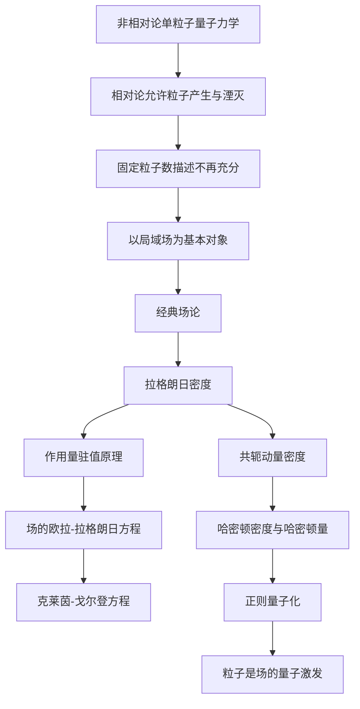

# 第一章 序论（Prelude）

> [!abstract] 本章要回答的问题
> 为什么相对论量子理论的基本对象必须是“场”？经典力学中的坐标、拉格朗日量和哈密顿量，又应当怎样推广到连续分布在空间中的场？

## 1. 学习目标

学完本章后，你应该能够：

1. 说明为什么单粒子量子力学不足以描述相对论性过程；
2. 熟练使用自然单位制、四维时空坐标和爱因斯坦求和约定；
3. 区分粒子的位置坐标与场的空间标签；
4. 从有限自由度系统过渡到连续场；
5. 从作用量原理推导场的欧拉—拉格朗日方程；
6. 写出自由实标量场的拉格朗日密度，并推出克莱茵—戈尔登方程；
7. 定义场的共轭动量密度、哈密顿密度和哈密顿量。

---

## 2. 为什么需要量子“场”

### 2.1 从单粒子量子力学说起

非相对论量子力学通常研究一个已经给定的系统。例如，一个粒子的状态由波函数

$$
\psi(t,\mathbf{x})
$$

描述，它按照薛定谔方程演化：

$$
i\hbar\frac{\partial}{\partial t}\psi(t,\mathbf{x})
=\hat H\psi(t,\mathbf{x}).
$$

这里，$\lvert\psi(t,\mathbf{x})\rvert^2$ 是在时刻 $t$、位置 $\mathbf{x}$ 附近找到粒子的概率密度。在普通低能问题中，我们往往默认“系统中有几个粒子”是事先确定的。

但是，将量子力学与狭义相对论同时考虑以后，这个前提不再可靠。

### 2.2 相对论允许粒子的产生和湮灭

狭义相对论给出能量—动量关系

$$
E^2=\mathbf{p}^2c^2+m^2c^4.
$$

质量本身对应能量，因此只要过程中的能量足够高，就可能发生粒子产生。例如，一个高能光子在适当环境中可以产生电子—正电子对：

$$
\gamma\longrightarrow e^-+e^+.
$$

反过来，电子与正电子也可以湮灭成光子：

$$
e^-+e^+\longrightarrow \gamma+\gamma.
$$

于是，粒子数不再是一个永远固定的输入。只描述“一个粒子的波函数”，无法完整表达一个粒子变成多个粒子、多个粒子又发生湮灭的过程。

> [!question] 检查理解
> 如果某个理论的状态空间只包含“恰好一个电子”的状态，它能否描述电子—正电子对的产生？为什么？

答案是否定的，因为末态与初态具有不同的粒子数，而原来的单粒子状态空间根本没有容纳这种末态。

### 2.3 相对论中的局域性

相对论要求因果影响不能以超过光速的速度传播。物理相互作用应当在时空中的局部位置发生，这就是**局域性**的基本思想。

场非常适合表达局域性：在每个时空点 $x=(t,\mathbf{x})$ 上，都定义一个场值；相互作用可以由同一个时空点上的场相乘来描述。例如，两个场 $\phi(x)$ 和 $\chi(x)$ 的局域相互作用可以具有

$$
\mathcal L_{\text{int}}(x)=-g\phi(x)\chi(x)
$$

这样的形式。这里的两个场都在同一个 $x$ 处取值。

### 2.4 场是基本对象，粒子是场的量子激发

可以把经典场想象成遍布空间的连续振动系统。例如，一根弦有许多振动模式；量子化之后，每一种模式的能量只能以离散份额改变。量子场与此类似：

- 场遍布空间，是理论的基本对象；
- 场可以分解为许多动量模式；
- 每个模式类似一个量子谐振子；
- 模式增加一个能量量子，在实验中就表现为产生了一个粒子。

因此，“一个粒子”不再被理解为独立于场的小球，而是某种场的一份量子化激发。例如，电子是电子场的激发，光子是电磁场的激发。

这个观点自然允许粒子数改变：一个模式可以增加或减少激发数。以后将引入的产生算符和湮灭算符，正是描述这种变化的数学工具。

> [!summary] 你现在应该理解什么
> 单粒子量子力学通常假定粒子数固定；相对论性过程却允许粒子的产生和湮灭。量子场论以局域场为基本对象，将粒子解释为场的量子激发，因而能够统一描述相对论、量子效应和粒子数变化。

---

## 3. 必要的理论力学与量子力学回顾

### 3.1 从牛顿方程到作用量原理

设一个系统由广义坐标 $q_i(t)$ 描述，其中 $i=1,2,\ldots,N$。拉格朗日量是坐标、速度和时间的函数：

$$
L=L(q_i,\dot q_i,t).
$$

系统的作用量定义为

$$
S[q]=\int_{t_1}^{t_2}L(q_i,\dot q_i,t)\,\mathrm dt.
$$

真实运动路径使作用量在端点固定的微小变化下取驻值：

$$
\delta S=0.
$$

这不一定意味着 $S$ 是最小值，因此称为**作用量驻值原理**比“最小作用量原理”更准确。

对坐标作微小变化

$$
q_i(t)\rightarrow q_i(t)+\delta q_i(t),
$$

并要求端点处

$$
\delta q_i(t_1)=\delta q_i(t_2)=0,
$$

可以得到欧拉—拉格朗日方程：

$$
\frac{\mathrm d}{\mathrm dt}\frac{\partial L}{\partial\dot q_i}
-\frac{\partial L}{\partial q_i}=0.
$$

它与牛顿运动方程等价，但更容易推广到场和相对论体系。

### 3.2 共轭动量与哈密顿量

与 $q_i$ 共轭的动量定义为

$$
p_i\equiv\frac{\partial L}{\partial\dot q_i}.
$$

对速度进行勒让德变换，得到哈密顿量

$$
H(q_i,p_i,t)=\sum_i p_i\dot q_i-L.
$$

哈密顿方程为

$$
\dot q_i=\frac{\partial H}{\partial p_i},
\qquad
\dot p_i=-\frac{\partial H}{\partial q_i}.
$$

拉格朗日形式使用 $(q_i,\dot q_i)$，哈密顿形式则使用 $(q_i,p_i)$。后者对正则量子化尤其重要，因为量子化时会把经典变量提升为算符，并对正则变量施加对易关系。

### 3.3 量子力学中的状态和算符

量子态是希尔伯特空间中的向量 $\lvert\psi\rangle$，可观测量由厄米算符表示。位置和动量满足正则对易关系

$$
[\hat x_i,\hat p_j]=i\hbar\delta_{ij}.
$$

其中

$$
[\hat A,\hat B]\equiv \hat A\hat B-\hat B\hat A
$$

称为对易子。这个关系将在场论中推广为“同一时刻、不同空间点上的场算符与共轭动量算符之间的对易关系”。

> [!note]
> 本章先研究经典场的拉格朗日和哈密顿结构。下一章再把场提升为算符并进行正则量子化。

> [!summary] 你现在应该理解什么
> 作用量驻值原理给出运动方程；共轭动量和勒让德变换把拉格朗日描述转为哈密顿描述；量子化则把正则变量提升为算符。这条路线可以从有限自由度系统推广到场。

---

## 4. 单位制、度规与常用符号

### 4.1 自然单位制

量子场论中常采用自然单位制：

$$
\hbar=c=1.
$$

这不是说普朗克常量和光速在物理上消失了，而是选择适当的单位，使它们的数值都等于 $1$。这样可以减少公式中的常数，让结构更清晰。

由

$$
E=\hbar\omega,
\qquad
E=pc
$$

可知，在自然单位制中

$$
[E]=[p]=[m],
$$

而长度和时间具有能量倒数的量纲：

$$
[x]=[t]=[E]^{-1}.
$$

方括号 $[A]$ 在这里表示物理量 $A$ 的量纲。

#### 如何恢复 $\hbar$ 和 $c$

恢复普通单位时，可以使用量纲分析。例如自然单位制中的相对论能量关系为

$$
E^2=\mathbf p^2+m^2.
$$

在国际单位制中，$\mathbf p^2$ 需要乘 $c^2$，$m^2$ 需要乘 $c^4$，因此

$$
E^2=\mathbf p^2c^2+m^2c^4.
$$

又如自然单位制中质量为 $m$ 的粒子的约化康普顿波长约为 $m^{-1}$。恢复单位后应为

$$
\bar\lambda=\frac{\hbar}{mc}.
$$

### 4.2 四维时空坐标

本讲义采用自然单位制，并定义四维时空坐标

$$
x^\mu=(x^0,x^1,x^2,x^3)=(t,x,y,z).
$$

希腊指标 $\mu,\nu,\rho,\ldots$ 取值 $0,1,2,3$；拉丁指标 $i,j,k,\ldots$ 通常只取空间分量 $1,2,3$。

若暂时不采用 $c=1$，也常写成 $x^0=ct$。

### 4.3 闵可夫斯基度规

本讲义采用“时间分量为正”的度规约定：

$$
g_{\mu\nu}=g^{\mu\nu}
=\operatorname{diag}(1,-1,-1,-1).
$$

四维矢量的指标通过度规升降：

$$
A_\mu=g_{\mu\nu}A^\nu.
$$

如果

$$
A^\mu=(A^0,\mathbf A),
$$

那么

$$
A_\mu=(A^0,-\mathbf A).
$$

两个四维矢量的洛伦兹内积为

$$
A\cdot B=A^\mu B_\mu
=A^0B^0-\mathbf A\cdot\mathbf B.
$$

时空间隔为

$$
x^2=x^\mu x_\mu=t^2-\mathbf x^2.
$$

> [!warning] 度规号差
> 有些教材采用 $g_{\mu\nu}=\operatorname{diag}(-1,1,1,1)$。两种约定都可以，但会导致若干公式的正负号不同。阅读其他教材时，应先确认其度规约定，并在整个计算中保持一致。

### 4.4 爱因斯坦求和约定

当同一个指标在一项中出现一次上标和一次下标时，默认对它求和：

$$
A^\mu B_\mu
\equiv\sum_{\mu=0}^{3}A^\mu B_\mu.
$$

自由指标在等式两边必须一致；被求和的指标称为哑指标，可以在不引起冲突的前提下改名。例如

$$
A^\mu B_\mu=A^\nu B_\nu.
$$

### 4.5 四维导数与达朗贝尔算符

定义

$$
\partial_\mu\equiv\frac{\partial}{\partial x^\mu}
=(\partial_t,\boldsymbol\nabla),
$$

以及

$$
\partial^\mu=g^{\mu\nu}\partial_\nu
=(\partial_t,-\boldsymbol\nabla).
$$

达朗贝尔算符定义为

$$
\Box\equiv\partial_\mu\partial^\mu
=\partial_t^2-\nabla^2.
$$

它是拉普拉斯算符在闵可夫斯基时空中的相对论推广。

### 4.6 四维动量

四维动量写作

$$
p^\mu=(E,\mathbf p),
\qquad
p_\mu=(E,-\mathbf p).
$$

质量壳条件为

$$
p^\mu p_\mu=E^2-\mathbf p^2=m^2.
$$

它正是相对论能量—动量关系的四维写法。

> [!summary] 你现在应该理解什么
> 自然单位制把 $\hbar$ 和 $c$ 吸收到单位定义中；度规规定四维内积的正负号；爱因斯坦约定简化了指标求和。后续所有公式都依赖这些约定。

---

## 5. 从离散自由度到连续场

### 5.1 一串相连的小振子

想象一条由大量质点和弹簧构成的链。第 $n$ 个质点相对平衡位置的位移记作 $q_n(t)$。若链上有 $N$ 个质点，系统就有 $N$ 个自由度：

$$
q_1(t),q_2(t),\ldots,q_N(t).
$$

当质点间距越来越小、质点数越来越多时，离散标签 $n$ 可以被连续空间坐标 $x$ 取代，而位移变成场：

$$
q_n(t)\longrightarrow\phi(t,x).
$$

在三维空间中则写为

$$
q_i(t)\longrightarrow\phi(t,\mathbf x).
$$

场可以理解为“每个空间点都拥有一个自由度”的系统，因此它具有无限多个自由度。

### 5.2 粒子坐标与场的空间标签

在粒子力学中，$q(t)$ 或 $\mathbf x(t)$ 是粒子的动态位置，它随时间演化。

在场论中，$\mathbf x$ 是用来标记空间点的参数，而 $\phi(t,\mathbf x)$ 才是该点上的动态变量。换句话说：

- 粒子力学问：“粒子现在在哪里？”
- 场论问：“给定位置上的场现在是多少？”

这是初学场论时非常重要的区别。

### 5.3 拉格朗日密度

局域场论的拉格朗日量通常是空间积分：

$$
L(t)=\int\mathrm d^3x\,\mathcal L(\phi,\partial_\mu\phi).
$$

$\mathcal L$ 称为**拉格朗日密度**。作用量为

$$
S=\int\mathrm dt\,L(t)
=\int\mathrm d^4x\,\mathcal L,
$$

其中

$$
\mathrm d^4x\equiv\mathrm dt\,\mathrm d^3x.
$$

三者的关系是

$$
\boxed{
\mathcal L
\xrightarrow{\int\mathrm d^3x}
L
\xrightarrow{\int\mathrm dt}
S
}.
$$

不要混淆 $L$ 与 $\mathcal L$：前者是整个空间上的拉格朗日量，后者是每单位空间体积对拉格朗日量的贡献。

### 5.4 什么是定域场论

如果 $\mathcal L(x)$ 只依赖于同一个时空点上的场及其有限阶导数，例如

$$
\mathcal L(x)=\mathcal L\bigl(\phi(x),\partial_\mu\phi(x)\bigr),
$$

就称这种理论是局域的或定域的。这里不会直接出现相隔很远的两个点上的场乘积，如 $\phi(x)\phi(y)$ 且 $x\ne y$。

> [!summary] 你现在应该理解什么
> 有限个坐标 $q_i(t)$ 在连续极限中变成场 $\phi(t,\mathbf x)$。场在每个空间点都有一个自由度。拉格朗日密度对空间积分得到拉格朗日量，再对时间积分得到作用量。

---

## 6. 场的欧拉—拉格朗日方程

考虑一个实标量场 $\phi(x)$，其作用量为

$$
S[\phi]=\int\mathrm d^4x\,
\mathcal L\bigl(\phi,\partial_\mu\phiigr).
$$

这里“实”表示 $\phi^*=\phi$；“标量”表示它在洛伦兹变换下不带方向指标。

### 6.1 对场作微小变分

令

$$
\phi(x)\rightarrow\phi(x)+\delta\phi(x).
$$

作用量的变化是

$$
\delta S
=\int\mathrm d^4x\,\delta\mathcal L.
$$

因为 $\mathcal L$ 依赖于 $\phi$ 和 $\partial_\mu\phi$，利用多元函数的链式法则：

$$
\delta\mathcal L
=\frac{\partial\mathcal L}{\partial\phi}\delta\phi
+\frac{\partial\mathcal L}{\partial(\partial_\mu\phi)}
\delta(\partial_\mu\phi).
$$

变分与时空微分可以交换，因此

$$
\delta(\partial_\mu\phi)=\partial_\mu(\delta\phi).
$$

于是

$$
\delta S
=\int\mathrm d^4x
\left[
\frac{\partial\mathcal L}{\partial\phi}\delta\phi
+\frac{\partial\mathcal L}{\partial(\partial_\mu\phi)}
\partial_\mu(\delta\phi)
\right].
$$

### 6.2 分部积分

对第二项做四维分部积分：

$$
\begin{aligned}
\frac{\partial\mathcal L}{\partial(\partial_\mu\phi)}
\partial_\mu(\delta\phi)
={}&
\partial_\mu\left[
\frac{\partial\mathcal L}{\partial(\partial_\mu\phi)}
\delta\phi
\right]\\
&-
\partial_\mu\left[
\frac{\partial\mathcal L}{\partial(\partial_\mu\phi)}
\right]\delta\phi.
\end{aligned}
$$

第一项是时空边界项。要求变分 $\delta\phi$ 在积分区域的边界上为零，边界项就不贡献。因此

$$
\delta S
=\int\mathrm d^4x
\left[
\frac{\partial\mathcal L}{\partial\phi}
-\partial_\mu\left(
\frac{\partial\mathcal L}{\partial(\partial_\mu\phi)}
\right)
\right]\delta\phi.
$$

由于区域内部的 $\delta\phi(x)$ 可以任意选取，要使 $\delta S=0$，方括号必须处处为零：

$$
\boxed{
\frac{\partial\mathcal L}{\partial\phi}
-\partial_\mu\left(
\frac{\partial\mathcal L}{\partial(\partial_\mu\phi)}
\right)=0
}.
$$

这就是单个实标量场的欧拉—拉格朗日方程。

如果存在多个场 $\phi_a$，每个独立场都满足

$$
\frac{\partial\mathcal L}{\partial\phi_a}
-\partial_\mu\left(
\frac{\partial\mathcal L}{\partial(\partial_\mu\phi_a)}
\right)=0.
$$

> [!tip] 与粒子力学对照
> 对应关系为
> $$
> q_i(t)\leftrightarrow\phi_a(x),
> \qquad
> \frac{\mathrm d}{\mathrm dt}
> \leftrightarrow\partial_\mu.
> $$
> 场依赖四个时空坐标，因此普通时间导数自然推广为四维偏导数。

> [!summary] 你现在应该理解什么
> 场的运动方程不是额外猜出的，而是从作用量驻值原理得到的。推导中的关键步骤是链式法则、变分与微分交换、四维分部积分以及边界变分为零。

---

## 7. 自由实标量场与克莱茵—戈尔登方程

### 7.1 拉格朗日密度

自由实标量场的拉格朗日密度取为

$$
\boxed{
\mathcal L
=\frac12\partial_\mu\phi\,\partial^\mu\phi
-\frac12m^2\phi^2
}.
$$

将时间和空间分量展开：

$$
\mathcal L
=\frac12\dot\phi^2
-\frac12(\boldsymbol\nabla\phi)^2
-\frac12m^2\phi^2,
$$

其中

$$
\dot\phi\equiv\frac{\partial\phi}{\partial t}.
$$

这三个部分分别类似于：

- $\frac12\dot\phi^2$：时间变化带来的“动能密度”；
- $\frac12(\boldsymbol\nabla\phi)^2$：空间不均匀带来的能量；
- $\frac12m^2\phi^2$：场偏离零点带来的“势能密度”。

“自由”表示拉格朗日密度中没有描述不同激发相互散射的相互作用项，如 $\phi^3$ 或 $\phi^4$。

### 7.2 推导运动方程

先计算对场本身的偏导：

$$
\frac{\partial\mathcal L}{\partial\phi}=-m^2\phi.
$$

再计算对场导数的偏导：

$$
\frac{\partial\mathcal L}{\partial(\partial_\mu\phi)}
=\partial^\mu\phi.
$$

代入场的欧拉—拉格朗日方程：

$$
-m^2\phi-\partial_\mu\partial^\mu\phi=0.
$$

整理后得到

$$
\boxed{(\Box+m^2)\phi=0}.
$$

展开为

$$
\boxed{
\left(\frac{\partial^2}{\partial t^2}
-\nabla^2+m^2\right)\phi(t,\mathbf x)=0
}.
$$

这就是自由实标量场的**克莱茵—戈尔登方程**。

### 7.3 平面波解与色散关系

尝试平面波形式

$$
\phi(x)\propto e^{-ip\cdot x},
$$

其中

$$
p\cdot x=Et-\mathbf p\cdot\mathbf x.
$$

由于

$$
\partial_\mu\partial^\mu e^{-ip\cdot x}
=-p_\mu p^\mu e^{-ip\cdot x},
$$

代入运动方程可得

$$
p^2=m^2,
$$

即

$$
E^2=\mathbf p^2+m^2.
$$

因此，克莱茵—戈尔登方程自动包含相对论能量—动量关系。这说明它是相对论协变的波动方程。

需要注意，方程允许

$$
E=\pm\sqrt{\mathbf p^2+m^2}.
$$

在单粒子量子力学中，负频率解会引发概率解释上的困难；在量子场论中，它将被重新解释，并与反粒子及产生、湮灭结构联系起来。这里暂不展开。

### 7.4 场的质量量纲

自然单位制中，作用量以 $\hbar$ 为单位，因此 $[S]=1$，即无量纲。又因为

$$
S=\int\mathrm d^4x\,\mathcal L,
$$

且 $[\mathrm d^4x]=[E]^{-4}$，所以

$$
[\mathcal L]=[E]^4.
$$

由动能项

$$
(\partial_\mu\phi)^2
$$

以及 $[\partial_\mu]=[E]$ 可得

$$
[\phi]=[E].
$$

也就是说，在四维时空中，自由实标量场的质量量纲为 $1$。

> [!summary] 你现在应该理解什么
> 自由实标量场的拉格朗日密度由洛伦兹标量构成。作用量原理给出克莱茵—戈尔登方程，其平面波解满足相对论色散关系。这里的 $m$ 因而可以解释为量子化后粒子激发的质量。

---

## 8. 场的哈密顿形式

### 8.1 共轭动量密度

粒子力学中，共轭动量为 $p_i=\partial L/\partial\dot q_i$。对场而言，与 $\phi(t,\mathbf x)$ 共轭的动量密度定义为

$$
\boxed{
\pi(t,\mathbf x)
\equiv\frac{\partial\mathcal L}{\partial\dot\phi(t,\mathbf x)}
}.
$$

对自由实标量场，

$$
\mathcal L
=\frac12\dot\phi^2
-\frac12(\boldsymbol\nabla\phi)^2
-\frac12m^2\phi^2,
$$

所以

$$
\boxed{\pi=\dot\phi}.
$$

### 8.2 哈密顿密度

对 $\dot\phi$ 作勒让德变换，定义哈密顿密度

$$
\boxed{
\mathcal H=\pi\dot\phi-\mathcal L
}.
$$

代入 $\pi=\dot\phi$，得到

$$
\begin{aligned}
\mathcal H
&=\dot\phi^2
-\left[
\frac12\dot\phi^2
-\frac12(\boldsymbol\nabla\phi)^2
-\frac12m^2\phi^2
\right]\\
&=\frac12\pi^2
+\frac12(\boldsymbol\nabla\phi)^2
+\frac12m^2\phi^2.
\end{aligned}
$$

因此

$$
\boxed{
\mathcal H
=\frac12\pi^2
+\frac12(\boldsymbol\nabla\phi)^2
+\frac12m^2\phi^2
}.
$$

总哈密顿量为

$$
\boxed{
H=\int\mathrm d^3x\,\mathcal H
}.
$$

对于自由实标量场，$\mathcal H$ 可以解释为能量密度。三个平方项均非负，因此总能量有下界。

### 8.3 场的哈密顿方程

场论中普通偏导数被泛函导数取代。哈密顿方程写成

$$
\dot\phi(t,\mathbf x)
=\frac{\delta H}{\delta\pi(t,\mathbf x)},
$$

$$
\dot\pi(t,\mathbf x)
=-\frac{\delta H}{\delta\phi(t,\mathbf x)}.
$$

对自由实标量场，第一式给出

$$
\dot\phi=\pi.
$$

第二式给出

$$
\dot\pi=\nabla^2\phi-m^2\phi.
$$

利用 $\pi=\dot\phi$，可得

$$
\ddot\phi-\nabla^2\phi+m^2\phi=0,
$$

这与克莱茵—戈尔登方程完全一致。

### 8.4 为正则量子化做准备

在经典场论中，$\phi$ 和 $\pi$ 是普通的场变量。正则量子化将它们提升为算符，并把粒子力学中的关系

$$
[\hat q_i,\hat p_j]=i\delta_{ij}
$$

推广到等时场算符关系

$$
[\hat\phi(t,\mathbf x),\hat\pi(t,\mathbf y)]
=i\delta^{(3)}(\mathbf x-\mathbf y).
$$

这里的三维狄拉克 $\delta$ 函数表达：场在每个空间点都像一个独立的正则自由度。这个关系将在下一章详细讨论。

> [!summary] 你现在应该理解什么
> 共轭动量密度是拉格朗日密度对场的时间导数的偏导；哈密顿密度来自勒让德变换；空间积分得到总哈密顿量。场的哈密顿方程与欧拉—拉格朗日方程给出相同的运动。

---

## 9. 本章概念脉络

如果当前 Obsidian 未开启 Mermaid，也可以用下面的文字链条理解：

$$
\text{相对论与量子力学}
\Longrightarrow
\text{粒子数可以改变}
\Longrightarrow
\text{以场为基本对象}
\Longrightarrow
\text{经典场的作用量与哈密顿结构}
\Longrightarrow
\text{量子化}
\Longrightarrow
\text{粒子作为场的激发}.
$$

---

## 10. 常见误区

### 误区一：场 $\phi(t,\mathbf x)$ 是粒子的波函数

不一定。经典场首先是每个时空点上的物理量。量子化后，$\phi$ 通常成为算符，而不是单粒子概率波函数。

### 误区二：场的空间坐标就是粒子的位置

$\mathbf x$ 是场的标签，表示我们正在查看哪个空间点；它不是某个粒子必须占据的位置。

### 误区三：$L$ 和 $\mathcal L$ 是同一个量

它们通过空间积分联系：

$$
L=\int\mathrm d^3x\,\mathcal L.
$$

$L$ 是整个系统的拉格朗日量，$\mathcal L$ 是拉格朗日密度。

### 误区四：自然单位制中量纲也消失了

自然单位制只减少了基本单位的种类，并没有取消量纲。长度仍然具有能量倒数的量纲，量纲分析仍是检查公式的重要方法。

### 误区五：采用不同度规的教材必有一本写错

两种常用度规约定都正确。关键是同一套推导中必须始终保持一致，不能混用。

### 误区六：$\delta S=0$ 表示作用量一定最小

$\delta S=0$ 只表示作用量取驻值，它也可能是最大值或鞍点。

### 误区七：自由场表示场完全不变化

自由场仍然可以传播和振荡。“自由”仅表示没有加入导致不同量子激发相互作用的项。

### 误区八：克莱茵—戈尔登方程只能描述自旋为零的单粒子波函数

在现代量子场论中，它首先被理解为标量场的场方程。量子化后，该场的激发对应自旋为零的粒子。

---

## 11. 本章总结

1. 相对论允许质量与能量相互转化，因此粒子可以产生和湮灭，固定粒子数的单粒子量子力学不再充分。
2. 量子场论以局域场为基本对象，把粒子解释为场的量子激发。
3. 自然单位制令 $\hbar=c=1$；本讲义采用度规 $g_{\mu\nu}=\operatorname{diag}(1,-1,-1,-1)$。
4. 场 $\phi(t,\mathbf x)$ 可以看作无穷多个连续自由度的集合。
5. 拉格朗日密度、拉格朗日量与作用量满足
   $$
   L=\int\mathrm d^3x\,\mathcal L,
   \qquad
   S=\int\mathrm d^4x\,\mathcal L.
   $$
6. 作用量驻值原理给出场的欧拉—拉格朗日方程
   $$
   \frac{\partial\mathcal L}{\partial\phi}
   -\partial_\mu\left(
   \frac{\partial\mathcal L}{\partial(\partial_\mu\phi)}
   \right)=0.
   $$
7. 自由实标量场满足克莱茵—戈尔登方程
   $$
   (\Box+m^2)\phi=0.
   $$
8. 场的共轭动量密度和哈密顿密度分别为
   $$
   \pi=\frac{\partial\mathcal L}{\partial\dot\phi},
   \qquad
   \mathcal H=\pi\dot\phi-\mathcal L.
   $$

---

## 12. 练习题

> [!example] 练习 1：为什么需要场
> 用自己的语言说明：为什么相对论性量子理论不能始终使用固定粒子数的单粒子波函数？请至少提到一个具体物理过程。
>
> **提示：**思考 $E=mc^2$、电子—正电子对产生，以及初态和末态的粒子数。

> [!example] 练习 2：自然单位与量纲
> 在自然单位制中，证明长度的量纲为质量量纲的倒数。若某粒子的质量为 $m$，说明为什么它对应的特征长度正比于 $m^{-1}$，并尝试恢复 $\hbar$ 和 $c$。
>
> **提示：**使用 $E=\hbar\omega$、$E=pc$ 和 $p\sim\hbar/\lambda$。

> [!example] 练习 3：指标与度规
> 本讲义采用 $g_{\mu\nu}=\operatorname{diag}(1,-1,-1,-1)$。设 $A^\mu=(2,1,-1,3)$，求 $A_\mu$ 和 $A^\mu A_\mu$。
>
> **提示：**降低空间指标时会改变符号。

> [!example] 练习 4：推导场方程
> 考虑拉格朗日密度
> $$
> \mathcal L
> =\frac12\partial_\mu\phi\partial^\mu\phi
> -\frac12m^2\phi^2-J(x)\phi,
> $$
> 其中 $J(x)$ 是给定的外源。使用场的欧拉—拉格朗日方程推导 $\phi$ 的运动方程。
>
> **提示：**分别计算 $\partial\mathcal L/\partial\phi$ 和 $\partial\mathcal L/\partial(\partial_\mu\phi)$；外源项会使方程右侧不再为零。

> [!example] 练习 5：哈密顿形式
> 从自由实标量场的拉格朗日密度出发，计算共轭动量密度 $\pi$ 和哈密顿密度 $\mathcal H$。进一步说明为什么 $\mathcal H$ 的形式暗示系统能量有下界。
>
> **提示：**先把 $\partial_\mu\phi\partial^\mu\phi$ 展开成时间导数项和空间梯度项，再对 $\dot\phi$ 作勒让德变换。

---

## 13. 下一章预告

下一章将把本章建立的经典场结构进行正则量子化。核心步骤包括：

1. 把 $\phi$ 和 $\pi$ 提升为算符；
2. 施加等时正则对易关系；
3. 将自由场分解为不同动量的振动模式；
4. 引入产生、湮灭算符；
5. 理解多粒子态和福克空间。

本章最重要的准备工作，是牢固掌握这条对应关系：

$$
(q_i,p_i)
\quad\longrightarrow\quad
(\phi(t,\mathbf x),\pi(t,\mathbf x)).
$$
