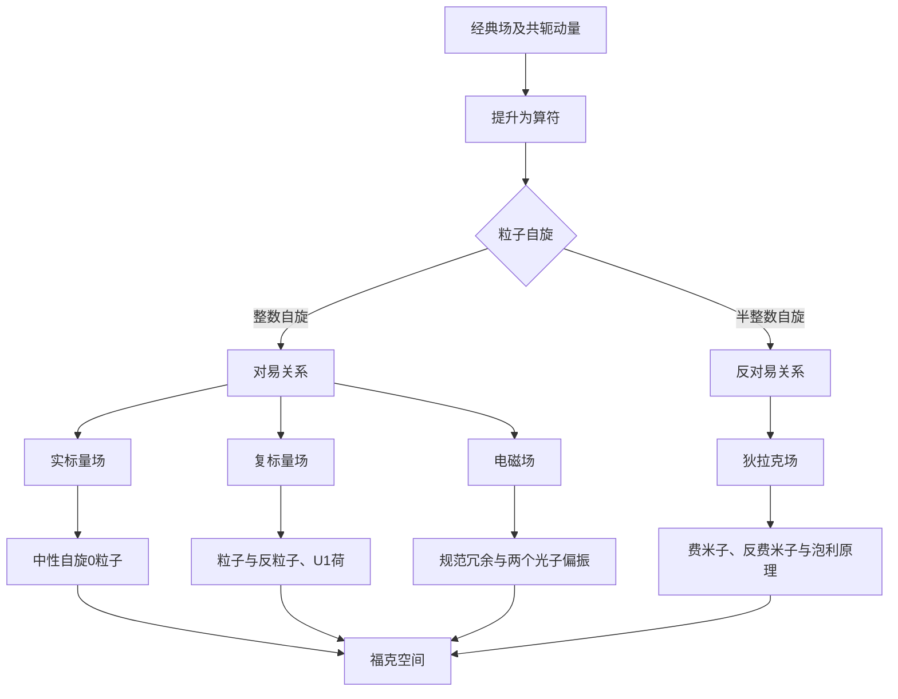

# 第二章 场的正则量子化

> [!abstract] 本章主线
> 经典场具有无限多个自由度。正则量子化把场及其共轭动量提升为算符，使每个动量模式成为一个量子谐振子。产生、湮灭这些模式的量子，就得到粒子的产生与湮灭。

## 0. 学习指南

### 0.1 本章学习目标

学完本章后，你应该能够：

1. 说明场的正则量子化与单粒子量子力学正则量子化之间的联系；
2. 对自由实标量场和复标量场进行模式展开与正则量子化；
3. 构造真空、单粒子态、多粒子态和数算符；
4. 从连续对称性推导诺特流与守恒荷；
5. 建立狄拉克方程，理解旋量、反粒子和投影算符；
6. 解释费米场为什么使用反对易关系；
7. 区分手征性、螺旋度和自旋；
8. 用协变形式表达麦克斯韦方程，理解规范冗余；
9. 写出自由电磁场的动量展开，并解释光子的两个物理偏振。

### 0.2 前置知识检查表

开始学习前，建议确认自己能够：

- [ ] 写出自然单位制下的相对论能量—动量关系；
- [ ] 使用度规升降四维指标；
- [ ] 计算简单的四维内积；
- [ ] 从作用量推导场的欧拉—拉格朗日方程；
- [ ] 定义场的共轭动量密度和哈密顿密度；
- [ ] 写出量子谐振子的产生、湮灭算符；
- [ ] 理解对易子、反对易子、厄米共轭和矩阵迹；
- [ ] 进行基本的傅里叶变换；
- [ ] 理解狄拉克 $\delta$ 函数的筛选性质。

如果其中几项不熟悉，不必停下。相关知识会在首次使用时简要回顾。

### 0.3 约定与符号

本章使用自然单位制

$$
\hbar=c=1,
$$

并采用度规

$$
g_{\mu\nu}=\operatorname{diag}(1,-1,-1,-1).
$$

四维坐标、四维动量和内积分别为

$$
x^\mu=(t,\mathbf x),
\qquad
p^\mu=(E_{\mathbf p},\mathbf p),
$$

$$
p\cdot x=E_{\mathbf p}t-\mathbf p\cdot\mathbf x,
\qquad
E_{\mathbf p}=\sqrt{\mathbf p^2+m^2}.
$$

定义洛伦兹不变的在壳积分测度

$$
\widetilde{\mathrm dp}
\equiv
\frac{\mathrm d^3p}{(2\pi)^3,2E_{\mathbf p}}.
$$

本章采用协变归一化：

$$
[a(\mathbf p),a^\dagger(\mathbf q)]
=(2\pi)^3,2E_{\mathbf p}\,
\delta^{(3)}(\mathbf p-\mathbf q).
$$

这样，场展开前不再额外出现 $1/\sqrt{2E_{\mathbf p}}$。有些教材采用非协变归一化，把这个因子写进场展开中；两者物理上等价。

常用记号如下：

| 记号                                  | 含义                |     |
| ----------------------------------- | ----------------- | --- |
| $\partial_\mu$                      | 对 $x^\mu$ 的偏导数    |     |
| $\Box=\partial_\mu\partial^\mu$     | 达朗贝尔算符            |     |
| $[A,B]=AB-BA$                       | 对易子               |     |
| $\{A,B\}=AB+BA$                     | 反对易子              |     |
| $\delta^{(3)}(\mathbf x-\mathbf y)$ | 三维狄拉克 $\delta$ 函数 |     |
| $:O:$                               | 算符 $O$ 的正规序       |     |
| $\not p=\gamma^\mu p_\mu$           | 费曼斜线记号            |     |
| $\bar\psi=\psi^\dagger\gamma^0$     | 狄拉克伴随             |     |

> [!warning] 关于约定
> 度规、傅里叶指数、旋量归一化和产生湮灭算符归一化在不同教材中可能不同。比较公式时，要把整套约定一起比较。

### 0.4 建议学习路线与时间

| 阶段 | 内容 | 建议时间 |
|---|---|---:|
| 第一阶段 | 谐振子、正则量子化、实标量场 | 4 学时 |
| 第二阶段 | 复标量场、诺特定理 | 3 学时 |
| 第三阶段 | 狄拉克方程、平面波解 | 4 学时 |
| 第四阶段 | 旋量场量子化、外尔旋量 | 4 学时 |
| 第五阶段 | 麦克斯韦方程、规范对称性 | 2 学时 |
| 第六阶段 | 电磁场量子化、综合复习 | 3 学时 |

---

## 1. 第一章知识回顾

经典实标量场的拉格朗日密度为

$$
\mathcal L
=\frac12\partial_\mu\phi\partial^\mu\phi
-\frac12m^2\phi^2.
$$

由场的欧拉—拉格朗日方程

$$
\frac{\partial\mathcal L}{\partial\phi}
-\partial_\mu
\frac{\partial\mathcal L}{\partial(\partial_\mu\phi)}=0
$$

得到克莱茵—戈尔登方程

$$
(\Box+m^2)\phi=0.
$$

共轭动量密度和哈密顿密度为

$$
\pi=\frac{\partial\mathcal L}{\partial\dot\phi}=\dot\phi,
$$

$$
\mathcal H
=\pi\dot\phi-\mathcal L
=\frac12\pi^2
+\frac12(\nabla\phi)^2
+\frac12m^2\phi^2.
$$

第一章中的 $\phi$ 与 $\pi$ 还是经典变量。本章要做的关键改变是

$$
\phi,\pi
\quad\longrightarrow\quad
\hat\phi,\hat\pi,
$$

并为它们规定合适的（反）对易关系。

---

## 2. 从量子谐振子到量子场

### 2.1 单个量子谐振子

质量取为 $1$ 的谐振子哈密顿量为

$$
H=\frac12p^2+\frac12\omega^2q^2,
$$

量子化后满足

$$
[\hat q,\hat p]=i.
$$

定义

$$
a=\sqrt{\frac{\omega}{2}}\hat q
+\frac{i}{\sqrt{2\omega}}\hat p,
$$

$$
a^\dagger=\sqrt{\frac{\omega}{2}}\hat q
-\frac{i}{\sqrt{2\omega}}\hat p.
$$

由 $[\hat q,\hat p]=i$ 可得

$$
[a,a^\dagger]=1.
$$

哈密顿量变为

$$
H=\omega\left(a^\dagger a+\frac12\right).
$$

数算符 $N=a^\dagger a$ 的本征值为 $0,1,2,\ldots$。$a^\dagger$ 使激发数增加一，$a$ 使激发数减少一。

### 2.2 场是无穷多个振子

把自由场作傅里叶分解后，每个动量 $\mathbf p$ 的模式独立振动，频率为

$$
\omega_{\mathbf p}=E_{\mathbf p}
=\sqrt{\mathbf p^2+m^2}.
$$

因此可以建立直观对应：

$$
\boxed{
\text{自由场}
=\text{所有动量模式的量子谐振子集合}
}.
$$

每个模式的一份激发就是一个确定动量的粒子。增加一个模式的激发数，等价于产生一个粒子；减少一次激发，等价于湮灭一个粒子。

### 2.3 盒归一化到连续动量

先把系统放在体积 $V=L^3$ 的周期边界盒中，允许动量离散取值：

$$
\mathbf p=\frac{2\pi}{L}\mathbf n,
\qquad
\mathbf n\in\mathbb Z^3.
$$

无限体积极限中，离散求和变成积分：

$$
\frac1V\sum_{\mathbf p}
\longrightarrow
\int\frac{\mathrm d^3p}{(2\pi)^3}.
$$

克罗内克符号相应变成狄拉克函数：

$$
V\delta_{\mathbf p\mathbf q}
\longrightarrow
(2\pi)^3\delta^{(3)}(\mathbf p-\mathbf q).
$$

这解释了为什么连续动量归一化中总会出现 $\delta^{(3)}$。

> [!summary] 你现在应该理解什么
> 自由场的不同动量模式彼此独立，每个模式在数学上都是一个谐振子。场量子化后，振子的激发数成为粒子数。

> [!question] 检查理解
> 1. 为什么确定动量的单粒子态通常不是空间定域态？
> 2. 盒子体积趋于无穷时，动量为什么从离散值变成连续值？

---

## 3. 正则量子化的一般框架

### 3.1 从泊松括号到对易子

粒子力学的正则变量满足

$$
\{q_i,p_j\}_{\mathrm{PB}}=\delta_{ij}.
$$

场论中，自由度标签由离散的 $i$ 变为连续的 $\mathbf x$：

$$
\{\phi(t,\mathbf x),\pi(t,\mathbf y)\}_{\mathrm{PB}}
=\delta^{(3)}(\mathbf x-\mathbf y).
$$

量子化规则把泊松括号替换为对易子除以 $i$，得到玻色场的等时关系：

$$
[\hat\phi(t,\mathbf x),\hat\pi(t,\mathbf y)]
=i\delta^{(3)}(\mathbf x-\mathbf y),
$$

$$
[\hat\phi(t,\mathbf x),\hat\phi(t,\mathbf y)]=0,
\qquad
[\hat\pi(t,\mathbf x),\hat\pi(t,\mathbf y)]=0.
$$

“等时”表示两个算符的时间坐标相同。$\delta^{(3)}(\mathbf x-\mathbf y)$ 是连续自由度版本的 $\delta_{ij}$：只有在同一空间点，场与其共轭动量才是一对正则变量。

### 3.2 场是算符值分布

量子场 $\hat\phi(x)$ 严格来说不是每一点都良好定义的普通算符，而是**算符值分布**。真正良好定义的对象通常是它与光滑函数 $f(x)$ 的积分：

$$
\hat\phi(f)=\int\mathrm d^4x\,f(x)\hat\phi(x).
$$

因此，$\hat\phi(x)^2$ 这类同一点算符乘积可能发散。正规序能够处理自由理论中的部分真空发散；相互作用理论还需要后续章节的重整化方法。

### 3.3 福克空间

真空态 $|0\rangle$ 定义为被所有湮灭算符消灭：

$$
a(\mathbf p)|0\rangle=0.
$$

单粒子态为

$$
|\mathbf p\rangle=a^\dagger(\mathbf p)|0\rangle,
$$

多粒子态为

$$
|\mathbf p_1,\ldots,\mathbf p_n\rangle
=a^\dagger(\mathbf p_1)\cdots
a^\dagger(\mathbf p_n)|0\rangle.
$$

包含 $0,1,2,\ldots$ 个粒子扇区的直和空间称为福克空间：

$$
\mathcal F
=\mathcal H_0\oplus\mathcal H_1
\oplus\mathcal H_2\oplus\cdots.
$$

它正是描述粒子数可变过程所需要的状态空间。

---

## 4. 自由实标量场的量子化

### 4.1 模式展开

从现在起省略场算符上的帽子。自由实标量场写成

$$
\boxed{
\phi(x)
=\int\widetilde{\mathrm dp}
\left[
a(\mathbf p)e^{-ip\cdot x}
+a^\dagger(\mathbf p)e^{ip\cdot x}
\right]
}.
$$

实场条件 $\phi^\dagger=\phi$ 使正频部分与负频部分互为厄米共轭。因此只需要一组 $a$ 和 $a^\dagger$。

共轭动量为

$$
\pi(x)=\dot\phi(x)
=-i\int\widetilde{\mathrm dp}\,E_{\mathbf p}
\left[
a(\mathbf p)e^{-ip\cdot x}
-a^\dagger(\mathbf p)e^{ip\cdot x}
\right].
$$

### 4.2 模式算符的对易关系

要求等时关系

$$
[\phi(t,\mathbf x),\pi(t,\mathbf y)]
=i\delta^{(3)}(\mathbf x-\mathbf y)
$$

等价于

$$
\boxed{
[a(\mathbf p),a^\dagger(\mathbf q)]
=(2\pi)^3,2E_{\mathbf p}
\delta^{(3)}(\mathbf p-\mathbf q)
},
$$

以及

$$
[a(\mathbf p),a(\mathbf q)]=0,
\qquad
[a^\dagger(\mathbf p),a^\dagger(\mathbf q)]=0.
$$

最后两个关系说明多个相同玻色子的产生算符可以交换顺序，因此多玻色子态在粒子交换下对称。

### 4.3 单粒子态与多粒子态

协变归一化的单粒子态满足

$$
\langle\mathbf p|\mathbf q\rangle
=(2\pi)^3,2E_{\mathbf p}
\delta^{(3)}(\mathbf p-\mathbf q).
$$

$a^\dagger(\mathbf p)$ 产生确定动量的平面波激发。平面波充满整个空间，所以它不是确定位置的粒子态。空间局域的波包需要叠加不同动量：

$$
|f\rangle
=\int\widetilde{\mathrm dp}\,
f(\mathbf p)a^\dagger(\mathbf p)|0\rangle.
$$

### 4.4 哈密顿量与零点能

把模式展开代入

$$
H=\int\mathrm d^3x
\left[
\frac12\pi^2
+\frac12(\nabla\phi)^2
+\frac12m^2\phi^2
\right],
$$

利用空间积分产生的 $\delta$ 函数，可以把不同动量模式分离。结果具有“每个模式一个谐振子”的形式：

$$
H
=\int\widetilde{\mathrm dp}\,
E_{\mathbf p}
\left[
a^\dagger(\mathbf p)a(\mathbf p)
+\frac12[a(\mathbf p),a^\dagger(\mathbf p)]
\right].
$$

第二项是所有模式零点能之和，在无限体积和任意高动量下发散。对不考虑引力的自由场，可以用正规序把所有产生算符移到湮灭算符左侧：

$$
:a(\mathbf p)a^\dagger(\mathbf q):
=a^\dagger(\mathbf q)a(\mathbf p).
$$

正规序哈密顿量为

$$
\boxed{
:H:
=\int\widetilde{\mathrm dp}\,
E_{\mathbf p}a^\dagger(\mathbf p)a(\mathbf p)
}.
$$

数算符为

$$
N=\int\widetilde{\mathrm dp}\,
a^\dagger(\mathbf p)a(\mathbf p).
$$

> [!warning] $\delta^{(3)}(\mathbf 0)$ 的含义
> 确定动量的平面波态不能归一化为有限范数，计算中会出现 $\delta^{(3)}(\mathbf 0)$。它对应无限空间体积。可先使用有限盒归一化，或使用可归一化的波包态。

### 4.5 为什么它描述中性自旋零粒子

- **中性：**实场只有一组产生、湮灭算符，粒子与反粒子不构成可区分的两类激发；
- **自旋为零：**标量场在空间旋转和洛伦兹变换下没有内部方向指标；
- **质量为 $m$：**平面波满足 $p^2=m^2$，即 $E_{\mathbf p}^2=\mathbf p^2+m^2$。

> [!summary] 你现在应该理解什么
> 实标量场量子化后，每个动量模式都有玻色谐振子谱。$a^\dagger$ 和 $a$ 分别产生、湮灭中性自旋零粒子，正规序去掉自由理论中的形式零点能。

---

## 5. 复标量场的量子化

### 5.1 经典理论与独立自由度

复标量场的拉格朗日密度为

$$
\mathcal L
=\partial_\mu\phi^\dagger\partial^\mu\phi
-m^2\phi^\dagger\phi.
$$

写成两个实场

$$
\phi=\frac{1}{\sqrt2}(\phi_1+i\phi_2),
$$

就能看到复场包含两个独立实自由度。做变分时，应把 $\phi$ 与 $\phi^\dagger$ 暂时看作独立变量。分别变分得到

$$
(\Box+m^2)\phi=0,
\qquad
(\Box+m^2)\phi^\dagger=0.
$$

共轭动量为

$$
\pi_\phi
=\frac{\partial\mathcal L}{\partial\dot\phi}
=\dot\phi^\dagger,
\qquad
\pi_{\phi^\dagger}
=\frac{\partial\mathcal L}{\partial\dot\phi^\dagger}
=\dot\phi.
$$

### 5.2 两组模式算符

复场的展开为

$$
\boxed{
\phi(x)=\int\widetilde{\mathrm dp}
\left[
a(\mathbf p)e^{-ip\cdot x}
+b^\dagger(\mathbf p)e^{ip\cdot x}
\right]
},
$$

$$
\boxed{
\phi^\dagger(x)=\int\widetilde{\mathrm dp}
\left[
b(\mathbf p)e^{-ip\cdot x}
+a^\dagger(\mathbf p)e^{ip\cdot x}
\right]
}.
$$

其中：

- $a^\dagger$ 产生粒子，$a$ 湮灭粒子；
- $b^\dagger$ 产生反粒子，$b$ 湮灭反粒子。

非零对易关系为

$$
[a(\mathbf p),a^\dagger(\mathbf q)]
=(2\pi)^3 2E_{\mathbf p}\delta^{(3)}(\mathbf p-\mathbf q),
$$

$$
[b(\mathbf p),b^\dagger(\mathbf q)]
=(2\pi)^3 2E_{\mathbf p}\delta^{(3)}(\mathbf p-\mathbf q).
$$

$a$ 类算符与 $b$ 类算符彼此对易。复场需要两组算符，正是因为粒子和反粒子是不同的激发。

### 5.3 全局 $U(1)$ 对称性

拉格朗日密度在相位变换

$$
\phi(x)\rightarrow e^{i\alpha}\phi(x),
\qquad
\phi^\dagger(x)\rightarrow e^{-i\alpha}\phi^\dagger(x)
$$

下不变，其中 $\alpha$ 是与时空无关的常数。无穷小变换为

$$
\delta\phi=i\alpha\phi,
\qquad
\delta\phi^\dagger=-i\alpha\phi^\dagger.
$$

去掉整体参数 $\alpha$ 后，诺特流可取为

$$
\boxed{
j^\mu
=i\left(
\phi^\dagger\partial^\mu\phi
-(\partial^\mu\phi^\dagger)\phi
\right)
}.
$$

利用运动方程可以验证

$$
\partial_\mu j^\mu=0.
$$

守恒荷为

$$
Q=\int\mathrm d^3x\,j^0.
$$

正规序后，它具有

$$
\boxed{
Q
=\int\widetilde{\mathrm dp}
\left[
a^\dagger(\mathbf p)a(\mathbf p)
-b^\dagger(\mathbf p)b(\mathbf p)
\right]
}
$$

的结构。若把单个粒子的电荷取为 $+1$，$Q$ 就等于“粒子数减反粒子数”。反粒子与粒子质量相同、电荷相反。

### 5.4 实场与复场对比

| 性质 | 实标量场 | 复标量场 |
|---|---|---|
| 实自由度 | 1 | 2 |
| 厄米性 | $\phi^\dagger=\phi$ | $\phi^\dagger\ne\phi$ |
| 模式算符 | 一组 $a,a^\dagger$ | 两组 $a,a^\dagger$ 和 $b,b^\dagger$ |
| 粒子与反粒子 | 不可区分 | 可区分 |
| 全局 $U(1)$ 荷 | 通常没有 | 可以有 |

> [!summary] 你现在应该理解什么
> 复标量场相当于两个实标量场。它的两组模式描述粒子和反粒子，全局相位对称性产生守恒电荷。

> [!question] 检查理解
> 1. 为什么不能令复场展开中的 $b=a$？
> 2. $Q$ 守恒是否意味着粒子数和反粒子数分别守恒？

---

## 6. 诺特定理与守恒定律

### 6.1 一般形式

设场发生连续无穷小变换

$$
\phi_a(x)\rightarrow\phi_a(x)+\delta\phi_a(x),
$$

坐标变化为

$$
x^\mu\rightarrow x^\mu+\delta x^\mu.
$$

若作用量在该变换下不变，变分通常可整理成

$$
\delta S=\int\mathrm d^4x\,\partial_\mu j^\mu.
$$

在运动方程成立时得到

$$
\boxed{\partial_\mu j^\mu=0}.
$$

这称为连续性方程。将其展开：

$$
\frac{\partial j^0}{\partial t}
+\nabla\cdot\mathbf j=0.
$$

对整个空间积分并假设无穷远处没有通量：

$$
\frac{\mathrm d}{\mathrm dt}
\int\mathrm d^3x\,j^0
=-\int\mathrm d^3x\,
\nabla\cdot\mathbf j=0.
$$

因此

$$
\boxed{
Q=\int\mathrm d^3x\,j^0,
\qquad
\frac{\mathrm dQ}{\mathrm dt}=0
}.
$$

$j^\mu$ 是守恒流，$Q$ 是守恒荷。量子理论中，$Q$ 还常作为相应对称变换的生成元：

$$
\delta\phi=i\epsilon[Q,\phi]
$$

，其中整体符号可能随变换定义而改变。

### 6.2 时空平移与能量—动量

若理论在平移

$$
x^\mu\rightarrow x^\mu+a^\mu
$$

下不变，则对应守恒流是能量—动量张量。正则形式为

$$
T^\mu{}_{\nu}
=\sum_a
\frac{\partial\mathcal L}
{\partial(\partial_\mu\phi_a)}
\partial_\nu\phi_a
-\delta^\mu{}_{\nu}\mathcal L.
$$

其守恒方程为

$$
\partial_\mu T^\mu{}_{\nu}=0.
$$

四动量为

$$
P_\nu=\int\mathrm d^3x\,T^0{}_{\nu}.
$$

$P^0=H$ 是能量，$P^i$ 是三动量。

### 6.3 洛伦兹变换与角动量

洛伦兹对称性带来总角动量守恒。对有自旋的场，总角动量包含两部分：

$$
J^{\mu\nu}=L^{\mu\nu}+S^{\mu\nu},
$$

其中 $L^{\mu\nu}$ 是轨道部分，$S^{\mu\nu}$ 是场的内禀自旋部分。标量场的内禀自旋为零，狄拉克场则具有自旋 $1/2$。

### 6.4 全局与局域对称性

全局 $U(1)$ 变换的参数 $\alpha$ 是常数：

$$
\phi(x)\rightarrow e^{i\alpha}\phi(x).
$$

局域变换允许参数依赖时空：

$$
\phi(x)\rightarrow e^{i\alpha(x)}\phi(x).
$$

普通导数作用在 $e^{i\alpha(x)}$ 上会产生额外项，因此仅有自由物质场时，局域变换通常不是对称性。为了建立局域规范不变性，需要引入规范场和协变导数。这将在相互作用章节中系统学习。

> [!summary] 你现在应该理解什么
> 连续对称性对应守恒流，守恒流的时间分量在空间上的积分给出守恒荷。平移、洛伦兹变换和全局相位变换分别联系能量—动量、角动量和内部电荷。

---

## 7. 狄拉克方程的建立

### 7.1 为什么需要新的方程

克莱茵—戈尔登方程是时空二阶方程，并不包含自旋 $1/2$ 粒子所需的旋量结构。狄拉克希望建立一个对时间和空间导数都为一阶的相对论方程，使时间演化形式更接近薛定谔方程：

$$
i\frac{\partial\psi}{\partial t}=H\psi.
$$

设哈密顿量对动量是线性的：

$$
H=\boldsymbol\alpha\cdot\mathbf p+\beta m.
$$

要求两次作用后恢复

$$
H^2=\mathbf p^2+m^2,
$$

就要求矩阵满足

$$
\{\alpha^i,\alpha^j\}=2\delta^{ij},
\qquad
\{\alpha^i,\beta\}=0,
\qquad
\beta^2=1.
$$

这些对象不可能都是普通数，必须用矩阵表示；因此 $\psi$ 也必须是多分量旋量。在四维时空中，最小的狄拉克表示使用四分量复旋量。

### 7.2 协变形式与伽马矩阵

定义

$$
\gamma^0=\beta,
\qquad
\gamma^i=\beta\alpha^i.
$$

狄拉克方程可写为

$$
\boxed{(i\gamma^\mu\partial_\mu-m)\psi=0}.
$$

伽马矩阵满足克利福德代数

$$
\boxed{
\{\gamma^\mu,\gamma^\nu\}
=2g^{\mu\nu}\mathbf1
}.
$$

将 $(i\not\partial-m)\psi=0$ 左乘 $(i\not\partial+m)$：

$$
(i\not\partial+m)(i\not\partial-m)\psi
=\left(-\gamma^\mu\gamma^\nu\partial_\mu\partial_\nu-m^2\right)\psi.
$$

因为 $\partial_\mu\partial_\nu$ 对指标对称，只有伽马矩阵乘积的反对称部分消失，留下

$$
\gamma^\mu\gamma^\nu\partial_\mu\partial_\nu
=\frac12\{\gamma^\mu,\gamma^\nu\}
\partial_\mu\partial_\nu
=\Box.
$$

于是每个旋量分量都满足

$$
(\Box+m^2)\psi=0.
$$

### 7.3 旋量不是四维矢量

四维矢量有四个分量，狄拉克旋量也有四个分量，但两者在洛伦兹变换下遵循不同的变换规律。分量数相同不代表几何性质相同。

不同的伽马矩阵表示通过相似变换联系：

$$
\gamma'^\mu=S\gamma^\mu S^{-1}.
$$

旋量也相应变换，最终可观测量不依赖选用狄拉克表示、手征表示还是其他表示。

### 7.4 狄拉克伴随与拉格朗日密度

单独的 $\psi^\dagger\psi$ 是概率密度的候选，但不是洛伦兹标量。定义狄拉克伴随

$$
\boxed{\bar\psi=\psi^\dagger\gamma^0}.
$$

于是 $\bar\psi\psi$ 是洛伦兹标量，$\bar\psi\gamma^\mu\psi$ 是四维矢量。

自由狄拉克场的拉格朗日密度为

$$
\boxed{
\mathcal L
=\bar\psi(i\gamma^\mu\partial_\mu-m)\psi
}.
$$

把 $\psi$ 和 $\bar\psi$ 看作独立变量。对 $\bar\psi$ 变分得到

$$
(i\gamma^\mu\partial_\mu-m)\psi=0.
$$

对 $\psi$ 变分并分部积分，得到伴随方程

$$
\boxed{
i(\partial_\mu\bar\psi)\gamma^\mu+m\bar\psi=0
}.
$$

由两式可验证狄拉克流

$$
j^\mu=\bar\psi\gamma^\mu\psi
$$

满足

$$
\partial_\mu j^\mu=0.
$$

其时间分量

$$
j^0=\psi^\dagger\psi\ge0
$$

是非负的，这比把克莱茵—戈尔登场当成单粒子波函数时的密度更适合概率解释。不过在量子场论中，$j^0$ 最终解释为电荷数密度而非单粒子概率密度。

> [!summary] 你现在应该理解什么
> 狄拉克方程是相对论协变的一阶方程。伽马矩阵的反对易代数保证其平方给出克莱茵—戈尔登方程，四分量旋量则承载自旋 $1/2$ 的洛伦兹表示。

---

## 8. 负能解、反粒子与空穴理论

### 8.1 两支能量解

对自由狄拉克方程尝试平面波解，仍然得到质量壳关系

$$
E^2=\mathbf p^2+m^2,
$$

因此形式上存在

$$
E=\pm\sqrt{\mathbf p^2+m^2}.
$$

若把狄拉克方程仅当成单粒子方程，负能量态会造成严重问题：一个正能量电子似乎可以不断向更低的负能态跃迁，使能量没有下界。

### 8.2 狄拉克海的历史图像

狄拉克提出，真空中所有负能电子态已经被占满。由于泡利不相容原理，普通电子不能再跃入这些态。当某个负能电子被激发离开以后，留下的“空穴”表现为：

- 正能量；
- 与电子质量相同；
- 电荷与电子相反。

这个空穴被解释为正电子。空穴理论在历史上成功预言和解释了反粒子，但它不容易普遍推广到玻色子，也使真空图像显得过于依赖单粒子能级。

### 8.3 现代量子场论的解释

现代观点不把负频模式解释为真实的负能粒子。场展开中的相应部分配上反粒子产生算符：

$$
v_s(p)e^{ip\cdot x},b_s^\dagger(\mathbf p).
$$

$b_s^\dagger$ 产生一个能量 $E_{\mathbf p}>0$ 的反粒子。量子场的哈密顿量在正确使用反对易关系和正规序后具有下界。

> [!warning]
> “负频解”“负能单粒子解释”和“负能物理粒子”不是同一概念。现代场论保留方程的两类模式，但把所有可观测粒子的能量都取为正。

---

## 9. 狄拉克平面波解和投影算符

### 9.1 粒子与反粒子旋量

正频粒子解写为

$$
\psi(x)=u_s(p)e^{-ip\cdot x}.
$$

代入狄拉克方程得到

$$
\boxed{(\not p-m)u_s(p)=0}.
$$

负频部分写为

$$
\psi(x)=v_s(p)e^{ip\cdot x},
$$

代入后得到

$$
\boxed{(\not p+m)v_s(p)=0}.
$$

这里 $p^0=E_{\mathbf p}>0$，$s=1,2$ 标记两个独立自旋态。$u_s$ 与粒子模式相联系，$v_s$ 与反粒子模式相联系。

### 9.2 静止旋量与增速

在狄拉克表示中，静止粒子的 $u$ 旋量主要位于上两个分量，$v$ 旋量主要位于下两个分量。一般动量旋量可由静止旋量作洛伦兹增速得到。

一种常用写法是

$$
u_s(p)=
\begin{pmatrix}
\sqrt{E_{\mathbf p}+m}\,\xi_s\\
\dfrac{\boldsymbol\sigma\cdot\mathbf p}
{\sqrt{E_{\mathbf p}+m}}\,\xi_s
\end{pmatrix},
$$

$$
v_s(p)=
\begin{pmatrix}
\dfrac{\boldsymbol\sigma\cdot\mathbf p}
{\sqrt{E_{\mathbf p}+m}}\,\eta_s\\
\sqrt{E_{\mathbf p}+m}\,\eta_s
\end{pmatrix}.
$$

$\xi_s$、$\eta_s$ 是二分量自旋基底，$\boldsymbol\sigma$ 是泡利矩阵。相位和 $v$ 旋量的自旋标签约定可能因教材而异。

### 9.3 归一化和正交关系

本章采用

$$
\bar u_r(p)u_s(p)=2m\delta_{rs},
\qquad
\bar v_r(p)v_s(p)=-2m\delta_{rs},
$$

$$
u_r^\dagger(p)u_s(p)=2E_{\mathbf p}\delta_{rs},
\qquad
v_r^\dagger(p)v_s(p)=2E_{\mathbf p}\delta_{rs}.
$$

粒子与反粒子旋量还满足适当的正交关系。这里的 $2m$ 和 $2E$ 是归一化选择，不是新的动力学结论。

### 9.4 完备性关系

对两个自旋态求和得到

$$
\boxed{
\sum_su_s(p)\bar u_s(p)=\not p+m
},
$$

$$
\boxed{
\sum_sv_s(p)\bar v_s(p)=\not p-m
}.
$$

由

$$
(\not p-m)(\not p+m)=p^2-m^2=0
$$

可见，$\not p+m$ 的像空间位于粒子解子空间中。对有质量粒子，适当除以 $2m$ 后可以构造相应投影算符。类似地，$\not p-m$ 编码反粒子旋量的完备求和。

这些自旋求和公式会在计算未观测末态自旋或平均初态自旋时，把旋量乘积化成伽马矩阵迹，从而极大简化散射计算。

> [!tip] 检查公式的方法
> 看到 $u$ 旋量时尝试用 $(\not p-m)$ 作用；看到 $v$ 旋量时尝试用 $(\not p+m)$ 作用。若不能得到零，很可能是符号或指数约定混用了。

> [!summary] 你现在应该理解什么
> $u_s$ 和 $v_s$ 是狄拉克方程在质量壳上的两类独立旋量。完备性关系把自旋求和转换为 $\not p\pm m$，是后续费曼图计算的基础工具。

> [!question] 检查理解
> 1. $v_s(p)e^{ip\cdot x}$ 中为什么仍把 $p^0$ 定义为正数？
> 2. 伽马矩阵表示改变时，完备性关系的物理内容会改变吗？

---

## 10. 旋量场的量子化

### 10.1 场展开

自由狄拉克场展开为

$$
\boxed{
\psi(x)
=\sum_{s=1}^2\int\widetilde{\mathrm dp}
\left[
a_s(\mathbf p)u_s(p)e^{-ip\cdot x}
+b_s^\dagger(\mathbf p)v_s(p)e^{ip\cdot x}
\right]
}.
$$

其狄拉克伴随为

$$
\bar\psi(x)
=\sum_{s=1}^2\int\widetilde{\mathrm dp}
\left[
a_s^\dagger(\mathbf p)\bar u_s(p)e^{ip\cdot x}
+b_s(\mathbf p)\bar v_s(p)e^{-ip\cdot x}
\right].
$$

四类算符的物理意义为：

| 算符 | 作用 |
|---|---|
| $a_s(\mathbf p)$ | 湮灭一个动量 $\mathbf p$、自旋 $s$ 的粒子 |
| $a_s^\dagger(\mathbf p)$ | 产生一个动量 $\mathbf p$、自旋 $s$ 的粒子 |
| $b_s(\mathbf p)$ | 湮灭一个动量 $\mathbf p$、自旋 $s$ 的反粒子 |
| $b_s^\dagger(\mathbf p)$ | 产生一个动量 $\mathbf p$、自旋 $s$ 的反粒子 |

### 10.2 为什么使用反对易关系

狄拉克拉格朗日密度对 $\dot\psi$ 是一阶的，其正则动量形式上为

$$
\pi_\psi
=\frac{\partial\mathcal L}{\partial\dot\psi}
=i\psi^\dagger.
$$

严格的约束分析需要更完整的正则形式。对入门阶段，直接给出量子化后的等时反对易关系：

$$
\boxed{
\{\psi_\alpha(t,\mathbf x),
\psi_\beta^\dagger(t,\mathbf y)\}
=\delta_{\alpha\beta}
\delta^{(3)}(\mathbf x-\mathbf y)
}.
$$

其余同类等时反对易子为零。模式算符满足

$$
\{a_r(\mathbf p),a_s^\dagger(\mathbf q)\}
=(2\pi)^3 2E_{\mathbf p}\,
\delta_{rs}\delta^{(3)}(\mathbf p-\mathbf q),
$$

$$
\{b_r(\mathbf p),b_s^\dagger(\mathbf q)\}
=(2\pi)^3 2E_{\mathbf p}\,
\delta_{rs}\delta^{(3)}(\mathbf p-\mathbf q).
$$

其他反对易子均为零。

若错误地使用玻色对易关系，反粒子部分会使能谱出现错误符号，无法同时保持能量正定、洛伦兹不变性和局域因果性。使用反对易关系后，重新排列反粒子算符会多出一个负号，恰好使正规序哈密顿量成为

$$
\boxed{
:H:
=\sum_s\int\widetilde{\mathrm dp}\,
E_{\mathbf p}
\left[
a_s^\dagger a_s+b_s^\dagger b_s
\right]
}.
$$

所有粒子和反粒子激发的能量都是正的。

### 10.3 泡利不相容原理

由

$$
\{a_s^\dagger(\mathbf p),a_s^\dagger(\mathbf p)\}=0
$$

得到

$$
2[a_s^\dagger(\mathbf p)]^2=0,
$$

所以

$$
[a_s^\dagger(\mathbf p)]^2=0.
$$

同一个费米模式不能被占据两次。这就是泡利不相容原理在福克空间中的直接表现。两个费米子交换次序时，状态改变一个负号：

$$
a_r^\dagger a_s^\dagger|0\rangle
=-a_s^\dagger a_r^\dagger|0\rangle.
$$

### 10.4 自旋—统计关系

相对论量子场论中的自旋—统计定理表明：

- 整数自旋场服从玻色统计，使用对易关系；
- 半整数自旋场服从费米统计，使用反对易关系。

该定理依赖洛伦兹不变性、局域性、能量正定等条件。本章不证明它，但要记住反对易关系不是人为附加的“记账规则”，而是相对论量子理论结构的必然要求。

> [!summary] 你现在应该理解什么
> 狄拉克场需要粒子和反粒子两组算符。反对易关系保证能量有下界，并自动产生泡利不相容原理和费米态的交换反对称性。

---

## 11. 外尔旋量、手征性与螺旋度

### 11.1 $\gamma^5$ 与手征投影

定义

$$
\gamma^5=i\gamma^0\gamma^1\gamma^2\gamma^3.
$$

它满足

$$
(\gamma^5)^2=1,
\qquad
\{\gamma^5,\gamma^\mu\}=0.
$$

定义左右手投影算符

$$
\boxed{
P_L=\frac{1-\gamma^5}{2},
\qquad
P_R=\frac{1+\gamma^5}{2}
}.
$$

它们满足

$$
P_L^2=P_L,
\qquad
P_R^2=P_R,
\qquad
P_LP_R=0,
\qquad
P_L+P_R=1.
$$

狄拉克旋量可分解为

$$
\psi=\psi_L+\psi_R,
\qquad
\psi_L=P_L\psi,
\qquad
\psi_R=P_R\psi.
$$

$\psi_L$ 和 $\psi_R$ 是两个二分量外尔旋量所对应的手征部分。

### 11.2 质量项混合左右手分量

狄拉克质量项可以写成

$$
m\bar\psi\psi
=m(\bar\psi_L\psi_R+\bar\psi_R\psi_L).
$$

它把左手与右手分量耦合起来。若 $m=0$，自由方程可分成相互独立的左右手外尔方程；若 $m\ne0$，传播过程中左右手分量不能完全独立。

### 11.3 手征性与螺旋度

螺旋度是自旋在动量方向上的投影：

$$
h=\frac{\mathbf S\cdot\mathbf p}{|\mathbf p|}.
$$

手征性则由 $\gamma^5$ 的本征值定义。二者不是同一个概念：

- 手征性是洛伦兹群表示和投影算符的性质；
- 螺旋度描述自旋相对于运动方向的取向；
- 对有质量粒子，可以通过追上并超过粒子来反转其动量方向，所以螺旋度会改变；
- 对无质量粒子，没有惯性系能追上它，粒子态的手征性与螺旋度可以对应起来；对反粒子态，场的手征标签与螺旋度的对应需要注意相反的解释。

弱相互作用对左右手分量的作用不同，因此手征性在标准模型中具有核心地位。

> [!summary] 你现在应该理解什么
> 狄拉克旋量由左右手两个手征部分组成。质量项混合左右手分量；无质量极限下它们可以独立传播。手征性与螺旋度概念不同，只在无质量极限中建立简单对应。

---

## 12. 麦克斯韦方程的协变形式

### 12.1 四维势与场强张量

将标势和矢势组合成四维势

$$
A^\mu=(A^0,\mathbf A).
$$

电场和磁场由势给出：

$$
\mathbf E=-\nabla A^0-\frac{\partial\mathbf A}{\partial t},
\qquad
\mathbf B=\nabla\times\mathbf A.
$$

定义反对称场强张量

$$
\boxed{
F_{\mu\nu}=\partial_\mu A_\nu-\partial_\nu A_\mu
}.
$$

$F_{\mu\nu}$ 的独立分量正好编码 $\mathbf E$ 和 $\mathbf B$。具体分量中的正负号取决于度规以及 $A^i$ 的定义，但张量方程不依赖具体坐标表示。

### 12.2 拉格朗日密度与运动方程

含外部四维电流 $j^\mu=(\rho,\mathbf j)$ 时，电磁场拉格朗日密度为

$$
\boxed{
\mathcal L
=-\frac14F_{\mu\nu}F^{\mu\nu}
-j_\mu A^\mu
}.
$$

由于

$$
\delta F_{\mu\nu}
=\partial_\mu\delta A_\nu
-\partial_\nu\delta A_\mu,
$$

以及 $F^{\mu\nu}=-F^{\nu\mu}$，作用量变分为

$$
\delta S
=\int\mathrm d^4x
\left[
-F^{\mu\nu}\partial_\mu\delta A_\nu
-j^\nu\delta A_\nu
\right].
$$

分部积分并舍去边界项：

$$
\delta S
=\int\mathrm d^4x
\left(\partial_\mu F^{\mu\nu}-j^\nu\right)
\delta A_\nu.
$$

于是得到

$$
\boxed{
\partial_\mu F^{\mu\nu}=j^\nu
}.
$$

它包含高斯定律和安培—麦克斯韦定律。另两条麦克斯韦方程来自 $F_{\mu\nu}$ 的定义，即比安基恒等式

$$
\boxed{
\partial_\lambda F_{\mu\nu}
+\partial_\mu F_{\nu\lambda}
+\partial_\nu F_{\lambda\mu}=0
}.
$$

### 12.3 电荷守恒

对运动方程再作用 $\partial_\nu$：

$$
\partial_\nu\partial_\mu F^{\mu\nu}
=\partial_\nu j^\nu.
$$

左边因导数对称而 $F^{\mu\nu}$ 反对称，恒等于零，所以

$$
\partial_\mu j^\mu=0.
$$

电荷守恒因而与电磁场方程的结构相容。

---

## 13. 规范对称性与规范条件

### 13.1 规范冗余

作变换

$$
\boxed{
A_\mu(x)\rightarrow A_\mu(x)+\partial_\mu\Lambda(x)
},
$$

场强变为

$$
F'_{\mu\nu}
=F_{\mu\nu}
+\partial_\mu\partial_\nu\Lambda
-\partial_\nu\partial_\mu\Lambda
=F_{\mu\nu}.
$$

因此 $\mathbf E$、$\mathbf B$ 和所有只依赖 $F_{\mu\nu}$ 的可观测量都不变。

规范变换不是把一个物理状态变成另一个不同物理状态，而是对同一个物理状态采用不同描述。这种描述上的重复称为**规范冗余**。

### 13.2 为什么四个分量只剩两个偏振

$A^\mu$ 表面上有四个分量，但：

1. 规范自由允许去掉一个冗余分量；
2. 场方程或约束再去掉一个非传播分量；
3. 最终自由光子只剩两个横向物理偏振。

因此，“场的分量数”不能简单当作“粒子的物理自由度数”。

### 13.3 常用规范条件

洛伦兹规范为

$$
\partial_\mu A^\mu=0.
$$

它保持洛伦兹协变形式，真空中使方程化为

$$
\Box A^\mu=0.
$$

库仑规范为

$$
\nabla\cdot\mathbf A=0.
$$

它直接突出横向自由度，适合直观地量子化自由辐射场，但洛伦兹协变性不再显式。

规范条件是在等价描述中选取一个代表，并不是给电磁场增加新的物理定律。不同规范会让中间公式不同，但可观测结果必须一致。

> [!summary] 你现在应该理解什么
> 四维势包含冗余描述。规范变换不改变场强，选规范是去除重复描述的过程。自由光子最终只有两个传播的横向偏振。

> [!question] 检查理解
> 1. 为什么 $A_\mu$ 本身依赖规范，而 $F_{\mu\nu}$ 不依赖规范？
> 2. “选择库仑规范”是否意味着改变了电磁场的实验结果？

---

## 14. 电磁场的正则量子化

### 14.1 正则量子化的困难

若直接计算四维势的共轭动量

$$
\Pi^\mu
=\frac{\partial\mathcal L}{\partial(\partial_0A_\mu)},
$$

会发现

$$
\Pi^0=0.
$$

原因是拉格朗日密度中没有 $\dot A_0^2$。这说明 $A_0$ 不是普通的独立动力学自由度，而是与约束相关。因而不能像四个独立标量场那样直接量子化 $A^\mu$。

### 14.2 库仑规范中的自由辐射场

对没有电荷和电流的自由场，可在库仑规范下只保留横向部分 $\mathbf A_T$：

$$
\nabla\cdot\mathbf A_T=0.
$$

进一步取自由辐射场的 $A^0=0$，则

$$
\mathbf E_T=-\dot{\mathbf A}_T,
\qquad
\mathbf B=\nabla\times\mathbf A_T.
$$

以三维矢势 $\mathbf A_T$ 为广义坐标时，共轭动量是

$$
\boldsymbol\Pi_T=\dot{\mathbf A}_T=-\mathbf E_T.
$$

若改用协变或下标分量作为广义变量，符号可能不同；物理内容不变。

等时对易关系为

$$
\boxed{
[A_{T,i}(t,\mathbf x),\Pi_{T,j}(t,\mathbf y)]
=i\delta^T_{ij}(\mathbf x-\mathbf y)
}.
$$

横向 $\delta$ 函数可写为

$$
\delta^T_{ij}(\mathbf x-\mathbf y)
=\int\frac{\mathrm d^3p}{(2\pi)^3}
\left(\delta_{ij}-\frac{p_ip_j}{|\mathbf p|^2}\right)
e^{i\mathbf p\cdot(\mathbf x-\mathbf y)}.
$$

括号中的投影矩阵只保留与 $\mathbf p$ 垂直的分量。

### 14.3 光子的模式算符

对每个动量 $\mathbf p$，有两个横向偏振 $\lambda=1,2$。产生、湮灭算符满足

$$
\boxed{
[a_\lambda(\mathbf p),a_{\lambda'}^\dagger(\mathbf q)]
=(2\pi)^3,2|\mathbf p|\,
\delta_{\lambda\lambda'}
\delta^{(3)}(\mathbf p-\mathbf q)
}.
$$

其他对易子为零。因此光子服从玻色统计，同一个模式中可以存在任意多个光子。

正规序哈密顿量为

$$
\boxed{
:H:
=\sum_{\lambda=1}^2
\int\frac{\mathrm d^3p}{(2\pi)^3,2|\mathbf p|}
|\mathbf p|\,
a_\lambda^\dagger(\mathbf p)a_\lambda(\mathbf p)
}.
$$

这表明每个光子的能量为

$$
E_{\mathbf p}=|\mathbf p|,
$$

对应质量 $m=0$。

### 14.4 协变量子化的预告

若希望保持洛伦兹协变性，可以先把四个分量都纳入展开，再用条件选出物理态，例如 Gupta–Bleuler 方法。更一般的规范理论在路径积分中还会引入规范固定项和 Faddeev–Popov 鬼场。

这些方法处理的是规范冗余，不表示自然界存在额外可观测的负范数光子或鬼粒子。本章只需建立这个认识，技术细节留待后续课程。

---

## 15. 电磁场在动量表象中的展开

### 15.1 横向模式展开

对自由光子定义

$$
\widetilde{\mathrm dp}_\gamma
\equiv
\frac{\mathrm d^3p}{(2\pi)^3,2|\mathbf p|}.
$$

库仑规范下的物理矢势展开为

$$
\boxed{
\mathbf A_T(x)
=\sum_{\lambda=1}^2
\int\widetilde{\mathrm dp}_\gamma
\left[
\boldsymbol\epsilon_\lambda(\mathbf p)
a_\lambda(\mathbf p)e^{-ip\cdot x}
+\boldsymbol\epsilon_\lambda^*(\mathbf p)
a_\lambda^\dagger(\mathbf p)e^{ip\cdot x}
\right]
}.
$$

其中 $p^0=|\mathbf p|$，偏振矢量满足横向条件

$$
\mathbf p\cdot\boldsymbol\epsilon_\lambda(\mathbf p)=0,
$$

归一化为

$$
\boldsymbol\epsilon_\lambda^*(\mathbf p)
\cdot\boldsymbol\epsilon_{\lambda'}(\mathbf p)
=\delta_{\lambda\lambda'}.
$$

两个横向偏振的完备关系为

$$
\boxed{
\sum_{\lambda=1}^2
\epsilon_{\lambda i}(\mathbf p)
\epsilon^*_{\lambda j}(\mathbf p)
=\delta_{ij}-\frac{p_ip_j}{|\mathbf p|^2}
}.
$$

右边正是横向投影算符。

### 15.2 四维记号

形式上也常写成

$$
A^\mu(x)
=\sum_\lambda\int\widetilde{\mathrm dp}_\gamma
\left[
\epsilon^\mu_\lambda(\mathbf p)
a_\lambda(\mathbf p)e^{-ip\cdot x}
+\epsilon^{\mu *}_\lambda(\mathbf p)
a_\lambda^\dagger(\mathbf p)e^{ip\cdot x}
\right].
$$

对真实外线光子，物理偏振满足

$$
p_\mu\epsilon^\mu_\lambda(p)=0.
$$

但仅凭这个四维条件还没有完全消除规范冗余，因为

$$
\epsilon^\mu(p)
\quad\text{与}\quad
\epsilon^\mu(p)+C p^\mu
$$

可以表示同一物理偏振。这里 $C$ 是任意常数。

### 15.3 线偏振、圆偏振与螺旋度

若 $\mathbf p$ 沿 $z$ 轴，可以选两个线偏振基矢

$$
\boldsymbol\epsilon_1=(1,0,0),
\qquad
\boldsymbol\epsilon_2=(0,1,0).
$$

圆偏振基矢为

$$
\boldsymbol\epsilon_\pm
=\frac1{\sqrt2}
(\boldsymbol\epsilon_1\pm i\boldsymbol\epsilon_2),
$$

整体相位及 $\pm$ 标签的对应随约定而异。它们对应光子的两个螺旋度状态。质量为零的自旋 $1$ 粒子没有独立的纵向物理偏振。

> [!summary] 你现在应该理解什么
> 电磁场的每个动量模式有两个横向谐振子，对应两种光子偏振。偏振完备关系是横向投影，规范等价性进一步说明纵向改变不产生新的物理状态。

> [!question] 检查理解
> 1. 为什么自由光子的能量是 $|\mathbf p|$？
> 2. 为什么 $A^\mu$ 有四个分量而光子只有两个物理偏振？

---

## 16. 四类自由场的横向比较

| 场 | 描述的粒子 | 自旋 | 质量 | 电荷 | 统计 | 量子化关系 | 在壳物理自由度 |
|---|---|---:|---:|---|---|---|---:|
| 实标量场 | 中性标量粒子 | $0$ | 可有 | 通常无 | 玻色 | 对易关系 | $1$ |
| 复标量场 | 标量粒子及反粒子 | $0$ | 可有 | 可以有 | 玻色 | 对易关系 | $2$ 个实自由度 |
| 狄拉克场 | 费米子及反费米子 | $\frac12$ | 可有 | 可以有 | 费米 | 反对易关系 | 粒子 $2$，反粒子 $2$ |
| 电磁场 | 光子 | $1$ | $0$ | 光子不带电 | 玻色 | 对易关系 | $2$ 个横向偏振 |

表中各列的含义：

- **描述的粒子**：场量子化后，产生算符所产生的基本激发。
- **自旋**：粒子在空间旋转下的内禀角动量表示。
- **质量**：由自由场方程的色散关系识别。
- **电荷**：是否存在相应内部对称性及守恒荷。
- **统计**：多粒子态在交换相同粒子时是对称还是反对称。
- **量子化关系**：玻色场采用对易关系，费米场采用反对易关系。
- **物理自由度**：满足运动方程、约束和规范等价后，真正独立传播的模式数。

> [!important]
> 场的书写分量数不一定等于物理自由度数。例如 $A^\mu$ 有四个分量，但自由光子只有两个物理偏振；狄拉克旋量有四个分量，按壳后对应两个粒子自旋态和两个反粒子自旋态。

---

## 17. 易混概念辨析

### 17.1 经典场与量子场

经典场 $\phi(x)$ 是数值函数；量子场 $\hat\phi(x)$ 是作用在福克空间上的算符值分布。量子场能够改变粒子数。

### 17.2 波函数与量子场

单粒子波函数描述固定粒子数状态的概率幅；量子场是能够产生或湮灭粒子的算符。某些矩阵元，如 $\langle0|\phi(x)|\mathbf p\rangle$，看起来像波函数，但场本身不是波函数。

### 17.3 正频部分与正能粒子

$e^{-ip\cdot x}$ 和 $e^{ip\cdot x}$ 是两种频率部分。量子化后，后者通常与反粒子产生算符相配。可观测粒子和反粒子的能量都取正值 $p^0=E_{\mathbf p}>0$。

### 17.4 实场与复场

实场满足 $\phi^\dagger=\phi$，通常描述自身就是反粒子的中性粒子。复场有两个实自由度，可用不同算符描述粒子和反粒子，并能承载 $U(1)$ 荷。

### 17.5 粒子与反粒子

反粒子不是“沿时间倒退的负能粒子”这一句话的字面实体。现代量子场论中，粒子和反粒子都是正能量激发，具有相同质量和相反内部量子数。

### 17.6 对易与反对易

对易关系产生交换对称的玻色多粒子态；反对易关系产生交换反对称的费米多粒子态，并使同一费米模式不能重复占据。

### 17.7 克罗内克 $\delta$ 与狄拉克 $\delta$

$\delta_{ij}$ 用于离散标签；$\delta(x-y)$ 用于连续变量，并通过积分实现筛选：

$$
\int\mathrm dx\,\delta(x-y)f(x)=f(y).
$$

### 17.8 普通数、算符与旋量

普通数彼此交换；算符的顺序可能重要；旋量是具有特定洛伦兹变换规律的多分量对象。狄拉克场既是旋量，又在量子化后具有算符性质。

### 17.9 自旋、螺旋度与手征性

- 自旋是粒子的内禀角动量；
- 螺旋度是自旋在动量方向上的投影；
- 手征性是 $\gamma^5$ 的本征性质。

对有质量粒子，可以通过超越粒子改变所见动量方向，从而改变螺旋度；手征投影则由场的洛伦兹表示结构定义。无质量极限中二者建立简单联系。

### 17.10 洛伦兹指标与旋量指标

$\mu,\nu$ 标记四维矢量或张量分量；$\alpha,\beta$ 可标记旋量分量。$\gamma^\mu_{\alpha\beta}$ 同时连接两类指标，不能把它们当作同一种指标求和。

### 17.11 全局对称性与规范对称性

全局对称性通常把物理状态变换为具有相同能量的另一个状态，并通过诺特定理产生守恒荷。规范对称性主要反映描述冗余；局域规范结构同时约束相互作用形式。

### 17.12 规范选择与物理约束

规范选择用于挑选等价描述的代表，不会改变可观测量。高斯定律等约束则限制允许的初始数据和物理态。

### 17.13 偏振矢量与四维动量

$p^\mu$ 描述光子的能量和传播方向，$\epsilon^\mu$ 描述场的偏振方向。对物理横向光子有 $p\cdot\epsilon=0$，但二者不是同一个四维矢量。

---

## 18. 本章知识脉络

文字版脉络：

$$
\text{经典场}
\longrightarrow
\text{正则变量}
\longrightarrow
\text{场算符与（反）对易关系}
\longrightarrow
\text{产生、湮灭算符}
\longrightarrow
\text{真空与多粒子福克空间}.
$$

不同场的分支是：

$$
\begin{aligned}
\text{实标量场}&\longrightarrow\text{中性自旋零玻色子},\\
\text{复标量场}&\longrightarrow\text{带荷粒子与反粒子},\\
\text{狄拉克场}&\longrightarrow\text{自旋半整数费米子},\\
\text{电磁场}&\longrightarrow\text{两个横向偏振的光子}.
\end{aligned}
$$

---

## 19. 常用公式速查

### 19.1 实标量场

$$
\mathcal L=\frac12(\partial\phi)^2-\frac12m^2\phi^2,
\qquad
(\Box+m^2)\phi=0.
$$

$$
\phi(x)=\int\widetilde{\mathrm dp}
\left(a_{\mathbf p}e^{-ipx}+a_{\mathbf p}^\dagger e^{ipx}\right).
$$

$$
[a_{\mathbf p},a_{\mathbf q}^\dagger]
=(2\pi)^3 2E_{\mathbf p}\delta^{(3)}(\mathbf p-\mathbf q).
$$

### 19.2 复标量场

$$
\mathcal L=\partial_\mu\phi^\dagger\partial^\mu\phi
-m^2\phi^\dagger\phi.
$$

$$
\phi(x)=\int\widetilde{\mathrm dp}
\left(a_{\mathbf p}e^{-ipx}+b_{\mathbf p}^\dagger e^{ipx}\right).
$$

$$
j^\mu=i\left(\phi^\dagger\partial^\mu\phi
-(\partial^\mu\phi^\dagger)\phi\right).
$$

### 19.3 狄拉克场

$$
\mathcal L=\bar\psi(i\not\partial-m)\psi,
\qquad
(i\not\partial-m)\psi=0.
$$

$$
\{\gamma^\mu,\gamma^\nu\}=2g^{\mu\nu},
\qquad
\bar\psi=\psi^\dagger\gamma^0.
$$

$$
\sum_su_s\bar u_s=\not p+m,
\qquad
\sum_sv_s\bar v_s=\not p-m.
$$

$$
\{a_r(\mathbf p),a_s^\dagger(\mathbf q)\}
=(2\pi)^3 2E_{\mathbf p}\delta_{rs}
\delta^{(3)}(\mathbf p-\mathbf q).
$$

### 19.4 电磁场

$$
F_{\mu\nu}=\partial_\mu A_\nu-\partial_\nu A_\mu,
\qquad
\mathcal L=-\frac14F_{\mu\nu}F^{\mu\nu}-j_\mu A^\mu.
$$

$$
\partial_\mu F^{\mu\nu}=j^\nu,
\qquad
A_\mu\rightarrow A_\mu+\partial_\mu\Lambda.
$$

$$
\sum_{\lambda=1}^2
\epsilon_{\lambda i}\epsilon^*_{\lambda j}
=\delta_{ij}-\frac{p_ip_j}{|\mathbf p|^2}.
$$

---

## 20. 初学者常见错误清单

- [ ] 混用了 $g=(+---)$ 和 $g=(-+++)$ 两种度规；
- [ ] 场展开与算符对易关系采用了不配套的归一化；
- [ ] 把 $e^{ipx}$ 直接称为“负能物理粒子”；
- [ ] 忘记复场需要粒子和反粒子两组算符；
- [ ] 把 $\phi^\dagger$ 与 $\phi$ 的变分当成同一个变分；
- [ ] 在交换两个费米算符时漏掉负号；
- [ ] 把 $u$ 和 $v$ 的狄拉克方程符号写反；
- [ ] 把 $\psi^\dagger$ 错当成狄拉克伴随 $\bar\psi$；
- [ ] 把旋量的四个分量理解成四个不同粒子；
- [ ] 把手征性和螺旋度当作任何情况下都相同；
- [ ] 把四维势的四个分量都当成可观测光子偏振；
- [ ] 认为选取规范会改变电磁场的物理结果；
- [ ] 忽略正规序只是一种处理自由真空常数的处方，并不能代替一般重整化。

---

## 21. 本章总结

1. 自由场的傅里叶模式是一组彼此独立的谐振子；量子化后的模式激发就是粒子。
2. 场的正则量子化把经典场及其共轭动量提升为算符，并规定等时（反）对易关系。
3. 实标量场描述自身为反粒子的中性自旋零玻色子；复标量场使用两组算符描述粒子与反粒子。
4. 连续全局对称性通过诺特定理产生守恒流与守恒荷。
5. 狄拉克方程是一阶相对论方程，伽马矩阵满足克利福德代数，旋量承载自旋 $1/2$ 表示。
6. 现代量子场论把狄拉克方程的两类模式解释为正能粒子和正能反粒子，不需要把负能粒子当作可观测实体。
7. 费米场的反对易关系保证能量正定，并导致交换反对称性和泡利不相容原理。
8. 左右手投影把狄拉克旋量分成两个手征部分；质量项将二者耦合。
9. 电磁势具有规范冗余。满足约束并除去规范自由后，光子只有两个横向物理偏振。
10. 四类场虽然形式不同，但都通过产生、湮灭算符在福克空间中统一描述粒子数可变的量子系统。

---

## 22. 综合练习

> [!example] 练习 1：场与谐振子
> 解释为什么自由实标量场可以看作无穷多个谐振子。每个振子的“坐标”“频率”和“激发数”分别对应什么？
>
> **提示：**先对场作空间傅里叶展开，再观察每个 $\mathbf p$ 模式的运动方程。

> [!example] 练习 2：实场模式为何成对出现
> 已知
> $$
> \phi(x)=\int\widetilde{\mathrm dp}
> [a(\mathbf p)e^{-ipx}+a^\dagger(\mathbf p)e^{ipx}],
> $$
> 用厄米性说明为什么两个系数必须互为厄米共轭。
>
> **提示：**对整个展开取厄米共轭，并把积分变量 $\mathbf p$ 重新命名。

> [!example] 练习 3：等时对易关系
> 从实标量场及其共轭动量的模式展开出发，验证
> $$
> [\phi(t,\mathbf x),\pi(t,\mathbf y)]
> =i\delta^{(3)}(\mathbf x-\mathbf y).
> $$
>
> **提示：**只有 $[a,a^\dagger]$ 和 $[a^\dagger,a]$ 两类交叉项不为零。

> [!example] 练习 4：哈密顿量与粒子能量
> 把实标量场展开代入经典哈密顿量，说明为什么 $a^\dagger(\mathbf p)$ 产生的单粒子态能量为 $E_{\mathbf p}$。
>
> **提示：**利用 $\mathbf p^2+m^2=E_{\mathbf p}^2$，并关注 $[H,a^\dagger]$。

> [!example] 练习 5：复标量场的运动方程
> 把 $\phi$ 和 $\phi^\dagger$ 视为独立变量，从
> $$
> \mathcal L=\partial_\mu\phi^\dagger\partial^\mu\phi
> -m^2\phi^\dagger\phi
> $$
> 推导两条克莱茵—戈尔登方程。
>
> **提示：**分别对 $\phi$ 和 $\phi^\dagger$ 使用欧拉—拉格朗日方程。

> [!example] 练习 6：诺特流
> 对复标量场的全局 $U(1)$ 变换推导诺特流，并直接使用运动方程验证 $\partial_\mu j^\mu=0$。
>
> **提示：**把 $\delta\phi=i\alpha\phi$ 和 $\delta\phi^\dagger=-i\alpha\phi^\dagger$ 代入诺特流的一般公式。

> [!example] 练习 7：狄拉克方程的平方
> 证明狄拉克方程的每个分量都满足克莱茵—戈尔登方程。
>
> **提示：**左乘 $i\not\partial+m$，并把 $\gamma^\mu\gamma^\nu$ 分成对易与反对易两部分。

> [!example] 练习 8：狄拉克流守恒
> 使用狄拉克方程及其伴随方程证明
> $$
> \partial_\mu(\bar\psi\gamma^\mu\psi)=0.
> $$
>
> **提示：**对乘积求导，让两个方程分别消去两项。

> [!example] 练习 9：投影算符
> 在 $p^2=m^2$ 条件下验证
> $$
> \left(\frac{\not p+m}{2m}\right)^2
> =\frac{\not p+m}{2m}.
> $$
> 解释它为何能投影到正能粒子旋量子空间。
>
> **提示：**使用 $\not p\,\not p=p^2=m^2$。

> [!example] 练习 10：泡利不相容原理
> 从 $\{a^\dagger,a^\dagger\}=0$ 证明，同一量子态不能放入两个完全相同的费米子。
>
> **提示：**反对易子中两个算符完全相同时，两项相等。

> [!example] 练习 11：手征投影
> 证明 $P_L^2=P_L$、$P_R^2=P_R$ 和 $P_LP_R=0$。再说明为什么 $m\bar\psi\psi$ 会联系左右手分量。
>
> **提示：**使用 $(\gamma^5)^2=1$；把 $\psi$ 写成 $\psi_L+\psi_R$。

> [!example] 练习 12：麦克斯韦方程
> 从
> $$
> \mathcal L=-\frac14F_{\mu\nu}F^{\mu\nu}-j_\mu A^\mu
> $$
> 出发，对 $A_\nu$ 变分，推导 $\partial_\mu F^{\mu\nu}=j^\nu$。
>
> **提示：**先写出 $\delta F_{\mu\nu}$，再利用 $F^{\mu\nu}$ 的反对称性。

> [!example] 练习 13：规范不变性
> 验证 $A_\mu\rightarrow A_\mu+\partial_\mu\Lambda$ 不改变 $F_{\mu\nu}$。这一步使用了偏导数的什么性质？
>
> **提示：**比较 $\partial_\mu\partial_\nu\Lambda$ 与 $\partial_\nu\partial_\mu\Lambda$。

> [!example] 练习 14：光子偏振
> 设光子动量沿 $z$ 轴。构造两个线偏振矢量，验证它们与动量正交，并构造两个圆偏振组合。
>
> **提示：**可从 $(1,0,0)$ 与 $(0,1,0)$ 开始。

> [!example] 练习 15：综合比较
> 比较实标量场、复标量场、狄拉克场和电磁场的模式算符、统计规律、粒子—反粒子结构和物理自由度。
>
> **提示：**不要只数场的表面分量，还要考虑运动方程、约束与规范冗余。

---

## 23. 分阶段自测标准

### 入门

- 能解释“自由场是无穷多个谐振子”的含义；
- 能说出 $a$、$a^\dagger$、$b$、$b^\dagger$ 的作用；
- 能区分玻色对易关系和费米反对易关系；
- 知道四类场分别对应哪类粒子。

### 掌握

- 能独立写出实、复标量场和狄拉克场的模式展开；
- 能推导标量场哈密顿量与复场诺特流；
- 能从伽马矩阵代数推出克莱茵—戈尔登方程；
- 能解释狄拉克完备性关系、泡利原理和光子横向偏振。

### 熟练

- 能在不同归一化和度规约定之间可靠转换；
- 能熟练使用旋量投影、自旋求和及伽马矩阵关系；
- 能识别电磁场正则量子化中的约束与规范冗余；
- 面对一个新的自由场拉格朗日密度，能系统完成运动方程、正则变量、模式展开、量子化关系和粒子解释。

---

## 24. 后续章节预告

本章处理的主要是自由场。加入相互作用后，哈密顿量不再是独立模式的简单求和。下一步将学习：

1. 粒子场与电磁场如何通过局域规范原则耦合；
2. 相互作用绘景和时间演化算符；
3. 微扰展开与威克定理；
4. 传播子、费曼图和费曼规则。

本章最重要的统一公式是

$$
\boxed{
\text{经典场模式}
\xrightarrow{\text{正则量子化}}
\text{产生与湮灭算符}
\xrightarrow{\text{作用于真空}}
\text{多粒子福克空间}
}.
$$
