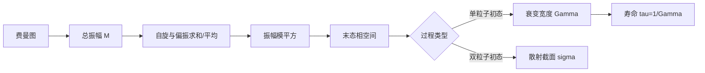

# 第五章 衰变与寿命，散射与截面

> [!abstract] 本章主线
> 费曼规则给出量子振幅 $\mathcal M$。把所有图的振幅相加、取模平方、进行自旋求和或平均，再乘以相空间并除以适当归一化因子，就得到实验可测的衰变宽度 $\Gamma$ 或散射截面 $\sigma$。

## 0. 学习目标与约定

### 0.1 学习目标

学完本章后，你应该能够：

1. 区分 $S$ 矩阵元、振幅、概率、跃迁率、衰变宽度和截面；
2. 写出洛伦兹不变 $n$ 体相空间；
3. 推导一般衰变宽度和散射截面公式；
4. 使用 Mandelstam 变量描述 $2\to2$ 过程；
5. 正确进行初态平均、末态求和与相同粒子计数；
6. 使用旋量完备性关系和 $\gamma$ 矩阵迹计算 $\overline{|\mathcal M|^2}$；
7. 计算典型 QED 树级散射和简单二体衰变；
8. 说明 Furry 定理的内容、依据和适用范围。

### 0.2 约定

$$
\hbar=c=1,
\qquad
g_{\mu\nu}=\operatorname{diag}(1,-1,-1,-1),
$$

$$
e>0,
\qquad
\alpha=\frac{e^2}{4\pi},
\qquad
\not p=\gamma^\mu p_\mu.
$$

单粒子态采用协变归一化：

$$
\langle\mathbf p|\mathbf q\rangle
=(2\pi)^3 2E_{\mathbf p}
\delta^{(3)}(\mathbf p-\mathbf q).
$$

不变振幅定义为

$$
S_{fi}=\delta_{fi}
+i(2\pi)^4\delta^{(4)}(p_f-p_i)\mathcal M_{fi}.
$$

横线

$$
\overline{|\mathcal M|^2}
$$

表示对未观测的末态自旋或偏振求和，并对无偏振初态自旋或偏振平均。

---

## 1. 从振幅到可测量量

### 1.1 为什么不能直接把 $\mathcal M$ 当概率

不同费曼图代表通向同一末态的不同量子途径。必须先相加振幅：

$$
\mathcal M_{\mathrm{tot}}=\sum_a\mathcal M_a,
$$

再取模平方：

$$
|\mathcal M_{\mathrm{tot}}|^2
=\sum_a|\mathcal M_a|^2
+\sum_{a\ne b}\mathcal M_a\mathcal M_b^*.
$$

后一项是干涉项。先分别求概率再相加会丢失干涉。

### 1.2 从概率到率

$S$ 矩阵元中四维 $\delta$ 函数的平方会产生总体积和总时间因子。除去这些归一化因子后，衰变问题得到单位时间概率，即衰变率；散射问题还要除以入射粒子流，得到截面。

完整推导可通过有限盒与有限时间正则化进行。本章把结果组织成洛伦兹不变形式，并解释每个因子的意义。

---

## 2. 洛伦兹不变相空间

对总四动量 $P$ 衰变或散射成 $n$ 个末态粒子，定义

$$
\boxed{
\mathrm d\Phi_n(P;p_1,\ldots,p_n)
=(2\pi)^4\delta^{(4)}
\left(P-\sum_{f=1}^np_f\right)
\prod_{f=1}^n
\frac{\mathrm d^3p_f}{(2\pi)^3 2E_f}
}.
$$

其中：

- 每个 $\mathrm d^3p_f/[(2\pi)^3 2E_f]$ 是一个末态粒子的洛伦兹不变在壳测度；
- $\delta^{(4)}$ 同时实施能量守恒和三动量守恒；
- 相空间只描述运动学上有多少末态可用，不包含相互作用强弱；
- 动力学信息在 $\mathcal M$ 中。

若末态含 $n_a$ 个完全相同的同种粒子，还要除以

$$
S=\prod_a n_a!,
$$

避免把交换相同粒子得到的同一物理状态重复积分。

> [!warning] 两种“对称因子”
> 末态相同粒子的 $1/n!$ 是相空间计数因子；费曼图的对称因子来自微扰展开中等价缩并的重复计数。二者来源不同。

---

## 3. 衰变宽度与寿命

### 3.1 一般公式

设一个四动量为 $P$、能量为 $E_A$ 的粒子衰变成 $n$ 个粒子：

$$
\boxed{
\mathrm d\Gamma
=\frac1{2E_A}
\overline{|\mathcal M|^2}
\,\mathrm d\Phi_n
}.
$$

若有相同末态粒子，再乘 $1/S$。在母粒子静止系中

$$
P^\mu=(M,\mathbf0),
\qquad
E_A=M.
$$

总宽度为对所有允许末态相空间积分并对所有衰变道求和：

$$
\Gamma_{\mathrm{tot}}=\sum_i\Gamma_i.
$$

分支比定义为

$$
\operatorname{Br}_i
=\frac{\Gamma_i}{\Gamma_{\mathrm{tot}}}.
$$

### 3.2 寿命、半衰期和宽度

不稳定态的存活振幅近似为

$$
a(t)=e^{-iMt-\Gamma t/2},
$$

因此存活概率为

$$
P(t)=|a(t)|^2=e^{-\Gamma t}.
$$

平均寿命和半衰期分别为

$$
\boxed{\tau=\frac1\Gamma},
\qquad
t_{1/2}=\frac{\ln2}{\Gamma}.
$$

恢复单位后

$$
\tau=\frac{\hbar}{\Gamma}.
$$

能量分布在共振附近常出现 Breit–Wigner 结构：

$$
\frac1{(s-M^2)^2+M^2\Gamma^2}.
$$

宽度越小，粒子寿命越长，共振峰越窄。

### 3.3 二体相空间

考虑

$$
A(P)\rightarrow1(p_1)+2(p_2).
$$

在母粒子静止系中，三动量守恒给出

$$
\mathbf p_2=-\mathbf p_1.
$$

定义 Källén 函数

$$
\boxed{
\lambda(x,y,z)
=x^2+y^2+z^2-2xy-2xz-2yz
}.
$$

末态三动量大小为

$$
\boxed{
|\mathbf p^*|
=\frac{\lambda^{1/2}(M^2,m_1^2,m_2^2)}{2M}
}.
$$

利用能量 $\delta$ 函数完成径向积分，得到

$$
\boxed{
\frac{\mathrm d\Gamma}{\mathrm d\Omega}
=\frac{|\mathbf p^*|}{32\pi^2M^2}
\overline{|\mathcal M|^2}
}.
$$

若振幅与方向无关，积分 $\int\mathrm d\Omega=4\pi$：

$$
\boxed{
\Gamma
=\frac{|\mathbf p^*|}{8\pi M^2}
\overline{|\mathcal M|^2}
}.
$$

若两个末态粒子完全相同，还要额外乘 $1/2!$。

> [!summary] 你现在应该理解什么
> 宽度是单位时间衰变概率，寿命是其倒数。二体衰变的动力学在 $|\mathcal M|^2$ 中，运动学则浓缩在 $|\mathbf p^*|$ 和相空间因子中。

---

## 4. 散射截面

### 4.1 截面的物理意义

截面衡量一个入射粒子流发生给定反应的概率强弱，量纲是面积。它不是粒子的真实几何面积，而是由量子振幅、入射流和末态相空间共同决定的有效面积。

对

$$
1(p_1)+2(p_2)\rightarrow f_1+\cdots+f_n,
$$

洛伦兹不变微分截面为

$$
\boxed{
\mathrm d\sigma
=\frac{\overline{|\mathcal M|^2}\,\mathrm d\Phi_n}
{4\sqrt{(p_1\cdot p_2)^2-m_1^2m_2^2}}
}.
$$

分母

$$
F=4\sqrt{(p_1\cdot p_2)^2-m_1^2m_2^2}
$$

是洛伦兹不变入射流因子。在一般参考系中可写成

$$
F=4E_1E_2v_{\mathrm M},
$$

其中 Møller 相对速度为

$$
v_{\mathrm M}
=\sqrt{(\mathbf v_1-\mathbf v_2)^2
-|\mathbf v_1\times\mathbf v_2|^2}.
$$

当两束速度共线时，交叉项为零，才简化为 $v_{\mathrm M}=|\mathbf v_1-\mathbf v_2|$。

### 4.2 $2\to2$ 质心系公式

质心系中

$$
\mathbf p_1^*+\mathbf p_2^*=0,
\qquad
\mathbf p_3^*+\mathbf p_4^*=0.
$$

对二体末态积分后得到

$$
\boxed{
\frac{\mathrm d\sigma}{\mathrm d\Omega}
=\frac1{64\pi^2s}
\frac{|\mathbf p_f^*|}{|\mathbf p_i^*|}
\overline{|\mathcal M|^2}
}.
$$

若末态两个粒子相同，应乘 $1/2!$，或只对不重复的角区域积分。

> [!summary] 你现在应该理解什么
> 衰变宽度除以的是单个母粒子的归一化 $2E_A$；散射截面还必须除以两束入射粒子的相对流量。

---

## 5. Mandelstam 变量

对过程

$$
1(p_1)+2(p_2)\rightarrow3(p_3)+4(p_4),
$$

定义

$$
\boxed{
s=(p_1+p_2)^2,
\qquad
t=(p_1-p_3)^2,
\qquad
u=(p_1-p_4)^2
}.
$$

$s$ 是质心系总能量平方；$t$ 和 $u$ 是两种动量转移的不变量。费曼图被称为 $s$、$t$、$u$ 道，是因为相应内部线携带的四动量平方分别为这些变量。

利用四动量守恒 $p_1+p_2=p_3+p_4$ 和在壳条件 $p_i^2=m_i^2$，展开三者可得

$$
\boxed{
s+t+u=m_1^2+m_2^2+m_3^2+m_4^2
}.
$$

高能且可忽略外粒子质量时，右边近似为零。在质心系的无质量 $2\to2$ 过程中，若 $\theta$ 是 $\mathbf p_1$ 与 $\mathbf p_3$ 的夹角，则

$$
t=-\frac s2(1-\cos\theta),
\qquad
u=-\frac s2(1+\cos\theta).
$$

---

## 6. 自旋求和与迹技术

### 6.1 为什么要平均和求和

若实验不控制初态自旋，应对所有初态自旋组合平均；若不测量末态自旋，应对末态自旋求和。例如两个无偏振自旋 $1/2$ 入射粒子给出

$$
\overline{|\mathcal M|^2}
=\frac14\sum_{\text{all spins}}|\mathcal M|^2.
$$

$1/4$ 是两个初态各有两个自旋态的平均因子。末态只求和，不再除以其状态数。

### 6.2 完备性关系

$$
\sum_su_s(p)\bar u_s(p)=\not p+m,
$$

$$
\sum_sv_s(p)\bar v_s(p)=\not p-m.
$$

取复共轭时使用

$$
[\bar u_a\Gamma u_b]^*
=\bar u_b\,\bar\Gamma\,u_a,
\qquad
\bar\Gamma=\gamma^0\Gamma^\dagger\gamma^0.
$$

把完备性关系代入后，旋量链闭合成矩阵迹。

### 6.3 常用迹公式

$$
\operatorname{Tr}(1)=4,
\qquad
\operatorname{Tr}(\text{奇数个 }\gamma)=0,
$$

$$
\operatorname{Tr}(\gamma^\mu\gamma^\nu)=4g^{\mu\nu},
$$

$$
\boxed{
\operatorname{Tr}
(\gamma^\mu\gamma^\nu\gamma^\rho\gamma^\sigma)
=4\left(
g^{\mu\nu}g^{\rho\sigma}
-g^{\mu\rho}g^{\nu\sigma}
+g^{\mu\sigma}g^{\nu\rho}
\right)
}.
$$

例如

$$
\operatorname{Tr}
[(\not a+m_a)\gamma^\mu(\not b+m_b)\gamma^\nu]
=4\left[
a^\mu b^\nu+a^\nu b^\mu
-g^{\mu\nu}(a\cdot b-m_am_b)
\right].
$$

> [!tip] 推荐计算顺序
> 先写 $\mathcal M$，再写 $\mathcal M^*$；完成自旋求和并化为两个张量；最后用 Mandelstam 变量化简。不要一开始就代入具体四维分量。

---

## 7. 电磁散射一：$e^-\mu^-\to e^-\mu^-$

### 7.1 树级振幅

设

$$
e^-(p_1)+\mu^-(p_2)
\rightarrow e^-(p_3)+\mu^-(p_4).
$$

交换光子动量

$$
q=p_1-p_3,
\qquad
q^2=t.
$$

树级振幅为

$$
i\mathcal M
=\left[\bar u(p_3)(-ie\gamma^\mu)u(p_1)\right]
\frac{-ig_{\mu\nu}}{t}
\left[\bar u(p_4)(-ie\gamma^\nu)u(p_2)\right].
$$

忽略不影响树级结果的 $i\epsilon$ 后，可把动力学部分写为

$$
\mathcal M
=\frac{e^2}{t}
[\bar u(p_3)\gamma^\mu u(p_1)]
[\bar u(p_4)\gamma_\mu u(p_2)]
$$

，整体符号随 $S$ 矩阵约定可能改变，但 $|\mathcal M|^2$ 不受影响。

### 7.2 自旋平均

对两个入射自旋各除以 $2$，得到

$$
\overline{|\mathcal M|^2}
=\frac{e^4}{4t^2}
L_e^{\mu\nu}L^{(\mathrm{muon})}_{\mu\nu},
$$

其中

$$
L_e^{\mu\nu}
=\operatorname{Tr}
[(\not p_3+m_e)\gamma^\mu
(\not p_1+m_e)\gamma^\nu],
$$

缪子张量具有相同结构。完成迹和缩并可得

$$
\boxed{
\overline{|\mathcal M|^2}
=\frac{2e^4}{t^2}
\left[
(s-m_e^2-m_\mu^2)^2
+(u-m_e^2-m_\mu^2)^2
+2t(m_e^2+m_\mu^2)
\right]
}.
$$

高能无质量极限为

$$
\overline{|\mathcal M|^2}
\simeq2e^4\frac{s^2+u^2}{t^2}.
$$

$t\to0$ 对应小角前向散射，无质量光子传播子的 $1/t$ 使截面增强。这是长程库仑相互作用的动量空间表现。

---

## 8. 电磁散射二：$e^+e^-\to\mu^+\mu^-$

### 8.1 振幅

设

$$
e^-(p_1)+e^+(p_2)
\rightarrow\mu^-(p_3)+\mu^+(p_4).
$$

中间虚光子携带

$$
q=p_1+p_2,
\qquad
q^2=s.
$$

树级振幅为

$$
i\mathcal M
=\left[\bar v(p_2)(-ie\gamma^\mu)u(p_1)\right]
\frac{-ig_{\mu\nu}}{s}
\left[\bar u(p_3)(-ie\gamma^\nu)v(p_4)\right].
$$

### 8.2 高能极限中的平方振幅

忽略电子和缪子质量，用完备性关系与迹公式得到

$$
\boxed{
\overline{|\mathcal M|^2}
=2e^4\frac{u^2+t^2}{s^2}
=e^4(1+\cos^2\theta)
}.
$$

对无质量 $2\to2$ 过程，初末态三动量大小相同。代入质心系截面公式：

$$
\frac{\mathrm d\sigma}{\mathrm d\Omega}
=\frac1{64\pi^2s}\overline{|\mathcal M|^2}.
$$

再用 $e^2=4\pi\alpha$，得到

$$
\boxed{
\frac{\mathrm d\sigma}{\mathrm d\Omega}
=\frac{\alpha^2}{4s}(1+\cos^2\theta)
}.
$$

对立体角积分：

$$
\int\mathrm d\Omega(1+\cos^2\theta)
=\frac{16\pi}{3},
$$

所以

$$
\boxed{
\sigma(e^+e^-\to\mu^+\mu^-)
=\frac{4\pi\alpha^2}{3s}
}.
$$

$1+\cos^2\theta$ 的角分布反映中间自旋 $1$ 光子和外部费米子的自旋结构；总截面随 $1/s$ 下降体现 QED 耦合无量纲时的高能标度。

---

## 9. 其他典型 QED 散射

### 9.1 Møller 散射

$$
e^-e^-\rightarrow e^-e^-.
$$

由于末态电子完全相同，有 $t$ 道和 $u$ 道两张图。交换两个外部费米子带来相对负号：

$$
\mathcal M=\mathcal M_t-\mathcal M_u.
$$

### 9.2 Bhabha 散射

$$
e^-e^+\rightarrow e^-e^+.
$$

存在 $s$ 道湮灭图和 $t$ 道散射图。总振幅包含二者的干涉。

### 9.3 Compton 散射

$$
e^-\gamma\rightarrow e^-\gamma.
$$

存在两种沿费米线排列光子顶角的图，通常称为 $s$ 道和 $u$ 道电子交换。只有把两图相加后，振幅才满足规范不变性的 Ward 检验：把外部光子偏振 $\epsilon^\mu$ 换成其动量 $k^\mu$，总振幅应为零。

> [!summary] 你现在应该理解什么
> 若多个图通向同一外态，必须在振幅层面相加。相同费米子的交换会产生负号，而规范不变性常常只有在相关图全部相加后才显现。

---

## 10. 衰变过程举例

### 10.1 标量衰变为两个相同标量

考虑质量为 $M$ 的标量 $\Phi$ 衰变为两个质量为 $m$ 的相同标量 $\chi$，相互作用为

$$
\mathcal L_{\mathrm I}=-\frac g2\Phi\chi^2.
$$

$1/2$ 抵消两个相同 $\chi$ 场缩并的 $2!$，顶角规则为 $-ig$。因此

$$
\mathcal M=-g,
\qquad
|\mathcal M|^2=g^2.
$$

末态动量大小为

$$
|\mathbf p^*|
=\frac M2\sqrt{1-\frac{4m^2}{M^2}}.
$$

由于末态粒子完全相同，相空间乘 $1/2!$：

$$
\Gamma
=\frac1{2!}
\frac{|\mathbf p^*|}{8\pi M^2}g^2.
$$

最终得到

$$
\boxed{
\Gamma(\Phi\to\chi\chi)
=\frac{g^2}{32\pi M}
\sqrt{1-\frac{4m^2}{M^2}}
}.
$$

当 $M<2m$ 时，该衰变道在运动学上关闭。阈值附近 $|\mathbf p^*|\to0$，相空间压低衰变率。

### 10.2 有自旋求和的结构性例子

设质量为 $M$ 的中性有质量矢量粒子 $V$ 与近似无质量的狄拉克费米子耦合：

$$
\mathcal L_{\mathrm I}=-gV_\mu\bar\psi\gamma^\mu\psi.
$$

对

$$
V(P)\rightarrow f(p_1)+\bar f(p_2),
$$

振幅为

$$
i\mathcal M
=-ig\epsilon_\mu(P)
\bar u(p_1)\gamma^\mu v(p_2).
$$

对三个初态偏振平均、末态自旋求和，并使用有质量矢量的偏振求和

$$
\sum_\lambda
\epsilon_\mu^{(\lambda)}
\epsilon_\nu^{(\lambda)*}
=-g_{\mu\nu}+\frac{P_\mu P_\nu}{M^2},
$$

可得无质量极限

$$
\overline{|\mathcal M|^2}
=\frac43g^2M^2.
$$

二体相空间给出

$$
\boxed{
\Gamma(V\to f\bar f)
=\frac{g^2M}{12\pi}
}.
$$

若末态费米子还有 $N_c$ 种颜色，结果再乘 $N_c$。这个例子展示了“写振幅—做偏振平均和自旋求和—积分相空间”的标准流程。

---

## 11. Furry 定理

### 11.1 定理陈述

纯 QED 中，一个闭合费米圈若连接奇数个外部光子，其总振幅为零：

$$
\boxed{
\text{闭合费米圈}+\text{奇数个矢量光子顶角}
\Longrightarrow\mathcal M=0
}.
$$

### 11.2 电荷共轭解释

电磁场在电荷共轭下为奇：

$$
A_\mu\xrightarrow C-A_\mu.
$$

QED 真空和作用量保持 $C$。因此奇数个光子场的真空相关函数在 $C$ 下获得负号，但又必须等于自身：

$$
\langle0|T A_{\mu_1}\cdots A_{\mu_{2n+1}}|0\rangle
=-\langle0|T A_{\mu_1}\cdots A_{\mu_{2n+1}}|0\rangle=0.
$$

闭合费米圈正是产生这类纯光子有效顶角的贡献，所以奇光子情形消失。

### 11.3 反向费米圈的迹解释

对固定方向书写闭合费米圈，得到伽马矩阵和传播子的迹。反转圈上费米子箭头方向，利用

$$
C^{-1}\gamma^\mu C=-(\gamma^\mu)^T
$$

以及迹在转置和循环排列下的性质，每个矢量光子顶角贡献一个负号。含 $n$ 个光子顶角的两种方向之和正比于

$$
1+(-1)^n.
$$

$n$ 为奇数时两项抵消，$n$ 为偶数时不被该定理禁止。

### 11.4 例子与适用范围

- 一个外部光子的费米圈蝌蚪贡献为零；
- 三个外部光子连接同一闭合费米圈的振幅为零；
- 四光子光—光散射圈图不被 Furry 定理禁止；
- 定理不适用于开放费米线；
- 若圈中含轴矢量、弱相互作用或其他具有不同 $C$ 性质的插入，不能机械套用“奇数顶角为零”。

> [!summary] 你现在应该理解什么
> Furry 定理是 QED 电荷共轭对称性的选择定则。它针对闭合费米圈上的奇数个矢量光子顶角，而不是所有含奇数个光子的过程。

---

## 12. 易混概念与常见错误

| 概念 A | 概念 B | 区别 |
|---|---|---|
| 振幅 $\mathcal M$ | 概率 | 概率来自总振幅的模平方 |
| 宽度 $\Gamma$ | 质量 $M$ | 都有能量量纲，但分别描述不稳定性和静质量 |
| 寿命 $\tau$ | 半衰期 $t_{1/2}$ | $t_{1/2}=\tau\ln2$ |
| 截面 | 几何面积 | 截面是反应概率的有效面积 |
| 相空间 | 普通位置空间 | 本章相空间指在壳末态动量空间 |
| 实验室系 | 质心系 | 前者常固定靶，后者总三动量为零 |
| 初态平均 | 末态求和 | 未制备的初态取平均，未观测的末态取求和 |
| 相同粒子因子 | 图的对称因子 | 前者防止末态重复积分，后者防止等价缩并重复计数 |

常见错误：

- 把不同图的 $|\mathcal M_i|^2$ 直接相加，漏掉干涉项；
- 忘记对无偏振初态平均，却错误地对末态也平均；
- 漏掉相同末态粒子的 $1/n!$；
- 在非质心系直接使用质心系 $2\to2$ 公式；
- 混淆 $t$ 变量与时间；
- 先取无质量极限，意外删除阈值和质量效应；
- 把内部传播子的动量设为在壳；
- 忘记 $t$ 道物理区域中 $t$ 常为负；
- 机械套用 Furry 定理到开放费米线或非矢量顶角；
- 在自然单位制中忘记 $[\Gamma]=E$、$[\sigma]=E^{-2}$。

---

## 13. 知识脉络与公式速查

文字版：

$$
\text{费曼规则}
\rightarrow\mathcal M
\rightarrow\overline{|\mathcal M|^2}
\rightarrow\text{相空间积分}
\rightarrow
\begin{cases}
\Gamma, & 1\to n,\\
\sigma, & 2\to n.
\end{cases}
$$

核心公式：

$$
\mathrm d\Gamma
=\frac1{2E_A}\overline{|\mathcal M|^2}\,\mathrm d\Phi_n,
$$

$$
\mathrm d\sigma
=\frac{\overline{|\mathcal M|^2}\,\mathrm d\Phi_n}
{4\sqrt{(p_1\cdot p_2)^2-m_1^2m_2^2}},
$$

$$
\frac{\mathrm d\sigma}{\mathrm d\Omega}
=\frac1{64\pi^2s}
\frac{|\mathbf p_f^*|}{|\mathbf p_i^*|}
\overline{|\mathcal M|^2},
$$

$$
|\mathbf p^*|
=\frac{\lambda^{1/2}(M^2,m_1^2,m_2^2)}{2M},
\qquad
\tau=\frac1\Gamma.
$$

---

## 14. 本章总结

1. 可观测率来自所有允许图的总振幅模平方，而不是单张图概率的简单和。
2. 洛伦兹不变相空间编码末态的在壳条件与总四动量守恒。
3. 衰变宽度描述单位时间衰变概率，平均寿命为 $1/\Gamma$。
4. 散射截面还必须除以入射流因子；质心系二体公式最常用于实际计算。
5. Mandelstam 变量以洛伦兹不变方式表达能量和动量转移。
6. 完备性关系和迹技术把自旋求和后的旋量链化为四动量标量。
7. 多张树图之间存在干涉；相同费米子交换还会产生相对负号。
8. Furry 定理由电荷共轭对称性保证，使纯 QED 闭合费米圈上的奇数个光子顶角贡献相消。

---

## 15. 综合练习

> [!example] 练习 1：量纲检查
> 在四维自然单位制中检查 $[\Gamma]=E$、$[\tau]=E^{-1}$ 和 $[\sigma]=E^{-2}$。
>
> **提示：**作用量无量纲，四维 $\delta$ 函数的量纲为 $E^{-4}$。

> [!example] 练习 2：相空间中的守恒律
> 展开 $\mathrm d\Phi_2$ 中的四维 $\delta$ 函数，说明哪三个积分可由三动量守恒直接完成。
>
> **提示：**写成一个能量 $\delta$ 函数和一个三维动量 $\delta$ 函数。

> [!example] 练习 3：指数衰变
> 从 $P(t)=e^{-\Gamma t}$ 求平均寿命和半衰期。
>
> **提示：**平均寿命可由 $\int_0^\infty P(t)\,\mathrm dt$ 得到。

> [!example] 练习 4：二体运动学
> 从 $P=p_1+p_2$ 和在壳条件推导 $|\mathbf p^*|=\lambda^{1/2}/(2M)$。
>
> **提示：**先在母粒子静止系求 $E_1=(M^2+m_1^2-m_2^2)/(2M)$。

> [!example] 练习 5：相同粒子因子
> 解释为什么积分 $\Phi\to\chi\chi$ 的完整二体相空间会把同一个物理末态计算两次。
>
> **提示：**交换 $p_1$ 和 $p_2$ 不产生新状态。

> [!example] 练习 6：流因子
> 在质心系中把不变流因子化为 $4E_1E_2|\mathbf v_1-\mathbf v_2|$，并解释迎头碰撞时的相对速度。
>
> **提示：**使用 $p_1=(E_1,\mathbf p)$、$p_2=(E_2,-\mathbf p)$。

> [!example] 练习 7：Mandelstam 恒等式
> 推导 $s+t+u=\sum_i m_i^2$。
>
> **提示：**展开三个平方，并用 $p_1+p_2=p_3+p_4$ 消去点积。

> [!example] 练习 8：四个 $\gamma$ 矩阵的迹
> 使用反对易关系推导 $\operatorname{Tr}(\gamma^\mu\gamma^\nu\gamma^\rho\gamma^\sigma)$。
>
> **提示：**把最左边的 $\gamma^\mu$ 逐步移到最右边并利用迹的循环性。

> [!example] 练习 9：电子—缪子散射
> 从 $t$ 道图写出 $e^-\mu^-\to e^-\mu^-$ 的振幅，并说明两个费米流分别对应哪条外线。
>
> **提示：**内部光子动量为 $q=p_1-p_3$。

> [!example] 练习 10：湮灭角分布
> 从 $\overline{|\mathcal M|^2}=e^4(1+\cos^2\theta)$ 推导 $e^+e^-\to\mu^+\mu^-$ 的微分和总截面。
>
> **提示：**使用 $e^2=4\pi\alpha$ 和 $\mathrm d\Omega=2\pi\,\mathrm d(\cos\theta)$。

> [!example] 练习 11：干涉
> 展开 $|\mathcal M_t-\mathcal M_u|^2$，指出 Møller 散射中交换负号影响哪一项。
>
> **提示：**重点观察 $-2\operatorname{Re}(\mathcal M_t\mathcal M_u^*)$。

> [!example] 练习 12：标量二体衰变
> 独立推导 $\Gamma(\Phi\to\chi\chi)$，并讨论 $m\to0$ 和 $M\to2m$ 两个极限。
>
> **提示：**不要遗漏相同末态的 $1/2!$。

> [!example] 练习 13：矢量粒子衰变
> 写出 $V\to f\bar f$ 的偏振平均和自旋求和表达式，并说明 $P_\mu P_\nu/M^2$ 项为什么在质量为零的守恒流极限中不贡献。
>
> **提示：**使用 $P_\mu\bar u\gamma^\mu v=0$。

> [!example] 练习 14：Furry 定理
> 用 $C$ 变换证明奇数个光子场的 QED 真空相关函数为零。
>
> **提示：**真空和作用量为 $C$ 偶，每个 $A_\mu$ 为 $C$ 奇。

> [!example] 练习 15：适用范围
> 判断以下情形能否直接用 Furry 定理：三光子闭合电子圈、四光子闭合电子圈、开放电子线发射一个光子、含一个轴矢量顶角的三点圈图。
>
> **提示：**核对“闭合费米圈、奇数个外部光子、纯矢量 QED 顶角”三个条件。

---

## 16. 自测标准与后续预告

- **入门：**能解释 $\Gamma$、$\tau$、$\sigma$、相空间和流因子的物理意义。
- **掌握：**能使用二体公式，完成自旋平均，并计算简单 QED 树级过程。
- **熟练：**能从图到 $\mathcal M$、从迹到不变量、从相空间到可测量量完整计算，并正确处理干涉与相同粒子。

下一章将研究圈图带来的量子修正。内部圈动量积分会产生紫外发散，需要引入正则化、反项和重整化：

$$
\text{树级预测}
\longrightarrow
\text{圈修正}
\longrightarrow
\text{发散的系统处理}
\longrightarrow
\text{有限可观测量}.
$$
