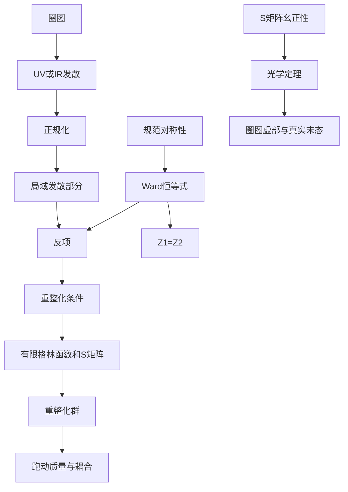

# 第六章 物理过程的微扰计算及一般重整化理论

> [!abstract] 本章主线
> 圈图使虚粒子的所有可能动量都参与计算，大动量区域可能产生紫外发散。正规化先让发散变得可控制；重整化再用有限种局域反项重新定义理论参数；重整化群则说明这些参数如何随观察能标变化。

## 0. 学习目标、前置知识与约定

### 0.1 学习目标

学完本章后，你应该能够：

1. 解释圈图和紫外发散的来源；
2. 区分正规化、重整化条件与重整化群；
3. 写出真空极化、电子自能和一圈顶角修正的积分结构；
4. 说明 $Z_1$、$Z_2$、$Z_3$ 和质量反项分别修正什么；
5. 使用表面发散度找出 QED 中可能发散的 1PI 图；
6. 陈述并使用 Ward–Takahashi 恒等式；
7. 从 $S$ 矩阵幺正性推导光学定理；
8. 解释跑动电荷、$\beta$ 函数和重整化尺度的意义；
9. 概述 QED 逐阶系统重整化的流程。

### 0.2 前置知识检查

- [ ] 能从 QED 费曼图写出传播子、顶角和圈积分；
- [ ] 能使用 Feynman 参数和 $\gamma$ 矩阵迹；
- [ ] 理解 $S$ 矩阵、不变振幅和光子规范对称性；
- [ ] 知道自能修正传播子、顶角修正相互作用；
- [ ] 能区分外线在壳动量与内部圈动量。

### 0.3 约定

$$
\hbar=c=1,
\qquad
g_{\mu\nu}=\operatorname{diag}(1,-1,-1,-1),
$$

$$
\bar\psi=\psi^\dagger\gamma^0,
\qquad
\not p=\gamma^\mu p_\mu,
\qquad
\alpha=\frac{e^2}{4\pi}.
$$

使用维数正规化

$$
d=4-2\epsilon,
$$

并记

$$
\boxed{
\frac1{\bar\epsilon}
\equiv
\frac1\epsilon-\gamma_E+\ln4\pi
}.
$$

$\mu$ 是维数正规化引入的质量尺度。本章主要采用费曼规范；$Z_2$、$Z_1$ 等中间量可能依赖规范，而物理可观测量不应依赖规范。

> [!warning]
> 有些教材采用 $d=4-\epsilon$，相应极点系数会差一个 $2$。比较结果前必须先核对 $d$ 的定义。

---

## 1. 为什么圈图会发散

### 1.1 圈动量没有固定值

树图的内部动量通常由外部动量和顶角守恒确定。圈图中至少有一个不能被这些条件固定的四动量，需要积分：

$$
\int\frac{\mathrm d^4k}{(2\pi)^4}.
$$

当 $|k|\to\infty$ 时，积分可能不收敛。例如欧氏大动量下

$$
\int^{\Lambda}\mathrm d^4k\,\frac1{(k^2)^2}
\sim\int^{\Lambda}\frac{\mathrm dk}{k}
\sim\ln\Lambda.
$$

这称为对数紫外发散。它来自对任意短距离或任意大虚动量的理想化描述。

### 1.2 三个不同步骤

1. **正规化**：引入参数，让原本没有定义的积分暂时成为可运算对象；
2. **重整化**：把发散的局域部分吸收到参数和场的重新定义中，并用条件确定有限部分；
3. **重整化群**：研究在裸理论不变时，重整化参数怎样随尺度 $\mu$ 改变。

重整化不是随意删除无穷大。反项必须是局域的，并服从理论的洛伦兹对称性、规范对称性和其他基本约束。

### 1.3 紫外与红外

- 紫外发散来自 $|k|\to\infty$，对应短距离；
- 红外发散来自无质量粒子的软动量 $|k|\to0$ 或共线区域，对应长距离。

质量、场强和耦合常数反项处理的是紫外发散。QED 红外发散通常要把虚软光子修正与实验分辨率内不可区分的真实软光子辐射合并，才能在可观测量中抵消。

> [!summary] 你现在应该理解什么
> 圈积分的自由动量可以进入无限大或无限小区域。UV 和 IR 发散来源不同，解决方法也不同。

---

## 2. 维数正规化与常用工具

### 2.1 改变积分维数

维数正规化把积分从四维解析延拓到

$$
d=4-2\epsilon.
$$

原来的对数发散表现为 $1/\epsilon$ 极点。为保持电荷在四维中的无量纲性质，要引入 $\mu^\epsilon$。

维数正规化的优势包括：

- 保持洛伦兹协变性；
- 允许圈动量平移；
- 在适当使用时保持 QED Ward 恒等式；
- 幂次发散和对数发散可统一处理。

### 2.2 Feynman 参数

两个分母可合并为

$$
\boxed{
\frac1{AB}
=\int_0^1\mathrm dx\,
\frac1{[xA+(1-x)B]^2}
}.
$$

更一般地，参数化把多个传播子分母合并成一个，然后通过圈动量平移完成平方，使分子中的奇次动量项在对称积分下消失。

### 2.3 标准主积分

常见 Minkowski 主积分为

$$
\boxed{
\mu^{2\epsilon}
\int\frac{\mathrm d^d\ell}{(2\pi)^d}
\frac1{(\ell^2-\Delta+i\epsilon)^n}
=\frac{i(-1)^n}{(4\pi)^{d/2}}
\frac{\Gamma(n-d/2)}{\Gamma(n)}
\mu^{2\epsilon}(\Delta-i\epsilon)^{d/2-n}
}.
$$

当 $n-d/2$ 接近非正整数时，Gamma 函数产生 $1/\epsilon$ 极点。Wick 转动把振荡的 Minkowski 积分联系到更直观的欧氏积分；$i\epsilon$ 决定转动时如何避开极点。

> [!question] 检查理解
> 1. 为什么改变积分维数不会改变外部时空的物理含义？
> 2. $\mu$ 为什么必须随维数正规化一起出现？

---

## 3. 真空极化

### 3.1 物理意义与积分

光子传播时可以短暂涨落成费米子—反费米子对，再湮灭回光子。对应一圈光子二点函数：

$$
\begin{aligned}
i\Pi^{\mu\nu}(q)
=&-(-ie)^2\mu^{2\epsilon}
\int\frac{\mathrm d^dk}{(2\pi)^d}
\operatorname{Tr}\Bigg[
\gamma^\mu
\frac{i(\not k+m)}{k^2-m^2+i\epsilon}\\
&\qquad\qquad\times
\gamma^\nu
\frac{i(\not k+\not q+m)}{(k+q)^2-m^2+i\epsilon}
\Bigg].
\end{aligned}
$$

最前面的负号来自闭合费米圈。不同的 $\Pi^{\mu\nu}$ 定义可能改变整体符号，但横向结构和可观测结果相同。

### 3.2 横向结构

规范不变性要求

$$
\boxed{q_\mu\Pi^{\mu\nu}(q)=0}.
$$

洛伦兹协变性允许的二阶张量只有 $g^{\mu\nu}$ 和 $q^\mu q^\nu$，再加横向条件就得到

$$
\boxed{
\Pi^{\mu\nu}(q)
=(q^\mu q^\nu-q^2g^{\mu\nu})\Pi(q^2)
}.
$$

这个结构排除了独立的光子质量项 $m_\gamma^2g^{\mu\nu}$，从而保护光子保持无质量。

### 3.3 参数化与重整化结果

做 $\gamma$ 矩阵迹、Feynman 参数化并平移

$$
\ell=k+xq,
\qquad
\Delta=m^2-x(1-x)q^2,
$$

即可把结果化为一个 $x$ 积分和标准主积分。发散部分与外动量无关，可由光子场强反项吸收。

采用动量零点减除并使用本节张量符号约定，对类空动量 $q^2=-Q^2<0$ 可写成

$$
\boxed{
\Pi_R(-Q^2)
=\frac{2\alpha}{\pi}
\int_0^1\mathrm dx\,x(1-x)
\ln\left[1+\frac{Q^2}{m^2}x(1-x)\right]
}.
$$

$Q^2$ 增大时，虚电子—正电子对对电荷的屏蔽减弱，有效电磁耦合缓慢增大。具体把 $\Pi_R$ 写在传播子分母中的正负号取决于 $\Pi^{\mu\nu}$ 的定义。

### 3.4 阈值和虚部

当类时动量满足

$$
q^2>4m^2,
$$

虚光子有足够能量产生真实费米子对。对数跨过支切，$\Pi_R(q^2)$ 出现虚部。这个虚部通过光学定理与 $\gamma^*\to f\bar f$ 的产生率相连。

> [!summary] 你现在应该理解什么
> 真空极化修正光子传播子。Ward 恒等式使它横向并保护光子无质量；其有限动量依赖表现为电荷随距离或能标变化。

---

## 4. 二阶电子自能

“二阶”指修正含两个 QED 顶角，因而为 $e^2$ 阶或 $\alpha$ 阶。

### 4.1 一圈积分

令圈中光子动量为 $k$，内部电子动量为 $p-k$。费曼规范下

$$
\begin{aligned}
-i\Sigma(\not p)
=&(-ie)^2\mu^{2\epsilon}
\int\frac{\mathrm d^dk}{(2\pi)^d}
\gamma^\mu
\frac{i(\not p-\not k+m)}{(p-k)^2-m^2+i\epsilon}\\
&\times\gamma^\nu
\frac{-ig_{\mu\nu}}{k^2+i\epsilon}.
\end{aligned}
$$

洛伦兹协变性和宇称要求它具有

$$
\boxed{
\Sigma(\not p)=A(p^2)\not p+B(p^2)m
}.
$$

这里 $A$ 修正动能归一化，$B$ 与质量修正有关。

### 4.2 修正后的传播子

把任意多个一粒子不可约自能插入求和：

$$
\begin{aligned}
S(p)
&=S_0+S_0(-i\Sigma)S_0+cdots\\
&=\frac{i}{\not p-m-\Sigma(\not p)+i\epsilon}.
\end{aligned}
$$

因此自能会改变两件事：

- 传播子极点的位置，对应物理质量；
- 极点附近的留数，对应场与单粒子态的归一化。

### 4.3 在壳条件

在壳重整化方案把 $m$ 定义为传播子的物理极点质量，并把极点留数定为 $1$：

$$
S_R^{-1}(p)\big|_{\not p=m}=0,
$$

$$
\frac{\partial S_R^{-1}}{\partial\not p}
\bigg|_{\not p=m}=1.
$$

第一个条件确定质量反项，第二个条件确定电子场强反项。对无质量光子的 QED，在壳 $Z_2$ 还含红外发散；它会在物理的包容性截面中与软光子辐射抵消。

> [!summary] 你现在应该理解什么
> 电子自能是对电子传播的量子修正。质量反项固定极点位置，场强反项固定极点留数；二者处理的是不同结构。

---

## 5. 三阶电磁顶角

“三阶”指完整顶角图含三个电磁顶角，因而是 $e^3$ 阶；相对于树级 $e$ 顶角，它是 $O(\alpha)$ 修正。

### 5.1 顶角积分

设入射电子动量为 $p$，出射电子动量为 $p'=p+q$，外部光子传递动量 $q$。定义

$$
\Gamma^\mu(p',p)=\gamma^\mu+\Lambda^\mu(p',p).
$$

一圈修正可写为

$$
\begin{aligned}
(-ie)\Lambda^\mu
=&(-ie)^3\mu^{2\epsilon}
\int\frac{\mathrm d^dk}{(2\pi)^d}
\gamma^\alpha
\frac{i(\not p'-\not k+m)}{(p'-k)^2-m^2+i\epsilon}\\
&\times\gamma^\mu
\frac{i(\not p-\not k+m)}{(p-k)^2-m^2+i\epsilon}
\gamma^\beta
\frac{-ig_{\alpha\beta}}{k^2+i\epsilon}.
\end{aligned}
$$

它包含一个独立圈动量和三个传播子分母。

### 5.2 电磁形状因子

对在壳外部电子，洛伦兹协变性和电流守恒使矩阵元写成

$$
\boxed{
\bar u(p')\Gamma^\mu u(p)
=\bar u(p')\left[
F_1(q^2)\gamma^\mu
+\frac{i\sigma^{\mu\nu}q_\nu}{2m}F_2(q^2)
\right]u(p)
}.
$$

$F_1$ 是狄拉克形状因子，$F_2$ 是泡利形状因子。电荷归一化条件为

$$
F_1(0)=1.
$$

树级 $F_2=0$，一圈量子修正给出著名的 Schwinger 结果

$$
\boxed{F_2(0)=\frac{\alpha}{2\pi}}.
$$

因此电子的反常磁矩

$$
a_e\equiv\frac{g_e-2}{2}
$$

在最低非平凡阶为 $\alpha/(2\pi)$。这是量子场论最精确的实验检验之一。

### 5.3 UV 与 IR 角色不同

顶角的 $\gamma^\mu$ 部分含紫外发散，需要顶角反项。无质量光子还使 $F_1$ 的某些在壳表达出现红外发散。后者不会被 UV 反项“修掉”，而是与不可分辨的真实软光子辐射合并后在包容性可观测量中抵消。$F_2(0)$ 的一圈结果则是有限的。

> [!summary] 你现在应该理解什么
> 顶角修正既含需要重整化的局域 $\gamma^\mu$ 部分，也包含有限的磁矩结构。UV 反项与 IR 实虚抵消不能混为一谈。

---

## 6. 裸拉格朗日量与反项

### 6.1 裸量和重整化量

从正规化后的裸 QED 拉格朗日量出发：

$$
\mathcal L_0
=-\frac14F_{0\mu\nu}F_0^{\mu\nu}
+\bar\psi_0(i\not\partial-m_0)\psi_0
-e_0\bar\psi_0\gamma^\mu\psi_0A_{0\mu}.
$$

定义

$$
\psi_0=Z_2^{1/2}\psi,
\qquad
A_0^\mu=Z_3^{1/2}A^\mu,
$$

$$
m_0=Z_m m,
\qquad
e_0=\mu^\epsilon Z_e e.
$$

下标 $0$ 表示裸量。裸量不是实验直接测量的“无限物理量”，而是正规化理论中与截止或 $\epsilon$ 配合使用、使裸拉格朗日量不依赖任意重整化尺度的参数。

### 6.2 重整化部分与反项部分

代入并定义

$$
Z_1\equiv Z_eZ_2Z_3^{1/2},
$$

可写成

$$
\mathcal L_0=\mathcal L_R+\mathcal L_{\mathrm{ct}},
$$

其中

$$
\mathcal L_R
=-\frac14F_{\mu\nu}F^{\mu\nu}
+\bar\psi(i\not\partial-m)\psi
-\mu^\epsilon e\bar\psi\gamma^\mu\psi A_\mu,
$$

$$
\boxed{
\mathcal L_{\mathrm{ct}}
=-\frac{\delta_3}{4}F_{\mu\nu}F^{\mu\nu}
+\delta_2\bar\psi i\not\partial\psi
-\delta_m\bar\psi\psi
-\mu^\epsilon e\delta_1
\bar\psi\gamma^\mu\psi A_\mu
}.
$$

这里

$$
\delta_3=Z_3-1,
\quad
\delta_2=Z_2-1,
\quad
\delta_1=Z_1-1,
$$

$$
\delta_m=(Z_2Z_m-1)m.
$$

四类反项分别抵消光子二点、电子动能、电子质量和电子—光子顶角的局域 UV 发散。

### 6.3 为什么反项形式有限

QED 的对称性只允许与原拉格朗日量相同的有限种质量维数不超过四的局域算符。若每一阶新发散都能被这组有限参数吸收，理论就是可重整化的。

> [!warning]
> “反项抵消发散”不表示每张图单独必须有限。只有把同阶裸圈图、反项图以及所有对称性要求的相关图合并，才得到重整化结果。

---

## 7. QED 单圈重整化

### 7.1 在壳方案

在壳方案直接使用物理条件：

- 电子传播子极点位于 $p^2=m^2$；
- 电子极点留数为 $1$；
- 光子在 $q^2=0$ 仍无质量且极点留数按约定归一化；
- Thomson 低能极限定义物理电荷；
- 顶角满足 $F_1(0)=1$。

它的参数物理直观，但含无质量粒子时，场强重整化常混有 IR 极点。

### 7.2 MS 与 $\overline{\mathrm{MS}}$

MS 只减去 $1/\epsilon$；$\overline{\mathrm{MS}}$ 还同时减去 $-\gamma_E+\ln4\pi$。这种方案计算简洁，特别适合重整化群。

对一个费米子味，只列 UV 极点部分，有

$$
\boxed{
Z_3=1-\frac{\alpha}{3\pi}\frac1{\bar\epsilon}
},
$$

$$
\boxed{
Z_m=1-\frac{3\alpha}{4\pi}\frac1{\bar\epsilon}
}.
$$

Ward 恒等式要求

$$
\boxed{Z_1=Z_2}.
$$

在费曼规范中，单圈 UV 极点可写为

$$
Z_2=Z_1
=1-\frac{\alpha}{4\pi}\frac1{\bar\epsilon}.
$$

$Z_2$ 和 $Z_1$ 的具体数值依赖规范，但它们的相等关系由规范对称性保护。由

$$
Z_1=Z_eZ_2Z_3^{1/2}
$$

得到

$$
\boxed{Z_e=Z_3^{-1/2}}.
$$

所以 QED 电荷重整化最终由光子场强重整化决定。

### 7.3 方案独立的物理

在壳质量与 $\overline{\mathrm{MS}}$ 质量的数值通常不同，耦合常数也随方案和尺度而不同。但把参数转换到同一方案，并在同一微扰阶数一致计算后，物理截面、寿命和谱线不能依赖这种人为选择。有限阶结果残留的尺度依赖可用来估计未计算高阶项的大小。

> [!summary] 你现在应该理解什么
> 重整化方案规定反项有限部分。方案改变会重新分配“参数”和“量子修正”，但不会改变精确物理预测。

---

## 8. QED 发散图形的一般分析

### 8.1 表面发散度

设一张连通 QED 图有 $L$ 个圈、$I_A$ 条内部光子线、$I_\psi$ 条内部费米线和 $V$ 个顶角。大动量下：

- 每个圈积分贡献 $k^4$；
- 每条光子传播子贡献 $k^{-2}$；
- 每条费米传播子贡献 $k^{-1}$。

所以表面发散度为

$$
\omega=4L-2I_A-I_\psi.
$$

拓扑关系为

$$
L=I_A+I_\psi-V+1,
$$

$$
2I_\psi+E_\psi=2V,
\qquad
2I_A+E_A=V,
$$

其中 $E_\psi$、$E_A$ 分别是外部费米线和光子线数。消去内部量得到

$$
\boxed{
\omega=4-E_A-\frac32E_\psi
}.
$$

$\omega<0$ 表示总体大动量区域表面收敛；$\omega\ge0$ 表示可能发散。但“可能”很重要：对称性、奇偶积分和不同图之间的抵消还会改善收敛性。

### 8.2 逐类分析

| 1PI 函数 | $(E_A,E_\psi)$ | $\omega$ | 实际结论 |
|---|---:|---:|---|
| 光子一点函数 | $(1,0)$ | $3$ | Furry 定理使其为零 |
| 光子二点函数 | $(2,0)$ | $2$ | 横向性消去更强发散，只需 $F^2$ 反项 |
| 光子三点函数 | $(3,0)$ | $1$ | Furry 定理使其为零 |
| 光子四点函数 | $(4,0)$ | $0$ | Ward 恒等式使一圈总和有限 |
| 电子二点函数 | $(0,2)$ | $1$ | 需要动能与质量反项 |
| 电子—光子顶角 | $(1,2)$ | $0$ | 对数发散，需要顶角反项 |
| 更多外线的 1PI 函数 | 其他 | 通常 $<0$ | 去除子图发散后总体收敛 |

四光子图虽然表面上是对数发散，但必须把费米圈上所有光子排列相加；规范不变性使可能的局域发散相消，留下有限的光—光散射振幅。

### 8.3 子图发散

一张图即使总体 $\omega<0$，内部仍可能包含发散的自能或顶角子图。系统重整化必须先处理子图，再处理总体发散。BPHZ 森林公式提供了不重不漏地减去嵌套和重叠子图发散的系统语言。

> [!summary] 你现在应该理解什么
> 表面发散度筛选候选发散图，但不能替代对称性分析。真正的全阶证明还必须处理子图发散和不同图之间的规范抵消。

---

## 9. Ward–Takahashi 恒等式

树级顶角满足

$$
q_\mu\gamma^\mu
=\not p'-\not p
=S_0^{-1}(p')-S_0^{-1}(p),
$$

其中省略了两边相同的质量项和整体 $i$ 约定。量子修正后，这一关系推广为

$$
\boxed{
q_\mu\Gamma^\mu(p+q,p)
=S^{-1}(p+q)-S^{-1}(p)
}.
$$

它不是某一张图的偶然性质，而是 QED 局域规范对称性在格林函数上的表达。

令 $q\to0$，对右边展开：

$$
S^{-1}(p+q)-S^{-1}(p)
=q_\mu\frac{\partial S^{-1}(p)}{\partial p_\mu}
+O(q^2).
$$

比较 $q_\mu$ 的系数得到

$$
\boxed{
\Gamma^\mu(p,p)
=\frac{\partial S^{-1}(p)}{\partial p_\mu}
}.
$$

电子动能反项系数是 $Z_2-1$，顶角反项系数是 $Z_1-1$。Ward–Takahashi 恒等式要求它们逐阶相等：

$$
\boxed{Z_1=Z_2}.
$$

于是

$$
Z_e=Z_3^{-1/2}.
$$

同一规范对称性还给出

$$
q_\mu\Pi^{\mu\nu}=0.
$$

因此不能产生形如 $m_\gamma^2g^{\mu\nu}$ 的光子质量反项。只要正规化与重整化过程保持规范对称性，光子就保持无质量。

> [!summary] 你现在应该理解什么
> Ward–Takahashi 恒等式把电子二点函数和电子—光子三点函数联系起来。$Z_1=Z_2$ 是规范对称性对反项的非平凡约束。

---

## 10. 光学定理

写

$$
S=1+iT.
$$

由 $S^\dagger S=1$：

$$
(1-iT^\dagger)(1+iT)=1,
$$

得到

$$
\boxed{i(T^\dagger-T)=T^\dagger T}.
$$

在初态 $|i\rangle$ 两侧取矩阵元，并在右边插入完备末态：

$$
2\operatorname{Im}\langle i|T|i\rangle
=\sum_f
\langle i|T^\dagger|f\rangle
\langle f|T|i\rangle.
$$

除去整体四动量 $\delta$ 函数后，得到振幅形式

$$
\boxed{
2\operatorname{Im}\mathcal M_{i\to i}
=\sum_f\int\mathrm d\Phi_f
|\mathcal M_{i\to f}|^2
}.
$$

右边还应按具体过程包含自旋求和、对称因子和适当归一化。左边是初态散射回自身的前向振幅虚部，右边是所有可能末态的总概率。除以入射流因子后，右边就是总截面。

圈图产生虚部的条件是某些内部线能够同时在壳。Cutkosky 规则把被切割传播子替换为在壳 $\delta$ 函数，示意为

$$
\frac{i}{k^2-m^2+i\epsilon}
\longrightarrow
2\pi\delta_+(k^2-m^2).
$$

切口左、右两部分分别对应振幅和其复共轭，切线的在壳积分正是末态相空间。真空极化在 $q^2>4m^2$ 时可以切开两条内部费米线，对应真实过程 $\gamma^*\to e^-e^+$。

> [!summary] 你现在应该理解什么
> 光学定理把前向振幅的虚部与所有真实末态概率联系起来。圈图的虚部是新物理通道能够在壳产生的信号。

---

## 11. 跑动电荷与重整化群

裸电荷不依赖人为尺度 $\mu$：

$$
\mu\frac{\mathrm d e_0}{\mathrm d\mu}=0.
$$

但

$$
e_0=\mu^\epsilon Z_e(e,\epsilon)e(\mu),
$$

所以重整化电荷必须随 $\mu$ 改变，以抵消 $\mu^\epsilon Z_e$ 的尺度变化。定义

$$
\beta(e)\equiv\mu\frac{\mathrm de}{\mathrm d\mu}.
$$

对一个单位电荷的狄拉克费米子，QED 单圈结果为

$$
\boxed{
\beta(e)=\frac{e^3}{12\pi^2}
},
$$

等价地

$$
\boxed{
\beta(\alpha)=\mu\frac{\mathrm d\alpha}{\mathrm d\mu}
=\frac{2\alpha^2}{3\pi}
}.
$$

积分微分方程得到

$$
\boxed{
\frac1{\alpha(\mu)}
=\frac1{\alpha(\mu_0)}
-\frac{2}{3\pi}\ln\frac{\mu}{\mu_0}
}.
$$

QED 有效耦合随能标升高而增大。直观上，真空中的虚带电对会屏蔽远距离电荷；探测距离越短，穿透的屏蔽云越多，看到的有效电荷越大。

单圈公式形式上在

$$
\mu_L
=\mu_0\exp\left[\frac{3\pi}{2\alpha(\mu_0)}\right]
$$

处分母为零，这称为 Landau 极点。它位于极端高能区域，不表示实验中已经看到电荷真正发散，而是警告不能把纯 QED 单圈微扰公式无限外推。

> [!summary] 你现在应该理解什么
> 跑动参数使不同能标下的大对数被系统吸收到耦合中。$\beta>0$ 表示 QED 耦合随能标升高而增强。

---

## 12. QED 的系统重整化

### 12.1 逐阶流程

对任意给定微扰阶数，可以按以下顺序工作：

1. 写出满足 QED 对称性的裸拉格朗日量；
2. 选取保持规范结构的正规化方法；
3. 把裸量写成重整化量与 $Z$ 因子；
4. 把拉格朗日量拆成重整化顶角和反项顶角；
5. 列出该阶所有 1PI 图和低阶反项插入图；
6. 先减去所有发散子图，再减去总体发散；
7. 用在壳、MS 或 $\overline{\mathrm{MS}}$ 条件确定有限部分；
8. 验证 Ward–Takahashi 恒等式和规范参数消除；
9. 去掉正规化参数，得到有限格林函数和 $S$ 矩阵；
10. 用重整化群检查或改进尺度依赖。

### 12.2 局域性为什么关键

大圈动量对应很短距离，因此 UV 发散对外部低动量的依赖可展开成多项式。这个多项式在位置空间中对应有限阶导数的局域算符，所以能够由局域反项吸收。

若每升高一阶都需要无穷多种全新反项，理论就失去通常意义上的可重整化预测力。QED 的功率计数与规范对称性保证只需要原拉格朗日量中的有限种结构。

### 12.3 重整化理论仍然有预测力

实验用少数物理输入确定 $m$、$e$ 等参数后，同一参数必须用于预测大量其他过程。例如用低能电荷和电子质量作为输入，就能预测反常磁矩、散射截面和能级修正。反项的有限部分不能为每个过程随意重新选择。

### 12.4 有效场论视角

现代观点把可重整化 QED 看作更一般有效场论展开的最低维部分。更高维局域算符可以存在，但会被某个高能尺度的幂次压低：

$$
\mathcal L_{\mathrm{EFT}}
=\mathcal L_{\mathrm{QED}}
+\sum_{d>4}\frac{c_d}{\Lambda^{d-4}}\mathcal O_d.
$$

在能量 $E\ll\Lambda$ 时，高维项按 $(E/\Lambda)^{d-4}$ 受抑制，理论仍可按精度要求逐阶预测。这一视角不会否定 QED 的可重整化，而是解释它为何主导低能物理。

> [!summary] 你现在应该理解什么
> 系统重整化依靠局域反项、对称性和逐阶减除。少数实验输入固定参数后，理论仍能对其他过程作出精确预测。

---

## 13. 易混概念与对照表

| 概念 A | 概念 B | 区别 |
|---|---|---|
| 正规化 | 重整化 | 前者暂时定义发散积分，后者用条件和反项重写参数 |
| 重整化 | 重整化群 | 前者使给定阶结果有限，后者描述参数的尺度依赖 |
| 裸参数 | 重整化参数 | 前者属于正规化拉格朗日量，后者由指定方案定义 |
| UV 发散 | IR 发散 | 分别来自大动量短距离与小动量长距离 |
| 总体发散 | 子图发散 | 前者来自所有圈动量同时变大，后者来自部分圈动量变大 |
| 1PI 图 | 可约图 | 1PI 图切断一条内部线仍保持连通，是有效顶角的基本块 |
| 极点质量 | $\overline{\mathrm{MS}}$ 质量 | 前者由传播子物理极点定义，后者是依赖尺度的短程参数 |
| 方案依赖 | 物理依赖 | 中间参数可依方案，精确可观测量不能依赖人为方案 |

重整化常数的职责如下：

| 常数 | 修正对象 | 对应反项结构 |
|---|---|---|
| $Z_3$ | 光子场强 | $F_{\mu\nu}F^{\mu\nu}$ |
| $Z_2$ | 电子场强 | $\bar\psi i\not\partial\psi$ |
| $Z_m$ | 电子质量 | $m\bar\psi\psi$ |
| $Z_1$ | 电子—光子顶角 | $e\bar\psi\gamma^\mu\psi A_\mu$ |
| $Z_e$ | 重整化电荷 | 由 $Z_1=Z_eZ_2Z_3^{1/2}$ 定义 |

常见错误包括：

- 把正规化参数 $\epsilon$ 当成可观测物理量；
- 只删去圈图发散而不加入相应反项图；
- 混用在壳与 $\overline{\mathrm{MS}}$ 参数；
- 把 $Z_2$ 或 $Z_1$ 的规范依赖误认为可观测量依赖规范；
- 认为表面发散度小于零就不存在发散子图；
- 忘记光子二点函数必须横向；
- 把顶角的 IR 发散归入 UV 反项；
- 在一圈精度中混入部分两圈结果而不做一致展开；
- 把重整化尺度 $\mu$ 当成新的物理常数；
- 把 Landau 极点理解为实验可达能区的真实粒子极点。

---

## 14. 知识脉络与公式速查

文字版：

$$
\text{裸圈图}
\xrightarrow{\text{正规化}}
\text{极点与有限部分}
\xrightarrow{\text{局域反项和重整化条件}}
\text{有限振幅}
\xrightarrow{\text{重整化群}}
\text{不同能标下的预测}.
$$

核心公式：

$$
\Pi^{\mu\nu}(q)
=(q^\mu q^\nu-q^2g^{\mu\nu})\Pi(q^2),
$$

$$
S(p)=\frac{i}{\not p-m-\Sigma(\not p)+i\epsilon},
$$

$$
\Gamma^\mu
=F_1(q^2)\gamma^\mu
+\frac{i\sigma^{\mu\nu}q_\nu}{2m}F_2(q^2),
$$

$$
\omega=4-E_A-\frac32E_\psi,
$$

$$
q_\mu\Gamma^\mu(p+q,p)
=S^{-1}(p+q)-S^{-1}(p),
$$

$$
2\operatorname{Im}\mathcal M_{i\to i}
=\sum_f\int\mathrm d\Phi_f
|\mathcal M_{i\to f}|^2,
$$

$$
\beta(\alpha)=\frac{2\alpha^2}{3\pi}.
$$

---

## 15. 本章总结

1. 圈图对未固定内部动量积分，UV 发散来自任意大的虚动量。
2. 维数正规化把四维积分延拓到 $d=4-2\epsilon$，使对数发散成为 $1/\epsilon$ 极点。
3. 真空极化修正光子传播并产生电荷屏蔽；横向性保护光子无质量。
4. 电子自能移动传播子极点并改变留数，需要质量和电子场强反项。
5. 顶角修正包含电荷结构和磁矩结构，一圈给出 $F_2(0)=\alpha/(2\pi)$。
6. 裸拉格朗日量可拆成重整化拉格朗日量与有限种局域反项。
7. Ward–Takahashi 恒等式给出 $Z_1=Z_2$，使电荷重整化由 $Z_3$ 决定。
8. 表面发散度找出候选发散 1PI 图，但还要考虑对称性和子图发散。
9. 光学定理由 $S$ 矩阵幺正性导出，把前向振幅虚部与所有真实末态联系起来。
10. QED 的正 $\beta$ 函数表示有效电荷随能标升高而增强。
11. 系统重整化是一套逐阶、局域并受对称性约束的预测程序。

---

## 16. 综合练习

> [!example] 练习 1：发散度直觉
> 用四维球坐标的幂次估计，判断
> $$
> \int\mathrm d^4k\frac1{k^2},
> \qquad
> \int\mathrm d^4k\frac1{(k^2)^2},
> \qquad
> \int\mathrm d^4k\frac1{(k^2)^3}
> $$
> 的 UV 发散程度。
>
> **提示：**四维测度的径向部分正比于 $k^3\mathrm dk$。

> [!example] 练习 2：Feynman 参数
> 验证 $1/(AB)=\int_0^1\mathrm dx/[xA+(1-x)B]^2$。
>
> **提示：**直接对 $x$ 积分，或把分母看作关于 $x$ 的线性函数。

> [!example] 练习 3：真空极化张量
> 假设 $\Pi^{\mu\nu}=Ag^{\mu\nu}+Bq^\mu q^\nu$，由 $q_\mu\Pi^{\mu\nu}=0$ 推导其横向形式。
>
> **提示：**求出 $A$ 与 $B$ 的关系。

> [!example] 练习 4：电子对阈值
> 说明为什么真空极化的两条内部电子线同时在壳要求 $q^2\ge4m^2$。
>
> **提示：**转到总三动量为零的参考系，最小总能量是多少？

> [!example] 练习 5：自能结构
> 为什么在保持洛伦兹和宇称的 QED 中，电子自能只能写成 $A(p^2)\not p+B(p^2)m$？
>
> **提示：**列出能由单个四动量 $p^\mu$ 和 $\gamma$ 矩阵构造的旋量矩阵。

> [!example] 练习 6：自能几何级数
> 从 $S=S_0+S_0(-i\Sigma)S_0+\cdots$ 推导修正传播子的分母结构。
>
> **提示：**把算符乘积视为矩阵几何级数，注意整体 $i$ 的约定。

> [!example] 练习 7：在壳条件
> 解释电子传播子的极点位置和极点留数分别测量什么，为什么需要两个独立反项条件。
>
> **提示：**在 $\not p=m$ 附近对逆传播子作一阶展开。

> [!example] 练习 8：形状因子
> 说明 $F_1(0)$ 与电荷、$F_2(0)$ 与反常磁矩的关系。
>
> **提示：**考虑静态、长波长外电磁场极限。

> [!example] 练习 9：反项来源
> 把 $\psi_0=Z_2^{1/2}\psi$、$A_0=Z_3^{1/2}A$、$m_0=Z_mm$ 代入裸拉格朗日量，重新推出 $\mathcal L_{\mathrm{ct}}$。
>
> **提示：**每个裸场出现一次就贡献相应的 $Z^{1/2}$。

> [!example] 练习 10：Ward 关系与 $Z$ 因子
> 从 $Z_1=Z_eZ_2Z_3^{1/2}$ 和 $Z_1=Z_2$ 推导 $Z_e=Z_3^{-1/2}$。
>
> **提示：**这是代数消元，但要说明其物理含义。

> [!example] 练习 11：表面发散度
> 使用 QED 顶角拓扑关系推导
> $$
> \omega=4-E_A-\frac32E_\psi.
> $$
>
> **提示：**先写 $\omega=4L-2I_A-I_\psi$，再依次消去 $L$、$I_A$ 和 $I_\psi$。

> [!example] 练习 12：候选发散图
> 计算电子二点、光子二点、QED 三点和四光子 1PI 函数的 $\omega$，并说明功率计数为什么不是最终结论。
>
> **提示：**再分别考虑 Ward 恒等式与 Furry 定理。

> [!example] 练习 13：零动量 Ward 恒等式
> 从完整 Ward–Takahashi 恒等式取 $q\to0$，推导 $\Gamma^\mu(p,p)=\partial S^{-1}/\partial p_\mu$。
>
> **提示：**对 $S^{-1}(p+q)$ 作 Taylor 展开。

> [!example] 练习 14：光学定理
> 从 $S=1+iT$ 和 $S^\dagger S=1$ 推导 $i(T^\dagger-T)=T^\dagger T$。
>
> **提示：**展开乘积后消去单位算符。

> [!example] 练习 15：切割真空极化
> 画出真空极化电子圈的二粒子切口，并说明切口两侧分别对应哪个振幅。
>
> **提示：**两条被切费米线变成一个真实 $e^-e^+$ 中间态。

> [!example] 练习 16：求解跑动耦合
> 从 $\mathrm d\alpha/\mathrm d\ln\mu=2\alpha^2/(3\pi)$ 推导 $1/\alpha(\mu)$ 的表达式。
>
> **提示：**对 $1/\alpha$ 求导比直接对 $\alpha$ 积分更方便。

> [!example] 练习 17：方案变化
> 设两个方案中的耦合满足 $e'=e+ce^3+O(e^5)$。说明为什么最低阶物理结果相同，而高阶系数会重新分配。
>
> **提示：**把 $e$ 用 $e'$ 反解，并代回同一个微扰级数。

> [!example] 练习 18：UV 还是 IR
> 判断下列问题主要属于 UV 还是 IR：大圈动量发散、软光子辐射、电子质量反项、共线光子发射、$\overline{\mathrm{MS}}$ 极点减除。
>
> **提示：**判断相关动量趋向无穷大还是零。

---

## 17. 分阶段自测标准

### 入门

- 能区分 UV、IR、正规化和重整化；
- 能说出真空极化、自能和顶角修正分别改变什么；
- 知道 $Z_1=Z_2$ 与规范对称性有关；
- 能用语言陈述光学定理。

### 掌握

- 能写出三个 QED 单圈函数的积分结构；
- 能用 Feynman 参数和维数正规化提取 UV 极点；
- 能推导 QED 表面发散度并分类候选发散图；
- 能从 Ward 恒等式推出重整化常数关系；
- 能从 $\beta$ 函数求单圈跑动耦合。

### 熟练

- 能选择重整化方案并写出相应反项条件；
- 能识别和减去总体与子图发散；
- 能检查计算是否满足横向性、Ward 恒等式和幺正性；
- 能解释方案、尺度和规范依赖为何不应出现在完整物理可观测量中；
- 能把 QED 重整化理解为更一般有效场论和重整化群框架的具体例子。

---

## 18. 全课程收束

从第一章到第六章，量子场论的基本逻辑已经连成一条链：

$$
\text{经典局域场}
\rightarrow
\text{正则量子化}
\rightarrow
\text{粒子与对称性}
\rightarrow
\text{相互作用和费曼图}
\rightarrow
\text{截面与衰变宽度}
\rightarrow
\text{圈修正与重整化}.
$$

重整化不是课程末尾孤立的技术补丁，而是把局域性、对称性、量子涨落和实验输入组织成可检验预测的统一框架。
