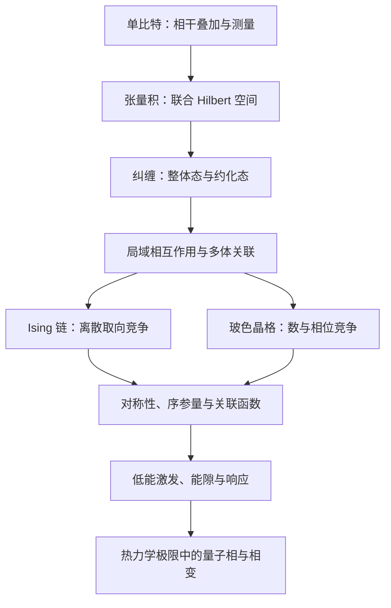

# 第一章 量子多体物理基础

本章依据给定课程大纲编写，是供课前预习、课后推导和期末复习使用的自学讲义，不是教师课堂内容的逐字记录。教师：姜胜寒；第 1、2 节各 2 学时，第 3、4 节各 3 学时，共 10 学时。正文比课堂板书更详细；标为“拓展”的推导可在第一次阅读时略过。

我们要追踪同一个问题：当许多简单的量子自由度结合起来时，为什么会出现单个自由度没有的性质？单个量子比特教我们辨认相干叠加；两个比特使我们遇到纠缠；把这样的自由度放在晶格上并允许它们相互作用，就会出现磁性、集体激发和量子相变。最后，把每个格点的两种自旋状态推广为任意玻色子占据数，我们将看到粒子数与相位的竞争如何产生 Mott 绝缘体和超流。

全文采用以下约定。态矢量用 $|\psi\rangle$ 或 $|\Psi\rangle$，标量超流序参量专用 $\psi=\langle b_i\rangle$；算符通常不加帽，是否为算符由定义确定。$I$ 是相应空间上的恒等算符，$\hbar$ 是约化 Planck 常数，$\mathrm i^2=-1$，时间用 $\tau$，避免与跃迁能量 $t$ 混淆。$N$ 始终是格点数或比特数，$N_{\mathrm p}$ 是粒子总数，$d$ 是空间维数，$a$ 是晶格间距。$J,h,t,U,\mu$ 都具有能量量纲；时间演化算符记作 $\mathcal U$，与排斥强度 $U$ 区分。

第 3 节研究均匀的一维铁磁最近邻链，$J>0,h\geq0$；第 4 节研究均匀、无无序、单组分、单能带、最近邻跃迁的排斥型 Bose–Hubbard 模型，$t\geq0,U>0$，另行讨论 $U=0$ 极限。讨论量子相时默认零温。有限例子明确采用开放边界；讨论体相可采用周期边界，并取 $N\to\infty$。这些条件是结论的一部分。

## 第 1 节 量子比特

学习目标：

- 能区分经典随机比特与相干叠加的量子比特。
- 能从归一化态矢量推导 Bloch 球表示，并解释两个角度。
- 能用 Pauli 矩阵计算测量概率、期望值和自旋涨落。
- 能把单比特幺正演化理解为 Bloch 球上的旋转。
- 能把纯态写成密度矩阵，为下一节描述子系统作准备。

### 1.1 本节要解决的问题

经典比特（classical bit）有 $0$ 和 $1$ 两种取值。若不知道其取值，可以给它们分配概率，例如各 $1/2$。这是一份关于取值的概率分布。

量子比特（qubit）是一个有效二维量子系统。它不只允许两种基态，还允许两种基态的相干叠加（coherent superposition）。所谓“相干”，不是“概率更复杂”，而是不同分量之间保留了相对相位，使它们在其他测量基下产生干涉。

因此，关键问题不是“一个比特怎么同时存两条经典信息”，而是：量子态除了指定某次测量的概率，还包含什么能影响其他测量的结构？

### 1.2 必要的预备知识：二维 Hilbert 空间

Hilbert 空间（希尔伯特空间）是带有内积的完备复线性空间。本节只用有限维空间，其完备性不涉及额外的分析困难。复线性意味着态矢量可以乘复数、彼此相加；内积使我们能定义长度和正交。

取一组正交归一基，称为计算基（computational basis）：

$$
|0\rangle=\begin{pmatrix}1\\0\end{pmatrix},\qquad
|1\rangle=\begin{pmatrix}0\\1\end{pmatrix},\qquad
\langle u|v\rangle=\delta_{uv},\quad u,v\in\{0,1\}.
$$

这里 $\delta_{uv}$ 是 Kronecker 符号：两指标相等时为 $1$，否则为 $0$。左矢是右矢的共轭转置。例如 $|\psi\rangle=(\alpha,\beta)^{\mathsf T}$ 对应 $\langle\psi|=(\alpha^*,\beta^*)$，星号表示复共轭。

一般归一化纯态（pure state）写为

$$
|\psi\rangle=\alpha|0\rangle+\beta|1\rangle,\qquad
|\alpha|^2+|\beta|^2=1. \tag{1.1}
$$

$\alpha,\beta$ 是概率振幅（probability amplitude），并非概率本身。模平方给出计算基测量的概率；振幅的复相位参与干涉。

物理纯态实际上对应一条射线（ray）：$|\psi\rangle$ 与 $e^{\mathrm i\chi}|\psi\rangle$ 表示同一个物理态，其中 $\chi$ 是任意实数。一个态矢量是该物理态的一种代表。

### 1.3 从简单例子引入：同样的 $z$ 测量概率，不同的量子态

定义

$$
|+\rangle=\frac{|0\rangle+|1\rangle}{\sqrt2},\qquad
|-\rangle=\frac{|0\rangle-|1\rangle}{\sqrt2}.
$$

两态在计算基测量中都以 $1/2$ 的概率得到 $0$ 或 $1$。但若在正交基 $\{|+\rangle,|-\rangle\}$ 中测量，前者必定给出 $+$，后者必定给出 $-$。原因是 $\langle+|+\rangle=1$，而 $\langle+|-\rangle=(1-1)/2=0$：后一式中两个振幅发生相消。

再考虑每次以概率 $1/2$ 制备 $|0\rangle$ 或 $|1\rangle$ 的经典混合。它在 $\{|+\rangle,|-\rangle\}$ 测量中仍各给出 $1/2$。所以，“计算基中各有一半概率”不足以确定量子态。叠加态与经典混合的差别必须通过其他测量基显现。

### 1.4 核心概念：相位、Pauli 矩阵与自旋

#### 1.4.1 全局相位与相对相位

全局相位（global phase）是所有分量共同乘上的相位。任意态 $|v\rangle$ 上的投影概率满足

$$
|\langle v|e^{\mathrm i\chi}\psi\rangle|^2
=|e^{\mathrm i\chi}|^2|\langle v|\psi\rangle|^2
=|\langle v|\psi\rangle|^2.
$$

期望值中的相位也由左右两侧相消，因此全局相位不可观测。

相对相位（relative phase）是不同基分量之间的相位差。对

$$
|\psi_\phi\rangle=\frac{|0\rangle+e^{\mathrm i\phi}|1\rangle}{\sqrt2}
$$

进行 $+$ 投影时，概率为

$$
p_+=\left|\frac{1+e^{\mathrm i\phi}}2\right|^2
=\frac{1+\cos\phi}{2}.
$$

$\phi$ 改变了两条振幅相加时的结果，所以它可通过干涉测量。这里的相位总是相对于选定的基和测量参照而言。

#### 1.4.2 Pauli 矩阵

Pauli 矩阵（泡利矩阵）是二维空间中的三个基本厄米算符：

$$
\sigma^x=\begin{pmatrix}0&1\\1&0\end{pmatrix},\quad
\sigma^y=\begin{pmatrix}0&-\mathrm i\\\mathrm i&0\end{pmatrix},\quad
\sigma^z=\begin{pmatrix}1&0\\0&-1\end{pmatrix}. \tag{1.2}
$$

$x,y,z$ 标记三个分量。它们的本征值都为 $\pm1$。$\sigma^z$ 区分 $|0\rangle$ 和 $|1\rangle$；$\sigma^x$ 交换它们，因此能检测两分量的实部相干；$\sigma^y$ 带有 $\pm\mathrm i$，检测虚部相干。

直接矩阵相乘给出 $(\sigma^x)^2=(\sigma^y)^2=(\sigma^z)^2=I$，以及

$$
\sigma^x\sigma^y=\mathrm i\sigma^z,\qquad
\sigma^y\sigma^x=-\mathrm i\sigma^z,\qquad
[\sigma^x,\sigma^y]=2\mathrm i\sigma^z,
$$

其余循环置换成立。对易子定义为 $[A,B]=AB-BA$。不同分量不对易，表示不能把它们看成同时具有确定取值的三个经典坐标。

#### 1.4.3 自旋 $1/2$ 与量子比特

真正的自旋 $1/2$ 满足

$$
S^x=\frac{\hbar}{2}\sigma^x,\qquad
S^y=\frac{\hbar}{2}\sigma^y,\qquad
S^z=\frac{\hbar}{2}\sigma^z.
$$

因此 $|0\rangle$、$|1\rangle$ 可选作 $S^z$ 本征值为 $+\hbar/2$、$-\hbar/2$ 的态。测量 $\sigma^z$ 得到的是无量纲的 $\pm1$；测量 $S^z$ 得到的是角动量。

任意孤立的两个能级也可以编码一个量子比特，但它们不一定是实际自旋。此时 Bloch 球的三个方向是有效二维空间中的方向，不必对应实验室里的空间方向。使用两能级近似还要求其他能级不被显著占据。

### 1.5 数学定义：测量、期望值与密度矩阵

设厄米可观测量 $A$ 的不同本征值为 $a_s$，对应正交投影为 $P_s$，则 $A=\sum_s a_sP_s$、$\sum_sP_s=I$。Born 规则（玻恩规则）规定

$$
p_s=\langle\psi|P_s|\psi\rangle,\qquad
\langle A\rangle=\sum_s a_sp_s=\langle\psi|A|\psi\rangle. \tag{1.3}
$$

$s$ 只是结果的标签。期望值是对同样制备的系统重复测量的统计平均，不一定是单次可能的测量值。理想投影测量得到结果 $s$ 后，条件态为 $P_s|\psi\rangle/\sqrt{p_s}$；这里只讨论 $p_s>0$ 的结果。

纯态的密度矩阵（density matrix）定义为

$$
\rho=|\psi\rangle\langle\psi|
=\begin{pmatrix}|\alpha|^2&\alpha\beta^*\\\alpha^*\beta&|\beta|^2\end{pmatrix}. \tag{1.4}
$$

它把预测测量所需的信息集中在一个算符中。对角元是计算基概率，非对角元记录该基下的相干。迹 $\operatorname{Tr}$ 是任意正交基中对角元之和；$\operatorname{Tr}(\rho A)=\langle A\rangle$。

纯态满足 $\rho^2=\rho$、$\operatorname{Tr}\rho=1$，因而 $\operatorname{Tr}\rho^2=1$。全局相位在外积中相消。下一节将把同一语言推广到混态和子系统。

### 1.6 关键推导：Bloch 球与幺正演化

#### 1.6.1 为什么只需要两个实参数

两个复振幅原有四个实参数。归一化消去一个；不可观测的全局相位再消去一个，因此物理纯态由两个实参数描述。

更具体地，把 $\alpha=|\alpha|e^{\mathrm i\chi_0}$、$\beta=|\beta|e^{\mathrm i\chi_1}$ 代入式（1.1），去掉共同相位 $e^{\mathrm i\chi_0}$，再令

$$
|\alpha|=\cos\frac\theta2,\qquad
|\beta|=\sin\frac\theta2,\qquad
\phi=\chi_1-\chi_0,
$$

得到

$$
|\psi\rangle=\cos\frac\theta2|0\rangle
+e^{\mathrm i\phi}\sin\frac\theta2|1\rangle,
\quad0\leq\theta\leq\pi,\quad0\leq\phi<2\pi. \tag{1.5}
$$

在 $\alpha=0$ 的南极不能通过 $\alpha$ 固定相位，但仍可用上述代表；两极的 $\phi$ 不再区分物理态。这是球坐标在极点的冗余。

#### 1.6.2 从期望值推导 Bloch 矢量

定义 Bloch 矢量（Bloch vector）为三个 Pauli 期望值组成的实矢量：

$$
\boldsymbol r=(\langle\sigma^x\rangle,\langle\sigma^y\rangle,\langle\sigma^z\rangle).
$$

先对一般振幅计算：

$$
\begin{aligned}
\langle\sigma^x\rangle&=\alpha^*\beta+\beta^*\alpha=2\operatorname{Re}(\alpha^*\beta),\\
\langle\sigma^y\rangle&=-\mathrm i\alpha^*\beta+\mathrm i\beta^*\alpha=2\operatorname{Im}(\alpha^*\beta),\\
\langle\sigma^z\rangle&=|\alpha|^2-|\beta|^2.
\end{aligned}
$$

$\operatorname{Re}$、$\operatorname{Im}$ 分别取实部和虚部。代入式（1.5），用 $2\sin(\theta/2)\cos(\theta/2)=\sin\theta$，得

$$
\boldsymbol r=(\sin\theta\cos\phi,\sin\theta\sin\phi,\cos\theta),
\qquad |\boldsymbol r|=1. \tag{1.6}
$$

这就是 Bloch 球（Bloch sphere）：球面上每一点表示一个单比特纯态，而不是一次测量结果，也不是粒子的位置。三个坐标是三组分别进行的测量的期望值。

式（1.4）还可以重写为

$$
\rho=\frac12(I+\boldsymbol r\cdot\boldsymbol\sigma),\qquad
\boldsymbol\sigma=(\sigma^x,\sigma^y,\sigma^z). \tag{1.7}
$$

点积表示三个分量相乘再求和。这说明 Bloch 矢量与密度矩阵携带相同的信息。

对单位矢量 $\boldsymbol n$ 方向的 Pauli 算符 $\boldsymbol n\cdot\boldsymbol\sigma$，其两个投影为 $P_\pm=(I\pm\boldsymbol n\cdot\boldsymbol\sigma)/2$，因此

$$
p_\pm=\frac{1\pm\boldsymbol n\cdot\boldsymbol r}{2}. \tag{1.8}
$$

Bloch 矢量与测量方向平行时结果确定，垂直时两个结果等概率。这一几何规律直接来自 Born 规则。

#### 1.6.3 幺正演化如何变成旋转

幺正算符（unitary operator）满足 $\mathcal U^\dagger\mathcal U=I$，保持内积和总概率。任意时间无关的单比特哈密顿量可写为

$$
H=E_{\mathrm c}I+\frac{\hbar\Omega}{2}\boldsymbol n\cdot\boldsymbol\sigma.
$$

$E_{\mathrm c}$ 是共同能量偏移，$\Omega\geq0$ 是角频率，$\boldsymbol n$ 是单位方向。共同偏移只贡献全局相位。利用 $(\boldsymbol n\cdot\boldsymbol\sigma)^2=I$，把指数级数的偶次项和奇次项分开，得

$$
\mathcal U(\tau)=e^{-\mathrm iH\tau/\hbar}
=e^{-\mathrm iE_{\mathrm c}\tau/\hbar}
\left[\cos\frac{\Omega\tau}{2}I
-\mathrm i\sin\frac{\Omega\tau}{2}\boldsymbol n\cdot\boldsymbol\sigma\right]. \tag{1.9}
$$

例如 $H=\hbar\Omega\sigma^z/2$ 作用后，$|0\rangle$ 的振幅乘 $e^{-\mathrm i\Omega\tau/2}$，$|1\rangle$ 的振幅乘 $e^{+\mathrm i\Omega\tau/2}$。去掉共同相位后，相对相位由 $\phi$ 变成 $\phi+\Omega\tau$，即 Bloch 矢量绕 $z$ 轴旋转角度 $\Omega\tau$。

一般方向也有同样结论。由 Pauli 对易关系可以求出 $\mathrm d\boldsymbol r/\mathrm d\tau=\Omega\boldsymbol n\times\boldsymbol r$，这是绕 $\boldsymbol n$ 的旋转方程。态矢量公式中的半角与 Bloch 矢量的整角并不矛盾：转过 $2\pi$ 后态矢量可变号，但物理射线不变。

### 1.7 物理图像：球面上的相干与测量

北极为 $|0\rangle$，南极为 $|1\rangle$；$+x$、$-x$ 方向分别为 $|+\rangle$、$|-\rangle$；$+y$ 方向为 $(|0\rangle+\mathrm i|1\rangle)/\sqrt2$。

纯态的球面点随孤立系统的幺正演化转动，长度保持为 $1$。测量则是另一种操作：若对 $|+\rangle$ 测量 $\sigma^z$ 并记录结果，每次条件态会落在一个极点；若丢弃结果，描述整批样本需要混态密度矩阵，不能用某个单一球面点代替。

这里没有把量子叠加解释成“系统已在 $0$ 或 $1$，只是尚未查看”。这样的经典概率模型虽然能拟合一次 $z$ 测量，却不能同时重现第 1.3 节的 $x$ 测量预测。这个例子排除的是简单的基态混合解释，并不是对所有隐变量理论的完整讨论。

### 1.8 典型例题

#### 例 1：测量 $|+\rangle$ 的 $z$ 方向自旋

由 $\langle0|+\rangle=\langle1|+\rangle=1/\sqrt2$，得到 $S^z=+\hbar/2$ 与 $-\hbar/2$ 的概率各为 $1/2$。因此

$$
\langle S^z\rangle=0,\qquad
\langle(S^z)^2\rangle=\frac{\hbar^2}{4},\qquad
(\Delta S^z)^2=\frac{\hbar^2}{4}.
$$

方差定义为 $(\Delta A)^2=\langle A^2\rangle-\langle A\rangle^2$。零期望值并不表示自旋大小为零：单次读数仍是 $\pm\hbar/2$，只是平均相消。

若随后立刻重复 $S^z$ 测量，理想情况下结果与第一次相同；因为第一次测量后，条件态已成为相应本征态。

#### 例 2：计算一个一般 Bloch 态的测量统计

第 1.6.2 节已经对任意 $\theta,\phi$ 完整推导了三个 Pauli 期望值。取具体值 $\theta=\pi/3,\phi=\pi/2$：

$$
|\psi\rangle=\frac{\sqrt3}{2}|0\rangle+\frac{\mathrm i}{2}|1\rangle,
\qquad\boldsymbol r=\left(0,\frac{\sqrt3}{2},\frac12\right).
$$

因此测量 $\sigma^z$ 得到 $+1$ 的概率为 $3/4$；测量 $\sigma^x$ 得到 $+1$ 的概率为 $1/2$；测量 $\sigma^y$ 得到 $+1$ 的概率为 $(2+\sqrt3)/4$。相同态在不同方向给出不同偏向，正由 Bloch 矢量的投影描述。

#### 例 3：横向驱动引起基态之间的振荡

取 $H=\hbar\Omega\sigma^x/2$，初态 $|0\rangle$。式（1.9）给出

$$
|\psi(\tau)\rangle=\cos\frac{\Omega\tau}{2}|0\rangle
-\mathrm i\sin\frac{\Omega\tau}{2}|1\rangle,
\qquad p_1(\tau)=\sin^2\frac{\Omega\tau}{2}.
$$

这是两能级系统的 Rabi 振荡（Rabi oscillation）的基本形式。概率随时间变化，来源是哈密顿量中的 $\sigma^x$ 不与所测量的 $\sigma^z$ 对易。这个机制正是第 3 节“横场翻转自旋”的单比特版本。

### 1.9 常见误区

- “归一化后二分量复矢量只有两个实参数。”归一化后仍有三个；还要除去全局相位。
- “Bloch 球面上的点是粒子所在的位置。”它表示二维量子系统的纯态。
- “$\langle\sigma^z\rangle=0$ 意味着每次测得零。”单次结果为 $\pm1$。
- “叠加与随机混合只是两种说法。”它们可在其他基下给出不同统计。
- “Pauli 矩阵就是有量纲的自旋算符。”两者相差 $\hbar/2$。

### 1.10 本节小结与概念关系

二维 Hilbert 空间提供两个独立基方向，复振幅允许相干叠加；除去归一化和全局相位后，纯态由 Bloch 球面上的两个角确定。Pauli 矩阵既是测量方向，也是单比特动力学的生成元。Born 规则把态变成概率，密度矩阵把这些预测编码为算符。

单比特的两个基矢还不能描述“两个系统各自可能取什么状态”。下一节必须同时记录每一个比特的指标，这正是引入张量积的原因。

### 1.11 思考题与练习题

**基础题**

1. 判断 $(|0\rangle+2|1\rangle)/\sqrt5$ 是否归一化，并求计算基概率。
2. 写出 $|0\rangle$、$|1\rangle$、$(|0\rangle-\mathrm i|1\rangle)/\sqrt2$ 的 Bloch 矢量。
3. 对 $|+\rangle$ 计算 $\langle\sigma^x\rangle$、$\langle\sigma^z\rangle$ 和 $(\Delta\sigma^z)^2$。

**推导题**

4. 从矩阵乘法证明 $P_\pm=(I\pm\boldsymbol n\cdot\boldsymbol\sigma)/2$ 满足 $P_\pm^2=P_\pm$、$P_+P_-=0$。
5. 用式（1.7）证明 $\operatorname{Tr}\rho^2=(1+|\boldsymbol r|^2)/2$。

**概念思考题**

6. 为什么仅测量计算基中的概率不能重建单比特纯态？应补充什么测量？

**简要答案与提示**

1. 已归一化，概率为 $1/5,4/5$。
2. 依次为 $(0,0,1)$、$(0,0,-1)$、$(0,-1,0)$。
3. 依次为 $1,0,1$。
4. 先证 $(\boldsymbol n\cdot\boldsymbol\sigma)^2=I$；不同 Pauli 乘积的交叉项两两抵消。
5. 展开平方，使用 $\operatorname{Tr}I=2$、$\operatorname{Tr}\sigma^x=\operatorname{Tr}\sigma^y=\operatorname{Tr}\sigma^z=0$。
6. 计算基概率只给出 $r_z$，不能给出相对相位。再分别测量 $\sigma^x,\sigma^y$ 的统计即可确定 $\boldsymbol r$；每组测量使用相同制备的独立样本。

## 第 2 节 多比特系统

学习目标：

- 能建立两个和 $N$ 个可区分量子比特的张量积空间。
- 能判断任意两比特纯态是否为直积态。
- 能写出局域算符并计算两点关联和连通关联。
- 能通过偏迹得到 Bell 态的约化密度矩阵。
- 能解释纠缠、经典关联和多体计算困难之间的联系。

### 2.1 本节要解决的问题

单比特态告诉我们一个系统的测量统计。两个系统放在一起后，必须预测“第一个测到什么，同时第二个测到什么”。仅分别列出两个单比特态通常不够，因为整体可以存在无法由单独状态重建的关联。

我们首先需要一个能同时保留两个系统标签的空间，然后再问：哪些整体态可以完全由两个局部态构成，哪些不能？这一问题会把“多个比特”推进到“量子多体系统”。

### 2.2 必要的预备知识：张量积不是向量相加

设子系统 $A,B$ 的空间分别为 $\mathcal H_A,\mathcal H_B$。张量积（tensor product）空间 $\mathcal H_A\otimes\mathcal H_B$ 是由所有 $|u\rangle_A\otimes|v\rangle_B$ 的线性组合构成的空间，并满足双线性规则：

$$
(c_0|u\rangle+c_1|u'\rangle)\otimes|v\rangle
=c_0|u\rangle\otimes|v\rangle+c_1|u'\rangle\otimes|v\rangle,
$$

对第二个因子也成立。$c_0,c_1$ 是任意复系数。内积由

$$
(\langle u|\otimes\langle v|)(|u'\rangle\otimes|v'\rangle)
=\langle u|u'\rangle\langle v|v'\rangle
$$

确定，表示独立基态的正交性要分别在两个子系统上检查。

对两个二维列矢量，约定基顺序为 $00,01,10,11$，则

$$
\begin{pmatrix}\alpha\\\beta\end{pmatrix}\otimes
\begin{pmatrix}\gamma\\\delta\end{pmatrix}
=\begin{pmatrix}\alpha\gamma\\\alpha\delta\\\beta\gamma\\\beta\delta\end{pmatrix}. \tag{2.1}
$$

这里 $\gamma,\delta$ 是第二个比特的振幅。结果有四个分量，分别记录四种联合结果。普通向量相加仍在同一个二维空间中，无法承担这一任务。若使用直和，维数虽然在这个特例中也等于四，但它通常描述“处于这一扇区或另一扇区”，没有上述复合系统的乘法结构；维数相同不等于物理含义相同。

### 2.3 从简单例子引入：四个基态与指数增长

两个量子比特的计算基为

$$
|00\rangle,quad|01\rangle,quad|10\rangle,quad|11\rangle,
\qquad |uv\rangle\equiv|u\rangle_A\otimes|v\rangle_B.
$$

第一个指标有两种选择，对每个选择第二个指标又有两种选择，共 $2\times2=4$ 种。推广到 $N$ 个比特：

$$
\mathcal H_N=\bigotimes_{i=1}^{N}\mathbb C^2,\qquad
\dim\mathcal H_N=2^N,\qquad
|\Psi\rangle=\sum_{s_1,\ldots,s_N=0,1}
C_{s_1\cdots s_N}|s_1\cdots s_N\rangle. \tag{2.2}
$$

$i$ 是比特标签，$s_i$ 是其基状态标签，$C_{s_1\cdots s_N}$ 是联合振幅，满足所有模平方之和为 $1$。指数来自每新增一个自由度，就要把已有的每种配置各复制为两种新配置。

一般纯态需要 $2^N$ 个复振幅，而直积态只需逐个记录单比特态，物理实参数为 $2N$ 个。并非所有态都同样复杂；困难在于相互作用通常使系统离开这个很小的直积态集合。

单粒子空间与多体空间也要区分。例如一个无内部自由度的粒子在 $N$ 个格点上活动，单粒子空间仅有 $N$ 个位置基态；每个格点都放一个自旋 $1/2$ 时，描述的是 $N$ 个局部自由度，维数是 $2^N$。两者不能因为都涉及 $N$ 个格点而混为一谈。

### 2.4 核心概念：直积、纠缠与局域操作

直积态（product state）能写为

$$
|\Psi\rangle=|u\rangle_A\otimes|v\rangle_B.
$$

对于纯态，“可分离”（separable）与“直积”在给定的 $A|B$ 划分下等价。不能如此分解的纯态称为纠缠态（entangled state）。这里的划分必须指定：纠缠是相对于所选子系统而言的。

四个 Bell 态（Bell states）为

$$
|\Phi^\pm\rangle=\frac{|00\rangle\pm|11\rangle}{\sqrt2},\qquad
|\Psi^\pm\rangle=\frac{|01\rangle\pm|10\rangle}{\sqrt2}.
$$

它们构成两比特空间的一组正交归一基。以 $|\Phi^+\rangle$ 为例：分别测量两个 $\sigma^z$，两次结果总相同，但每个单独结果都是随机的。稍后会看到，这种关联还保留着不同联合配置之间的相干。

局域算符（local operator）只作用于指定子系统。例如

$$
\sigma_i^z=I\otimes\cdots\otimes\underbrace{\sigma^z}_{\text{第 }i\text{ 个因子}}\otimes\cdots\otimes I. \tag{2.3}
$$

上式的“局域”指算符的支撑范围，不是说它对整体态的影响可以用单比特态完整描述。对 Bell 态施加 $\sigma_A^z$，会把 $|\Phi^+\rangle$ 变为 $|\Phi^-\rangle$，改变全局的相对相位。

不同格点上的算符对易，因为它们作用于不同的张量因子。全局算符（global operator）则可涉及整个系统，如总磁化 $M_z=\sum_i\sigma_i^z$ 或翻转所有自旋的乘积。最近邻相互作用 $\sigma_i^z\sigma_{i+1}^z$ 在多体语境中仍称局域相互作用，因为只支撑在相邻少数格点上。

### 2.5 数学定义：关联、混态和偏迹

#### 2.5.1 两点关联与连通关联

对格点 $i,j$ 上的局域算符 $A_i,B_j$，定义两点关联函数（two-point correlation function）和连通关联（connected correlation）：

$$
G_{AB}(i,j)=\langle A_iB_j\rangle,\qquad
C_{AB}(i,j)=\langle A_iB_j\rangle-\langle A_i\rangle\langle B_j\rangle. \tag{2.4}
$$

$G_{AB}$ 记录联合统计；$C_{AB}$ 扣除由各自平均值已经能解释的部分。例如两个总是向上的自旋有 $G_{zz}=1$，但 $C_{zz}=0$，因为没有额外的共同涨落。

直积态的期望值因子化，因而不同子系统的连通关联为零。但反过来，一种算符的连通关联为零不足以证明态是直积态；必须检查更完整的信息。

#### 2.5.2 混态与可分离混态

当以概率 $p_\nu$ 制备纯态 $|\chi_\nu\rangle$ 时，密度矩阵为

$$
\rho=\sum_\nu p_\nu|\chi_\nu\rangle\langle\chi_\nu|,
\qquad p_\nu\geq0,\quad\sum_\nu p_\nu=1. \tag{2.5}
$$

$\nu$ 标记制备方案。若 $\rho$ 不对应单一射线，就称为混态（mixed state）。一般密度矩阵必须厄米、半正定且迹为一；半正定是指 $\langle v|\rho|v\rangle\geq0$，保证概率非负。混态有 $\operatorname{Tr}\rho^2<1$。

同一混态可有不同的纯态分解。例如 $I/2$ 既可由 $|0\rangle,|1\rangle$ 各半混合得到，也可由 $|+\rangle,|-\rangle$ 各半混合得到。因此，单凭密度矩阵不能恢复唯一的“背后到底制备了哪个纯态”的故事。

一个混态若可写为 $\rho_{AB}=\sum_\nu p_\nu\rho_A^{(\nu)}\otimes\rho_B^{(\nu)}$，称为可分离混态；它不必是单一张量积。不能这样写的混态才是纠缠混态。两比特纯态的判据不能直接用于一般混态。

#### 2.5.3 约化密度矩阵与偏迹

若只测量 $A$，需要一个局部描述 $\rho_A$，使所有局域可观测量 $O_A$ 都满足

$$
\operatorname{Tr}_{AB}\!\left[\rho_{AB}(O_A\otimes I_B)\right]
=\operatorname{Tr}_A(\rho_AO_A).
$$

满足这一要求的约化密度矩阵（reduced density matrix）是

$$
\rho_A=\operatorname{Tr}_B\rho_{AB}
=\sum_b(I_A\otimes\langle b|)\rho_{AB}(I_A\otimes|b\rangle). \tag{2.6}
$$

$\{|b\rangle\}$ 是 $B$ 的任意正交归一基。$\operatorname{Tr}_B$ 称偏迹（partial trace）：把未观测子系统的完整基指标求和，而保留 $A$ 的两个矩阵指标。它是计算局部预测的规则，不是一次实际的测量或破坏过程。

### 2.6 关键推导

#### 2.6.1 两比特纯态的可分离判据

写一般归一化态

$$
|\Psi\rangle=c_{00}|00\rangle+c_{01}|01\rangle+c_{10}|10\rangle+c_{11}|11\rangle,
\quad\sum_{u,v=0,1}|c_{uv}|^2=1.
$$

把系数组成矩阵 $C=\begin{pmatrix}c_{00}&c_{01}\\c_{10}&c_{11}\end{pmatrix}$。若态可写成 $(\alpha|0\rangle+\beta|1\rangle)\otimes(\gamma|0\rangle+\delta|1\rangle)$，则

$$
C=\begin{pmatrix}\alpha\\\beta\end{pmatrix}
\begin{pmatrix}\gamma&\delta\end{pmatrix},\qquad
\det C=c_{00}c_{11}-c_{01}c_{10}=0.
$$

反之，非零的 $2\times2$ 矩阵若行列式为零，它的列向量线性相关，秩为一；可提取一个非零列向量，把另一列写成它的倍数，从而写成上述外积。再将两个因子分别归一化，即得到直积态。因此

$$
\text{两比特纯态可分离}\quad\Longleftrightarrow\quad
c_{00}c_{11}-c_{01}c_{10}=0. \tag{2.7}
$$

Bell 态 $|\Phi^+\rangle$ 的行列式为 $1/2$，所以不能分解。它的“只有 $00$ 和 $11$，同时还保持二者相干”的结构，不可能由两个独立振幅列表相乘产生。

#### 2.6.2 完整计算 Bell 态的约化密度矩阵

从外积出发：

$$
\rho_{AB}=|\Phi^+\rangle\langle\Phi^+|
=\frac12\left(|00\rangle\langle00|+|00\rangle\langle11|
+|11\rangle\langle00|+|11\rangle\langle11|\right).
$$

使用偏迹规则

$$
\operatorname{Tr}_B(|u b\rangle\langle v b'|)
=|u\rangle\langle v|\,\langle b'|b\rangle
=\delta_{bb'}|u\rangle\langle v|,
$$

两个对角项分别留下 $|0\rangle\langle0|$ 和 $|1\rangle\langle1|$；两个交叉项含 $\langle1|0\rangle$ 或 $\langle0|1\rangle$，因此为零。于是

$$
\rho_A=\frac12\bigl(|0\rangle\langle0|+|1\rangle\langle1|\bigr)=\frac I2,
\qquad\operatorname{Tr}\rho_A^2=\frac12. \tag{2.8}
$$

同理 $\rho_B=I/2$，但 $\operatorname{Tr}\rho_{AB}^2=1$。整体是纯态，局部却是最大混态（maximally mixed state）。局部的随机性并不要求整体的制备有经典不确定性；它可以来自与另一个系统的纠缠。

对一般两比特纯态，同样计算得 $(\rho_A)_{uv}=\sum_b c_{ub}c_{vb}^*$，即 $\rho_A=CC^\dagger$。当 $C$ 秩为一时，$\rho_A$ 是纯态；当 $C$ 秩为二时，$\rho_A$ 是混态。这把“不能分解整体振幅”和“子系统不纯”连接起来。

#### 2.6.3 单比特混态位于 Bloch 球内部

任意单比特密度矩阵仍可写成式（1.7）。其本征值为 $(1\pm|\boldsymbol r|)/2$：因为沿 $\boldsymbol r$ 方向的 Pauli 算符本征值为 $\pm1$。半正定性要求 $|\boldsymbol r|\leq1$。

因此球面是纯态，球内是混态，球心 $\boldsymbol r=0$ 对应 $I/2$。Bell 态的每个比特都位于这个球心；但一个球心加另一个球心，不能表示整个 Bell 态。两个局部密度矩阵没有包含全部联合信息。

### 2.7 物理图像：局域相互作用怎样形成整体关联

若哈密顿量为 $H=H_A\otimes I_B+I_A\otimes H_B$，两项对易，时间演化可分解为 $\mathcal U_A\otimes\mathcal U_B$。它把直积态变成直积态，不能从直积初态产生纠缠。

相互作用包含不能分成独立局部作用的项，如 $\sigma_A^z\sigma_B^z$。它让一个比特的相位演化依赖另一个比特的状态，因此可能形成不可分解的联合振幅。相互作用“可能”产生纠缠，并非对任何初态和任何时刻都必然产生；相互作用本征态可能只获得全局相位。

局域操作也不意味着可以瞬时传递信息。对 $A$ 施加局域幺正变换后，$B$ 的约化密度矩阵不变；偏迹中的 $\mathcal U_A^\dagger\mathcal U_A$ 抵消。若选择某个测量结果作条件，$B$ 的条件态可以变化，但对方要知道所选结果仍需经典通信。多体系统中的长期关联来自整体态及其制备、演化，不能解释成可控的瞬时信号。

### 2.8 典型例题

#### 例 1：相同的 $z$ 关联，是否就是同一个态

比较 Bell 纯态与经典相关混态

$$
\rho_{\mathrm{cl}}=\frac12|00\rangle\langle00|+\frac12|11\rangle\langle11|.
$$

两者都满足 $\langle\sigma_A^z\rangle=\langle\sigma_B^z\rangle=0$、$\langle\sigma_A^z\sigma_B^z\rangle=1$，局部密度矩阵也都为 $I/2$。因此 $z$ 方向关联和局部纯度不能单独区分它们。

但 $\sigma_A^x\sigma_B^x$ 交换 $|00\rangle$ 和 $|11\rangle$，故

$$
\langle\Phi^+|\sigma_A^x\sigma_B^x|\Phi^+\rangle=1,
\qquad\operatorname{Tr}(\rho_{\mathrm{cl}}\sigma_A^x\sigma_B^x)=0.
$$

Bell 态保留交叉项，经典混合没有。这个计算区分了这两个具体状态；不要将一次 $xx$ 测量结果当成适用于任意未知混态的完整纠缠判据。

#### 例 2：两个自旋的相互作用产生纠缠

取 $H_{\mathrm{int}}=-J\sigma_A^z\sigma_B^z$、$J>0$，初态为 $|++\rangle$。令无量纲时间 $\vartheta=J\tau/\hbar$。平行基态的能量为 $-J$，反平行为 $+J$，因此

$$
|\Psi(\tau)\rangle=\frac12\left[e^{\mathrm i\vartheta}(|00\rangle+|11\rangle)
+e^{-\mathrm i\vartheta}(|01\rangle+|10\rangle)\right].
$$

系数矩阵的行列式为

$$
\det C=\frac{e^{2\mathrm i\vartheta}-e^{-2\mathrm i\vartheta}}4
=\frac{\mathrm i}{2}\sin(2\vartheta).
$$

除 $\vartheta$ 为 $\pi/2$ 的整数倍外，该态均纠缠。在 $\vartheta=\pi/4$ 时，$CC^\dagger=I/2$，局部为最大混态。整个过程是幺正演化，整体一直纯；局部变混来自纠缠增长，不来自“整体失去量子性”。

#### 例 3：指数维数的实际代价

若一个复振幅用两个 8 字节浮点数存储，仅保存一般 $N=40$ 比特态就需 $16\times2^{40}$ 字节，即 $16\,\mathrm{TiB}$，尚未计入算符和临时内存。$\mathrm{TiB}=2^{40}$ 字节。

局域哈密顿量可以非常稀疏，许多物理态也能压缩表示，因此不能据此断言所有 40 比特问题都不可计算。指数增长指出的是直接存储任意态的困难；寻找可利用的对称性和纠缠结构，是多体方法的核心方向。

### 2.9 常见误区

- “两个比特只有四种可能状态。”只有四个计算基态，纯态是它们的连续复线性组合。
- “只要有相关就有纠缠。”可分离混态也能有非零连通关联。
- “总态纯，所以各部分一定纯。”Bell 态给出反例。
- “偏迹会把系统真的测量掉。”偏迹只是对未观测自由度求和的描述规则。
- “局域哈密顿量只会产生局域直积态。”反复作用的局域相互作用可建立复杂多体关联。

### 2.10 本节小结与概念关系

张量积使联合基态数相乘，联合振幅不能总被拆成局部振幅，这就是纯态纠缠的起点。密度矩阵统一描述纯态与混态；偏迹保留局部可观测信息；关联函数则捕捉两个或多个区域共同的统计结构。

多比特系统与量子多体系统在数学上没有一条突然改变规则的界线。前者强调有限自由度的编码、操作和读出；后者通常强调空间组织、相互作用、低能集体现象及随系统尺度增长的行为。下一节把本节的 $-J\sigma_A^z\sigma_B^z$ 放到整条链上，再加入单比特翻转项，便得到横场量子 Ising 模型。

### 2.11 思考题与练习题

**基础题**

1. 展开 $|+\rangle\otimes|0\rangle$，按 $00,01,10,11$ 写出列矢量。
2. 计算 $\sigma_A^x|01\rangle$ 与 $\sigma_B^z|01\rangle$。
3. 判断 $(|00\rangle+|01\rangle)/\sqrt2$ 和 $(|00\rangle+|01\rangle+|10\rangle-|11\rangle)/2$ 是否可分离。

**推导题**

4. 对 $|\Psi^-\rangle$ 计算 $\rho_A$，并求 $\langle\sigma_A^z\sigma_B^z\rangle$。
5. 从偏迹定义推导 $\rho_A=CC^\dagger$，并说明为什么局部幺正变换不能改变其本征值。

**概念思考题**

6. 若两个比特的局部密度矩阵均为 $I/2$，能否断定整体纠缠？

**简要答案与提示**

1. $(|00\rangle+|10\rangle)/\sqrt2$，列矢量为 $(1,0,1,0)^{\mathsf T}/\sqrt2$。
2. 分别为 $|11\rangle$、$-|01\rangle$。
3. 第一态为 $|0\rangle\otimes|+\rangle$；第二态的 $\det C=-1/2$，纠缠。
4. $\rho_A=I/2$；关联为 $-1$，因为两个 $z$ 结果总相反。
5. 对 $B$ 指标求和得到 $(\rho_A)_{uv}=\sum_b c_{ub}c_{vb}^*$。$A$ 上的幺正使 $\rho_A\mapsto\mathcal U_A\rho_A\mathcal U_A^\dagger$，相似变换保谱；$B$ 上的局部幺正不改变 $\rho_A$。
6. 不能。Bell 态、$\rho_{\mathrm{cl}}$ 和 $I_A/2\otimes I_B/2$ 都满足这一条件，但它们的整体关联不同。若另已知整体为纯态，局部混态才足以判定该二分划分下存在纠缠。

## 第 3 节 量子 Ising 模型

学习目标：

- 能解释经典 Ising 相互作用与量子横场分别偏好的态。
- 能用两自旋精确解理解基矢混合、纠缠和有限尺寸平滑变化。
- 能用 $\mathbb Z_2$ 对称性、序参量和极限次序描述自发对称性破缺。
- 能区分基态劈裂、体激发能隙、长程关联和关联长度。
- 能说明一维临界点 $h/J=1$ 的依据及其适用条件。

### 3.1 本节要解决的问题

两个相互作用自旋已经能纠缠，但两个自旋不会形成宏观磁体。要研究宏观性质，我们把同样的局部作用重复到整条链，考察随着 $N$ 增长，基态是否会形成稳定的集体取向，以及这种取向怎样被量子涨落破坏。

Ising 模型保留最小的局部自由度和最简单的相互作用，因此适合分清“单比特的叠加”“多个比特的纠缠”和“多体相的组织方式”这三个层次。它能精确求解，使物理直觉可以与严格结果对照。

### 3.2 必要的预备知识：基态、温度和热力学极限

哈密顿量的最低能量本征态称为基态（ground state），其能量记为 $E_0$；更高能量的本征态是激发态（excited state）。零温平衡研究首先问：什么状态使能量最低？

非零温平衡还要考虑热占据。若能级为 $E_s$，温度为 $T$，则 Gibbs 概率为

$$
p_s=\frac{e^{-E_s/(k_{\mathrm B}T)}}{Z},\qquad
Z=\sum_s e^{-E_s/(k_{\mathrm B}T)}.
$$

$k_{\mathrm B}$ 是 Boltzmann 常数，$Z$ 是配分函数（partition function），确保概率归一化。热涨落（thermal fluctuation）来自不同能态的热占据；量子涨落（quantum fluctuation）则可在单一基态中出现，例如 $|+\rangle$ 的 $\sigma^z$ 方差为一。两者来源不同。

热力学极限（thermodynamic limit）是让 $N\to\infty$，同时保持局部耦合和密度等强度量固定。短程系统的总能量通常随 $N$ 增长，因此比较每格点基态能量 $e_0=\lim_{N\to\infty}E_0/N$。

量子相变（quantum phase transition）是零温基态随参数变化发生的热力学极限下的非解析变化；连续相变常伴随关联长度发散和低能尺度消失。有限维、参数光滑、基态非简并且与其他能级分离的系统，基态通常随参数光滑变化。有限系统仍可出现由对称性保护的精确能级交叉，但不能把任意小系统的交叉都当作宏观体相变。

### 3.3 从简单例子引入：经典 Ising 的平行偏好

经典 Ising 自由度是格点上的数 $s_i=\pm1$。开放链能量为

$$
E_{\mathrm{cl}}=-J\sum_{i=1}^{N-1}s_i s_{i+1},\qquad J>0.
$$

$s_i$ 可理解为只保留沿某个易轴的两种磁矩取向。一个键上，平行配置 $++$ 或 $--$ 的能量为 $-J$，反平行配置为 $+J$，所以产生一个反平行键要多付 $2J$。

例如三自旋开放链中，$+++ $ 的能量是 $-2J$，$++-$ 是 $0$，$+-+$ 是 $+2J$。分隔两种取向区域的反平行键称为畴壁（domain wall）。在一维开放链中，一个畴壁代价为 $2J$；周期链必须有偶数个畴壁，最小成对代价为 $4J$。

经典模型中每个配置的能量是一个数，不包含不同配置之间的相干混合。将 $s_i$ 改为对角算符 $\sigma_i^z$ 后，若没有其他项，能谱仍等价于这套经典配置能量。要产生非平凡量子动力学，需要加入不与它对易的项。

### 3.4 核心概念：横场与 Ising 相互作用的竞争

一维横场量子 Ising 模型（transverse-field quantum Ising model）定义为

$$
H=-J\sum_i\sigma_i^z\sigma_{i+1}^z-h\sum_i\sigma_i^x. \tag{3.1}
$$

$J$ 是最近邻铁磁耦合能，$h$ 是横场耦合能，不直接等同于以特斯拉计的磁场；$i$ 标记格点。开放链第一项从 $1$ 求和到 $N-1$，周期链从 $1$ 到 $N$ 并令 $\sigma_{N+1}^z=\sigma_1^z$。小系统计算必须声明边界以免重复计键。

$-J$ 项希望相邻 $z$ 分量同号。$-h\sigma_i^x$ 的单格点最低态是 $|+\rangle_i$，因为其 $\sigma_i^x$ 本征值为 $+1$，能量为 $-h$。在 $z$ 基下，$\sigma_i^x$ 翻转第 $i$ 个指标，使不同自旋配置发生混合。

两个偏好不能同时完全实现，因为例如

$$
[\sigma_i^z\sigma_{i+1}^z,\sigma_i^x]
=2\mathrm i\sigma_i^y\sigma_{i+1}^z\ne0.
$$

取确定 $z$ 配置可以优化相互作用，却不能同时把每个自旋放进 $\sigma^x=+1$ 的态；后者对 $z$ 测量有最大单比特不确定性。竞争的物理含义就是：获得横场能需要混合那些本来可能付出畴壁能的配置。

### 3.5 数学定义：对称性、序参量与关联

#### 3.5.1 $\mathbb Z_2$ 对称性

对称性（symmetry）是保持物理规律、在这里保持哈密顿量不变的变换。定义全局翻转算符

$$
P=\prod_{i=1}^{N}\sigma_i^x,\qquad P^2=I.
$$

$P$ 将所有 $z$ 自旋一起翻转。由单比特矩阵乘法得

$$
P\sigma_i^zP^{-1}=-\sigma_i^z,\qquad
P\sigma_i^xP^{-1}=\sigma_i^x,\qquad PHP^{-1}=H. \tag{3.2}
$$

每条键上的两个负号相消，横场项不变，因此 $[H,P]=0$。只有“不翻转”和“翻转”两个操作，构成 $\mathbb Z_2$ 对称性。

#### 3.5.2 序参量

序参量（order parameter）是用于区别两侧集体组织方式的量。本模型的纵向磁化密度为

$$
m_z=\frac1N\sum_i\langle\sigma_i^z\rangle. \tag{3.3}
$$

它在 $P$ 下变号。横向磁化 $m_x=N^{-1}\sum_i\langle\sigma_i^x\rangle$ 则不变，通常在两相都可非零，所以不适合作为该对称性破缺的序参量。

“有序”在这里特指稳定的 $z$ 铁磁长程关联，不是说态矢量是否简单；“无序”也不是指粒子随机地高速乱动。量子顺磁相（quantum paramagnet）可以是一个相干且非常确定的基态。

#### 3.5.3 激发能隙与关联长度

有限系统的最低能级差定义为 $\Delta_N=E_1-E_0$，其中 $E_1$ 是按能量排序的下一能级。若存在简并或准简并基态集合，研究体激发时必须把这个集合单独看待，不能把其中的微小劈裂等同于体内局域激发的代价。

平移不变链中，令 $\ell$ 为格点间隔，定义

$$
G_{zz}(\ell)=\langle\sigma_i^z\sigma_{i+\ell}^z\rangle,\qquad
C_{zz}(\ell)=G_{zz}(\ell)-\langle\sigma_i^z\rangle\langle\sigma_{i+\ell}^z\rangle. \tag{3.4}
$$

若远距离连通关联的包络按 $e^{-\ell a/\xi}$ 衰减，$\xi$ 就是关联长度（correlation length），表示局部涨落能关联到多远。还可能乘有幂次前因子，$\xi$ 刻画的是指数部分。有序相应在选定一个纯粹破缺态后讨论连通关联；对称猫态中的 $C_{zz}$ 可含不衰减的整体取向不确定性。

### 3.6 关键推导：从两端极限走向临界点

#### 3.6.1 两个可直接求解的极限

当 $h=0$ 时，两个全平行态

$$
|0\cdots0\rangle,\qquad|1\cdots1\rangle
$$

均使每条键能量为 $-J$，是简并基态，分别有 $m_z=+1,-1$。它们的任意线性组合也处于基态空间，包括 $m_z=0$ 的对称猫态。基态简并意味着哈密顿量本身没有指定选择哪一个代表。

当 $J=0,h>0$ 时，各格点独立，唯一基态为

$$
|\Psi_0\rangle=|+\rangle^{\otimes N},\qquad E_0=-Nh.
$$

把一个格点改成 $|-\rangle$，其能量由 $-h$ 变为 $+h$，代价 $2h$。不同格点的 $z$ 连通关联为零，$m_z=0,m_x=1$。这里“顺磁”指没有自发纵向取向，并不表示没有横向极化。

这两端的集体性质不同，因此在无限链上从一端走向另一端，不能始终维持同一种有隙对称结构。

#### 3.6.2 两自旋开放链的精确解

取一个键：

$$
H_2=-J\sigma_1^z\sigma_2^z-h(\sigma_1^x+\sigma_2^x).
$$

引入两个归一化偶宇称态 $|F_+\rangle=(|00\rangle+|11\rangle)/\sqrt2$、$|A_+\rangle=(|01\rangle+|10\rangle)/\sqrt2$。$F$ 表示平行组合，$A$ 表示反平行组合。

相互作用给它们的对角能量分别为 $-J,+J$。横场的作用为 $(\sigma_1^x+\sigma_2^x)|F_+\rangle=2|A_+\rangle$，反向同理。因此此子空间中

$$
H_{2,+}=\begin{pmatrix}-J&-2h\\-2h&J\end{pmatrix}.
$$

特征方程为 $E^2-J^2-4h^2=0$，得到本征值 $\pm R$，其中 $R=\sqrt{J^2+4h^2}$。另外两个态 $|F_-\rangle=(|00\rangle-|11\rangle)/\sqrt2$、$|A_-\rangle=(|01\rangle-|10\rangle)/\sqrt2$ 被横场总和湮灭，能量分别为 $-J,+J$。

所以在 $h>0$ 时，基态唯一，能量为 $-R$。令 $0<\eta<\pi/4$，定义 $\cos2\eta=J/R$、$\sin2\eta=2h/R$，归一化基态为

$$
|\Psi_0\rangle=\cos\eta\,|F_+\rangle+\sin\eta\,|A_+\rangle. \tag{3.5}
$$

$h\to0^+$ 时趋向 $|F_+\rangle$；$h/J\to\infty$ 时趋向 $(|F_+\rangle+|A_+\rangle)/\sqrt2=|++\rangle$。基态在所有 $h>0$ 平滑变化。

直接由两个分量权重可求

$$
\langle\sigma_1^z\sigma_2^z\rangle=\cos2\eta=\frac J R,\qquad
\frac12\langle\sigma_1^x+\sigma_2^x\rangle=\sin2\eta=\frac{2h}R,
\qquad m_z=0.
$$

横场逐渐削弱平行关联并增强横向极化。这个例子没有严格相变，也不能用它寻找无限链的精确临界点；它展示了局部竞争怎样改变波函数。

#### 3.6.3 为什么有限链的 $m_z=0$ 不排除铁磁相

如果有限系统的基态唯一，由 $[H,P]=0$ 可把它取为 $P$ 的本征态，$P|\Psi_0\rangle=p|\Psi_0\rangle$、$p=\pm1$。于是

$$
\langle\sigma_i^z\rangle
=\langle\Psi_0|P^{-1}(P\sigma_i^zP^{-1})P|\Psi_0\rangle
=-\langle\sigma_i^z\rangle=0.
$$

这只是对称性要求，并没有计算出无限系统是否会选取一个取向。为定义自发对称性破缺（spontaneous symmetry breaking），加入微弱纵场

$$
H_\epsilon=H-\epsilon\sum_i\sigma_i^z,\qquad
m_z^{\mathrm{sp}}=\lim_{\epsilon\to0^+}\lim_{N\to\infty}
\frac1N\sum_i\langle\sigma_i^z\rangle_{H_\epsilon}. \tag{3.6}
$$

$\epsilon>0$ 是选定正向的能量尺度，上标 $\mathrm{sp}$ 表示自发值。必须先让系统无限大，再撤去偏置。若反过来，有限非简并基态先恢复对称，结果就一直为零。

有序相中两个宏观取向的有限链混合需要涉及越来越多的自旋，隧穿劈裂随尺寸通常指数减小。一个固定而极小的 $\epsilon$ 对两个取向产生与 $N\epsilon$ 同阶的偏置；在 $N\to\infty$ 后足以选态，撤去它仍可保留非零磁化。哈密顿量恢复对称，而选定的态不恢复对称，这才称“自发”。

不加纵场也能用 $G_{zz}(\ell)$ 检测：有序相中先取无限系统，再取远距离，关联趋向 $(m_z^{\mathrm{sp}})^2>0$。有限对称基态虽然 $m_z=0$，仍能显现这一长程关联趋势。

#### 3.6.4 无序、有序与临界态的关联图像

小横场下，虚拟翻转配置混入基态，自发磁化从 $1$ 降低，但远处仍能保持同一取向。有序相具有非零长程 $zz$ 关联。

大横场下，基态接近 $|+\rangle^{\otimes N}$，有限 $J$ 建立短程 $zz$ 关联，但其远距离部分衰减到零；量子顺磁相不意味着严格无纠缠，严格直积只在 $J=0$ 极限成立。

在连续临界点（critical point），涨落涉及所有长度尺度，关联通常由指数衰减变为幂律衰减（power-law decay）。幂律 $\ell^{-p}$ 中 $p>0$ 是指数，不存在控制远距离衰减的有限指数长度。这比“介于有序和无序之间”更准确：临界态本身具有尺度依赖的特殊关联。

#### 3.6.5 拓展：精确谱为何在 $h=J$ 闭合

本段给出精确求解的骨架，以说明临界值并非简单猜测“两个参数相等”。第一次阅读可先掌握式（3.7）及其解释。

Jordan–Wigner 变换（Jordan–Wigner transformation）的目的，是将难以直接对角化的自旋相互作用改写为二次费米子形式。费米子算符满足反对易关系 $\{c_i,c_j^\dagger\}=\delta_{ij}$、$\{c_i,c_j\}=0$，其中 $\{A,B\}=AB+BA$；不同格点的自旋算符却对易。因此映射必须加入一条记录前面所有格点状态的字符串，才能补出交换时的负号。

对开放链定义两个厄米算符

$$
\gamma_{i,1}=\left(\prod_{j<i}\sigma_j^x\right)\sigma_i^z,\qquad
\gamma_{i,2}=-\left(\prod_{j<i}\sigma_j^x\right)\sigma_i^y.
$$

$j<i$ 的乘积是字符串，$i=1$ 时为空积 $I$。它们满足 $\gamma_{i,\lambda}^\dagger=\gamma_{i,\lambda}$ 与 $\{\gamma_{i,\lambda},\gamma_{j,\lambda'}\}=2\delta_{ij}\delta_{\lambda\lambda'}$，$\lambda=1,2$；这种自共轭费米子算符称为 Majorana 算符。可组合成 $c_i=(\gamma_{i,1}+\mathrm i\gamma_{i,2})/2$。

相邻字符串相消，并利用 $\sigma^z\sigma^y=-\mathrm i\sigma^x$，得到

$$
\sigma_i^x=-\mathrm i\gamma_{i,1}\gamma_{i,2},\qquad
\sigma_i^z\sigma_{i+1}^z=-\mathrm i\gamma_{i,2}\gamma_{i+1,1},
$$

所以

$$
H=\mathrm i h\sum_i\gamma_{i,1}\gamma_{i,2}
+\mathrm iJ\sum_{i=1}^{N-1}\gamma_{i,2}\gamma_{i+1,1}.
$$

现在每项只有两个费米子算符。为求无限均匀链的体谱，对格点指标作 Fourier 变换：$\gamma_{i,\lambda}=N^{-1/2}\sum_k e^{\mathrm i k i a}\gamma_{k,\lambda}$，$k$ 是波数，$ka$ 无量纲。相邻耦合产生 $e^{\pm\mathrm i ka}$。相应的厄米单粒子矩阵可取为

$$
\mathcal M(k)=2\begin{pmatrix}
0&\mathrm i(h-Je^{-\mathrm i ka})\\
-\mathrm i(h-Je^{\mathrm i ka})&0
\end{pmatrix}.
$$

这是二次 Majorana 哈密顿量对应的谱矩阵，不是把原来的自旋态空间缩成两个状态；各动量模式仍共同构成多体 Hilbert 空间。因 $\mathcal M(k)^2=4|h-Je^{\mathrm i ka}|^2I$，正激发能为

$$
\varepsilon(k)=2\sqrt{J^2+h^2-2Jh\cos(ka)},\qquad
\Delta_{\mathrm{bulk}}\equiv\min_k\varepsilon(k)=2|J-h|. \tag{3.7}
$$

这里 $\Delta_{\mathrm{bulk}}$ 是无限均匀链的基本体准粒子能标。有限周期自旋链的费米子边界条件还依赖宇称扇区，物理态允许的准粒子数也受约束；上式不能无条件当作每个有限链的 $E_1-E_0$。开放链的映射没有该跨边界字符串问题，但可出现与边界有关的低能模式。

$J,h>0$ 时，$\cos(ka)$ 在 $k=0$ 最大，故能量在那里最低。只有 $h=J$ 时最低能消失；此时 $\varepsilon(k)=4J|\sin(ka/2)|\simeq2Ja|k|$，足够长波的涨落只需任意小能量。这给出临界点 $h/J=1$。严格精确解还建立了两侧的相结构；此处未展开完整的费米子多体态构造和关联函数行列式推导。原始精确求解见 [Pfeuty（1970）](https://doi.org/10.1016/0003-4916(70)90270-8)。

与这一谱相符，在接近临界点时关联长度按 $\xi/a\propto|h/J-1|^{-1}$ 发散；比例系数及不同关联通道的细节不由这一量纲论证确定。精确解还给出 $m_z^{\mathrm{sp}}=[1-(h/J)^2]^{1/8}$（$0\leq h<J$）以及临界 $G_{zz}(\ell)\propto\ell^{-1/4}$。这两个关联结论在本讲义中作为有来源的精确结果引用，不把单粒子能谱当作其完整证明。仍见 [Pfeuty 的精确解](https://doi.org/10.1016/0003-4916(70)90270-8)。

### 3.7 物理图像：相、能隙和相变

| 性质 | 铁磁有序相 $0\leq h<J$ | 临界点 $h=J$ | 量子顺磁相 $h>J$ |
|---|---|---|---|
| 主导倾向 | $z$ 自旋保持集体取向 | 两种能量竞争使长波涨落软化 | 自旋偏向 $+x$ |
| 自发 $m_z$ | 选态后非零 | 为零 | 为零 |
| 远距离 $G_{zz}$ | 趋向非零常数 | 幂律趋零 | 指数包络趋零 |
| 基态结构 | 无限系统有两种破缺取向 | 临界基态 | 保持 $\mathbb Z_2$ 的基态 |
| 基本体激发能标 | 有限 | 闭合 | 有限 |
| 关联长度 | 破缺态的连通关联通常有限 | 发散 | 有限 |

有序相可以同时有“两个基态之间几乎不需能量就能换扇区”和“在体内造一个局部缺陷需要有限能量”。在 $h=0$ 的周期链，两个全平行基态精确简并，但翻转一个自旋造出两个畴壁仍要 $4J$。这就是区分基态劈裂与体激发的最直接理由。

热相变改变温度，热熵与能量竞争；零温量子相变改变 $h/J$，不同不对易能量项改变基态。特别地，一维短程经典 Ising 链在任何 $T>0$ 都无铁磁长程有序：有限能量的畴壁可在任意位置出现，热力学极限中会破坏无限远的取向关联。一维横场量子 Ising 链却可在 $T=0,h<J$ 有序。这并不矛盾，因为温度和横场不是同一种涨落来源。

### 3.8 典型例题

#### 例 1：为什么单自旋直积平均场给错一维临界点

平均场（mean-field approximation）忽略部分关联，以统一的单比特 Bloch 态直积作变分基态。令其 Bloch 矢量在 $xz$ 平面，$\langle\sigma^z\rangle=\cos\theta$、$\langle\sigma^x\rangle=\sin\theta$，取 $0\leq\theta\leq\pi/2$。

对一维周期链，每格点对应一条不重复的键，所以

$$
e_{\mathrm{var}}=-J\cos^2\theta-h\sin\theta.
$$

令 $s=\sin\theta\in[0,1]$，则 $e_{\mathrm{var}}=-J+Js^2-hs$。极小条件 $2Js-h=0$ 给出 $s=h/(2J)$，仅当 $h\leq2J$ 有效；更大横场时极小值位于端点 $s=1$。

这个近似预测在 $h=2J$ 失去纵向磁化，与精确 $h=J$ 不符。原因不是能量竞争图像错了，而是直积变分排除了关键的空间纠缠和涨落。它适合练习“如何由波函数计算能量并优化”，不能冒充一维精确理论。

#### 例 2：有限对称态的磁化与关联

取 $N\geq2$ 的猫态 $|\mathrm{cat}\rangle=(|0\cdots0\rangle+|1\cdots1\rangle)/\sqrt2$。每个格点约化态为 $I/2$，所以 $\langle\sigma_i^z\rangle=0$。但对不同格点 $i,j$，两个配置都有 $\sigma_i^z\sigma_j^z=+1$，故 $G_{zz}(i,j)=1$。

令 $M_z=\sum_i\sigma_i^z$，则 $\langle M_z^2\rangle=N^2$。因此 $\langle M_z^2\rangle/N^2$ 是有限对称系统中观察铁磁倾向的有用量。作为比较，$|+\rangle^{\otimes N}$ 只有 $i=j$ 项贡献，得到 $\langle M_z^2\rangle/N^2=1/N\to0$。

#### 例 3：同一个“最小能隙”为什么需要说明对象

两自旋精确解中，$h>0$ 时第一激发能为 $-J$，因此 $\Delta_2=R-J\simeq2h^2/J$（$h\ll J$）。它来自两个平行组合之间的高阶混合，不是畴壁代价 $2J$。

这提醒我们：写“能隙闭合”之前，应声明尺寸、边界条件、粒子数或宇称扇区，以及是否已排除准简并基态集合。量子临界点关注的是体内低能尺度的消失，而不是任意有限系统的一条小劈裂。

### 3.9 常见误区

- “有限基态 $m_z=0$，所以一定无序。”还需看远距离关联和选态极限。
- “横场大就是温度高。”横场可改变单一零温基态，温度改变热占据。
- “有序相必须每个自旋都确定向上。”有限横场下有量子涨落，磁化通常小于一。
- “$E_1-E_0$ 趋零就必然是临界点。”准简并基态的劈裂也会趋零。
- “两个项的系数相等，所以临界点必然是 $h=J$。”该值依赖模型与归一化，需由精确解等依据确定。

### 3.10 本节小结与概念关系

经典 Ising 相互作用先给出畴壁代价，横场再让不同配置发生相干混合。多个局部竞争项共同决定基态的长程组织：小横场为铁磁相，大横场为量子顺磁相，两者在无限一维均匀链的 $h/J=1$ 处由连续量子相变连接。

序参量回答“是否选取一个取向”，关联函数回答“不同位置能保持怎样的联系”，能隙回答“产生低能激发要付出多少代价”。下一节沿用这三个问题，但局部自由度从两个自旋状态变为粒子占据数，竞争也由离散方向转为粒子数与相位。

### 3.11 思考题与练习题

**基础题**

1. 对三自旋开放链在 $h=0$ 时计算 $|000\rangle,|001\rangle,|010\rangle$ 的能量。
2. 在 $J=0,h>0$ 时求基态、$m_x,m_z$ 及最低激发能。
3. 验证 $P\sigma_i^zP^{-1}=-\sigma_i^z$，并解释为何一个纵场项会显式破坏 $\mathbb Z_2$。

**推导题**

4. 从两自旋的 $2\times2$ 矩阵推导式（3.5）和 $\langle\sigma_1^z\sigma_2^z\rangle=J/R$。
5. 将式（3.7）在 $h\approx J,|ka|\ll1$ 展开，求能谱的低波数形式，并求临界时的速度 $v$，定义 $\varepsilon\simeq\hbar v|k|$。

**概念思考题**

6. 在有限链中发现 $m_z=0$、但 $\langle M_z^2\rangle/N^2$ 随 $N$ 增长趋向正数，应怎样解释？仅靠一个尺寸是否足够？

**简要答案与提示**

1. 分别为 $-2J,0,+2J$。
2. 基态 $|+\rangle^{\otimes N}$；$m_x=1,m_z=0$；能隙 $2h$。
3. 只需计算同一格点的 $\sigma^x\sigma^z\sigma^x=-\sigma^z$。纵场只含一个 $\sigma^z$，翻转后变号。
4. 对能量 $-R$ 解方程 $(R-J)\cos\eta=2h\sin\eta$，再归一化。关联是 $\cos^2\eta-\sin^2\eta$。
5. $\varepsilon(k)\simeq2\sqrt{(h-J)^2+Jh(ka)^2}$；临界 $v=2Ja/\hbar$。由质量能标与波数项平衡可估计 $\xi$ 的发散幂次，但不同观测通道的系数还需关联函数分析。
6. 这与保持对称的铁磁有序相有限尺寸代表相容。需比较多个尺寸、远距离关联及边界效应，不能只看一次有限计算就宣称已证明热力学相变。

## 第 4 节 绝缘体与超流

学习目标：

- 能用占据数语言建立玻色子 Fock 空间，理解产生、湮灭和跃迁。
- 能从单格点能量推导 Mott 区间、粒子与空穴能隙及不可压缩性。
- 能解释相干、凝聚、超流刚度与对称性破缺之间的联系和区别。
- 能用两格点例子说明 Mott 态中的虚拟运动和粒子数涨落。
- 能读懂 Bose–Hubbard 的 Mott 叶瓣结构，并识别一维和有限尺寸的例外。

### 4.1 本节要解决的问题

Ising 链每个格点只有两种基态，而冷原子晶格中每个格点可能有零个、一个、两个乃至更多粒子。粒子还能从一个格点隧穿到另一个格点。因此，除了“局部态怎样取向”，我们还要问“粒子是否容易重新分布”和“不同位置之间是否保持稳定的相位联系”。

绝缘体（insulator）与超流（superfluid）讨论的是低能物质输运及集体相干。它们不能仅由一张粒子位置图判断。本节用 Bose–Hubbard 模型把微观跃迁、局部排斥、低能激发与宏观响应连接起来。

### 4.2 必要的预备知识：玻色子与占据数语言

#### 4.2.1 从单粒子空间到 Fock 空间

玻色子（boson）的多粒子波函数在交换两个相同粒子时不变。同一单粒子态可以被任意多个玻色子占据。对于不可分辨粒子，逐个给粒子贴标签并不是最方便的办法；更自然的是问“每个单粒子模式里有多少粒子”。

在单能带晶格近似中，每个格点 $i$ 对应一个局域轨道，局部占据数基为 $|n\rangle_i$，其中 $n=0,1,2,\ldots$。不同粒子数正交。全系统基为

$$
|n_1,\ldots,n_N\rangle=\bigotimes_{i=1}^N|n_i\rangle_i.
$$

允许所有粒子数的空间称为 Fock 空间（Fock space）。局部空间现在是无限维；若固定总粒子数 $N_{\mathrm p}$，只保留 $\sum_i n_i=N_{\mathrm p}$ 的配置，维数为 $\binom{N_{\mathrm p}+N-1}{N_{\mathrm p}}$。这由将不可分辨的 $N_{\mathrm p}$ 个粒子分配到 $N$ 个盒子的组合计数得到。

二次量子化（second quantization）就是这种用模式占据数和改变占据数的算符描述多粒子系统的方法，不是把量子力学“再量子化一次”。这里的张量因子按格点模式划分，不按不可分辨粒子的标签划分。相同玻色子的交换对称性已编码在占据数表示中。

#### 4.2.2 产生、湮灭和数算符

产生算符（creation operator）$b_i^\dagger$ 在格点 $i$ 增加一个粒子；湮灭算符（annihilation operator）$b_i$ 减少一个：

$$
b_i|n\rangle_i=\sqrt n\,|n-1\rangle_i,\qquad
b_i^\dagger|n\rangle_i=\sqrt{n+1}\,|n+1\rangle_i,\qquad b_i|0\rangle_i=0. \tag{4.1}
$$

根号系数确保标准归一化以及玻色对易关系

$$
[b_i,b_j^\dagger]=\delta_{ij},\qquad[b_i,b_j]=[b_i^\dagger,b_j^\dagger]=0.
$$

例如 $b_i b_i^\dagger|n\rangle_i=(n+1)|n\rangle_i$，而 $b_i^\dagger b_i|n\rangle_i=n|n\rangle_i$，二者之差是 $|n\rangle_i$，所以 $[b_i,b_i^\dagger]=I$。

数算符（number operator）定义为

$$
n_i=b_i^\dagger b_i,\qquad
\hat N_{\mathrm p}=\sum_i n_i,\qquad
n_i|n\rangle_i=n|n\rangle_i. \tag{4.2}
$$

$\hat N_{\mathrm p}$ 是总粒子数算符，$N_{\mathrm p}$ 表示其固定本征值。由作用规则得 $[n_i,b_i]=-b_i$、$[n_i,b_i^\dagger]=b_i^\dagger$。这些恒等式以后用于判断守恒量和电流。

### 4.3 从简单例子引入：一个粒子在两个格点间活动

先只保留两个格点间的跃迁，固定 $N_{\mathrm p}=1$：

$$
H_t=-t(b_1^\dagger b_2+b_2^\dagger b_1),\qquad t>0.
$$

基为 $|10\rangle,|01\rangle$。这里数字是占据数，与前面的比特标签物理含义不同。$b_2^\dagger b_1|10\rangle=|01\rangle$，所以

$$
H_t=\begin{pmatrix}0&-t\\-t&0\end{pmatrix}.
$$

对称态 $(|10\rangle+|01\rangle)/\sqrt2$ 的能量为 $-t$，反对称态能量为 $+t$。跃迁降低对称离域组合的能量：粒子不是以某个未知位置静止在一边，而是两个位置振幅保持相干。

但一个粒子的两格点相干还不是宏观超流。超流必须进一步讨论许多粒子的集体态及其对长波相位扭曲的响应。这个例子只解释跃迁项为什么倾向于相干离域化。

### 4.4 核心概念：Bose–Hubbard 模型的三种能量

Bose–Hubbard 模型为

$$
H=-t\sum_{\langle i,j\rangle}(b_i^\dagger b_j+b_j^\dagger b_i)
+\frac U2\sum_i n_i(n_i-1)-\mu\sum_i n_i. \tag{4.3}
$$

$\langle i,j\rangle$ 遍历每一条无向最近邻键一次。$t$ 是跃迁振幅，$U>0$ 是同格点两个粒子的排斥能，$\mu$ 是化学势（chemical potential），即调节增加粒子是否有利的能量参数。

跃迁算符的完整矩阵元为

$$
b_i^\dagger b_j|\ldots,n_i,\ldots,n_j,\ldots\rangle
=\sqrt{(n_i+1)n_j}|\ldots,n_i+1,\ldots,n_j-1,\ldots\rangle.
$$

它保持总数，却改变局部数。根号因子意味着跃迁幅度依赖占据数，不能把所有占据配置之间的耦合都写成同一个 $-t$。

$U n_i(n_i-1)/2$ 来自同格点粒子对的数目：$n_i$ 个粒子有 $n_i(n_i-1)/2$ 对。零粒子和单粒子没有配对排斥，双占据代价 $U$，三占据代价 $3U$。排斥因此抑制占据数的不均匀和涨落。

化学势项的负号表示增大 $\mu$ 有利于增加粒子。严格说，式（4.3）是用于比较不同粒子数扇区的巨正则能量算符 $H_{\mathrm{phys}}-\mu\hat N_{\mathrm p}$；沿用惯例仍记为 $H$。在固定 $N_{\mathrm p}$ 的计算里，$-\mu N_{\mathrm p}$ 是常数，不改变该扇区的本征态。

所有项都保持粒子总数，$[H,\hat N_{\mathrm p}]=0$；但 $[H,n_i]$ 在 $t\ne0$ 时通常非零。粒子总数守恒与局部粒子数固定是两回事。

Mott 绝缘体（Mott insulator）是由相互作用导致的不可压缩绝缘相。本节清洁均匀模型中，它出现在适当的整数平均填充及足够小的 $t/U$。超流则在跃迁建立足够强的相位联系时出现。相互作用与跃迁并不是简单地把粒子“锁死”或“放开”，而是在不同配置的能量和相干混合之间竞争。

### 4.5 数学定义：如何识别这两种相

#### 4.5.1 密度、涨落与可压缩性

平均填充为 $\bar n=\langle\hat N_{\mathrm p}\rangle/N$，局域数涨落为

$$
(\Delta n_i)^2=\langle n_i^2\rangle-\langle n_i\rangle^2.
$$

定义每格点密度响应

$$
\kappa=\frac{\partial\bar n}{\partial\mu}\bigg|_{T=0}. \tag{4.4}
$$

这里把 $\kappa$ 称为可压缩性（compressibility）的格点版本；与某些包含密度归一化因子的热力学定义可能相差因子。$\kappa=0$ 表示小幅改变化学势时密度不变。后面会看到局域数涨落非零仍可与 $\kappa=0$ 共存。

#### 4.5.2 单粒子关联与序参量

单粒子关联函数（one-body correlation function）定义为

$$
g_1(i,j)=\langle b_i^\dagger b_j\rangle. \tag{4.5}
$$

$b_j$ 在 $j$ 消去粒子，$b_i^\dagger$ 在 $i$ 放回粒子；这个期望值比较相差一次粒子转移的配置之间的相干。它不等于粒子沿某条经典轨迹实际走过的概率。

在允许自发破缺的描述中，定义均匀超流序参量

$$
\psi=\langle b_i\rangle=|\psi|e^{\mathrm i\varphi}. \tag{4.6}
$$

$|\psi|$ 是幅度，$\varphi$ 是相位。这是连续的复序参量，区别于 Ising 的两个纵向取向。定义全局变换 $\mathcal R(\chi)=e^{-\mathrm i\chi\hat N_{\mathrm p}}$，由 $[\hat N_{\mathrm p},b_i]=-b_i$ 得 $\mathcal R b_i\mathcal R^{-1}=e^{\mathrm i\chi}b_i$；所有粒子相位一起转动，哈密顿量不变。这称为 $\mathrm U(1)$ 对称性。

有限系统的固定总数态严格有 $\langle b_i\rangle=0$，因为 $b_i$ 将态送到与原态正交的 $N_{\mathrm p}-1$ 扇区。若在 $d\geq2$ 的零温常规超流中采用破缺态描述，可先加入微弱源 $-\sum_i(f b_i^\dagger+f^*b_i)$，$f$ 是选定相位的复能量参数，再先取热力学极限、后令 $f\to0$。于是 $\psi$ 可非零。

因此 $\psi$ 是有适用条件的方便表征。对固定粒子数和低维系统，更稳妥的是考察 $g_1$ 和刚度。

#### 4.5.3 超流刚度

超流刚度（superfluid stiffness）衡量对缓慢空间相位扭曲的能量代价。考虑周期边界、每个方向有 $L$ 个格点的 $d$ 维超立方晶格，$N=L^d$，给一个方向施加总相位扭转 $\Theta$。等价地，把该方向每条正向键的跃迁乘以 $e^{\mathrm i\Theta/L}$，反向乘共轭。

设固定密度的物理基态能量为 $E_0(\Theta)$，定义本文归一化的刚度

$$
\Upsilon=\lim_{L\to\infty}L^{2-d}
\left.\frac{\partial^2E_0(\Theta)}{\partial\Theta^2}\right|_{\Theta=0},
\qquad
E_0(\Theta)-E_0(0)\simeq\frac{\Upsilon}{2}L^{d-2}\Theta^2. \tag{4.7}
$$

$L$ 是无量纲的线性格点数，故此定义下 $\Upsilon$ 具有能量量纲。先对有限 $L$ 求导，再取极限。超流相中这一适当缩放后的响应非零；Mott 相中趋零。非零刚度表示相邻区域的相位不愿随意彼此扭开，但均匀改变所有位置的相位不花能量。

### 4.6 关键推导：两端极限与 Mott 叶瓣

#### 4.6.1 $t=0$：逐格点求解整数填充

没有跃迁时各格点独立，单格点占据 $n$ 的巨正则能量为

$$
\mathcal E_n=\frac U2n(n-1)-\mu n.
$$

若 $n\geq1$ 是最低能占据，需同时满足相对 $n+1$ 和 $n-1$ 的稳定性：

$$
\mathcal E_{n+1}-\mathcal E_n=Un-\mu>0,
\qquad
\mathcal E_{n-1}-\mathcal E_n=\mu-U(n-1)>0.
$$

$\mathcal E_n$ 是关于整数 $n$ 的凸函数，邻近差分随 $n$ 增大而增大，因此这两个条件也保证相对所有其他占据数稳定。于是

$$
U(n-1)<\mu<Un. \tag{4.8}
$$

区间内部基态为 $\bigotimes_i|n\rangle_i$，每格点恰有整数 $n$。$\mu<0$ 时是真空 $n=0$；在端点 $\mu=Un$，局部 $n$ 和 $n+1$ 简并，不能继续使用区间内部的非简并推导。

例如 $0<\mu<U$ 对应单位填充。增加一个粒子需要制造双占据，排斥提高能量；减少一个粒子需要抵抗化学势给出的保留粒子的偏好。

#### 4.6.2 粒子能隙、空穴能隙与 Mott 能隙

“空穴”（hole）在此指相对于整数背景少一个粒子的缺陷，不是反粒子。原子极限的增加与移除粒子代价分别为

$$
\Delta_{\mathrm p}=Un-\mu,\qquad
\Delta_{\mathrm h}=\mu-U(n-1). \tag{4.9}
$$

Mott 区间内两者均为正。对保持总粒子数的体系，把一个粒子移到另一格点，产生一个粒子缺陷和一个空穴缺陷；$t=0$ 时其代价为 $\Delta_{\mathrm p}+\Delta_{\mathrm h}=U$。

更一般地，以 $E_0^{\mathrm{phys}}(N_{\mathrm p})$ 表示不含化学势项、固定总数扇区的物理基态能量，定义

$$
\begin{aligned}
\mu_+&=E_0^{\mathrm{phys}}(N_{\mathrm p}+1)-E_0^{\mathrm{phys}}(N_{\mathrm p}),\\
\mu_-&=E_0^{\mathrm{phys}}(N_{\mathrm p})-E_0^{\mathrm{phys}}(N_{\mathrm p}-1),\\
\Delta_{\mathrm c}&=\mu_+-\mu_-.
\end{aligned} \tag{4.10}
$$

$\Delta_{\mathrm c}$ 是粒子数或电荷能隙（charge gap；对中性原子仍沿用此名称）。在给定化学势下，$\Delta_{\mathrm p}=\mu_+-\mu$、$\Delta_{\mathrm h}=\mu-\mu_-$。因此相同整数总数在 $\mu_-<\mu<\mu_+$ 内稳定，形成密度平台；平台内部 $\kappa=0$。

这给出了不可压缩性的能量解释：不是禁止任何微观涨落，而是增减真实低能粒子需要越过有限阈值。$t=0$ 时 $\Delta_{\mathrm c}=U$；有限 $t$ 时缺陷获得色散，能隙缩小。在叶瓣一般侧边，粒子或空穴中的一个能隙先闭合；在固定整数密度到达尖端时，平台宽度 $\Delta_{\mathrm c}$ 消失。不要把“所有边界上两个缺陷能隙同时闭合”当成普遍结论。

#### 4.6.3 有限小跃迁：绝缘体中为什么仍有虚拟运动

以两个开放格点、两个玻色子、$t\ll U$ 为例，固定总数后省略常数 $-2\mu$。$t=0$ 基态为 $|11\rangle$，能量取零；$|20\rangle$ 和 $|02\rangle$ 能量为 $U$。

跃迁矩阵元为 $\langle20|H_t|11\rangle=\langle02|H_t|11\rangle=-\sqrt2t$。非简并微扰论给出一阶态修正：

$$
|\Psi_0\rangle\propto |11\rangle+rac{\sqrt2t}{U}(|20\rangle+|02\rangle).
$$

正号来自负的跃迁矩阵元除以负的能量分母 $0-U$。这些混入分量是虚拟粒子—空穴配置；它们在基态中相干存在，不是系统已热激发到能量 $U$。

到最低非零阶，$\langle n_1\rangle=1$，而

$$
(\Delta n_1)^2=4(t/U)^2+O((t/U)^4),\qquad
E_0=-\frac{4t^2}{U}+O(t^4/U^3).
$$

$O$ 表示更高阶的小量。因此绝缘相可有局部涨落和非零动能期望。绝缘行为关乎热力学极限下的低能输运与加减粒子代价，不是“所有微观运动严格停止”。

#### 4.6.4 $U=0$：离域凝聚的严格极限及其限制

固定 $N_{\mathrm p}$，在均匀周期超立方晶格上定义动量模式

$$
b_{\boldsymbol k}=\frac1{\sqrt N}\sum_i e^{-\mathrm i\boldsymbol k\cdot\boldsymbol R_i}b_i,
\qquad
b_i=\frac1{\sqrt N}\sum_{\boldsymbol k}e^{\mathrm i\boldsymbol k\cdot\boldsymbol R_i}b_{\boldsymbol k}.
$$

$\boldsymbol R_i$ 为格点位置，$\boldsymbol k$ 为允许的晶格动量。代入跃迁项并用离散平面波正交性，得单粒子色散

$$
\epsilon_{\boldsymbol k}=-2t\sum_{\nu=1}^d\cos(k_\nu a).
$$

这里 $\nu$ 标记空间分量。对 $t>0$，最低模式为 $\boldsymbol k=0$。玻色子允许共同占据同一模式，因此固定总数的基态为

$$
|\Psi_{\mathrm{BEC}}\rangle=\frac{(b_{\boldsymbol0}^\dagger)^{N_{\mathrm p}}}{\sqrt{N_{\mathrm p}!}}|\mathrm{vac}\rangle, \tag{4.11}
$$

$|\mathrm{vac}\rangle$ 是所有格点无粒子的真空。玻色—爱因斯坦凝聚（Bose–Einstein condensation，BEC）指某个单粒子模式的占据与总粒子数同阶。在这个非相互作用极限，该模式占据所有粒子。

由所有粒子都在均匀模式，得到 $g_1(i,j)=N_{\mathrm p}/N=\bar n$。每个格点的局部粒子数服从单格点概率 $1/N$ 的二项分布，所以 $(\Delta n_i)^2=\bar n(1-1/N)$。整体总数严格固定，但局部有涨落；同时 $\langle b_i\rangle=0$，再一次说明不能仅凭这一期望值否定凝聚。

严格 $U=0$ 的玻色气体是特殊极限。若使用巨正则描述，$\mu$ 低于最低单粒子能时基态为真空，高于它时无限占据使巨正则能量无下界，等于它时粒子数不被选定；所以这里必须明确固定总数。其低动量激发为二次色散，用 Landau 能量稳定性判据 $v_{\mathrm c}=\min_{\boldsymbol k\ne0}(\epsilon_{\boldsymbol k}-\epsilon_{\boldsymbol0})/(\hbar|\boldsymbol k|)$ 会得到零临界速度。因此凝聚并不自动保证对任意弱扰动都具有稳定无耗散流动；普通相互作用超流的线性声模需要另行讨论。

#### 4.6.5 相干态、数涨落与相位联系

为了表示有确定平均相位的局部振幅，引入玻色相干态（coherent state）$|\zeta\rangle$，定义 $b|\zeta\rangle=\zeta|\zeta\rangle$，其中 $\zeta$ 为复数、$b$ 是某一格点的湮灭算符。

设 $|\zeta\rangle=\sum_{n=0}^\infty q_n|n\rangle$，代入定义并比较 $|n\rangle$ 的系数，得 $q_{n+1}\sqrt{n+1}=\zeta q_n$，所以 $q_n=q_0\zeta^n/\sqrt{n!}$。归一化确定 $q_0=e^{-|\zeta|^2/2}$，于是

$$
|\zeta\rangle=e^{-|\zeta|^2/2}\sum_{n=0}^\infty\frac{\zeta^n}{\sqrt{n!}}|n\rangle,
\quad\langle n\rangle=|\zeta|^2,
\quad(\Delta n)^2=|\zeta|^2,
\quad\langle b\rangle=\zeta. \tag{4.12}
$$

它是不同数态的相干叠加，粒子数分布为 Poisson 分布。相位 $\arg\zeta$ 控制相邻粒子数分量的相对相位，而不是某一固定数态整体不可观测的相位。

若用局部相干态直积作近似，$\zeta_i=\sqrt{\bar n_i}e^{\mathrm i\varphi_i}$，$\bar n_i$ 是局部平均占据，单条键的跃迁能为

$$
\langle H_{t,ij}\rangle=-2t\sqrt{\bar n_i\bar n_j}\cos(\varphi_i-\varphi_j). \tag{4.13}
$$

对 $t>0$，相位差为零能量最低；小相位差的代价为 $t\sqrt{\bar n_i\bar n_j}(\varphi_i-\varphi_j)^2$。这直接展示“跃迁偏好相位对齐”。相反，排斥项对偏离整数背景的数涨落给出二次惩罚，偏好窄的占据数分布。

“数与相位竞争”可在数态和相干态之间直观看到，但不能无条件写下一个处处良好的厄米相位算符满足 $[n,\varphi]=\mathrm i$。粒子数有下界，严格相位算符有细节。大占据、相位起伏较小的转子近似中，数与相位可近似视作共轭变量；本节以数态展开和式（4.13）为依据，不将类比当作普遍算符恒等式。

#### 4.6.6 拓展：单格点平均场推导 Mott 叶瓣

令 $z_{\mathrm c}$ 是每个格点的最近邻数，避免与 Pauli 的 $z$ 分量混淆；超立方晶格 $z_{\mathrm c}=2d$。假设均匀 $\psi=\langle b_i\rangle$，写 $b_i=\psi+\delta b_i$，其中 $\langle\delta b_i\rangle=0$。舍去不同格点的涨落乘积 $\delta b_i^\dagger\delta b_j$，即作平均场分解：

$$
b_i^\dagger b_j\approx\psi b_i^\dagger+\psi^*b_j-|\psi|^2.
$$

对所有键求和后，每格点的有效哈密顿量为

$$
H_{\mathrm{MF},i}=\frac U2n_i(n_i-1)-\mu n_i
-z_{\mathrm c}t(\psi b_i^\dagger+\psi^*b_i)+z_{\mathrm c}t|\psi|^2.
$$

常数项保证没有重复计算平均跃迁能。对 Mott 区间内部的数态 $|n\rangle$，线性扰动的一级能量修正为零，因为 $\langle n|b|n\rangle=0$。二级修正只经过 $|n+1\rangle$、$|n-1\rangle$，得到每格点能量展开

$$
e_{\mathrm{MF}}(\psi)=\mathcal E_n+
\left[z_{\mathrm c}t-(z_{\mathrm c}t)^2\left(
\frac{n+1}{\Delta_{\mathrm p}}+\frac n{\Delta_{\mathrm h}}\right)\right]|\psi|^2
+O(|\psi|^4).
$$

分母是正的激发代价；二级能量降低带负号。若 $|\psi|^2$ 的系数为正，$\psi=0$ 在此近似中稳定；系数变号时产生凝聚倾向。令二次系数为零，得

$$
\frac1{z_{\mathrm c}t_{\mathrm c}^{\mathrm{MF}}}
=\frac{n+1}{Un-\mu}+\frac n{\mu-U(n-1)}. \tag{4.14}
$$

$t_{\mathrm c}^{\mathrm{MF}}$ 是平均场估计的临界跃迁。定义 $x=\mu/U$、$y=z_{\mathrm c}t/U$，化简为

$$
y_{\mathrm c}^{\mathrm{MF}}=\frac{(n-x)(x-n+1)}{x+1},\qquad n-1<x<n. \tag{4.15}
$$

分子在两个整数端点消失，区间中间为正。因此每个整数填充在 $(t/U,\mu/U)$ 平面占据一块从 $t=0$ 区间伸出的区域，边界在一个有限 $t/U$ 处会合，称为 Mott 叶瓣（Mott lobe）。靠近上下边界时，某类缺陷已很便宜，少量跃迁便能使其离域；区间内部缺陷较贵，需要更强跃迁。这就是叶瓣形状的能量解释。

单格点平均场忽略空间关联，是定性说明叶瓣的近似，不是一维精确相图，也不能给出正确的一维临界类型。Mott 绝缘相、整数密度平台及超流转变的理论背景见 [Fisher 等（1989）](https://doi.org/10.1103/PhysRevB.40.546)。

### 4.7 物理图像：怎样理解绝缘、相干与超流

#### 4.7.1 为什么整数填充很重要

设平均每格点有整数 $n$ 个粒子。将一个粒子从一个格点移到另一个格点，背景 $n,n$ 变成 $n-1,n+1$，原子极限中多付 $U$。整个晶格都能形成同一个局部稳定占据，因此存在阻止低能密度变化的阈值。

若填充为 $n$ 与 $n+1$ 之间，原子极限中需要混合两种占据；多出来的粒子可在等能位置间重新分布，有限跃迁就能使这些缺陷活动。故在本节均匀、无无序、仅在位排斥模型中，非整数填充不能形成同样的 Mott 平台。整数填充只是必要条件，还要 $t/U$ 足够小；大跃迁时整数填充也可以超流。

这一论证依赖模型。若扩大晶格原胞、增加格点间排斥或无序，还可有其他绝缘机制，不能把“任何绝缘体必须每个原格点整数占据”当作普遍定理。$n=0$ 的真空也不称为相互作用驱动的 Mott 绝缘体。

#### 4.7.2 Mott 绝缘体与超流对照

下表讨论本节清洁模型的零温热力学相；“超流非零序参量与长程关联”默认 $d\geq2$、常规相互作用超流并采用适当选态极限。一维修正在表后单独说明。

| 性质 | Mott 绝缘体 | 超流态 |
|---|---|---|
| 粒子分布 | 均匀整数平均填充；强耦合下接近每格点固定整数 | 均匀体系的平均密度也可均匀；多种占据配置相干叠加 |
| 局部粒子数涨落 | $t=0$ 严格为零；有限 $t$ 时一般小而非零 | 一般非零，可随相互作用被压低，不必是 Poisson 分布 |
| 相位相干 | 无跨任意远距离的单粒子相干 | 有集体相位联系；相位缓慢变化有刚度 |
| $\psi=\langle b_i\rangle$ | 在常规相中为零 | 破缺态描述中可非零；有限固定数态仍为零 |
| 激发能隙 | 叶瓣内部增减粒子均需有限能量；基本低能体激发有隙 | 常规中性相互作用超流有无隙声模；热力学粒子数能隙消失 |
| 可压缩性 $\kappa$ | 零温平台内部为零 | 通常正且有限；严格理想气体需单独处理 |
| 单粒子关联 | $g_1(i,j)$ 在大间距按指数包络衰减 | $d\geq2,T=0$ 可趋非零常数；一维通常幂律衰减 |
| 对外界扰动的响应 | 小化学势变化不改密度；边界相位扭转的体刚度为零 | 密度可连续变化；适当归一化的相位扭转响应非零 |
| 低能输运 | 零温、低能极限下不支持超流输运；高频或有足够能量的扰动仍可激发粒子 | 允许相位梯度携带流；能否稳定无耗散还依赖临界速度、缺陷与驱动条件 |

平均密度图可能在两相都非常平坦。真正的区别藏在局部数分布、不同位置的相干和响应函数中。

#### 4.7.3 连续对称性与无隙声模

在常规中性超流的破缺态描述中，任意整体相位都等价。若把相位从一个位置到另一个位置缓慢扭转，能量代价由梯度而不是绝对相位决定。波长越长，单位长度内相位变化越小，激发能就能越低。

这类与连续对称性破缺相关的低能集体模式称为 Goldstone 模（Goldstone mode）。在常规具有有限可压缩性和刚度的中性超流中，它是密度与相位耦合的声波，长波色散为 $\varepsilon(\boldsymbol k)\simeq\hbar c_{\mathrm s}|\boldsymbol k|$，其中 $c_{\mathrm s}$ 为声速。这里给的是长波物理解释；完整声速公式需建立密度—相位动力学，不由单格点平均场能量直接推出。

Ising 有序相只破缺离散 $\mathbb Z_2$，两个取向之间没有连续的等能转动路径，因此不必有 Goldstone 模，有序相内部可以有体能隙。连续与离散对称性的差别，直接影响低能激发。

#### 4.7.4 一维必须修正的结论

均匀、短程、相互作用的一维 Bose–Hubbard 超流在零温通常没有真正的单粒子长程有序：无限距离的 $g_1$ 仍趋零，但通常按幂律而非指数衰减。这称为准长程有序（quasi-long-range order）。它仍可有非零零温刚度和正可压缩性，故不能用 $\psi=0$ 判为 Mott 态。严格 $U=0$ 的理想凝聚态是特殊极限，不能直接外推到任意有限排斥。

一维整数填充的 Mott 叶瓣尖端转变属于 Berezinskii–Kosterlitz–Thouless 转变（BKT transition）：接近转变时出现不同于普通幂律临界的指数型尺度变化。这里仅用它提醒读者，单格点平均场不能给出一维临界行为；完整说明需要一维低能场论。相关结果见 [Cazalilla 等的一维玻色体系综述](https://doi.org/10.1103/RevModPhys.83.1405)。

二维非零温超流也需要区分准长程有序与真正凝聚；本讲义的主表因此限定为零温。空间维数、温度和作用范围不是附带注脚，而是判断相干是否能延伸到无限距离的关键条件。

#### 4.7.5 普通绝缘体、Mott 绝缘体、BEC、超流与超导

| 概念 | 主要回答的问题 | 与本节的关系 |
|---|---|---|
| 绝缘体 | 是否缺乏相应的低能直流输运 | 是输运性质的总称，不能一律等同于“所有激发都有隙” |
| 能带绝缘体（band insulator） | 非相互作用或弱相互作用费米子的填满能带与空能带是否被隙分开 | 绝缘可源于单粒子能带结构；不需要 Mott 局部排斥机制 |
| Mott 绝缘体 | 相互作用是否阻止相应密度的低能粒子转移与增减 | 本节玻色模型的整数平台是最简单例子 |
| BEC | 单粒子密度矩阵是否有与 $N_{\mathrm p}$ 同阶的大本征值 | 诊断宏观模式占据，不直接等同于流动稳定性 |
| 超流 | 是否具有集体相位刚度及相应超流响应 | 是响应和低能动力学性质，可在无真正 BEC 的低维条件下存在 |
| 超导（superconductivity） | 带电凝聚体系如何响应电磁场 | 涉及电荷输运和 Meissner 效应，不能把中性原子超流直接称为超导 |

表中的“单粒子密度矩阵”就是矩阵 $g_1(i,j)$，它的迹为 $N_{\mathrm p}$，不同于迹归一为一的多体密度矩阵 $\rho$。BEC 的大本征值判据在固定粒子数体系中也可使用。

普通电子超导常涉及电子配对及其相位相干，但带电体系与电磁场的耦合会改变低能模式，不能把中性超流的无隙声模原样搬过去。一般电子 Mott 绝缘体也可能有无隙自旋激发；本节的“有隙”描述针对所指定的单组分玻色 Mott 相及相关粒子激发，不是所有 Mott 材料的全谱定理。

#### 4.7.6 冷原子光学晶格怎样实现模型

光学晶格（optical lattice）利用激光干涉产生周期势，超冷中性原子占据势阱。若温度、相互作用及动力学能量不足以显著激发更高能带，可用每个势阱的最低局域轨道建立单能带 Bose–Hubbard 描述。

相邻轨道重叠给出 $t$，同一轨道中两个原子的短程散射给出 $U$。加深晶格通常显著减小隧穿并增强局域束缚，从而提高 $U/t$。实际样品常另有陷阱势，使局部有效化学势随位置变化，因此可同时出现不同填充的 Mott 区域和超流区域。模型建立与可调控实现见 [Jaksch 等（1998）](https://doi.org/10.1103/PhysRevLett.81.3108)。

Greiner 等在三维光学晶格超冷玻色原子中观察了随晶格深度改变的超流—Mott 转变。释放后干涉图样可反映相干结构，但有限温度、有限尺寸和短程关联都会影响图样；辨认 Mott 性质应结合能隙、密度或涨落等证据。实验原文见 [Greiner 等（2002）](https://doi.org/10.1038/415039a)。

### 4.8 典型例题

#### 例 1：给定化学势，判断占据与激发代价

取 $t=0,U>0,\mu=1.4U$。由 $U(n-1)<\mu<Un$，得 $n=2$。增加一个粒子的代价为 $2U-1.4U=0.6U$，移除一个粒子的代价为 $1.4U-U=0.4U$。

若固定总粒子数，从一个格点取走一个粒子并放到另一个格点，总代价为 $U$。若将 $\mu$ 小幅增大到 $1.5U$，填充仍为二，因此区间内 $\kappa=0$；但两个缺陷能隙分别变为 $0.5U$，说明可压缩性为零不表示所有激发能量都不随参数变化。

#### 例 2：两格点、两玻色子的完整精确解

沿用开放边界和固定 $N_{\mathrm p}=2$，在对称子空间选 $|11\rangle$、$|S\rangle=(|20\rangle+|02\rangle)/\sqrt2$。跃迁给出 $H_t|11\rangle=-2t|S\rangle$，所以

$$
H_{2\mathrm B}=\begin{pmatrix}0&-2t\\-2t&U\end{pmatrix},\qquad
E_0=\frac{U-\sqrt{U^2+16t^2}}2.
$$

反对称双占据组合能量为 $U$，不与 $|11\rangle$ 耦合。令 $D=\sqrt{U^2+16t^2}$，定义混合角 $0\leq\eta_{\mathrm B}\leq\pi/4$ 满足 $\cos2\eta_{\mathrm B}=U/D$、$\sin2\eta_{\mathrm B}=4t/D$，则

$$
|\Psi_0\rangle=\cos\eta_{\mathrm B}|11\rangle+\sin\eta_{\mathrm B}|S\rangle.
$$

因为 $|11\rangle$ 的 $n_1$ 偏离平均值为零，$|S\rangle$ 中 $n_1=0,2$ 各半，故

$$
(\Delta n_1)^2=\sin^2\eta_{\mathrm B}=\frac12\left(1-\frac U D\right),\qquad
g_1(1,2)=\sin2\eta_{\mathrm B}=\frac{4t}{D}.
$$

强排斥下回到小涨落 $|11\rangle$；$U\to0$ 时局部方差趋于 $1/2$，单粒子关联趋于 $1$，与式（4.11）在 $N=N_{\mathrm p}=2$ 的凝聚态一致。对所有 $t>0$ 平滑演化，没有两格点的严格 Mott—超流体相变。

#### 例 3：单位填充平均场叶瓣的尖端

对 $n=1$，式（4.15）给出 $y=x(1-x)/(x+1)$，$0<x<1$。求导得

$$
\frac{\mathrm dy}{\mathrm dx}=\frac{1-2x-x^2}{(x+1)^2}.
$$

极大值位于 $x=\sqrt2-1$，因此

$$
\left(\frac{z_{\mathrm c}t}{U}\right)_{\mathrm{tip}}^{\mathrm{MF}}=3-2\sqrt2.
$$

这只是单格点平均场尖端值，不能用它给一维链或具体实验报“精确临界值”。题目的意义是读懂叶瓣的两个边界如何合并，以及配位数为什么进入平均场。

### 4.9 常见误区

- “Mott 绝缘体中粒子完全不动。”有限跃迁带来虚拟粒子—空穴配置和局部数涨落。
- “整数填充自动绝缘。”还要跃迁相对排斥足够弱；整数填充也可超流。
- “$\langle b_i\rangle=0$ 就无超流。”固定总数和一维情形都要求结合关联与刚度判断。
- “局部数涨落非零就一定可压缩。”局部重新分布与改变总密度的能量代价不同。
- “凝聚、超流、超导是同义词。”它们分别强调模式占据、集体流动响应和带电体系的电磁性质。

### 4.10 本节小结与概念关系

占据数语言把多比特张量积推广为多模式 Fock 空间。$b_i^\dagger b_j$ 相干地连接不同占据配置；排斥 $U$ 惩罚把粒子堆到同一格点；化学势选择平均填充。原子极限的局部整数稳定区间给出 Mott 平台和粒子数能隙，有限跃迁让缺陷离域并最终破坏绝缘。

数态与相干态展示数涨落和相位联系的两种极限。关联函数描述空间相干，刚度描述相位扭曲的能量响应，可压缩性描述密度响应。这些量互相补充，不能用单一有限系统的 $\langle b_i\rangle$ 取代整个相的判断。

### 4.11 思考题与练习题

**基础题**

1. 计算 $b|3\rangle$、$b^\dagger|3\rangle$、$n|3\rangle$ 和 $n(n-1)|3\rangle$。
2. 在 $t=0,\mu=0.3U$ 时求填充、$\Delta_{\mathrm p},\Delta_{\mathrm h},\Delta_{\mathrm c}$。
3. 一个固定总数的凝聚态满足 $\langle b_i\rangle=0$。应测量或计算哪两类量判断相干与超流响应？

**推导题**

4. 从式（4.1）推导 $[H,\hat N_{\mathrm p}]=0$，并说明单个 $n_i$ 为什么通常不守恒。
5. 从 $|n\rangle$ 的二级微扰能推导式（4.14），解释分子 $n+1$ 和 $n$ 的来源。

**概念思考题**

6. 实验发现整数平均填充和较小的局部数涨落，是否已经足以证明处于 Mott 相？还需要什么信息？

**简要答案与提示**

1. 分别为 $\sqrt3|2\rangle$、$2|4\rangle$、$3|3\rangle$、$6|3\rangle$。
2. $n=1$；分别为 $0.7U,0.3U,U$。
3. 单粒子关联 $g_1$ 或其大本征值，以及对边界相位扭转的刚度；还可结合低能谱和密度响应。
4. $[\hat N_{\mathrm p},b_i^\dagger b_j]=b_i^\dagger b_j-b_i^\dagger b_j=0$；但对单个 $n_i$，从其他格点进入和离开的跃迁分别改变本地占据。
5. 只有 $|n\pm1\rangle$ 中间态贡献；矩阵元平方分别为 $n+1,n$，分母为相应正缺陷能量，二级能量修正为负。
6. 不足。有限相互作用超流也可在整数填充有受抑制的数涨落；应结合不可压缩平台、粒子数能隙、远距离相干与刚度，并控制温度、尺寸和陷阱不均匀性。

## 全章整理与期末复习

### 5.1 全章知识结构

这张图不是把“纠缠存在”当作“发生相变”的充分条件。两比特态可以纠缠而没有宏观相变；强场端的直积基态也属于一个合法量子相。它显示的是描述能力逐步增加：先定义状态，再组织空间自由度，再分析集体性质。

### 5.2 四节内容之间的逻辑关系

| 从哪里到哪里 | 为什么必须迈出这一步 | 新增的物理问题 |
|---|---|---|
| 单比特到多比特 | 单个二维矢量不能记录两个系统的联合结果 | 联合振幅能否分解？局部统计是否决定整体？ |
| 多比特到相互作用晶格 | 几何和局域耦合使联合态具有空间结构 | 局部作用怎样组织长距离关联？ |
| 相互作用到 Ising 相变 | 一个模型中可以明确比较不对易项的能量偏好 | 无限系统是否选取集体取向？何时变得临界？ |
| Ising 到 Bose–Hubbard | 局部两态改为占据数，加入实际粒子转移 | 何时出现数平台、相位刚度和超流？ |
| 两类模型到一般多体思想 | 单个序参量不能说明所有性质 | 如何联合使用对称性、关联、能隙和响应？ |

Ising 模型展示离散 $\mathbb Z_2$ 对称性及其破缺，两个相通常都具有非临界的体能标。Bose–Hubbard 模型展示粒子数守恒所联系的连续 $\mathrm U(1)$ 结构，以及绝缘相的粒子数能隙与超流相的低能密度—相位模式。两者都有“不同能量项竞争”，但竞争对象、低能模式和临界行为并不相同。

### 5.3 重要公式汇总

公式不能脱离条件背诵。下表只收录反复使用的关系，完整符号定义与推导见对应小节。

| 内容 | 公式 | 条件与定位 |
|---|---|---|
| 单比特纯态 | $\lvert\psi\rangle=\cos(\theta/2)\lvert0\rangle+e^{\mathrm i\phi}\sin(\theta/2)\lvert1\rangle$ | 去掉全局相位；式（1.5） |
| Bloch 密度矩阵 | $\rho=(I+\boldsymbol r\cdot\boldsymbol\sigma)/2$ | 球面纯态，球内混态；式（1.7） |
| 方向测量概率 | $p_\pm=(1\pm\boldsymbol n\cdot\boldsymbol r)/2$ | $\boldsymbol n$ 为单位方向；式（1.8） |
| 多比特维数 | $\dim\mathcal H_N=2^N$ | $N$ 个可区分二维因子；式（2.2） |
| 两比特纯态分解判据 | $c_{00}c_{11}-c_{01}c_{10}=0$ | 不直接适用于混态；式（2.7） |
| 约化态 | $\rho_A=\operatorname{Tr}_B\rho_{AB}$ | 保留全部 $A$ 局域测量预测；式（2.6） |
| 连通关联 | $C_{AB}(i,j)=\langle A_iB_j\rangle-\langle A_i\rangle\langle B_j\rangle$ | 非零不必意味着纠缠；式（2.4） |
| Ising 对称性 | $P=\prod_i\sigma_i^x,\ [H,P]=0$ | 无纵场；式（3.2） |
| 自发磁化极限 | $m_z^{\mathrm{sp}}=\lim_{\epsilon\to0^+}\lim_{N\to\infty}m_z(N,\epsilon)$ | 先无限大，后撤源；式（3.6） |
| Ising 体谱 | $\varepsilon(k)=2\sqrt{J^2+h^2-2Jh\cos(ka)}$ | 一维均匀最近邻模型的无限链体谱；式（3.7） |
| Ising 基本体能标 | $\Delta_{\mathrm{bulk}}=2\lvert J-h\rvert$ | 不等同于任意有限链最低劈裂 |
| 玻色算符 | $b_i\lvert n\rangle_i=\sqrt n\lvert n-1\rangle_i$ | $b_i\lvert0\rangle_i=0$；式（4.1） |
| 单格点 Mott 稳定区 | $U(n-1)<\mu<Un$ | $t=0,U>0,n\geq1$；式（4.8） |
| 原子极限缺陷能隙 | $\Delta_{\mathrm p}=Un-\mu,\ \Delta_{\mathrm h}=\mu-U(n-1)$ | Mott 区间内部；式（4.9） |
| 粒子数能隙 | $\Delta_{\mathrm c}=E_0^{\mathrm{phys}}(N_{\mathrm p}+1)+E_0^{\mathrm{phys}}(N_{\mathrm p}-1)-2E_0^{\mathrm{phys}}(N_{\mathrm p})$ | 与固定总数下的中性激发需区分；式（4.10） |
| 密度响应 | $\kappa=\partial\bar n/\partial\mu$ | 零温每格点约定；式（4.4） |
| 相干诊断 | $g_1(i,j)=\langle b_i^\dagger b_j\rangle$ | 保持总数的可观测关联；式（4.5） |
| 刚度 | $\Upsilon=\lim_{L\to\infty}L^{2-d}E_0''(0)$ | 导数针对总边界相位扭转；式（4.7） |
| 平均场叶瓣边界 | $(z_{\mathrm c}t_{\mathrm c}^{\mathrm{MF}})^{-1}=(n+1)/\Delta_{\mathrm p}+n/\Delta_{\mathrm h}$ | 忽略空间涨落，非一维精确结果；式（4.14） |

本章的两个模型分别是

$$
H_{\mathrm{Ising}}=-J\sum_i\sigma_i^z\sigma_{i+1}^z-h\sum_i\sigma_i^x,
$$

$$
H_{\mathrm{BH}}=-t\sum_{\langle i,j\rangle}(b_i^\dagger b_j+b_j^\dagger b_i)
+\frac U2\sum_i n_i(n_i-1)-\mu\sum_i n_i.
$$

记住它们最有效的方法，是能对每一项回答：“它连接哪些基态？给哪些配置增加能量？与什么量不对易？它单独存在时的基态是什么？”

### 5.4 重要概念对照表

| 容易混淆的概念 | 区别 | 最小例子或检验 |
|---|---|---|
| 单粒子空间／多体空间 | 前者记录一个粒子的模式，后者记录全部占据或局部自由度 | 一个粒子在 $N$ 格点：$N$ 维；$N$ 比特：$2^N$ 维 |
| 相干叠加／概率混合 | 先加复振幅再平方／对各次制备的概率加权 | $\lvert+\rangle$ 与 $I/2$ 的 $x$ 测量不同 |
| 全局相位／相对相位 | 整个态共同相位不可观测／分量间相位可影响干涉 | 改变 $\lvert1\rangle$ 分量的符号可交换 $+$、$-$ |
| 纯态／混态 | 是否能用一条射线描述 | $\operatorname{Tr}\rho^2=1$ 或小于一 |
| 直积／纠缠 | 相对于指定二分划分，纯态振幅能否分解 | 两比特系数矩阵的行列式 |
| 经典关联／纠缠关联 | 可分离混态也能有联合相关；纠缠不能用可分离混态表示 | 比较 Bell 态与 $\rho_{\mathrm{cl}}$ |
| 局域／全局算符 | 看支撑在哪些自由度上 | 单格点 Pauli 与全局翻转 $P$ |
| 经典／量子 Ising | 配置能量及热概率／允许不对易横场引起配置混合 | $\sigma^x$ 是否连接不同 $z$ 配置 |
| 热相变／量子相变 | 改变温度导致热平衡结构变化／零温基态随控制参数变化 | 固定耦合升温／固定零温改变 $h/J$ |
| 有序／无序／临界 | 长程取向关联／缺乏该长程关联／特殊幂律与发散尺度 | $G_{zz}$ 的远距离形式 |
| 显式／自发破缺 | 哈密顿量本身不再对称／哈密顿量对称但选定态不对称 | 有限纵场／先取无限大后撤去纵场 |
| 基态劈裂／体能隙 | 基态集合内换取向的微小能量／创造体缺陷的能量 | Ising 猫态双重态与畴壁 |
| 局部数涨落／可压缩性 | 固定总数内部的重新分布／改变总密度的响应 | 有限 $t$ 的 Mott 态可前者非零、后者为零 |
| 凝聚／超流 | 宏观模式占据／刚度与流动响应 | 一维相互作用超流可无真正 BEC |
| 有限交叉／真正相变 | 有限样本的平滑重组／热力学极限的非解析体性质 | 两格点精确解与无限系统相图 |

### 5.5 期末复习检查清单

复习时尽量先不看正文，实际写出证明或算例；“见过公式”不等于能使用。

- [ ] 能用一次 $x$ 测量区分相干的 $|+\rangle$ 与经典等概率混合。
- [ ] 能解释四个实振幅参数怎样变成 Bloch 球的两个角。
- [ ] 能写出三个 Pauli 矩阵并检查 $\sigma^y$ 的正负号。
- [ ] 能根据 Bloch 矢量计算任意方向的测量概率。
- [ ] 能将单比特时间演化的相对相位变化翻译成球面旋转。
- [ ] 能展开两比特张量积，说明基顺序，写对局域算符。
- [ ] 能用行列式判断两比特纯态纠缠，并知道混态需要不同判据。
- [ ] 能不跳步地算完 Bell 态的偏迹。
- [ ] 能解释为什么局部混态不一定意味着整体混态。
- [ ] 能计算并区分 $G_{AB}$ 与 $C_{AB}$。
- [ ] 能从两自旋耦合写出 $2\times2$ 子空间矩阵并求基态。
- [ ] 能说明 $J$ 项、$h$ 项分别优化什么，为什么不能同时完全优化。
- [ ] 能证明 $[H,P]=0$ 及有限对称本征态的 $m_z=0$。
- [ ] 能写对自发破缺的两个极限次序。
- [ ] 能说明临界点 $h/J=1$ 所需的一维、均匀、最近邻及算符归一化条件。
- [ ] 能区分准简并劈裂与体激发能隙，并用畴壁举例。
- [ ] 能解释有序态、顺磁态和临界态的远距离关联差别。
- [ ] 能用占据数写出玻色产生、湮灭、数算符并检查根号系数。
- [ ] 能说明固定总粒子数时化学势项只是常数。
- [ ] 能推导 $t=0$ 的整数填充区间和两个缺陷能隙。
- [ ] 能由 $E_0^{\mathrm{phys}}(N_{\mathrm p})$ 构造密度平台与粒子数能隙。
- [ ] 能解释 Mott 态为什么有虚拟跃迁却仍不可压缩。
- [ ] 能说明局部数涨落与相位联系的竞争，避免不加条件地使用相位算符。
- [ ] 能区分 $\psi$、$g_1$、BEC 大本征值和 $\Upsilon$。
- [ ] 能画出 Mott 叶瓣的概念形状，标出整数平台、上下边界和尖端。
- [ ] 能指出平均场预测的适用范围，并解释一维为何需要修正。
- [ ] 能区分超流、BEC 和超导，说明冷原子为何属于中性体系。
- [ ] 面对一个“相变”结论，会主动检查温度、边界、尺寸、守恒扇区和极限次序。

### 5.6 综合练习题及解题提示

#### 综合题 1：由可调纠缠连接单比特与两比特语言

考虑 $|\Psi_q\rangle=\sqrt q|00\rangle+\sqrt{1-q}|11\rangle$，其中 $0\leq q\leq1$。求 $\rho_A$、Bloch 矢量、纯度、$zz$ 连通关联，并判断哪些 $q$ 给出纠缠。

解题提示：偏迹消去交叉项，得 $\rho_A=\operatorname{diag}(q,1-q)$，$\boldsymbol r_A=(0,0,2q-1)$，纯度为 $q^2+(1-q)^2$。$G_{zz}=1$，局部 $z$ 期望均为 $2q-1$，所以 $C_{zz}=4q(1-q)$。$0<q<1$ 时系数矩阵行列式非零，纯态纠缠；$q=1/2$ 为 Bell 态，两个端点为直积态。

若把该态的交叉项删除，$zz$ 连通关联保持不变，但得到可分离混态。这个补充再次说明“某个关联大”不是单独的纠缠定义。

#### 综合题 2：局域混态、整体对称性和磁性

在 $N\geq3$ 的 $|\mathrm{cat}\rangle$ 与 $|+\rangle^{\otimes N}$ 中，分别计算单格点密度矩阵、不同格点的 $G_{zz}$、$\langle M_z^2\rangle/N^2$。解释为什么一个单格点 Bloch 球不能完整描述磁相。

解题提示：猫态的局部密度矩阵为 $I/2$，但 $G_{zz}=1$，磁化平方密度为 $1$。横向直积态的局部密度矩阵为 $(I+\sigma^x)/2$，不同格点 $G_{zz}=0$，磁化平方密度为 $1/N$。空间组织存在于联合统计中；此外经典的两个铁磁配置等概率混合也有同样 $zz$ 长程关联，所以还要区分磁序与整体纠缠。

#### 综合题 3：从连续性方程理解“粒子会动”

对 Bose–Hubbard 模型，用 Heisenberg 方程 $\mathrm d n_i/\mathrm d\tau=(\mathrm i/\hbar)[H,n_i]$ 推导局部数的变化。定义从 $i$ 流向 $j$ 的粒子流算符为

$$
\mathcal J_{i\to j}=\frac{\mathrm it}{\hbar}(b_j^\dagger b_i-b_i^\dagger b_j).
$$

证明 $\mathrm d n_i/\mathrm d\tau=-\sum_{j\text{ 为 }i\text{ 的近邻}}\mathcal J_{i\to j}$。再问：若基态平均流为零，能否判断其绝缘？

解题提示：在位项与 $n_i$ 对易，只有接到 $i$ 的键贡献；用 $[n_i,b_i]=-b_i$ 和 $[n_i,b_i^\dagger]=b_i^\dagger$ 即可。零外加扭转的时间反演对称超流基态也可没有净流，因此 $\langle\mathcal J\rangle=0$ 不是绝缘判据。要研究响应：小相位扭转或低能驱动是否引起适当的持续流动。

#### 综合题 4：两种“局部涨落但整体守恒”

比较两自旋模型基态与固定两个玻色子的两格点基态。分别指出守恒的全局量、局部不确定的量，以及混合角改变的物理意义。

解题提示：横场 Ising 守恒全局 $P=\sigma_1^x\sigma_2^x$，不守恒 $M_z$，也通常不守恒单个 $\sigma_i^z$。Bose–Hubbard 守恒 $n_1+n_2$，却不守恒单个 $n_i$。前者混合平行和反平行自旋配置，后者混合均匀占据和粒子—空穴配置；两者都不能把“全局守恒”读成“局部没有涨落”。

#### 综合题 5：从固定总数的能量判断 Mott 平台

设对多个尺寸算得相邻总数的 $E_0^{\mathrm{phys}}$。如何用它们构造 $\mu_\pm$ 与 $\Delta_{\mathrm c}$？若每个有限尺寸的 $\Delta_{\mathrm c}$ 都大于零，能否直接证明 Mott 相？

解题提示：使用式（4.10）。有限体系本就有离散加粒子台阶，应考察在固定密度下 $N\to\infty$ 的能隙是否趋向非零常数。在具有有限正可压缩性的均匀可压缩相内部，将 $E_0^{\mathrm{phys}}\simeq N e(\bar n)$ 对 $N_{\mathrm p}$ 展开，得

$$
\Delta_{\mathrm c}\simeq\frac1N\frac{\mathrm d\mu}{\mathrm d\bar n}
=\frac1{N\kappa}.
$$

这说明有限尺寸的正粒子数能隙也可在极限中消失。该展开假设能量密度可微、$\kappa$ 有限，不适用于 Mott 平台内部的不可压缩尖点结构。

#### 综合题 6：为一组观测结果作有条件的判断

已知某均匀一维玻色模型在零温、固定总数下满足：$\langle b_i\rangle=0$，$g_1(i,j)$ 远距离按幂律衰减，$\kappa>0$，适当尺寸缩放后的 $\Upsilon>0$。应称它为 Mott 绝缘体、普通凝聚态还是一维超流？哪些观测最关键？

解题提示：这些结果与具有准长程有序的一维超流相容，排除本节 Mott 平台。$\psi=0$ 既受固定总数约束，又符合一维无真正长程序的事实。刚度和可压缩性提供响应信息，幂律关联区别于有隙 Mott 相的指数包络。不能因缺少非零 $\psi$ 就判绝缘，也不能因有超流刚度就断言存在真正 BEC。

#### 综合题 7：为什么两种有序相的能隙不同

比较 Ising 铁磁相与 $d\geq2$ 的零温中性 Bose–Hubbard 超流。为什么前者可以有体能隙，后者有长波无隙模式？这与两者都有序是否矛盾？

解题提示：Ising 只有两个离散取向，局部改变取向需要畴壁；连续相位有任意缓慢的空间扭曲，梯度能可趋零。有序是长距离组织方式的概念，不决定所有有序态必须具有相同低能谱。有限系统中的对称基态及其低能转动或隧穿结构，还要与无限系统的体激发分别讨论。

### 5.7 参考文献与进一步阅读定位

以下文献用于核对精确结果、模型适用范围与实验出处，不是要求初学者先读完才能学习本章。正文的两比特、两自旋、两格点和平均场计算已在讲义内展开。

1. P. Pfeuty, “The one-dimensional Ising model with a transverse field,” *Annals of Physics* **57**, 79–90 (1970)。用于核对一维横场 Ising 精确谱、临界点和关联结果。[期刊原文](https://doi.org/10.1016/0003-4916(70)90270-8)
2. M. P. A. Fisher, P. B. Weichman, G. Grinstein, and D. S. Fisher, “Boson localization and the superfluid-insulator transition,” *Physical Review B* **40**, 546–570 (1989)。讨论玻色绝缘与超流转变的理论结构；包含超出本讲义清洁模型范围的无序问题。[期刊原文](https://doi.org/10.1103/PhysRevB.40.546)
3. D. Jaksch, C. Bruder, J. I. Cirac, C. W. Gardiner, and P. Zoller, “Cold Bosonic Atoms in Optical Lattices,” *Physical Review Letters* **81**, 3108–3111 (1998)。解释光学晶格中的 Bose–Hubbard 实现。[期刊原文](https://doi.org/10.1103/PhysRevLett.81.3108)；[作者预印本](https://arxiv.org/abs/cond-mat/9805329)
4. M. Greiner, O. Mandel, T. Esslinger, T. W. Hänsch, and I. Bloch, “Quantum phase transition from a superfluid to a Mott insulator in a gas of ultracold atoms,” *Nature* **415**, 39–44 (2002)。三维光学晶格超流—Mott 转变实验。[期刊原文](https://doi.org/10.1038/415039a)
5. M. A. Cazalilla, R. Citro, T. Giamarchi, E. Orignac, and M. Rigol, “One dimensional bosons: From condensed matter systems to ultracold gases,” *Reviews of Modern Physics* **83**, 1405–1466 (2011)。用于进一步理解一维准长程有序及 Mott 转变；本章之后再阅读其中低能理论部分。[期刊原文](https://doi.org/10.1103/RevModPhys.83.1405)；[作者预印本](https://arxiv.org/abs/1101.5337)
